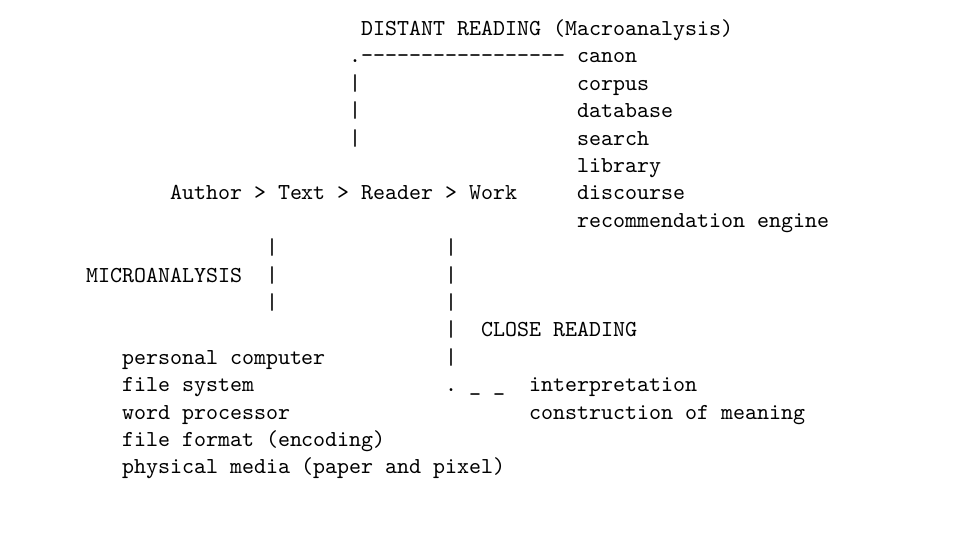

# Chapter 1: Laying Bare the Device

As I write these words, a ceiling-mounted smoke detector in the hallway outside
of my apartment emits a shrill squeal every three minutes or so. And at every
15 minutes, a pleasant female voice announces also "low battery." These
precautions are stipulated by US National Fire Alarm Code 72-108 11.6.6 (2013).
The clause requiring a "distinct audible signal before the battery is incapable
of operating" is not only required by law, it is *built into the device*. The
device internalizes legislation in its programming. We obtain the condition
where the two meanings of code---as governance and program
instruction---coincide. Code equals code.

The electronic book is one such device. It is also governed by codes both
political and computational. And yet, I continue to read the book as if it was
still an immutable, passive object. I think of it still as an intimate
artifact, a friend even: wholly known to me and benign. The literary device is
none of these things. It records my reading, sleeping, and consumption habits,
relaying the logs to a third party. It reconfigures itself and "my" texts
dynamically, at will. It comes with a manual and terms of service. In short, it
*legislates* reading.

The task of *Plain Text* will be to encounter the book anew, as a computational
device and to deal with the outcomes of that shift. It is to imagine a
hermeneutics capable of apprehending literary computation. Finally, it is to
preserve a sense of human agency in the interpretive act. To commence that
work, we must first locate its object of study. I mean "locate" in two
complementary senses of the word. The first entails finding the text in the
machine. Device reading happens on a screen which refreshes itself at a rate of
60 cycles per second (Hertz). Screen textuality is therefore by definition
ephemeral. We will have to dig deeper to find the source for what flashes on
the screen. The second sense of "location" entails the search for spaces where
literary devices operate. Note that I do not write "computers" or "electronic
books." Literary devices are those machines that in themselves constitute a
system for textual diffusion. They facilitate symbolic exchange.

Both senses of locality, micro and macro, lead us to an archive in the history
of literary computing. With the above definitions in mind, I will argue that
all computing is in part a literary activity in that it participates in the
circulation of written texts. We can therefore read the device as we would any
other form of literature. More than "can," I will later argue for an ethics of
computational reading, by which the device internals *must* be made available
for analysis. Three devices that have fundamentally changed the nature of the
literary encounter (reading and writing), will emerge by the end of the
chapter.

## 1.1 Literary Device as Gadget and Technique

The formal concept of a "device," widely used in literary studies, is an
artifact of an unfortunate translation from Russian. The word *priem* would be
much better translated as "technique," in the sense of "method," "approach," or
"procedure." The word "device" contains these meanings as well, but in modern
usage, it usually carries a concrete connotation, as "an object, machine, or
piece of equipment that has been made for a special purpose" (Merriam-Webster).
"Laying bare the device," for Viktor Shklovsky, who coined the phrase, meant
making explicit the implicit mechanism of the metaphor, particularly in cases
where such metaphors turn "stale," "automatic," and "naturalized," that is,
bereft of their original poetic and evocative power. One could write, for
example, "a field of study," without much thought about figurative space.
Shklovsky would have the reader pause to consider the implications. In which
sense ideas resemble (or not) a field? The writer could draw our attention to
the strangeness of the analogy by mentioning "mowing a verdant field of study,"
for example, or better yet, by depicting someone in the process of mowing a
field while discussing epistemology (or something along these lines). The
unexpected transference of properties accentuates and renews a familiar image.
In what sense could one "mow" a "verdant" "field" of ideas?  Such unusual
juxtapositions renew the peculiarity of the initial metaphor. The figure is
"made strange" again, in what Shklovsky calls the technique of poetic
"estrangement" [@shklovksy_sborniki_1917].

When pursuing estrangement the author "lays bare" or "makes obvious" the
metaphor, in drawing attention to its implicit, inner dynamics. Vladimir
Nabokov, a writer conspicuously aware of the formalist theoretical heritage,
makes use of this move consistently and with relentless clinical precision. In
the short story "A Guide to Berlin," to which D. Barton Johnson attributes our
first glimpse at Nabokov's "mature virtuoso style [@johnson_guide_1979, 354],"
Nabokov writes:

> In front of the house where I live, a gigantic black pipe lies along the
outer edge of the sidewalk. A couple of feet away, in the same file, lies
another, then a third and a fourth---the street's iron entrails, still idle,
not yet lowered into the ground, deep under the asphalt. For the first few days
after they were unloaded, with a hollow clanging, from trucks, little boys
would run on them, up and down, and crawl on all fours through those round
tunnels, but a week later nobody was playing anymore and thick snow was falling
instead; and now when, cautiously probing the treacherous glaze of the sidewalk
with my thick rubber-heeled stick, I go out in the flat gray light of the
morning, an even stripe of fresh snow stretches along the upper side of each
black pipe [...] Today someone wrote "Otto" with his finger on the strip of
virgin snow, and I thought how beautifully that name, with its two soft o's
flanking the pair of gentle consonants suited the silent layer of snow upon
that pipe with its two orifices and its tacit tunnel [@nabokov_guide_1976, 27].

The tightly wound vignette takes the formalist programmatic concern with
"laying bare the device" to its logical and recursively structured conclusion.
The pipes can be read as a metaphor for the literary device. Usually found
beneath the street, they now sit idle and visible above the surface. Yet even
when exposed, the device fails to captivate for long. Disused, it passes out
sight, covered in snow. The narrator "probes the glaze" of the street,
penetrating through to the surface level and in this also finds a palindrome,
which not only resembles the pipes visually, but is in itself a
surface-revealing inscription that makes pipe surface visible again, through
the snow. Although the metaphoric pipe cannot reach beyond the page, the
mimetic surface inscription draws attention to the word's visual shape and
acoustics, inviting readers to perform the symmetry of its assonance and
consonance. The reader forms the named round vowels and mouths its obstruents.
"Otto" contorts the body to shape it in accordance with the sound image:
reverse mimesis, the body as sound pipe. The moment of corporeal reenactment
briefly transcends representational and paper-bound confines of the medium. The
performance makes the "making of the literary technique obvious," obvious. In
this lies the prevalent characteristic of Nabokov's mature work, which often
seeks to lift off of the page through sheer recursion of literary technique,
where each successive turn of the abstraction brings the word closer to the
reader.

Yet for all the language games, literary technique in the sense used by the
formalists remains tied to the medium. Say someone were to ask: What lies
beneath the text? The literal answer would have to be: paper or furniture.
Reading for surface or depth at the level of representation can only begin to
approach the material conditions of textual dissemination. Language contains
traces of labor and implement implicit in the writing, binding, and the
distribution of printed material. In this chapter, I would like to take the
formalist program one step further, off of the page. My interests lie in books
and documents as literal devices. When asked in the context of book history,
the question of surface gains an instrumental dimension. Physical affordances
of liquid crystal displays and magnetic storage differ drastically from those
of goat skins or parchment. Yet surface representation maintains the illusion
of self-similarity. I am concerned here with the particularities of that
illusion. A poem, a novel, a physician's script, or a legal contract all still
look like their paper counterparts, but increasingly they behave like gadgets.
These reading and writing appliances do not mediate silently: they monitor,
adjust, warn, and control.

Like the smoke alarm, literary gadgets are governed and internalize government
in ways that we have only begun to comprehend. And as will gradually become
apparent for the duration of the book, some structural decisions in the making
of such devices are explicitly designed to resist tampering, access, or
interpretation. They obscure the flows of code and codex under the familiar
guise of surface representation.

## 1.2 WYSINAWYG (What You See Is Not Always What You Get)

I do not trust the text appearing before my eyes. Wendy Hui Kyong Chun calls
magnetic storage the "enduring ephemeral," which "creates unforeseen
degenerative links between humans and machines" [@chun_enduring_2008, 148]. If
the floating gate transistor,[^ln1-gate] where my text now lives, can be called
the enduring ephemeral, I will call my liquid crystal display, where the text
shows itself, fading persistence. This is not to believe (fearing the wrath of
textual thinkers like Jerome McGann, Johanna Drucker, and Katherine Hayles)
that text on the screen lacks materiality. Not at all. Only that it seems to
drift from surface to surface, beyond the field of vision, in ways that erode
trust in the general permanence of the literary system. If we are destined to
dwell on surfaces, I do not know to which surface to attach my attention: the
screen or the floating gate.

I have before me at least two inscriptions: one as circuit state on my hard
drive, and another as crystal phase on the screen. They denote the same idea,
but in two distinct places. How did this duplicity come to be? And what impact
does it have on the life of a mind? In an attempt to answer, I offer the
following three historical preconditions for digital textuality. They are not
meant as history, but rather as signposts to mark the journey ahead. The schema
proceeds roughly as follows: first, content and control couple at the visible
surface of removable storage media (ticker tape and punch card); second,
inscription splits into input and output, retreating into magnetic storage to
reemerge at last on screen, in the same guise, but also, as we suspect, somehow
transformed: less solid and concealing something beneath the phantasmal shell
of its former appearance.[^ln1-denning]

Where does text reside? If you are reading this book in print, you can point to
the page and be fairly certain of the answer: here, on the page. If you are
reading the book on a *device*, things get more complicated. You can point to
the screen and yet it would not be enough to say that the text resides there.
The screen will go dark when the device loses power, but the text will
persevere within, stored at another physical location. Deep within a device,
the text will be embedded into into some sort of a storage medium, usually a
magnetic or a "solid state" drive. Where the digital text resides affects even
those who prefer to read in print. Like most literature today, print materials
are also "born digital." At some point of time, they occupy the same
duplicitous position between storage medium and pixel.

Few readers today will be able to give an account of a pixel's passage from
keystroke to ink or pixel. The vast machinery that brings literature to life
hides from the reader's view. Literature conceals. Even on the level of
stylistics, writing well is meant to evoke a sense of ease where it is usually
the product of painstaking labor. Let us hold on to that intuition for the
duration of this chapter: writing conceals labor.

Literature hides the labor of readers and writers. In another sense, there is
also the concealment of raw, physical energy that "goes into the word." The
work it takes to get a rock up a mountain gives it potential energy to roll
back down. By definition, potential energy relates to the possibility of "work
done." The rock can pull something up the hill as it is falling down, for
example. What of the energy that went into the writing of these sentences? I
spent a few *joules* compressing the springs under my keyboard. Many more went
into my laptop as electric current. Why? To overcome matter's passive impedance
of advancing change. To preserve and to communicate this message *amperes*, the
unit of electrical flow, struggled with *ohms*, the unit of electrical
resistance.

There is energy too in the librarian's effort to archive a book, in the
churning of a search engine to make it accessible to a reading public, and in
the work of a truck driver who ferries information by road. The sum of these
energies, which seem significant now in their accumulation, went into the
writing of these words. Much of it dissipated as heat and light. And some of
it---just a small part---left an imprint somewhere. It left a trace of ink on a
page, magnetized a piece of tape, or shifted the configuration of the floating
gate buried within the solid state drive. Finally, the potential energy
remaining within the word began a chain of electrical reactions in the reader's
brain. The mental effort or reading and writing amounts to "knowledge
work."[@liu_laws_2004] Ultimately, writing serves to connect the electrical
circuitry of at least two neurological systems. Reading leaves the brain in a
different state than before. Writing, in this light, involves the transmission
of neural activity between hosts. When considered as a physical process,
literature is a type of electroencephalography (EEG), or electric head writing.

![The place of linguistic structure among "the facts of language". Saussure's communication circuit [@saussure_course_1986, 11].](images/saussure.jpg)

Ferdinand de Saussure's paradigmatic circuit model of communication (pictured
here) follows from head to head. The task of *Plain Text* will be to complicate
that picture by tracing the passage of thought further from *inscription* to a
*device*. At each stage of the passage, we will observe the process of encoding
and decoding, by which one type of substance---a thought---is converted into
another type: a word or the oscillation of an electrical current. I will
present here a type of a materialist reading practice, which pays attention to
the physical properties of the communication act. I will give that practice a
name---microanalysis---and a purpose: to uncover the energy gained or lost in the
transformation from code to code and from medium to medium.

I am concerned with energy because too often our foundational models of reading
and interpretation take the text as a fixed given. Even in our most
destabilizing readings, like Jacques Derrida's "Plato's Pharmacy", the
materiality of the text is assumed to persevere. "We will take off here from
the *Phaedrus*," Derrida writes [@derrida_dissemination_1981, 66]. "The reader
can count the lines" at the "precisely calculated center of the dialogue"
[@derrida_dissemination_1981, 67]. Plato's dialog has for Derrida a definite
beginning, middle, and end.  Derrida asks the reader "to return to the text,"
even when the text "remains forever imperceptible"
[@derrida_dissemination_1981, 63 & 95].[^ln1-translate] When Derrida talks in
this usual way of a literary scholar, he uses the word "text" in two distinct
ways: one, as an abstract mental construct---the one that is "forever
imperceptible," and the physical one, which has a definite and stable
topography---the one to which we return with confidence.

In the vision of post-structural poetics, the text in the abstract resembles
the quicksand of unstable signifies. In other words, one can define a word only
in relation to other words. In this way, Derrida describes texts as
"dissimulation of the woven texture," "a web that envelops a web," and "an
organism, indefinitely regenerating its own tissue behind the cutting trace,
the decision of each reading" [@derrida_dissemination_1981, 63]. In *Plain
Text*, I want to further challenge the stability of the text as a physical
artifact. The literary device reconfigures the text dynamically in the process
of reading. Because the text is no longer fixed into a stable medium, we must
do away with page numbers, for example. Pagination changes according to the
size of the device. More intrusively, the reader cannot rely to encounter the
same text upon return. The writer, the book seller, or the censor have the
technological capacity to alter the text in real time, even as the book rests
in hand or on a shelf.

Much is at stake in the material affordances of the literary artifact. The
political struggle for meaning-making, that is, the very opportunity to engage
in the act of interpretation, begins with the text as a material object. In the
West, it is easy to forget the blunt effectiveness of physical control. Books
that are burned or locked up cannot be read at all. Global inequities of access
to knowledge are much more obvious in the post-colonial world, where readers
print their own books and build their own libraries to preserve access. Witness
the so-called "shadow libraries" of Eastern Europe [@tenen_book_2014,
@bodo_short_2014], the street book vendors of India and Pakistan
[@mahmood_copyright_2005, @liang_piracy_2009], and the *samizdat* press of
Nigeria under the conditions that have been described as "book famine"
[@okiy_photocopying_2005, @nkiko_book_2014]. Yet despite the hardship, these
practices are at least engaged in the proactive preservation of the literary
sphere. Shadow libraries erect architectures of knowledge and create reading
publics who own the means of textual diffusion. They make copies, write server
software that aids in the distribution, and build archives.
Elsewhere---here---such infrastructures are created for us. Consequently, they
disappear from view. If indeed my intuition is correct and readers do not know
what books are, how they are made, or what they are capable of, we are all
living under the conditions of profound alienation. The alienation remains
benign as long as we trust in the 

[^ln1-translate]: "In our discussion of this text we have been using an
authoritative French translation of Plato, the one published by Guillaume Bude.
In the case of *Phaedrus*, the translation is by Leon Robin. We will continue to
refer to it, inserting Greek text in parenthesis [@derrida_dissemination_1981,
71]."

## 1.3 How will we find it "microanalysis,"?

Microanalysis opens the gap between text as it is embedded into storage media
and text as it is seen on the screen. 

the closest possible kind of reading
that pays attention to the material contexts of knowledge production.

Such textual proliferation comes at a cost. Until recently, the bread and
butter of literary scholarship has been close reading. Close reading, like
critical thinking, is an idea more easily performed than explained, because the
details become contentious as soon as they are formalized.[^ln2-close] I will
tread carefully, therefore, by committing myself to a broad definition of close
reading that involves some notion of deliberate and reflective practice aimed
at deep comprehension. The Partnership for Assessment of Readiness for College
and Careers (PARCC), the organization responsible for the controversial
Common Core standards being implemented in schools across the United States
today, promotes close reading as "thorough," "methodical," and "analytical"
practice that "enables students to reflect on the meanings of individual words
and sentences; the order in which sentences unfold; and the development of
ideas over the course of the text, which ultimately leads students to arrive at
an understanding of the text as a whole" [@parcc_parcc_2012, 7]. The general
movement here is from "text" on the page to "work" (text as a whole, in the
language of the report). The model of textuality implicit in the institutional
project of close reading assumes an environment of received literary canons,
naturally accessible to the human intellect. For the duration of the "Gutenberg
galaxy," the age of print, a well-educated person might have been expected to
internalize some several hundred or perhaps thousands of major texts
constituting the canon. Close reading was honed to operate on that naturalized
scale.

The expansion of the textual field has radically increased the cognitive
demands of literary engagement. The pipeline between text and work has
lengthened considerably. On the one side, the matter of canon formation can no
longer be relegated to stable, long-term systems of social filtering. Seen from
the perspective of a literary interface, the database, the social stream, and
the search engine are tools for dynamic, "on the fly," generative
canon-formation. Consider the task of finding an unknown (to me) factoid
online, about philosophy in the times of Andalusian Spain, for example. Where
in the past I might have started with a subject catalog compiled by librarians,
today I construct a search query, using resources that I believe will return a
reasonably authoritative list of texts on the subject. The search engine, in
effect, replaces (or rather complements) centuries-long processes of
canon-formation. A near-instantaneous list of results now becomes my ephemeral,
but nevertheless authoritative, collection of relevant literature.

Each text in the returned list still requires the instrumentation of close,
analytical interpretation. However, the same discipline of critical and
reflective deliberation exercised on the level of an individual text needs to
also be exercised on the level of procedurally generated search engine results:
Where to search? Using what engine? How to construct the query? What are the
implicit biases of the system?  The academic question of canon-formation
transforms into a (not yet critical) practice of rapid, iterative, generative
canon-making. Whatever ideals motivate close reading between "text" and "work"
surely must drive the process on the level of dynamic corpus composition.

Examples of macroanalysis. The various practices of distant reading arise from
the condition in which canons are no longer accessible, in their entirety, to
the unaided (natural) human intellect. These include distant reading and
macroanalysis in literary studies [@jockers_macroanalysis_2013;
@moretti_distant_2013], culturomics in economy [@aiden_uncharted:_2014],
e-discovery in law [@scheindlin_electronic_2004; @scheindlin_electronic_2009],
automatic essay evaluation in education [@shermis_handbook_2013], and medical
informatics in medicine [@shortliffe_biomedical_2013], among others. At the
foundations of these nascent disciplines is a shared toolkit of statistical
natural language processing [@manning_foundations_1999; @jurafsky_speech_2008],
automatic summarization [@radev_centroid-based_2004; @nenkova_pyramid_2007],
machine learning [@rasmussen_gaussian_2006; @flach_machine_2012], network
analysis [@opsahl_node_2010; @szell_measuring_2010; @takhteyev_geography_2012],
and topic modeling [@wallach_topic_2006; @blei_probabilistic_2012].

Where distant reading perceives patterns across large-scale corpora,
microanalysis breaks literary systems down to their minute constituent
components.



Where distant reading and macroanalysis are concerned with text aggregates,
microanalysis, of the type suggested (but not carried out to its logical
conclusion) by Kittler and Latour and Woolgar, occupies the other side of the
text--work equation. Note that contrary to what one may intuit, distant reading
often happens prior to close reading and not the other way around. In most
cases, the reader must find the text before analyzing it. Canons, corpora,
collections, libraries, and archives are all aggregates that mediate the
process of discovery. Microanalysis, too, constitutes a study of mediation, but
on the level of physical minutiae otherwise not readily observed in cursory
exploration. The instruments of microanalysis may coincide with computational
tools, designed to find hidden patterns lurking above or beneath a given
document.[^ln2-iarkho] The micro-instrumentation might also include a
screwdriver, a binding needle, or a soldering iron: sharp tools that help to
pry open and to scrutinize otherwise magical textual black boxes.

The pre-modern model of literary transmission assumes relatively short physical
distances separating authors, texts, and readers. Were I to write these words
in front of you, on paper, I would simply pass the page into your hands. In
receiving this text, you could be fairly certain that no third party meddled in
the process of passing the note. When communicating in this way, it makes sense
to talk about notions of strong "authorial intent" and "fidelity to the
original," because authors and their works are thought to occupy the same
contiguous space and time. The advent of cheap mechanical reproduction of print
(for the sake of brevity let's say the printing press) has introduced a range
of devices that mediate between the author and the reader. Distance, time, and
mediation subsequently weaken facile notions of authorial fidelity or intent.
At the very least, we know that editorial practices, publishing markets, and
communication technologies can introduce an unintended element of noise into
the channel. At the maximal break down of the communication act, long-distance,
asynchronous communication is susceptible to "man-in-the-middle" attacks, by
which a third party maliciously alters the content of communication
[@needham_using_1978].

Changing material conditions of textual transmission push against familiar
literary critical ideas. For example, as the mechanical reproduction of print
weakens the material basis for authorship attribution, the notion of authorship
itself undergoes change. That is not say that the author is dead, as Barthes
would have it. Authors continue to live and to collect royalties from the sale
of their works. The weakening of the authorship function merely makes certain
ways of talking about things like "authorial intent" and "fidelity to the
original" difficult to sustain. Massively collaborative writing projects like
Wikipedia and procedural narrative generation (machine writing) further erode
ideas of authorial production based on individual human agency. Yet, it would
be a mistake to believe that the myth of autopoiesis (the literature that
"writes itself," writing that writes, discourse that speaks, etc.)[^ln2-varela]
can displace the myth of the author. A discipline of close attention to the
atomic particulars of encoding, transmission, storage, and the decoding of text
at the site if its application to the human condition ultimately aims to
reclaim subjective agency, in motion. This may seem strange at first: to
recover the subject in the physical minutiae of the literary--technological
encounter. Yet the point of contact is crucial, for it is here that the subject
seems to disappear, in a compressed moment of time that needs to be unpacked
with some precision.

## 1.4 Where will we find it? Everywhere

1. Methodologically, materialism of the sort described above has naturally led me
to sociological approaches to the study of knowledge formation. In a study on
the construction of scientific knowledge, Bruno Latour and Steve Woolgar
perform what they call an ethnography of a science lab by exposing the passage
of ideas from applied experiment to literary production. For Woolgar and Latour
a laboratory functions as a factory of sorts, ingesting matter and artifact to
produce fact and inscription, beyond simplistic notions of knowledge-making and
discovery [@latour_laboratory_1986]. A cite of production. 

Why am I reading Ltour. Because latour gives us a way to see much lit.

Although much cited in the study of culture, science, and technology,
*Laboratory Life* has had less of an impact on the study of literature, even
though Latour and Woolgar borrowed much the other way around. In the 1986
postscript to the American edition, they remark on the broad trend in literary
theory toward treating texts as objects of interpretation, disavowing the kind
of criticism aimed at the "real meaning of texts," at "what the text says,"
"what really happened," or "what the authors intended"
[@latour_laboratory_1986, 273]. Similarly, the authors wanted to aim research
in the social study of science at the "contingent character of objectification
practices." Science, in their view, is itself a type of literary system,
"generating texts whose fate (status, value, utility, facticity) depends
subsequently on interpretation" [@latour_laboratory_1986, 273]. Throughout the
book, Woolgar and Latour use the term literature to mean something "inscribed,
printed, or published," a combination of verbs that coincides with "literature"
consistently throughout [@latour_laboratory_1986, 47-53]. Viewed as a work of
literary theory, *Laboratory Life* reifies the research program began by the
post-structuralists. Where Jacques Derrida could remark offhandedly that
"everything is a text,"[^ln2-derrida] Woolgar and Latour make concrete the
literal transformation of matter into text. No longer was literature an
illustration of something that happens in the laboratory: Latour and Woolgar
showed the laboratory itself to function as an inscription-making machine.

The conventional way to understand Woolgar and Latour brings the interpreter
into the laboratory, breaking the illusion of scientific objectivity: instead
of "discovering" facts, scientists construct them (therefore, *social
constructivism*). Paradoxically, as Latour and Woolgar worked to undermine the
empirical unity of science (turning it into a kind of hermeneutics), they
performed literary analysis as an empirical method. To "read" the laboratory,
researchers observed the space in person, embedded into the fabric of its
everyday activity. As ethnographers, Woolgar and Latour were interested in
discovering models of objectivity (and science) that emanate from the practice
doing science localized to the particular laboratory under observation. A
theory of knowledge formation therefore becomes visible through ethnographic
description. In the *Laboratory Life* the reader is asked to examines a range
of evidentiary material along with published work. Floor plans, research
samples, workflow diagrams, dialog transcriptions, time sheets, and logbooks
all become a part of the epistemology.

To view Woolgar and Latour as scholars of literature (and not just of
laboratories) is to open up the floodgates of textuality. The laboratory, the
courthouse, the hospital---these institutions cannot be reduced to text, but
the lesson of *Laboratory Life* is that they are, in part, literary systems.
Beneath every scientific discovery, every popular song, every film, radio, or
television serial, every art or architectural project, every political office,
every legal judgment, every restaurant meal, every doctor's prescription, every
website, and every machine manual---beneath that giant and perplexing pile of
human activity lies a complex network of circulating textual documentation.
Woolgar and Latour show that literary scholarship can involve more than just
reading books, but also making visible that textual undercurrent: following it
and mapping its movements across rooms and offices, all the while exposing the
mechanisms of its mutation and locomotion. It is an exciting prospect: to view
the hospital as a library, where cadres of physicians and administrators
convert human stories into diagnoses, into controlled vocabularies, into files,
into billable codes, into inscriptions, and into archives. Or to see the legal
system as a process of literary discovery, where legions of attorneys and
paralegals pore over terabytes of textual material, transforming inscription
into evidence. That is not all these institutions are, but they are also that;
and there is much work to be done there for a scholar of literature.

On an average day in 2008, at home, an average American read around 100,500
words a day. At 250 words per page, that is around 402 printed pages.  Between
the years of 1980 and 2008, the consumption of information in bytes---a measure
that would obviously privilege storage-heavy content like sound and
video---grew at a modest 5.4 percent per year. Reading, in decline until the
advent of the internet, has tripled in the same period. Reading in print
accounted for 26 percent of verbal information consumed in 1960. That number
fell to 9 percent in 2008, but the consumption of words digitally increased to
27 percent of total consumption, which means that reading has increased its
share of the overall household attention span [@bohn_how_2009;
@hilbert_worlds_2011; @hilbert_info_2012]. The first decade of the twenty-first
century saw a 20 percent increase in library visitation
[@u.s._institute_of_museum_and_library_services_public_2010]. According to
UNESCO data, literacy rates continue to rise globally, as the world calibrates
imbalances of access along the lines of gender and geography
[@huebler_adult_2013]. By a conservative estimate, the number of scientific
publications grows at about 4.7 percent per year, which means that the amount
of published research roughly doubles every 15 years or so, and the figures are
much higher in some fields [@archambault_welcome_2005; @crespi_empirical_2008;
@larsen_rate_2010]. The number of books published in the United States almost
tripled from 2005 to 2009 [@bowker_u.s._2009].

All measures point to a drastic expansion of the textual field. At the same
time, we are often told that reading of short stories, novels, poetry, and
plays appears to be at grave risk [stephens_rise_1998; @merrin_television_1999;
@nea_reading_2004; @golumbia_cultural_2009; @fish_digital_2012;
@marche_literature_2012].[^ln2-internet] Something does not add up. As a
society we are reading, writing, and publishing more each year. The
reconciliation of vocabularies locates the source of the perceived metaphysical
threat in the culture's profound alienation from the material contexts of
literary production. The language of literary theory is supremely tuned to deal
with symbols. Only after long reflection, on the order of centuries, do we
begin to note the sheer strangeness of the textual interface: the medieval
palimpsest, the stylus, and the goat parchment. Yet we cannot afford to care
less about the keyboard and the screen today that we do about ink and paper.  A
battle is quietly brewing for the soul of computing and hence for the control
of our basic reading and writing apparatus.

Where literacy thrives, the very nature of what constitutes a literary text (of
any kind) has changed significantly with the advent of ubiquitous computing and
its related techniques involving the internet, integrated circuits, magnetic
storage, miniaturization, and search and suggest algorithms. By many accounts,
the second half of the twentieth century saw a major technological shift
affecting the production, access, and distribution of knowledge, in a shift
comparable in its consequences to those accompanying the spread of the
Gutenberg printing press in the fifteenth century [@johns_piracy:_2009;
@kovarik_revolutions_2011]. Matters always central to the field of literary
studies remain vitally important to the functioning of modern society. Literary
studies, when conceived broadly, provide fertile grounds for collaboration
between diverse disciplines interested in the changing dynamics of narrative,
interpretation, language, form, prosody, composition, dialog, discourse, story,
genre, authorship, influence, and text. It is in this core conceptual cluster
of operational terms that I want to locate a notion of poetics capable of
addressing not only the machinations of poetry and prose, but also of pixel,
code, string, script, inscription, list, document, file, record, project, and
archive.

## 1.5 Content and Control

Thesis the book is not just a book!

With the site more broadly defined, we can begin the work of recovering the
material contexts of literary production. I want to foreshadow now what will
become the punchline of the whole book: namely that the ghost in the machine
cannot be reduced to some vague notions of value---these amount to a
distraction, which lies plainly upon the surface. The conspicuous ghostly
apparition (indicating the absence of a living subject) is agency itself,
which, for now, necrotically attaches itself to dead things like systems,
mediums, and automated discourses. If all this talk of value, ghosts, and
necromancy sounds familiar, the reader will not be surprised when I advance
Karl Marx as a preeminent theorist of the algorithm and someone able to help us
reason through Kittler's computational conundrum. On towards Marx then (who
will appear much later), through the machine that, although intimately familiar
to every writer and consumer of text by touch, remains alien and alienating in
its hidden possibilities, soothing and threatening all at once.

The personal computer governing the production of textuality today emerged from
an amalgam of automated devices, chief among them the telegraph, the
typewriter, and the calculator. In his seminal 1937 paper "On Computable
Numbers," Alan Turing describes an automatic machine (*a*-machine) capable of
transposing the problem of calculability into "effective calculability." Where
all previous calculators are special-purpose mechanisms, engineered to augment
a specific type of computation, Turing thought of his device as a universal
"*a*-machine." In theory (and it was conceived as a thought experiment, at
first), it could imitate any other mechanism for calculation, because its
internal composition could be reduced to a dynamic representational state (as
opposed to a fixed, mechanical one). The device would receive input by means of
a paper ribbon containing discrete symbolic inputs. At its bare minimum, the
device would need only the ribbon, a means of "reading," and the means of
"writing" the symbols onto the tape. Mechanically, its movement could be
restricted to one axis or to the movement of the tape through the mechanism.
What makes such a device a *universal* machine is its ability to internalize
symbol as part of its mechanism. Symbolic input, in this case, can represent
computable data (letters and numbers), but it can also function as control code
("move left," "erase mark") altering the movement of the mechanism.

In fact, the Turing machine does not properly differentiate between content and
control code. Its "internal state" (Turing uses terms of sentient awareness
throughout) "is determined by *m*-configuration *q<sub>n</sub>* and the scanned
symbol," where the *m*-configurations are defined as "a finite number of
conditions" of a machine, which, in Turing's words, may be compared to "a man
in the process of computing a real number" [@turing_computable_1937, 231]. The
initial configuration plus the scanned symbol define the next internal state of
the machine. The material and the symbolic fuse into one: here lies the essence
of the universal Turing machine (UTM). Software is also hardware. In being able
to internalize configuration as symbol, the *universal* Turing machine can in
effect imitate all other special-purpose Turing machines. This transition of
symbols into machine states effectively defines modern programming. A universal
machine, unlike other, definitive, single-purpose and limited-state mechanisms
(a clock for example), contains the ability to take on differing internal
symbolic configurations. It can imitate a clock, an abacus, a scale, and, with
time, Turing thought it could imitate humans as well.

This ambiguity between hardware and software leads to some confusion in the
critical literature, as evidenced by Lev Manovich's playful response to
Kittler's "there is no software" argument. If I understand it correctly,
Kittler's short but often cited essay picks up the thread of Kittler's earlier
work to posit what he calls a "postmodern writing scene." "We do not write
anymore," writes Kittler: "human-made writing passes through microscopically
written inscriptions which, in contrast to all historical writing tools, are
able to read and write by themselves" [@kittler_there_1995]. According to this
schema, Kittler sees the paper-bound design blueprints of the first integrated
microprocessor as the last "real" piece of writing. Everything written after
that point is hardware (because software is hardware at that "microscopic"
level).

Manovich inverts Kittler's argument into "there is only software," by which he
means that in a pragmatic sense, the affordances of a given medium are
determined by software. A printed page begins to differ from a screen only when
the readers are able to effect something on the screen that they could not on
paper. To this end, Manovich encourages his readers to become active developers
of software, rather than its passive consumers [@manovich_there_2011, 274]. In
that, Manovich reasserts the possibility of writing in the silicon age. Kittler
(who passed in 2011) could perhaps object to that line of reasoning in
maintaining that chip architecture (the last written work) still determines (as
foundation) all higher levels of textuality "floating" above the silicon
bedrock. And no amount of learning to code would give an ordinary subject the
resources required to write in silicon---a process so advanced and expensive as
to be limited to a handful of international chip manufacturers. In opening a
successive nested series of black boxes, the post-silicon writer hits the
impenetrable bedrock of chip architecture. In such conditions, is it even
worthwhile to follow Manovich's call for new literacies? Is writing still
possible? If "there is no software," then no. Else if everything is software,
then one can answer to the affirmative.

This ontological complication has its roots deep in Cartesian dualism. The
question of where do brains end and minds begin remains unresolved in cognitive
science, for example. Similarly, at some imperceptible point software
disappears into hardware. But before we ourselves get lost in that liminal
space between matter and idea, let us recover a measure of oddity found in the
now ubiquitous operation of Turing machines. First, note that Turing's original
formulation happens at the level of a thought experiment. (Turing does not
begin to build actual machines until his move to Princeton in 1936.) A
universal Turing machine comes to life initially as an idea that can take on
the structure of other ideas expressed symbolically. Second, note that though
Turing describes his machine in the language of mathematics (where his most
significant contribution lies), his description also contains the bare minimum
of a mechanical device. No matter how symbolic a Turing machine aspires to be,
no matter how ascendant to the realm of the ideal, it still needs a bare
minimum of physical matter to function. And Turing's paper does contain the
canonical description of that bare physical minimum.

With the above two observations in mind, we can view abstracted universal
Turing machines, as implemented in the Wireworld universe (a cellular automaton
simulation), for example, or in Minecraft (a procedurally generated sand-box
world-exploration game), as recursive, second-order ideational constructs,
built on top of first-order physical mechanisms (a personal computer, in the
case of Wireworld and Minecraft). We know this, because all *n+* order Turing
machines are limited in computational power by the physical capabilities of
that bottom-most device (the physical machine writing the simulation). The
simulated UTM cannot outperform (in terms of cycles per second, instructions
per cycle, or its capacity to hold a number of instructions) the machine doing
the simulation. If we disregard the dizzying levels of recursion (a Turing
machine, simulating a Turing machine, simulating a Turing machine and so on),
we can begin to examine the turtle at the bottom, which has its head in the
symbolic and its feet firmly in the material world.

Literature in computer science tends to confront universal Turing machines as
algorithms: in other words, as virtual, second-order symbolic representations.
As consummate thinkers on the level of the symbol, computer scientists and
literary scholars (unlike, say, electrical engineers or book binders) rarely
need to pay heed to that strange bottom-most turtle.[^ln2-bottom] Yet it is
impossible to entirely disassociate the implementation from the idea. In his
review of Turing's "On Computable Numbers" paper, Alonzo Church, the American
mathematician whose work anticipated Turing's (independently) in several
important aspects, wrote that "a human calculator, provided with pencil and
paper and explicit instructions can be regarded as a kind of a Turing machine"
[@church_computable_1937, 42-3; also cited in @petzold_annotated_2008, 63].
Disregarding the broader, metaphysical implications of that statement, note for
now the persistence of two essential implements required for the minimally
viable operation of the Church--Turing human and machine calculators. Pen and
paper persevere and assert themselves through the
abstraction.[^ln2-abstraction]

Forced to confront the universal Turing machine *as a mechanism*, the historian
must acknowledge that it borrows from a number of extant designs, which,
together and incrementally, give the UTM its physical form. A media history of
the Turing machine as device differs from its intellectual history as symbolic,
mathematical abstraction in interesting and instructive ways.[^ln2-turing]


Although Turing's original article did not include any drawings, he describes
his "*a*-machine" in terms of paper tape medium, scanning, erasing, "writing
down notes," "external operators," and "moves" of the mechanism. From the
engineering standpoint, Turing's machine can be reduced (1) to the mechanism
for "reading" and "writing" symbols onto and from paper storage media, and (2)
to the paper tape storage medium itself (as seen in Mike Davey's
reconstruction). In the United States, these elements would find prior art in
mechanisms such as the "Numeral adding or subtracting attachment for
type-writing machines" [@daugherty_numeral_1894], "Combined
Type-writing and Computing Machine" [@degener_combined_1911], "Computing
Attachment for Typewriters" [@wright_computing_1914], "Computing Mechanism"
[@wright_computing_1915], and "Combined Type-writing and Adding Machine"
[@ellis_combined_1914] among others.


By the end of the nineteenth century a number of lesser mechanisms anticipate
the functional elements of Turing's machine. And by 1936, when Turing
publishes his paper on computable numbers, these inventions not only anticipate
the modern computer, but are brought to mass market in the widespread
manufacture of computing scales, dial recorders, electric tabulating machines,
and computing typewriters made by companies like Underwood Computing Machine,
Electromatic, and International Business Machines (IBM). Rather than a single
eureka moment, the invention of the universal machine should be viewed as a
gradual historical process that culminates in Turing's universal (and minimally
viable) specifications.

When viewed in the context of literary, book, and textual history (instead of
the history of mathematics, for example), the universal Turing machine signifies a
culmination of several broad, long-term trends that begin with the invention of
writing itself. Since much has been written on the first two of these periods,
I will outline them briefly with the intention of elucidating the third in
greater detail:

1. The mechanization of type and the accompanying normalization of language
begins with the diffusion of movable type in China and Europe, circa 1040
(China) and 1450 (Germany) [@mcluhan_gutenberg_1962; @he_diffusion_1994;
@needham_shorter_1994, 1-34; @febvre_coming_2010]. With the invention of
movable type and the typewriter, the variability of hand-written script can be
normalized to a limited set of discrete characters. The process of
normalization continues today as contemporary technologies like natural
language processing and optical character recognition struggle to bring
non-regularized writing systems under the computational umbrella.

2. The development of distant writing (telegraphy) and remote communications,
which, although extant in many early societies (as smoke and mirror signals,
for example) accelerates dramatically at the beginning of the nineteenth
century [@shaffner_telegraph_1859; @beauchamp_history_2001;
@standage_victorian_2014]. When combined with the mechanization of type,
telegraphy amplifies the range and the speed of geographical displacement
enabled by the circulation of printed matter. The telegraph further weakens the
authorial function in transposing writing from its immediate physical
environment across vast geographical distances. The advent of telecommunication
lengthens the chain of technological mediation between author and reader. In
the absence of the identifying "hand," the telegraph clerk's and the censor's
mark cannot be distinguished from the author's (a common literary plot device
in the fiction of the period). The notion of a telegram's "fidelity" therefore
becomes an attribute of the communication channel as a whole (instead of an
attribute attached to authorial intent).

3. Finally, the rise of Turing machines in the late nineteenth and early
twentieth centuries elevates print from an intelligence-conveying medium to one
of communication and control. "Content" intended for humans is now routinely
mixed with "control codes" intended to alter the operation of the receiving
device.

It is this last and still current moment of historical development that is
least theorized. A dominant tradition in the history of the human sciences
follows Louis Althusser and Michel Foucault (and, to a lesser extent, Jacques
Derrida)[^ln2-derr] in analyzing mechanisms of structure and control in terms
of ideology, discourse, and representation. Where for Althusser "every science
is a science of ideology,"[^ln2-alt] Foucault posits his archeology of the
human sciences on the level of "positive unconscious," revealing unspoken
"rules" that govern the formation of "theories, concepts, and objects of study"
on the level of "scientific representation" [@foucault_order_1994, xi].

There are a number of theoretical niceties here (that the reader may skip, if
not interested in the history of Marxist thought). For example, the concept of
ideology, in the orthodox Marxist schema of things, exists as a "political
superstructure [...] to which correspond definite forms of social
consciousness." In the Marxist model, ideology floats *above* the material
base---the dominant mode of production---that "determines the general character
of the social, political and spiritual processes of life"
[@marx_contribution_1904, 11]. Althusser's influential contribution to this
world view was to insist that ideology, although secondary to the mode of
production, nevertheless assures its continual reproduction as a means of
continuing subjugation and political control. Simply put, for Althusser, the
ideological apparatus of the modern capitalist state ends up being "installed
in the dominant [social] position" [@althusser_lenin_2001, 85-127]. In a
similar (although not equivalent) rhetorical move, Foucault envisions that
beneath the "epistemological level" of human activity there exists an
"archaeological layer," where representation "governs the mode of being of
language, individuals, nature, and need itself" [@foucault_order_1994, 209].
Ideology and representation, once determined, now determine. The rhetorical
jujitsu inverts Hegel yet again, to put Marx back on his head.[^ln2-flip] My
short history of the universal Turing machine runs counter to this top-heavy
tradition of reading Marx in the inverse. As a device, the Turing machine fuses
control and communication. Control is meant here bluntly, as physical circuit
control, at the level of the mechanism and not at the attenuated level of
ideology or representation.

A number of inventions at the end of the nineteenth century pertain
specifically to "circuit-controlling devices controlled by a traveling
perforated strip or tape" [@cuttriss_telegraphy_1893]. Prior to perforated
tape, the transmission of messages by telegraph required the presence of a
skilled operator, able to transcribe messages from text to Morse code, and into
the physical motion of a lever-operated circuit. In this system, the human
operator acted as a mute interface between text and machine. The transcription
of text into signal, and back onto paper, required the real-time presence of
human encoders and decoders. The perforated tape decoupled the human from the
machine. In US1187035 (1916) on "Telegraphy" Albert and Ralph Bumstead explain,
"the object of our invention is to provide a system of telegraphy which does
not require skilled operators for the transmission and reception of messages"
[@bumstead_telegraphy_1916]. Instead, the message was transcribed into
perforation via mechanical means and then fed into the device.  The tape
mechanics of the typewriter could then be coupled with the electrics of the
telegraph, with perforated tape acting as a mediator between the two "worlds"
of mechanics and electricity. A number of devices emerged at the time with the
aim of transforming the mechanical action of the typewriter into perforation,
and, consequently, perforation into script, completing the circuit between
automated "encoding" and "decoding." As one device converts human input into
mechanical states, and into signal, another device converts the signal into
mechanical states and into human-legible messages.

What began as a trickle at the end of the nineteenth century ended in a flood
at the beginning of the twentieth. A multitude of devices capitalized on the
control capabilities of removable storage media. These included machines for
tape-controlled telegraphic transmission [@wheatstone_improvement_1874;
@murray_tape-controlled_1905; @bumstead_telegraphy_1916], tape-controlled
printing [@creed_printing_1911], printing telegraphs
[@hallden_printing-telegraph_1929], and remote broadcast programming devices
for radio and television content [@vriendt_program_1934; @brown_automatic_1936;
@brown_selective_1936]. With the invention of punch cards and perforated tape
(also used in textile looms, as early as 1725), a message meant for another
human became also a physical medium---bumps and holes---used to animate the
mechanical movement of the transmission apparatus.

For example, of the 33 asserted claims in the Bumstead brothers' patent, the
first 13 relate to the "transmission of intelligence [...] adapted to initiate
a succession of electrical impulses all of which have a character representing
significance, a receiver adapted to detect variations in time intervals
elapsing between successive impulses, a plurality of interpreting relays
selectively actuated by said receiver, and a printed mechanism responsive for
the combined action" [@bumstead_telegraphy_1916, 12-13]. Up to this point, the
patent describes a device for transmission information, from type to print.
Starting with clause 14, the language changes to describe a more general
"telegraph system," involving "an impulse transmitter having means to vary the
time intervals between successive transmitted impulses, each time interval
having a character *representing significance*, a receiver responsive to said
devices, and signal, *distributing*, *interpreting*, and recording devices
responsive to the contiguous significant time intervals defined by the impulses
[emphasis mine]" [@bumstead_telegraphy_1916, 14]. For the automated telegraph
the control code and the message are one: that is, the arrangement of
perforation on the ticker tape affects the internal mechanical configuration of
the machine. Another way to put this would be to say that the state of the
tape-driven telegraph machine at any given time is also, in part, a message
meant for the human recipient.  The printing telegraph of Brothers Bumstead,
along with their subsequents and antecedents, contain all the necessary parts
for a Turing machine: discrete symbolic language, removable storage medium, and
a device that can alter its internal state based on the reading and writing
passing symbols.

By 1905, Murray (of the Murray telegraph and alphabet) can write that "if we
disregard the small class of telegrams that merely express emotions, *the
essence of telegraphy is control* [emphasis mine]." He goes on to write that
"telegraph systems, therefore, belong not to the class of producing or
distributing, but to the class of controlling mechanisms"
[@murray_setting_1905, 556].

With this history in mind, I am interested in reformulating the metaphysical
anxiety about literature and value formation in terms of text and control. If
you are reading these words on a screen, my message has reached you through a
long chain of transformations: from the mechanical action of my keyboard, to
the arrangement of electrons on magnetic storage media, to the modulation of
fiber-optic signal, to the shimmer of the flowing liquid crystal. Many, many
third parties were involved in that act of communication. And some part of that
message was used to control the electrical circuits of the device in your lap,
in your hand, near to your eye, embedded, or embodied. Close reading limited to
the parsing of content and representation risks missing the machinations of
naked circuit control. It looks like you are reading a book, but this book
changes its internals as it receives instructions to inform and to control. For
now I ask only, Who controls the device? But were a book also a pill or fused
with the neural circuitry of the brain, would you know what and whom you were
reading?

[^ln2-gurevich]: Kittler mistakingly attributes "Algorithms in the World of
Bounded Resources" to Brosl Hasslacher. The author is rather Yuri Gurevich,
Principle Researcher at Microsoft Research and then a professor at the
University of Michigan. Hasslacher's essay entitled "Beyond the Turing Machine"
appeared in the same volume of collected essays, @herken_universal_1988.

[^ln2-bottom]: For example, in the Open Systems Interconnection (OSI) model of
communication, the top-most layer of protocols and interface method is called
the "application layer" and the bottom-most layer the "physical layer"
[@peterson_computer_2007, 26-28]. Timothy Colburn and Gary Shute describe it as
being "responsible for encoding bits onto a transmission medium, whether wires,
fiber optics, or radio broadcast, in ways that maximize the transmission rate
and minimize sensitivity to noise [@colburn_abstraction_2007, 181].

[^ln2-abstraction]: This is a topic of some contention in the literature. In
his influential paper on the topic, James Moor includes the immateriality of
software as one of the "three myths" of computer science. "As a practical
matter, what we regard as computer instructions, and consequently what we
regard as computer programs, is determined by computers available," he writes
[@moor_three_1978, 215]. Nurbay Irmark argues that software is instead a purely
abstract artifact, akin to a musical work [@irmak_software_2012]. See also
@turner_programming_2013; @colburn_software_1999.

[^ln2-turing]: The intellectual history of the Turing machine is well
established, in multiple works on the subject. It follows the Greek Diophantus,
René Descartes, Georg Cantor, David Hilbert, Gottlob Frege, Bertrand Russell,
Kurt Gödel, Ludwig Wittgenstein [@petzold_annotated_2008;
@herken_universal_1988; @grattan-guinness_development_1981].

[^ln2-alt]: "We have to think (in a completely novel way) the relation between
a science and the ideology [...] the fact that such an investigation confronts
us with the observation that every science, in the relationship it has with
ideology it emerged from, can only be thought as a 'science of ideology, would
disconcert us, were we not forewarned of the name of the *object* of knowledge,
which can only exist in the form of ideology" [@althusser_reproduction_2014,
46].

[^ln2-derr]: See @derrida_writing_1978. I am alluding particularly to
statements like "ethnology-like any science-comes about within the element of
discourse," and "this moment was that in which language invaded the universal
problematic; that in which, in the absence of a center or origin, everything
became discourse-provided we can agree on this word-that is to say, when
everything became a system where the central signified, the original or
transcendental signified, is never absolutely present outside a system of
differences. The absence of the transcendental signified extends the domain and
the interplay of signification ad infinitum" (278-294).

[^ln2-flip]: There is a long-standing joke in Marxist literature that involves
flipping Hegel, who prioritized the transcendent spiritual over the physical
and material forms of life, over "back to his feet." See for example
@marx_marx-engels_1978: "The form of wood, for instance, is altered, by making
a table out of it. Yet, for all that, the table continues to be that common,
every-day thing, wood. But, so soon as it steps forth as a commodity, it is
changes into something transcendent. It not only stands with its feed on the
ground, but, in relation to all other commodities, it stands on its head, and
evolves out of its wooden brain grotesque ideas, far more wonderful than
'table-turning' ever was" (320). See also @engels_ludwig_1941: "Thereby the
dialectic of the concept itself became merely the conscious reflex of the
dialectical motion of the real world and the dialectic of Hegel was placed upon
its head; or rather, turned off its head, on which it was standing before, and
placed on its feet again" (44).

[^ln1-dirt]: Think of text as substance and literature as surface. The first is
like dirt where the second is gound. We play with one on top of the other.

[^ln1-gate]: Solid state memory devices like flash memory store information in
capacitor "circuit states." This by contrast with electromagnetic storage that
works by modulating electrical charge over a magnetic surface. Solid state
capacitor storage was used in the earliest computers
[@kahng_semipermanent_1967, 1296], but was prohibitively expensive to
manufacture until well into the twenty-first century, when solid state drives
began to replace electromagnetic storage on consumer devices. In an early
(1967) paper on "A Floating Gate and Its Application to Memory Devices," Kahng
and Sze explain: "A structure has been proposed and fabricated in which
semipermanent charge storage is possible. A floating gate is placed a small
distance from an electron source. When an appropriately high field is applied
through an outer gate, the floating gate charges up. The charges are stored
even after the removal of the charging field due to much lower back transport
probability [...] Such a device functions as a bistable memory with
nondestructive read-out features. The memory holding time observed was longer
than one hour" [@kahng_floating_1967, 1288]. See also @horton_experimental_1962
and @frohman-bentchkowsky_fully_1971 on "floating gate avalanche injection."

[^ln1-denning]: These stages correspond roughly to the "three generations of
electronic computing" outlined in Peter Denning's "theory of operating systems"
[@denning_third_1971].

## 1.6 Three devices
### A. Removable storage media and automation, 1725--1964.[^ln3-loom]

"You must acknowledge that this is readable without special training," reads
the schematic illustration to a Goldberg 1911 patent, simply titled
"Controller." "My invention relates to all controllers," Goldberg writes.
Furthermore, the object of his invention is "to provide a mechanism operable by
a control sheet which is legible to every person having sufficient education to
enable him to read." Goldberg illustrates his invention in attaching to his
patent "a control sheet in which the control characters are in the form of the
letters of the ordinary English alphabet"  [@goldberg_controller_1915]. Rather
than using ticker tape, Goldberg uses perforations that form letters. On
Goldberg's control sheets, the language of machines and the language of humans
coincide.

![Goldberg's Control Cards [@goldberg_controller_1915].](images/control-2.png)

The Controller never caught on, but the patent makes it clear that Goldberg,
among others, was aware of the problem: the mechanization of type, automation,
and remote control required specialized training. With the advent of the
automated telegraph, content meant for people was now being intermixed with
machine-controlling code. To combat mutual unintelligibility, Goldberg imagines
using cards, perforated in the shape of the English alphabet. Besides carrying
(human-readable) content, the perforations do "double duty" to mechanically
manipulate the machine's "blocks," "handles," "terminal blades," and "plungers"
[@goldberg_controller_1915]. Early paper-based storage media, from Morse
code-based ticker tape systems, to the telegraphs of Hughes and Baudot, and to
punch cards that powered weaving looms, player pianos, and census tabulators
coupled message and control. The era of ticker tape punch cards can be thought
to end with the mass-market introduction of IBM's Magnetic Tape/Selectric
Typewriter in 1964.

### B: Magnetic tape, 1888--1968

"Historically unforeseen, barely a thing, software's ghostly presence produces
and defies apprehension," Wendy Chun writes in her *Programmed Visions*, an
influential monograph that continues to shape the field of software studies.
She quotes several prominent computer scientists and media historians to the
same effect. But what gives software its ephemeral quality? Embossed onto
ticker tape or punched into the card, early software protrudes through the
medium. In the age of the telegraph, the largest barrier to the comprehension
of software was encoding. But once the cipher is known and the format
identified, the inscription makes itself visible to view. Early programmable
media could hardly be called ephemeral or immaterial. Anecdotes circulate in
the digital humanities circles of Father Roberto Busa, an early (post-WWII)
pioneer in the field of computational philology, carting his punch cards around
Italy on a truck.[^ln3-busa] Code before its electromagnetic period was
burdensome, fragile, unwieldy, and, most of all, visible.

![IBM Mag Card II, introduced in 1969 for use in the Magnetic Card/Selectric
Typewriter (MC/ST) in 1969. "A simple relationship could be maintained between
a typed page and a recorded card" [@may_ibm_1981, 744]. Image by Pointillist
under GNU Free Documentation License, Version 1.2.](images/ibm-card.png)

The principles of magnetic recording were developed by Oberlin Smith (among
others), the American engineer who also filed several inventions related to
weaving looms at the end of the nineteenth century. In 1888, inspired by
Edison's mechanical phonograph, Smith made public his experiments with an
"electrical method" of sound recording using a "magnetized cord" (cotton mixed
with hardened steel dust) as a recording medium. These experiments were later
put into practice by Valdemar Poulsen of Denmark, who patented several
influential designs for a magnetic wire recorder [@smith_possible_1888;
@poulsen_method_1900; @engel_1888-1988_1988; @thiele_magnetic_1988;
@daniel_magnetic_1998; @vasic_coding_2004].

In 1964, IBM combined magnetic tape storage with its *Selectric* line of
electric typewriters, introducing the Magnetic Tape Selectric (MT/ST) line of
typewriters to the mass market. Writing for the *Encyclopedia of Library and
Information Science* in 1992, Daniel Eisenberg mentions the MT/ST as one of the
first word processors, defined by the ability to record strokes and to print
them onto paper *as a separate operation* [@eisenberg_word_1992]. The
separation of input and output allows for word processing as such. An article
in the *IBM Journal for Research and Development* explains that the real
significance of the MT/ST workstation was in the introduction of new "power
typing" technologies: "For the first time the typist could type at 'rough
draft' speed, 'backspace and strike over' errors, and not worry about the
pressure of mistakes made at the end of the page" [@may_ibm_1981, 742].

We may think of word processing as a temporal extension of the page. Words on
magnetic storage media begin to exist in the ephemeral state, giving the typist
an opportunity to edit and emend *before* commitment to paper, in its immutable
form, and as a separate operation, removed from the immediate process of
inscription. The very invention of word processing thus corresponds to the
decline of text into ephemera. What was visible through a hole punch on ticker
tape, was now submerged into tape. The tape no longer afforded human legibility
nor comprehension. Encoding used by MT/ST retained the familiar (from the
earlier sections) underlying structure (7-bit encoding, in this case) which, on
tape, ceased to be recoverable by the naked eye. The inscription lay literally
beyond (human) sense. We lack the perceptual apparatus to perceive "magnetic
domains" and "polarities"[^ln3-magnet] that take place of visible alphabets.
Magnetic storage remains, for all unassisted intents and purposes, a black
slate.

### C: Screen, 1968--today

By decoupling input and output, magnetic storage and solid state media afford
the injection of time and space, in arbitrary intervals, between the process of
inscription and comprehension. Content, coupled with control code, sinks
beneath the matte surface of electrical charge. The final movement in the
emergence of automated discourse reintroduces the illusion of immediacy into
the process of inscription. Text, invisible in its material substratum,
reappears on the screen, but, crucially, it no longer corresponds to its mirror
inscription. This property is as perilous as it is liberating: perilous,
because the flows of power and control can now be submerged under the
shimmering surface of the screen, and liberating, because loosely coupled to
their material substratum texts become both more fluid and more portable.
Plainly put, the systematic barriers to copying, sharing, exchanging, editing,
remixing, and disseminating texts are reduced to a minimum.

Ersatz isomorphism (between disk storage and screen image) leads to the
reception of digital text as an ephemeral artifact. With the illusory role of
the screen in mind, I propose 1968 as the year in which the contemporary
textual condition takes its present form. On December 9, 1968 Douglas
Engelbart, then founder and primary investigator at the NASA- and ARPA-funded
Augmentation Research Center lab at the Stanford Research Institute, gave what
later became known colloquially as "the mother of all demos
[@tweney_mother_2008]" before an audience of roughly one thousand or so
computer professionals attending the Fall Joint Computer Conference held at the
Convention Center in San Francisco [@rogers_demo_2005]. The demo announced the
arrival of almost every technology prophesied by Vannevar Bush in his
influential 1945 piece for *The Atlantic* [@bush_as_1945]. Speaking a little
over an hour,  through a headset, in a prerecorded address, Engelbart features
functional (live) prototypes of the following: graphical user interfaces, video
conferencing, remote camera monitoring, links and hypertext, version control,
text search, image manipulation, windows-based user interfaces, digital slides,
networked machines, mouse, stylus, and joystick inputs, and "what you see is
what you get" (WYSIWYG) word processing.

!["NOW IS THE TIME FOB." Schematics for a "display system"
[@engelbart_x-y_1970].](images/engel.png)

In his report to NASA, which sponsored research on "intellect augmentation"
along with DARPA, Engelbart describes his lab as a group of scientists
"developing an experimental laboratory around an interactive, multiconsole
computer-display system" and "working to learn the principles by which
interactive computer aids can augment the intellectual capability of the
subjects" [@engelbart_human_1969, 1]. Cathode Ray Tube (CRT) displays were
central to this research mission. In one of many patents that came out of
"intellect augmentation" laboratory, Engelbart pictures the "display system" as
a workstation that combines a typewriter, a CRT, and a mouse. The system is
frozen in mid-action, with the words "THE TIME IS NOW FOB" prominently
displayed on the screen. Although Engelbart does not explain the message, the
system's user is evidently in the process of editing a sentence and about to
correct the nonsensical FOB into a FOR. Engelbart writes, "One of the
potentially most promising means for delivering and receiving information to
and from digital computers involves the display of computer outputs as visual
representation on a cathode ray tube and the alternation of the display by
human operator in order to deliver instructions to the computer"
[@engelbart_x-y_1970].

The CRT closes the circuit between human and machine, with a few caveats. In
practice, the short-lived screen-less word processors (like the IBM MT/ST)
necessitated for the cognitively arduous task of continuously keeping the
underlying document structure in the mind's eye. The CRT lifts that burden by
unfolding the structure topographically, allowing for spatial navigation along
the document---restoring, in a sense, the natural affordances of print. Data
becomes visible again. Moreover, represented in the shimmer of the cathode ray,
it attaches itself lightly to the retina. Users trying out this way of writing
for the first time report that the screen liberates them from the material
confines of print textuality. One user, possibly Engelbart himself, writes the
following:[^ln3-follow]

[^ln3-follow]: I reproduce the text verbatim and preserving the line breaks,
since formatting is an important part of the reported experience.

```
    1B2B1 "To accommodate and preserve a thought or
    piece of information that isn't related to the work
    of the moment, one can very quickly and easily
    insert a note within the structure of a file at such
    a place that it will nether get in the way nor get
    lost.

    1B2B2 "Later, working in another part of the file,
    he can almost instantly (e.g. within two seconds)
    return to the place where he temporarily is storing
    such notes, to modify or add to any of them.

    1B2B3 "As any such miscellaneous thought develops,
    it is easy (and delightful) to reshape the structure
    and content of its discussion material.
```

Engelbart, interested in collecting empirical phenomenological accounts of the
system, records what must count as several of the most evocative passages to
appear on the pages of a NASA technical report. In the "Results and Discussion"
section an anonymous user continues to report:

```
1B4 "I find that I can express myself better, if I can
make all the little changes and experiments with wording
and structure as they occur to me." [Here the user
experiments a little with using structural decomposition
of a complex sentence.]
```

A deconstruction indeed follows, as the author begins to deviate from the
conventions of the technical report. The numbered passages, and unexpected
enjambment, heightens the staccato quality of the prose, which at times reaches
towards the lyric:


```
    1B4A "I find that I write faster and more freely,

        1B4A1 "pouring thoughts and trial words on the
        screen with much less inhibition,

        1B4A2 "finding it easy to repair mistakes or wrong
        choices

            1B4A22 "so while capturing a thought I don't
            have to inhibit the outpouring of thought and
            action to do it with particular correctness,

        1B4A3 "finding that several trials at the right
        wording can be done very quickly

            1B4A3A "so I can experiment, easily take a look
            and see how a new version strikes me--and often
            the first unworried attempt at a way to express
            something turn out to be satisfactory, or at
            least to require only minor touch up.

        1B4A4 "Finding that where I might otherwise
        hesitate in search of the right word, I now pour out
        a succession of potentially appropriate words,
        leaving them all the while the rest of the
        statement takes shape. Then I select from among
        them, or replace them all, or else merely change the
        list a it and wait for a later movement of the
        spirit.
```

When input and output coincide in time, as they do on paper, mistakes can be
costly. The writer must commit to making an inscription and, once made, the
inscription gains permanence in a way that is difficult to correct. One can
erase, removing a layer of physical material, or cover up, adding a layer of
white ink to repair the damage. Engelbart's anonymous writer reports a feeling
of freedom from such commitment to physical medium. He or she can simply
"backspace" and start over. The contemporary reader may take such things for
granted now, but imagine trying to write in that way for the first time.
Writing "comes easy," becomes "uninhibited," and it "pours out" experimentally.
Rather than manipulate language mentally, the writer "pours" the words onto the
screen and then "selects" the right one, without hesitation. The highly
hierarchical and blocky paragraph structure, along with its repetitive refrain,
"finding" and "I find that," gives the prose a hypnotic drive forward, which
matches the reported experience of liberation. Anonymous continues:

```
    1B4B "I find that,

        1B4B1 "being much more aware of

            1B4B1A "the relationships among the phrases of a
            sentence,

            1B4B1B "among the statements of a list,

            1B4B1C "and among the various level and members
            of a branch,

        1B4B2 "being able

            1B4B2A "to view them in different ways,

            1B4B2B "to rearrange them easily,

            1B4B2C "to experiment with certain special
            portrayals,

                1B4B2C1 "not available easily in unstructured data

                1B4B2C2 "or usable without the CRT display,

        1B4B3 "and being aware that

            1B4B3A "I can (and am seeking to) develop still
            further special conventions and computer aids

            1B4B3B "to make even more of this available and
            easy,

        1B4B4 "all tend to increase

            1B4B4A "my interest and experimentation

            1B4B4B "and my conviction that this is but a
            peek at what is to come soon.
```

The passages are too contrived to be spontaneous admissions of phenomenological
experience. Despite the experimental structure, the passages contain a
well-formed rhetorical message advancing key elements of Engelbart's research
program, which aimed to develop new data structures in combination with new
ways of displaying them. Yet I cannot help but be carried away by the fluency
of the prose and by the sheer audacity of the project. Here's someone who has
not only glimpsed the future, but has also brought it into being. The
contemporary author can drag and drop passages around with more facility, but
he has not himself structured his cognitive environment. In Engelbart's terms,
someone else has augmented the author's intellect, in ways that may or may not
fit the individual psyche. That feeling of effortless textuality cannot
therefore be taken at face value, by the unreliable phenomenological accounts
alone. To bring his system into being, Engelbart convened what he called a
"bootstrap community," which through recursive self-improvement could lift
itself up towards a smarter, more efficient, and as the report's lexicon
betrays, a more human way of working. To accomplish this, the group crafted new
input and output devices. They wrote new programming languages, compilers to
interpret them, and debuggers to troubleshoot. They invented word editors and
format control languages. Here's how Engelbart diagrams a *part* of his
text-manipulation language in the same report:

!["State--chart portrayal of part of text--manipulation control language"
[@engelbart_human_1969, 36].](images/engel-edit.png)

The diagram shows much attention to the detail of and love for the writing
craft. But there is also much complexity. It is near impenetrable. In building
their own tools, Engelbart's team lifted themselves up by the bootstraps. But
it was not the machine that lifted them up---it was the process of creating the
machine. The very metaphor of bootstrapping suggests the impossibility of using
one's bootstraps to pull others out of the Platonic cave. As a side effect of
that effort, text, before readily apparent on the page, now enters a complex
system of executable code and control structure. The perception of material
lightness of textual being comes at the price of legibility. Would new authors
find the same ease in the complication of the mechanism? I suspect not unless
they become an active part of a "bootstrapping community" of their own.

As the chapter is about to take on the intellectual history of document
structure, I propose we keep the above three devices at hand: Goldberg's
Controller, the IBM MT/ST, and Engelbart's Time Fob. In the first of these,
text structure and machine control lie before us for inspection. The second one
is mute: a black slate. The last of these belongs to what Peter Denning calls
the "third generation" of computer systems, an assemblage of storage, input,
and output devices that continues to shape the contemporary human encounter
with text. In this period, the inscription fractures into traces of disparate
kind: some that fade from view to appear elsewhere in the system in a more
enduring form, as an arrangement of floating gates; some that persist in the
flicker of the cathode ray or the flow of the liquid crystal, but only as long
as the device draws power; and yet others that simply dissemble to create the
illusion of effortless textuality.


