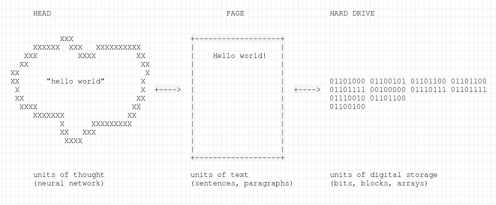

## Chapter 3: Form, Formula, Format

We know that the word shapes the human body in strange ways. After a lifetime
of reading shoulders acquire a stooped countenance, as if the book was
exerting pressure against the solar plexus. Eyesight deteriorates through
continual exertion. Tendons and other supporting structures in the wrist swell
from repetitive stress of contact with keyboards, the mechanical letter.
Reading and writing take their toll. An even more profound change happens when
we read and write computationally. Just as poetics strives to discover formal
structures in the organization of complex symbolic notational systems, the
complex symbolic notational systems embedded into our devices are building
models of us. Machine learning algorithms track the speed by which the reader
advances from paragraph to paragraph. They create a "fingerprint" of
individual readers that points to their gender, age, race, ethnicity, and
socio-economic status. They track the movement of the finger: where the reader
is likely to move next; what themes are likely to follow other kinds of
themes; how the human brain makes connections between topics. Heat maps are
drawn to reflect the dynamics of attention, desire. Supervised learning
algorithms use our collective philological output to predict behavior and to
alter the visible content to better suit our predilections. Deep neural
networks artificially mimic the brain to create models of human behavior that
lie beyond human comprehension. The What I propose here is the beginning.

Despite the formative impact on the practices of comprehension, code---the
programmatic sign---does not often figure in our theories of meaning making.
Instead, we erroneously consign it to the ornamental "formatting" layer of
document structure. We do so at our peril. Unlike passive decorative elements
like fleurons, daggers and pilcrows, box drawings, and other dingbats the
programmatic sign actively molds text to context. At the maximally blunt limit
of its functions, the formatting layer affects visibility. For example, it can
selectively render some words and sentences on the screen while suppressing
others. The ability to hide text from view completely or to make it so small
as to be illegible affects not just the style but the politics of text. Code,
in that sense, can determine its audience, privileging certain voices and
modes of access over others. It is in the sense of audience selection that the
programmatic sign acquires its non-representational, tactical character.
Stripped of references, resemblances, and designations the programmatic sign
commands and controls.

Unlike figurative language, machine control languages function in the
imperative. They do not stand for action---they are action. More binding than
the "speech acts" J.L. Austin, control codes arrange and regulate. Code is an
exercise of power, not its representation. The difference between
representation and control is one of brute force. It lies in the distinction
between a restraining order and physical restraint. A restraining order
*signifies* the calling forth of codified power. Physical restraints like
handcuffs *enact* the exercise of codified power. Like all violence they do
not stand for anything. Stripped of references, resemblances, and
designations, they are in themselves an arrangement and rearrangement of
matter. The handcuffs contort the body into the shape of submission. Absent a
body, the restraints draw an empty shape.

Code acts similarly to shape the word. Located somewhere between the screen
and the storage medium, formatting relates matter to content. It is a
technique, by which immanent inscriptions are composed into transcendent
digital objects like novels, songs, and photographs. Formatting imposes
structure. Think of a paragraph, for example. By convention, writers use
paragraphs to break up the flow of monolithic thought on a page. The paragraph
contains information. Can we imagine an empty paragraph? Can the shape of the
paragraph persist outside of the material confines of the page or the screen?
Can one imagine a paragraph that unfolds spatially not in two dimensions, but
in one, along a straight line? What about a three dimensional paragraph?
Could it take the shape of a cuboid instead instead of a rectangle? These
questions boggle the mind because the paragraph draws a singular shape. It is
a textual container of a type. Any other shape less or more than the paragraph
would go by another name. It would constitute another format. To imagine
something like a one-dimensional paragraph is akin to imagining a flat
shoebox. A flat shoebox could no longer hold shoes. It would contain something
else like images of footwear. Similarly, a paragraph identifies a particular
arrangement of elements. It is a box or a data structure of a shape, made to
hold words and sentences. Like nesting dolls, words and sentences are in
themselves data structures that contain further, smaller arrangements of
information. One could say, what of such arrangements?  Who cares about
paragraphs? It is merely one type of a container among many. It has only the
instrumental function to help get the point across. The meat of interpretation
lies in the stuff within. Words come in other shapes and sizes. The outer
container is disposable and therefore insignificant.

Formats could only seem insignificant in the past when they were few and
simple. The transition between static and composable, dynamic media
necessitates renewed attention to the formatting layer of meaning making. What
you saw is what you got on the page. On the screen, what you see is but a
small part of what you get. The content---all that is contained on a
page---shifts beneath the projected image. In print, content can be gleaned
from the surface. There is nothing but surface on a page. The screen is a
layered surface. Sandwiched between substrates of glass, liquid crystal moves
in response to electrical modulation. The ebb and flow of electricity in turn
reflects yet another layer of codification, inscribed onto yet other recondite
planes of inscription. A byte, made up of eight binary bits, holds a letter.
The string of letters spelling out "hello world" occupies eleven bytes on the
hard drive.[^ln3-space] A file in the Portable Document Format (`.pdf`)
containing nothing but "hello world" takes up 24,335 bytes on my system.
Encoding accounts for the disparity between plain text and fancy text, the
latter defined as "text representation consisting of plain text plus added
information" [@unicode_consortium_unicode_1990].

[^ln3-space]: Ten bytes for the letters and one byte for the space character.

What is the nature of this "added information?" Historically, the added
information included machine instructions for viewing and printing text,
encoding, or encryption, used for clandestine communication. The Portable
Document Format (PDF) specifically can also contain features that enable--and
I quote the exact specifications here---"accessibility of content to those
with disabilities," "digital signatures to certify authenticity," "electronic
forms to gather data," "preservation of document fidelity independent of the
device, platform, and software," and "security and permission to allow the
creator to retain control of the document and associated rights"
[@iso_portable_2008, vii]. These capabilities operate somewhere between the
visible content and stored information. The formatting layer specifies the
*affordances* of electronic text. More than passive conduits of meaning,
electronic texts thus carry within them the rules for engagement between
authors and their readers. In our example, the Portable Document Format
encodes among other things ideas about "reading," "authenticity," "fidelity,"
"preservation," and "authorship." Whatever literary theoretical framework the
reader brings to the process of interpretation must therefore meet the
affordances encoded into the electronic text itself. Such an encounter happens
not on the level of representation or ideology, but on the level of the
physical, the phatic, and the imperative, where formatting and control codes
reside.

The familiar paper paragraph structure already presents several interesting
problems for analysis. In claiming typographical space on a page the paragraph
suggests corresponding mental units. A unit of text becomes also a unit of
thought. But no such structures as paragraphs exist in the mind.
Physiologically, the brain arranges information otherwise. Things get
significantly more complicated when the paragraph mediates between the mind
and the page on the one side of comprehension, and the page and the machine on
the other.

Just like there is nothing inherently paragraph-like in the neural arrangement
of the brain, there is also nothing inherently paragraph-like or page-like in
the arrangement of bits along the surface of the magnetic disk or the solid
state drive. If we could peek inside the machine, we would see forms and
structures particular to those media. The analysis of computational forms
requires new formalisms and new critical vocabularies capable of drawing
correspondences between disparate structures. We are at the moment presented
with metaphors of paragraphs, pages, files, and folders. Screen
representations of paragraphs, pages, files, and folders look like their
counterparts on the page, yet they represent other structures in the head, and
yet other structures on the disk. The metaphor thus mediates between mental
image---information stored in the head---and inscription---information stored
in the machine. The nature of the interface between these disparate symbolisms
stems from the incompatibility between incommensurate systems. Format
specifications govern the transference of data structures from one medium into
the other, at the point of contact between human, symbol, and machine.

[^ln3-symbolisms]: I am combining the vocabulary of Wittgenstein from the
previous chapter with Alexander Galloway's. See @galloway_interface_2012,
viii.

Formatting rules facilitate the conversion of machine-readable codes into
human-readable text. The structure of the transformation governs the
production, storage, reception, and the dissemination of the textual artifact.
Despite its significance, formatting continues to elude the critical gaze
because our very concept of form, central to literary analysis, has always
drifted between vague and conflicting intuitions. The history of formalism, as
I will show it in the first part of this chapter, contains within it two
conflicting ideas about the nature of literary form. Going back to the
reception of Plato, Hegel, and the Russian formalists, the English "form"
renders at times the material, outward, and apparent shape of something said,
written, or pictured. Yet just as often, critics use "form" in the sense of a
Platonic ideal: abstracted from matter, inward-facing, and in need of
explication. Form in that sense is closer to the idea of an algorithm of a
formula: it produces meaning according to implicit rules.

In this chapter, I would like to augment these two senses of form with a
third, introducing the concept of formatting into the critical discourse. In
the second half of the chapter, and really, for the duration of this book, I
aim to show how formatting affects our ability to read and interpret everyday
digital documents. I propose we begin with a historically-grounded theoretical
discussion about formalism and end with a media history of something called
the Document Object Model. This formal construct governs the structure of most
modern textual artifacts. It embodies a particular kind of formalism and
therefore helps us test some of our theoretical intuitions about form,
formulae, and format in practice, immediately at hand.

### 3.1 Concrete and Universal

The intellectual history of formalist thought in literary theory contains
within it at least these two distinct and contradictory ideas about form: one
about the outward shape of the sign and another about the inward structure or
formula that governs semiosis. The distinction is important because it leads
to several conflicting strategies of interpretation. Taken in the sense of
"outwards shape," form suggests an aesthetics or even an "erotics" of art
[@sontag_against_1966]. In this view, a sign is forever embedded into the
specific contexts of inscription and/or reception. The material peculiarity of
a word makes it forever different from the same word on a different page.
Formalism in this sense is concerned with the palpable, outward physical
attributes of text. Understood as formula, form suggests a more analytical
approach, aimed at explicating the inward structures---rules, patterns,
archetypes---that shape the production of text from within. Formal analysis in
that sense studies not specific traces or utterances, but rather the
development of ideal forms, which exist independent of any specific
instantiation. Form in that sense constitutes an abstraction, leading to
generalized historical categories like genre and period. Our ideas about "the
novel," for example, or "modernism," or "post-colonial theory" reflect formal
groupings of that kind. Where palpable form leads to immanent material
artifacts, the abstracted notion of form leads to transcendent, universal
ideals.

The notion of a "format" occupies the conceptual space somewhere between form
as intrinsic formula and form as extrinsic shape. In what remains a singular
article-length treatment on the topic in literary studies, G. Thomas Tanselle
approaches the concept of formatting from the point of view of textual
criticism---the practice of compiling, editing, annotating, preserving, and
publishing scholarly critical editions of (often) canonical texts. For
Tanselle's purposes, the concept of formatting addresses narrowly something
like "the number of page units placed on the press at one time"
[@tanselle_concept_2000, 112-3]. He acknowledges, however, that more broadly
speaking, formats refer also to the "nature and the order of the contents"
[@tanselle_concept_2000, 67-8]. In this way we may speak of soap operas as a
format for daytime television. The format of a journal may be a "broadsheet
daily" or a "tabloid." Unlike the more narrow term, genre, format identifies
both a particular kind and a particular structuring of content. The novel is a
genre, where the paperback is its common format. A paperback implies not only
the physical shape of the book, but also a method of manufacturing and
distribution, along with the *kind* of content. We do not expect scientific
textbooks in paperback, for example, just as we would not expect tabloids to
be printed on expensive stock or to support long-form investigative
journalism. The format captures something about the shape, the design, the
style, and the thematics of the subject matter; it connects, in other words,
the where to the what, the how, and in what order.

With these provisional definitions down on paper, I would like to revisit a
few of the canonical texts from the long history of formalism. It would be
interesting to see, for example, whether Plato's or Hegel's seminal passages
on formal aesthetics fall on inward structure or outward shape side of the
divide I have posited so far. Note first that in whatever tradition, the
concept of "form" is usually contraposed to some idea of "content." Content
refers to the stuff being shaped or arranged, whether by intrinsic law or
though extrinsic shaping. For example, the historian R.G. Collingwood famously
described the distinction between classical and romantic art periods in terms
of for the form/content divide. He wrote: "Classical art, in a word, stands
for form; romantic art for content" [@collingwood_form_1929, 335]. In recent
work on computational text generation, Kathleen McKeown wrote that to produce
discourse, writers and speakers "must decide what to say and how to present it
effectively," once again making the distinction content (the what to say) and
its presentation. McKeown writes that a machine that generates text should,
among other things, be able to determine the "content and textual shape" of
what needs to be said or written [@mckeown_text_1992, 1]. Similarly, in her
influential essay "Print Is Flat, Code Is Deep," Katherine Hayles writes about
"the interplay between a text's physical characteristics and its signifying
strategies" [@hayles_print_2004, 72]. In this way, a text having differing
physical characteristics may nevertheless employ the same signifying
strategies. The various editions of Shakespeare's *Hamlet*, for example, may
look different but nevertheless refer to the same work of art. We saw a
similar distinction in the discussion about technique, where writers made a
distinction between the object of art, a transcendent idea or content of the
work, and the object itself which contained the work's immanent, physical
characteristics.

As an aside, note that what counts for material belonging to the contingent
physical characteristics of a text object and what counts for the material
belonging to its signifying strategies depends on the kind of object at hand.
In this way, when reading a novel the reader may ignore the line length. The
length of an average line in Herman Melville's *Moby Dick*, for example,
changes with the edition. In this case, line lengths carry no meaning. But
when reading poetry, for example, the reader understands line length to be an
integral part of the text's "signifying strategies." The distinction between
form and content in that sense propagates a kind of value formation, by which
we are asked to separate those attributes of the texts that are meaningful
from those that are not. Some notion of form in that distinction implies
disposable shape, asking us to identify those physical attributes of the text
that can be omitted in the interpretation or the reproduction of texts. One
can imagine a printer deciding to discard information about the color of a
manuscript's ink for example or to do way with the idiosyncrasies of a
writer's handwriting. Those parts of the texts that are deemed insignificant
are omitted, while those dimmed significant pass from the category of
contingent "formal" characteristics to its essential signifying "contents."

The traditional distinction between form and content helps us perceive yet
another sense of "form," by which theorists often identify quite the opposite
to what is meant by form in the sense of a disposable shape. Consider that
under traditional, Platonic definitions form denotes the essential properties
of the object. For Plato, the "essence" or an "idea" of something (like a
chair) exists in an ideal, metaphysical state, somewhere beyond the confines
of the material universe. By contrast, a physical instantiation of that object
(a specific chair) embodies a somewhat more limited, corrupted even, version
of that perfect idea. The task of the philosopher becomes one of
reconstructing the single ideal notion of the perfect chair from its many
imperfect instantiations. A computer scientist will recognize in this chain of
reasoning some of the principles behind object-oriented programming: a way of
building software that works by defining abstract "object classes" and
invoking them as "class instances" [@hoare_record_1965;
@nygaard_history_1981]. The abstract class can further be modified, or
extended when called into action. In this way the abstract category of chairs
becomes a given chair, complete with individual flaws and imperfections. As
before, the flaws an imperfections are considered insignificant compared to
the perfected form of the ideal chair. In the idealist tradition, ideas
provide us with lasting universal "templates" for instantiation within the
contingent and always changing physical confines of the material
world.[^ln4-descartes]

So far, I have been using the term "form" quite liberally, relying on the
reader's intuitions about its use in everyday language. A closer look at the
canonical texts in the original will help us identify the conflicting meanings
that emerge in translation. In Plato's dialogues we find a number of words
that are sometimes reasonably rendered into the English "form." These include
*eidos* (essence), *idea* (idea), *morphe* (shape), and *phainomena*
(appearance). Compare, for example, the following several translations from
Plato's *Timaeus*. In *Timaeus*, we see the titular character discuss the
nature of the physical world with his collocutor. In a passage that
anticipates the famous "molten wax" analogy in Descartes, Timaeus notices that
some elements, like water, change their appearance [*phantazomenōn*] while
remaining essentially the same substance. Benjamin Jowett translates the
passage as follows:

> Thus, then, as the several elements never present themselves in the same
> form [*phantazomenōn*], how can anyone have the assurance to assert
> positively that any of them, whatever it may be, is one thing rather than
> another?  [@plato_timaeus_1998, 49d]

Compare the above with the translation of the same passage by W.R.M. Lamb, who
renders the Greek *phantazomenōn* into the English "appearance":

> Accordingly, since no one of these ever remains identical in appearance
> [*phantazomenōn*], which of them shall a man definitely affirm to be any one
> particular element and no other without incurring ridicule?
> [@plato_plato_1955, 48d]

Both translations of the Greek *phantazomenōn*, form and appearance, capture
the plain meaning of the passage: the essence of a thing remains even as its
outward appearance changes, taking on a phantasmal, fantastic, ghostly,
imaginable, and even "virtual" shape and appearance (all reasonable English
approximations of the Greek *phantazomenōn*). Accordingly, Jowett translates
*phantazomenōn* (that which is changeable) as "form" and Lamb as "appearance."

Contrast the *Timaeus* passages with the ones in *Cratylus*, about
name-giving. In *Cratylus*, Socrates and Hermogenes discuss the ways in which
words signify things by convention. "What has the carpenter in view when he
makes a shuttle?" Socrates asks. "Is it not something the nature of which is
to weave?" Hermogenes answers. "Well, then, if the shuttle breaks while he is
making it, will he make another with his mind fixed on that which is broken,
or on that form [*eidos*] with reference to which he was making the one which
he broke?" Hermogenes agrees the carpenter would fix his mind on the ideal
form. In that case, we should properly call *that* the real shuttle, Socrates
concludes---his point being that the exact outward appearance of individual
shuttles does not matter as much as the abstracted idea of shuttles. The
abstraction endures even as given instantiations break and shatter. There
exist different types of shuttles, some used to weave wool and some for linen,
but all of them, in Jowett's translation, "must contain the form or ideal
[*eidos*] of shuttle" [@plato_dialogues_1937, 389a-b]. In *Cratylus*, *eidos*
or form stands for the "universal lasting ideal" of all shuttles: exactly the
opposite of *phantazomenōn* as "ephemeral instantiation" in the previous
passage! Yet both *eidos* and *phantazomenōn* were reasonably translated into
the English "form," indicating a fundamental overloading of the
concept.[^ln4-plato]

The confusion persists in many English translations of G.W.F. Hegel, whose
discussion of Platonic forms gives us another paradigmatic text in the history
of formal aesthetics. In his *Lectures on Aesthetics*, Hegel posits classical
art as striving to reach an equilibrium between its ideational, spiritual
content and "the configuration of sensuous material" [@hegel_hegels_1998, 70].
Hegel prose is marked by technical and sometimes idiosyncratic vocabulary.
Rather than define terms precisely, Hegel saturates his text with semantic
cognates. On the side of "content" [*Inhalt*, *Gehalt*], he evokes words like
inner life [*Innere Lebendigkeit*], feeling [*Empfindung*], soul [*Seele*],
and spirit [*Geist*]. All of these convey a movement inward to a location (if
it can be called such) beyond the physical world, accessible only to the
spirit [*Geist*] or mind [*Gedanken*, *Verstand*]. On the side of "form" (same
in German), Hegel accumulates words like expression [*Ausdruck*] and
presentation [*Darstellung*], but also lines, curves, surfaces, carvings,
colors, tones, word sounds, and generally matter or material [*Linien*,
*Krümmungen*, *Flächen*, *Aushöhlungen*, *Farben*, *Tönen*, *Wortklängen*,
*Material*] [@hegel_werke:_1986, *Einleitung*]. The semantic cluster of words
related to "form" conveys physical (palpable, of this world) and
outward-facing properties, available for examination to the senses (*Sinne*).

In contrasting the dominant aesthetic modes of classical and Romantic periods,
Hegel paints Romanticism as an art that seeks to disengage itself from matter,
reaching the realm of pure self-reflective Spirit. Romanticism, in his words,
is "freed from this immediate existence which must be set down as negative,
overcome, and reflected into the spiritual unity" [@hegel_hegels_1998, 81]. He
writes: "Poetry is the universal art of the spirit which has become free in
itself and which is not tied down for its realization to external sensuous
material; instead, it launches out exclusively in the inner space and the
inner time of ideas and feelings" [@hegel_hegels_1998, 89]. Finally,
"inwardness celebrates its triumph over the external and manifests its victory
in and on the external itself, whereby what is apparent to the senses alone
sinks into worthlessness" [@hegel_hegels_1998, 81]. Romantic art can, in this
way, triumph over the external, material world, reaching, at its apex, what he
calls the stage of "free concrete spirituality" [*freie konkrete Geistigkeit*]
[@hegel_werke:_1986]. The idea overcomes matter to become both free from the
constraints of the deterministic physical universe, yet gaining a measure of
solidity in its tangible instantiation.

Several lines in Hegel's own exposition on Plato's idealism give us a glimpse
of his struggle with the Platonic concept of form. In his "Lectures on
Philosophy," Hegel writes: "The Idea is nothing but what is current with us
under the name of the Universal, when this word is not taken in the sense of
*formal* Universal [*formell Allgemeine*]." The formal universal for him is
"merely a property of things," whereas Plato is concerned with the
"implicitly" universal (as contrasted with explicitly, or formally universal).
This internal "essence" and "in-and-for-itself existent" lays a claim to truth
alone. Hegel writes: "We translate the Greek word *eidos* by 'genus' or
'species,'" but when "genus" or "species" are "seized as a number of similar
determinations collected by reflection from several individuals, to serve as a
*mark* for the convenience of the understanding, then we have the Universal in
quite an external form" [@hegel_philosophy_1870, 250]. In other words, as soon
as *eidos* is instantiated, it moves from being an ideal form into an apparent
shape, as an epistemological category.

I understand Hegel's problem with "formal Universal" as follows. Imagine
someone were to write "all these cats are subsumed under the category of
'feline.'" The ideal of being "feline" captures a snapshot of what it means to
be feline at the moment of the category's naming. For Hegel, the true ideal
cannot exist in the name alone, it must continue to exist and develop in the
real world. It is not, in other words, merely a socially constructed (we would
say today) category, but something that "internally distinguishes itself"
while remaining "free in its infinitude and independent" from all attempts to
fix it categorically. The best I can understand this is to think about the
evolutionary process that continues in the species, even as the taxonomy
describing that evolution may remain tied to its fixed ways of expression. No
matter what we call cats, the feline species will continue to evolve. New and
radically different cats may come into existence---ones no longer covered by
the "external mark" of being "feline," that is by our taxonomical categories.
Yet this would only mean that the ideal of "feline" has developed past human
understanding. Zoologists would, at that point, need simply adjust their
categories to include new forms of feline being. Ideal feline being moves on
immediately thereafter, continuing to develop and leaving behind only the husk
or a "snapshot" of what it meant to be a cat in times already past. For Hegel,
one should not confuse that static categorical snapshot with the animate
ideal. For this reason Hegel disparages the "formal universal" as a corrupted,
"mere" form of the ideal.

By contrast to the "formal universal," Hegel's "concrete universal" exists in
the real, physical world. It is more than a category. One way to understand
this difficult concept is to think of it as capturing both *eidos* and
*phantazomenōn*---or idea and appearance, both reasonably transcribed to
"form" in English. In an essay on Hegel's concept, John Crowe Ransom likens it
to a "little universe or an organized working combination of parts." He
writes: "Thus the formula of a chemical reaction; the recipe for a dish; the
blue-print of a machine." Crucially, the Hegelian universal becomes concrete
when the machine "has been materialized, and working properly"
[@ransom_concrete_1954, 387]. As was the case with Wittgenstein's logical
mechanisms, Ransom imagines a perfected kind of a machine that represents the
ideal of the aesthetic object.

### 3.2 Strategies of Reading

The above notes on Plato and Hegel are not meant to present a definitive
history of formalism in Western aesthetics. Rather, they point to series of
related folds and creases in that tradition, appearing around the concept of
form with some regularity. W.K. Wimsatt once observed that literary theorists
often persist in making statements that understand a work of literary art to
be, in a peculiar way, "a very individual thing or a very universal thing or
both" [@wimsatt_structure_1947, 262]. A work of art, a poem, understood as
something which "cannot be expressed in other terms" leads to the kind of
criticism that emphasizes the reflection upon the outward, affective, palpable
elements of the text. The function of such criticism, according to Wimsatt, is
to create "approximate descriptions of poems" and "multiple restatements of
their meaning," which aid the reader in coming to their own "intuitive and
full realizations" of literature [@wimsatt_structure_1947, 280]. Understood as
an end product of a living ideal or formula, the analysis of literature seeks
to recover latent universal mechanisms, laws, and deep structures that give
rise to surface phenomena.

The dual motion of literary criticism at once towards the outward shape and
inward formula---poetics and hermeneutics---is perhaps most starkly visible in
the intellectual legacy of Russian formalism in the first few decades of 20th
century. The seminal series of "OPOYAZ" publications, appearing between 1916
and 1920, gave voice to a unified program to a group of literary scholars that
included Viktor Shklovsky, Osip Brik, Lev Yakubinsky, Boris Eichenbaum, and
Roman Jakobson, among others. Collectively, the volumes strike out in two
distinct, but complementary directions.

A set of essays by Brik, Shklovsky, Yakubinski, and others contrapose "sound"
[*zvuk*] to "symbol" [*obraz*]. Brik writes: "I believe that elements of
symbolic and sonic [*zvukovoi*] art exist simultaneously, and that every given
piece of [poetic] work comprises an equilibrium of these two heterogeneous
poetic impulses" [@shklovksy_sborniki_1917, 25]. Of the sixteen or so unique
essays that appear in the three collected volumes (some of the essays repeat
across volumes), thirteen have the word "sound" [*zvuk*], or some variation
thereof, in the title, in combinations like "sound image," "sound gesture,"
and "sound repetition." To this cluster of essays we may attribute the Russian
formalist concern with *zaum*---literally, beyond sense, or beyonsense---
trans-rational, nonsensical sounds that nevertheless elicit an affective,
lived response, giving voice to ideas that are difficult to explain rationally
[@khlebnivkov_collected_1987, 179; @khlebnikov_king_1990, 151;
@labelle_lexicon_2014, 63].

Poetry in the symbolic mode encodes meaning inwardly: the elephant "stands
for" memory, or the like. *Zaum* poetics instead evoke affect through external
shape, as sound. Khlebnikov writes that "mystical incantation and beyonsense
are appeals 'over the head' of government straight to the population of
feelings, a direct cry to the predawn of the soul" [@khlebnikov_king_1990,
152]. Shklovsky defines *zaum* as "without words but with sound." He writes:

> Thought and speech cannot keep up with inspired experience, and
for this reason artists are free to express themselves not only in language of
common understanding, but also in private language---language that has no
settled sense [...] Lilacs are beautiful, but how deformed [*bezobrazno*] the
word "lilac," plundered and exhausted. This is why I call a lilac "uao,"
restoring its primal clarity [@shklovksy_poetika_1919, 13].

The word *bezobrazno*, in the meaning of hideous or deformed, literally
translates as "without an image." In language of lilacs has lost its shape,
the author implies. Formalism of the outward kind thus aims to restore the
word image, returning form, in the sense of shape, to content. Formal
techniques like chanting or neologism revitalize the external sound image. In
repetition the word loses its sense while gaining a distinct physical sound
signature, which habitually goes unnoticed in everyday use.

Three of the sixteen essays in the seminal volumes I have discussed above
strike in another direction, away from shape and towards formula. Shklovsky's
"Art as Technique," "Linkages between Plot and Style Device," and Eichenbaum's
"How the *Overcoat* Is Made," constitute a cluster of essays that deal with
narrative structure rather than phonetic image.[ln3-propp]  All three authors
cite a common source of influence for this direction of research: namely, the
work of Alexander Veselovsky, the 19th century Russian historian of literature
and founder of the comparative method in that tradition. Veselovsky, a scholar
of the generation previous to the formalists, did not attain the renown
enjoyed by his pupils in the West. An early pioneer of comparative literature,
he advocated philology as a "historical" and "genetic" study of "poetic
consciousness and its forms." Citing literary explorations by Goethe,
Friedrich Schiller, and Georges Polti as his inspiration, Veselovsky almost
always uses the word "form" in the sense of the "formula," and not at all in
the sense of "shape" or "sound." In this, he imagines a rather Hegelian model
of literary evolution, which proceeds through the development of universal
constants, narrative plot sequences for example, which further influence the
development of literary particulars.  Veselovsky calls these genetic constants
"vagabond formulas" [@veselovsky_sobranie_1913, 185]. He writes:

> Somewhere, someone gave these plots [*siuzhety*] an apt expression, a
> formula, elastic enough to fit, if not new content, then new interpretations
> of plots rich in their associative possibilities. The formula endures.
> Writers will return to it, altering its significance, expanding its meaning,
> and adopting it to new types. As the formula of "desire" was and continues
> to be repeated, so also are repeated the plots of *Faust* and *Don Juan*
> across the distance of centuries [...] We are connected to a tradition. We
> expand within it---not to create new forms, but to attach to them new
> sentiments and concerns. This dynamic could be considered as a type of "law
> of [cultural] energy conservation. [@veselovsky_sobranie_1913, 475-47]

[ln3-propp]: To this strain of formalism one could also adduce Vladimir
Propp's well-known *Morphology of the Folktale*, a text that finds a limited
number of universal principles of composition in the multiplicity of folktale
traditions.

The Hegelian influence is unmistakable in these lines. Like the world spirit,
literary formulae exist and develop across time and space. Veselovsky's
formulas resemble concrete universals, which develop independently of
individual texts. Formulae in this sense have a life of their own, in a trans-
or meta- human way, not accessible to the individual author. They are evoked
indirectly. They exist in the ether of culture, attaining a historical
momentum of their own through a process of gradual genetic development. Form,
in this Hegelian, historical sense, means exactly the opposite of form in the
sense of a private utterance, by which an individual author breaks with an
ossified tradition, as was the case with Shklovsky's idiosyncratic naming of
the flower, *uao*.

The tension between extrinsic shape and intrinsic rule lies at the heart of
literary theory, manifesting at times under differing yet essentially related
vocabularies. The emphasis on extrinsic shape logically leads to the poetics
of affective reading of the kind that privileges apparent surface phenomena.
The emphasis on intrinsic rules leads to a hermeneutics or an archeology of
text, by which the critics role becomes to discover non-apparent deep
structural regularities. Recently, the theoretical distinction between shape
and formula has been negotiated in terms of depth and surface. Two types of
reading become evident in this model. The "symptomatic" literary critic
reaches beyond the "ephemeral" external appearances to uncover internal and
eternal metaphysical truth within. For a Marxist critic like Terry Eagleton or
Frederic Jameson that latent meaning may have something to do with hidden
machinations of capital and ideology. The psychologically minded critic reads
in search of hidden drives, desires, or cognitive structures. By contrast to
symptomatic reading, Stephen Best and Sharon Marcus describe a constellation
of reading practices concerned with "what is evident, perceptible,
apprehensible in text: what is neither hidden nor hiding; what, in the
geometrical sense, has length and breadth but no thickness, and therefore
covers no depth." The authors identify a constellation of related
interpretation practices at the surface: reading for material surface, reading
for verbal structure, reading for affect, reading for description, reading for
pattern, and finally, reading for literal meaning or "just reading"
[@best_surface_2009, 9].

In making the argument for a kind of surface reading, Best and Marcus appeal
to the kind of formal poetics advocated by Susan Sontag in the late 1960s. At
the time, Sontag wrote about "the need for more attention to form in art."
Interpretation can be liberating, she wrote, but it can also stifle
creativity. It "depletes" the world in some way, placing the critic in a
privileged and unnecessarily meddling position between reader and text. "If
excessive stress on content provokes the arrogance of interpretation, more
extended and more thorough descriptions of form would silence," she writes.
"The best criticism, and it is uncommon, is of this sort that dissolves
considerations of content into those of form" [@sontag_against_1966, 8-9].
Marcus and Best remind the reader that Sontag's manifesto is not just an
argument against interpretation, but also an "affective and ethical stance"
[@best_surface_2009, 10]. Strategies of "deep" interpretation carry with them
also a claim to access, along with an imbalance of interpretive acumen. The
critic claims to uncover what the lay reader does not and cannot see without
expert guidance. As an ethical stance, reading for external forms flattens the
hierarchy between the lay reader and the professional interpreter. In this
sense, Best, Marcus, and Sontag continue in the liberal Lutheran tradition of
vernacular exegesis. All readers are priests at the surface. All readers are
capable, the critics suggest, of forming their own interpretation.

Interpretation at the level of meaning and content for Sontag is an
intellectual and ultimately reactionary activity. It aims to find "the maximum
amount of content" within. It is reactionary because it serves only to
multiply the available "levels of analysis." In explicating the work of art,
the critic essentially creates alternative and diverging copies of the
original. Each layer of criticism adds to the content of the work. In Sontag's
words, to "design" a work of art that can be experienced in this way, on
multiple levels, might have been "creative" and "revolutionary" in the age of
aesthetic paucity, when creativity and interpretation were limited to a few
privileged individuals. By contrast, Sontag believes that her times are a
period of creative abundance. "Think of the sheer multiplication of works of
art available to all of us," she writes. Contemporary culture is based on
"excess" and "material plenitude" which dull the senses. In such conditions,
the production of further critical variations on the theme only adds to the
dulling clutter.

By "interpretation," Sontag means a "conscious act of the mind" which
illustrates a "certain code," or "certain rules" of engagement. It is, for
her, "virtually" a type of translation. The critic "transforms" and "revamps"
the text: X turns out to be A, Y turns out to be B, and so on
[@sontag_against_1966, 3]. And by "form" Sontag means something like the
apparent, perceptual properties of the work: this sentence is long, for
example. And this one short. A critic could say that the sentence length means
something, but Sontag wants to stop short of meaning making. A discipline of
careful perception---of paying attention---rather sharpens the reader's
sensibilities. The history of interpretation Sontag objects to is one that
privileges content over form. The very words "explication" and "exegesis"
imply the movement from inside to the outside. For a psychoanalytical critic
interpretation in that sense may mean revealing the hidden psychological
drives that give rise to a particular form of an expression. A Marxist critic
may instead look for the concealed operation of this or that ideology.
Fredrick Jameson, a prominent Marxist critic, writes for example:

> Thus the process of criticism is, not so much the interpretation of
content, as it is a revealing of it, a laying bare, a restoration of the
original message, the original experience, beneath the distortions of the
various kinds of censorship that have been at work upon it; and this revelation
takes the form of an explanation of why the content was so distorted and is
thus inseparable from a description of the mechanisms of the censorship itself
[@jameson_marxism_1972, 404].

Form in the sense of "outward shape" suggests an emphasis on what Susan Sontag
deemed the "sensory experience" or the "erotics" of art. In her now classic
1966 essay "Against Interpretation," Sontag posits transparency as the
"highest, most liberating value in art and in criticism today." "Transparency
means experiencing the luminousness of the thing in itself, of things being
what they are" she explains [@sontag_against_1966, 9]. Rather than to show
what a work of art *means*, Sontag urges critics to show "how it is" and "that
it is" [@sontag_against_1966, 10]. To make her argument Sontag relies on the
distinction between "meaning" or "content" on the one hand and "form" or the
"sensory experience" of the work on the other. Form, in this sense, mirrors
McKeown's "shape" and the "text's physical characteristics" of Hayles.

If reading for sensory experience implies an erotics of art and reading for
hidden formulae implies an analytics, what would it mean to read for the
format? To borrow from Tanselle's vocabulary, the format bridges the "physical
structure of finished books" with their "intellectual content." This
connection happens through what Tanselle calls "printing-shop routines" and
what we began to identify in the previous chapter as a kind of a technique.
Formatting in that sense is a way of structuring of information. The task of a
textual scholar broadly is therefore to serve in the role of an arbitrator in
the conflict between the textual witnesses, which individually contain
slightly differing versions of the same text, but in aggregate identify the
sum total of a given work.[^ln3-printers] The textual scholar studies how
works become texts and the other way around. It is in this sense, for example,
that C. Deirdre Phelps describes the notion of physical form in textual
criticism. In creating a physical manifestation of a text, publishers
introduce textual changes that may or may not correspond to either authorial
intention or the reader's expectations. For example, we could imagine an
expensive edition of poetry by William Blake to be printed without
illustrations to save costs. If we subsequently lose all other editions of
Blake, the textual critic may be interested in reconstructing the
bibliographic genealogy of this one edition to understand something about the
life of the work. "The textual critic is concerned mainly with the fact of the
[textual] change itself," Phelps writes [@phelps_edition_1994, 65-6].

[^ln3-printers]: See for example the discussion on the limits of the inductive
method in bibliographic study in @mckenzie_making_2002, 16-17. See also
@mcgann_socialization_1991; @tanselle_textual_1996.

Various schools of textual criticism may privilege either authorial intention,
publisher's discretion, or the reader's expectation, but whatever these
choices may hold, they propagate a kind of value determination that separates
those physical attributes meaningful to the work from those that are not. For
example, in their online edition of Claude McKay's 1922 collection of poems
*Harlem Dawn*, the editors made the decision to encode indentation, preserving
the perceived integrity of the poem's visual line structure. However, they
have also allowed for the text to wrap when viewed on small devices, in effect
"soft wrapping" those lyrical lines that are too long to fit on a small
screen. The end result is a compromise between authorial intention and
technological capability. Other solutions are possible, of course. The editors
could have chosen to recreate a graphical facsimile of a particular print
edition, which would not render well on small screen [@mckay_harlem_2015]. The
choice to preserve certain attributes of formatting, while suppressing others
identifies those elements meaningful to the editors. In the most extreme case,
we could imagine an editor wanting to preserve all of a text's details, down
to the molecular structure of the original. Such a text could be accompanied
by a potentially unlimited amount of metadata describing the precise physical
contexts of the universe surrounding the authoritative version. To reproduce
the text faithfully would be to reproduce the world around it. We do not,
however, as readers, usually care for all of a text's physical attributes.
Stains and scratches on the paper's surface are usually discarded in
reproduction. They are not seen as meaningful for the understanding of text.

Thus whenever we think of Shakespeare's *King Lear*, for example, whatever is
meant by the "format" of the play belongs neither wholly to its physical
medium (pixel or paper) nor to the ideational content of the work. Format, in
that sense, lies somewhere between the two worlds: it is in the shape of the
letters, in the structure of the narrative, and in the prosody of the word. We
do not quite know which of these elements belong to the content of the play
and which are the contingent material artifacts of the printing process: the
way the fonts look, for example, or the way lines break on the page. Some
matters of format matter to us as readers (line breaks), while others may not
(font kerning, for example). The tradition of textual criticism reminds the
literary theorist of the transition that happens between literary texts and
literary works. The transformation between ideas and things is always a
fraught process, because whatever the theorist may believe about the dynamics
of interpretation must be weighed against the material affordances of the
specific textual witness. A word, a comma not included into the text cannot
become a part of meaning making. Formatting practices keep the gates of
interpretation.

[^ln3-remind]: See for example @shillingsburg_being_2006;
@greetham_textual_1989.

In a meditation on pictographs and pictographic logic Johanna Drucker and
Jerome McGann write about the "presentational form of texts" which usually
masks their "logical operations in a surface rhetoric that dominates and
controls our conscious attention." "The physicality of textual marks and
shapes disappear in an act of reading determined to highlight certain kinds of
conceptual references (content)," they continue. At the same time, what the
authors call the "holistic repleteness of images" also keeps us from
perceiving their "conceptual order [...] as if the graphic character of the
work were completely obvious" [@drucker_images_????]. This important insight
captures the dual movement of formatting at once towards the physical
characteristics of the text and towards the mental characteristics of the
content. Ideation ally, the reader understands the text as a mental construct
that takes shape in the mind. The book subsides into obscurity, as Percy
Lubbock wrote in *The Craft of Fiction*. Subsequently, readers tend to treat
text in a disembodied fashion---surface rhetoric---forgetting about the
material structures that support the mental phenomena. Phenomenologically
speaking however, the page presents itself holistically, at once, as a unified
image, in what the Drucker and McGann call its "holistic repleteness." It is
as if it was always so: these words were always in this order, at these
coordinates. The printer and the book designer know that it is not so. Drucker
and McGann write that "systems of graphic presentation are operational, not
merely passive schematic structures [...] active agents for creating meaning,
instructions for reading, viewing, comprehending information
[@drucker_images_????].

We are finally confronted with several concrete differences between print and
digital formats for text resolution. Editors and textual scholars negotiate
the instruction set for reading, viewing, and comprehending information in
print in advance of publication. The choice to include or to exclude certain
words, versions, or visual elements of the text is set into the page, where it
remains statically in place for the duration of a book's life cycle. The book
itself provides a stable platform for a range of reading practices, which
include annotation, copying, and the preservation of written work. To the
extent that books determine the affordances of reading, those affordances
exhibit historical continuity. For example, the format of the book presupposes
several physical abilities like manual dexterity, reading capability, and
eyesight within a specific range of vision. In return, the book affords tasks
like highlighting and the taking of notes. Empty space on a page around the
text facilitates marginalia. For the highlighter or the pen to function well
the printing medium must be made of a porous material, and not, for example,
plastic, which would make marking the page difficult while affording other
capabilities, like reading under water.[^ln3-notes]

[ln3-notes]: See @blair_note_2004; @daston_taking_2004; @piper_note_2012.

The affordances of the electronic book are more diffuse. On the one hand, the
format of the book has been replaced with a multitude of competing digital
formats, each vying to supplant print to become the singular, unified reading
platform. The family of book- and document-related application software made
by Adobe Systems, the company behind the popular Portable Document Format,
includes Adobe Digital Editions, which the reader can use "to download and
purchase digital content, which can be read both online and offline. The
platform's "features" include the ability to "download and transfer books
between devices," "searching eBooks," support for multiple languages, the
ability to borrow books, printing, limited support for visually impaired
readers, bookmarking, highlights, notes, and file organization [@_plans_????].
Its own competing Adobe Document Cloud reading platform includes the Free,
Standard, and Pro versions of Acrobat Reader, "the global standard for
reliably viewing, printing, and commenting on PDF documents" [@_adobe_????].
Only the most expensive Pro version allows one to "create and validate PDFs to
meet accessibility standards for people with disabilities." The free version
does not support bookmarks or document editing. The Pro version allow enables
readers to "redact and permanently remove sensitive information in PDFs" and
to "compare two version of a document to see what's changed" [@_plans_????].
The Amazon Kindle reader, made by the world's largest purveyor of book both
print and electronic, includes a feature called "Public Notes" which allows
Kindle customers to "make their highlights and notes available for anyone to
see" [@_amazon_????-1]. The frequently asked question page further explains
that "if someone you follow has highlighted a passage in a book and has turned
on Public Notes for the book, you'll see that passage highlighted along with
the name of the person who highlighted it." The FAQ continues to tout the
benefits of their platform:

> Now authors, thought leaders, passionate readers, professors and all Kindle
users can opt-in to share their notes with other readers, helping friends,
family members, and other Kindle users who choose to follow them to get more
from their reading. If someone you follow has highlighted a passage in a book
and has turned on Public Notes for the book, you'll see that passage
highlighted along with the name of the person who highlighted it. You'll also
see the notes that they made in the book [@_amazon_????] The Google Play Books
platform does not have a public note features nor does it support book
editing. It does however add the ability to translate words and passages and
to search for selected phrases using the company's search engine
[@_read_????]. In short, the electronic book cannot be reduced to a single
platform. The affordances of reading, taking notes, sharing, and storing books
are determined by the software, governed by specific socio-economic
contingencies. Thus a book available in North America, might be be available
on other continents, or it could be available elsewhere in a redacted form,
its content tailored to the reader's geography dynamically.

On the other hand, my remarks about the diffuse affordances of the electronic
book hold true only for interaction through the sanctioned "front end" modes
of access. For example, note that all of the major book platforms I have
mentioned above are coupled tightly with their respective book markets.
Whatever the comparative affordances of reading an Amazon ebook versus the
book expressed in the Adobe Document Cloud, the software must emulate the
logics of document ownership. To own an electronic book or a document means
significantly different things depending on the specific affordances of the
given platform. In another sense, to own a book in each case means to have
access to the bits that bring the simulation of the book into existence. At
some lower level of abstraction the variety of reading platforms rest on the
computational substratum. This hyper-media, as Lev Manovich calls it,
underlies all simulacra, including the bibliographic
[@manovich_software_2013]. A common act of epistemic disobedience, to borrow
from Walter Mignolo, therefore includes accessing the book bits more directly,
through unsanctioned channels [@mignolo_epistemic_2009]. One can for example
disentangle models of document ownership embodied in an Amazon Kindle document
format from the "content" of the book itself. The so called "ripping" of the
Kindle book library involves reformatting individual books into other forms
which could hypothetically enable unfettered copying and circulation,
constrained by original platform. The activity need not be illicit. The
extraction of plain text from the Portable Document Format commonly
constitutes the initial step in scholarly corpus analysis or distant reading.

In each of the above examples, the reader confronts some aspect of formatting
instrumentally, for a particular purpose like copying, analysis, or
preservation. I am however also interested in a more systematic wholesale
exposition of electronic document structure. Reading for format involves the
deconstruction, both literal and figuratively historical, of the literary
device. Where paper books present the reader with a limited set of known
affordances tied to the print medium, electronic books present us with a
virtually limitless and for the most part unexamined set of simulated
affordances. Whatever interpretive activity readers hope to enact at the level
of textual representation is grounded in the material affordances of the
simulated book. The responsibility for formatting no longer belongs to the
singular act of edition making. A number of agents actively intercede in the
transition between the inscription---information on a disk---and its
representation---pixels on the screen. These intercessions may be benign, as
when the electronic book changes the layout of the text to fit a smaller
screen when displaying text on mobile devices; or it may be totalizing as when
a book platform is designed also to censor or to surveil its readers for
commercial or political purposes. Reading for format reveals the structure of
the transformation between media: the liquid crystal, the floating gate, and
the entorhinal grid.[^ln3-hex] The format governs and controls in the sense of
shaping the encounter between otherwise incommensurate systems, hardware and
wetware---storage, screen, and brain.

[^ln3-hex]: In this last regard see @stensola_entorhinal_2012. This
ground-breaking work describes the structure of data in the human brain.

### 3.3 Format Theory

A notion of formatting underlies all contemporary digital documents. The
history of formatting reveals a structure that emerges initially for the
purposes of visual layout, developing into an active agent containing
"instructions for reading, viewing, and comprehending information" of the sort
Drucker and McGann highlight in their work. I would like to spend the second
half of this chapter on several case studies from the still unwritten history
of formatting. These case studies will help test our theoretical intuitions
about form in practice. They serve also to convince the reader of the
continual importance of textual criticism and format studies for the
advancement of literary scholarship and more broadly for the politics of
reading and interpretation at large. If, as we conventionally intuit, the
format layer arbitrates between medium and symbol---word and page---then it
must also play a part in the encounter between human and text. Format in a
sense determines the available reading strategies, including the one of not
reading at all: thus an archive under lock and key, the management of copy
rights and borrowing privileges, the sensor's viscous black ink.

![EDIT Document Model, 1968 [@kaiman_computer-aided_1968, 66].](images/edit.png)

Describing *EDIT*, one of the first editors designed for the GE635 36-bit
mainframe computers in use at Bell Labs in 1968, Arthur Kaiman wrote: "The
publication editor is divided into three related sections, the document layout
facility, the editing facility, and the printing facility"
[@kaiman_computer-aided_1968, 66]. The "layout," in Kaiman's vocabulary,
contains such things as justification, indentation, and spacing. These
"primitive requests" can be combined to describe more complex "structures of
the printed text." The creators of *QED*, another influential early text
editor (created for the SDS-930 time-sharing system at Berkeley) similarly
encouraged the writer "to think in terms of structure" of the text. *QED* and
*EDIT* were some of the first text editors to separate notions of "content"
and "formatting," which were meant to be recombined later and imprinted onto
external storage media. Kaiman explains that "the user types the document
layout file and the text file, then produces a proof or master copy of the
text by printing the text according to the directions of the layout file. The
text file contains layout marks to be interpreted by the layout file." "Text,"
in this schema, constitutes content meaningful only to the user, whereas
layout contains some elements meaningful to the human and some elements as
code instructions intended for device control. Layout in that sense asks the
human editor to make a distinction between semantic an spatial units: words
and their coordinates.

IBM's FORMAT text program, written in FORTRAN IV for OS/360 devices in 1968,
discusses formatting in terms of "text control." "All input to FORMAT is
free-form, in that there are no positional constraints," the author of the
program writes [@berns_format_1968, 85; @berns_description_1969, 141]." Text
control under the FORMAT model was limited to several "command words" that
included "P" for "begin new paragraph," "T" for "tab," and "A" for "print 'as
is', maintaining spacing of the input" [@berns_description_1969, 141]. EDIT
also had the capability of building an index, in effect listing all the unique
words in any given document, along with a rudimentary facility for search, or
in its own works for "locating text words, phrases, and strings in the input
stream" [@berns_format_1968, 91; @berns_description_1969, 145].

More than a decade later, reflecting on the proliferation of text editors the
authors advance the following unified theory of format. "A *document* is an
object composed of a hierarchy of primitive objects," the authors write. The
objects are further divided into "abstract" or "logical" objects and their
"concrete" instantiations. The authors explain: "an abstract object is denoted
by an identifier and the class to which the object belongs." By contrast,
concrete objects occupy "one or more two-dimensional page spaces and represent
the possible formatted images of abstract objects" [@furuta_document_1982,
418]. In other words, the concrete object gives physical shape, layout, or
style to the instantiation of abstract universal classes like paragraphs and
sentences. Concrete objects are abstract paragraphs and sentences "laid out"
in page space. In this schema, the word "cat" embodies a concrete object, a
physical inscription at a given location. It further denotes the identifier
for the idea of "cat," which belongs to the class "word". Note that by this
model, cats are not classified under the their semantic category of "felines."
Rather, we are concerned with the abstract type of the identifier itself.
Other primitive classes include paragraphs, sections, paragraphs, and
footnotes, for example. A document can therefore be expressed as a
hierarchical ordering of such primitive objects. In this way, we may think of
a "novel" as an abstract succession of "chapters," which in turn encapsulate
"paragraphs" that contain "sentences and words," further composed of
"characters." These abstract units must then find their physical manifestation
on a page. They stand in a hierarchical relationship to each other because
paragraphs contain sentences, and sentences words, and not the other way
around. Together, the primitive object classes make up more sophisticated
abstractions like "letters," "articles," "books," and "journals"
[@furuta_document_1982, 417-19; @shaw_model_1980].

The classes / instance distinction allows us to think of editing and
formatting tasks in terms of state transformations. In this way, editing the
document involves the transition abstract states, as when the author corrects
spelling for example. Concrete to concrete editing transitions can involve the
sequential rearrangement of sentences or paragraphs, or moving data from one
table to another. Crucially for our discussion, the authors define formatting
as a transformation between abstract and concrete classes: the application of
font styles, for example. Formatting in that sense converts what the authors
call the "intended document" into the "visible concrete document." Between
these two polarities we observe the document description, at which stage
content and physical text specifications are mixed together and laid out for
viewing on a particular device [@furuta_document_1982, 419-22]. This last part
is important, as many systems are designed to display text without "knowing"
in a sense the ultimate physical dimensions of the target device. We can think
for example of document files that are rendered in more or less the same way
on a multitude of screens of varying sizes. Nothing in the code guarantees the
dimensions of the visible concrete document. We are only assured of the proper
structure: that the paragraphs will have a certain spacing, that the footnotes
appear on the bottom of the page, and so on.

We can think of examples of other formatting operations which move in the
opposite direction: from concrete to abstract for example. This happens in
Optical Character Recognition, in the process by which the image of a physical
page is converted into an intended, abstract structure, the "content" thereby
lifted from the physical page. Yet other formatting functions convert 

<!--- stop here -->

Spelling correction, for example, constitutes an editing manipulation where
abstract objects are modified into other abstract objects. Moving footnotes to
endnotes, or shifting data tables around the document would count as editing of
the "concrete to concrete" type. The authors define *formatting* as giving
concrete shape to ideas in the transformation between abstract and concrete
objects. Italicizing a word, for example, gives the idea of "emphasis" a
slanted form. The act of breaking a document into pages gives shape (and a
specific number of lines, for example) to the idea of a page.

The authors hint at, but do not discuss the opposite movement, from "concrete
to abstract" entities, as would be done in the process of optical character
recognition (OCR). An important part of the digitization process, OCR "lifts"
ideational content from the page image. Without OCR, common document formats
like `.pdf` and `.tiff` therefore remain *merely visual representations*. They
do not, at that stage, contain text or "abstract objects" as such. They are
just pictures. Similar to how humans must "read" a text first in order to
understand it, OCR attempts to "recognize" textual content from the image as a
first step to further manipulation. Leaving aside the question of machine
"understanding," recognition in this case implies more narrowly the
conversation of image into text. This implies also that textuality occupies a
distinct and privileged category in document epistemology, from the point of
view of the machine. Another way to think about machine text would be to
describe "images" as one type of "internal data structure" and text as another,
more "structured" and "more internal," mode of representation. Consider that in
the hierarchical Document Object Model images can contain text, but text
cannot contain images. Text, in that sense, lies at the innermost location in
series of nested "outer" containers. Lacking a model of "comprehension" or
"understanding," the Document Object Model merely posits text as "content" only
in the sense of it being the "innermost" object of recognition.

The "recognition" of characters does not, however, fully capture the variety of
abstract document objects, which besides letters and words include paragraphs,
tables, titles, and footnotes. These also count as "content." It is essential
therefore to know "where text resides on the page," since some elements of
positioning in themselves can carry meaning. For instance, proper names could
carry different connotations depending on their location in the text. A name in
the "author field" means something distinct from any other name mentioned in
the body of the document. Lawrence O'Gorman, an influential researcher in the
field of document image processing, calls the recognition of this sort of
object, at the intersection of concrete and universal, "document lay-out
understanding," which consists of "functional labeling of blocks [...]
distinguished in some way by their physical features (such as by font size) and
by the 'meaning' of the block [@ogorman_document_1993, 1162-63;
@ogorman_document_1995, 82-99 (in the reconstructed edition)]." But note also
that document layout (alternatively "formatting" or the arrangement of
"concrete objects") could also incorporate meaningless (to humans) structures,
such as the incidental "rivers" of empty space formed between the words. That
sort of concrete structure goes "unrecognized" because it does not correspond
to any abstract objects.

![Method for extracting document structure based on "nearest-neighbor clustering
of page components" [@ogorman_document_1993, 1164].](images/docstrum.png)

Finally, the Document Object Model defines *viewing* as the movement from
concrete objects to output device. This could include printing the document
onto paper, or publishing it online, for example. It is at this moment that the
full weight of Hegelian "universal concrete" makes itself known. The "concrete"
object in the Document Object Model is still only a *description* of the
two-dimensional space and represents some "possible formatted images of
abstract objects."[^ln4-dom] To repeat: the concrete object represents
"possible" formatted images, and not yet actual formatted images! To actualize
materially, the document must be fixed and flattened back out onto a medium
such as a screen or paper. These media have actual dimensions. In this way, a
footnote placed at the bottom of the page at the level of concrete object can
then be rendered at the bottom of an A1 (841mm × 1,189mm) size piece of paper
or at the bottom of a much smaller A4-sized sheet (210mm × 297mm).[^ln4-iso216]

In yet another formative paper in the history of contemporary textuality, Brian
Kernighan and Joseph Ossanna describe TROFF, a text processor written circa
1973 for the PDP-11 outputting to Graphic Systems Cat typesetter. In 1979,
Kernighan reports modifying the original program to produce output for a
greater variety of typesetters. Kernighan explains, "TROFF produces its output
in a device-independent form," and its output "must be processed by a drive for
that device to produce printed output" [@kernighan_troff_1992].

This stage flattens out the layers of ideas and visual style, to render them
and to make them visible on screen or page [@furuta_document_1982, 419-20;
@kimura_structure_1984]. Similar to Hegel's "universal concrete," the
"formatting layer" in the Document Object Model bridges the gap between ideas
and matter. Formatting is where ideas connect to physical shape. This is a most
delicate operation, for in giving shape to abstract ideas formatting does
something more notable than mere application of visual style. Formatter
designers from TROFF to FORMAT consistently describe their programs in explicit
terms of instrumental control. Berns, for example, explains that "text control"
as implemented in FORMAT aims to accomplish four "basic" tasks: "to read the
input, to interpret and convert the input as required; to keep the document
flowing smoothly from line to line, column to column, and page to page, unless
otherwise instructed, and to break this automatic flow as directed"
[@berns_description_1969].

Because formatting governs both meaning-carrying and purely decorative
elements, text control can involve operations like "replace word," "make
invisible," or "insert file." These commands intertwine with "free-form"
abstract and ideational content at the formatting level, to come into being in
the "viewing" stage of text processing, where the layers flatten across "a
two-dimensional space" in view of the user. SCRIPT and the related Generalized
Markup Language (GML) developed in the late 1960s by IBM (originally for use on
the CP67/CMS time-sharing system), and now at the basis of ubiquitous XML and
HTML markup languages through ISO 8879, describes a number of such text
transformations that occur to "generate the proper output form." In formatting,
SCRIPT represents the "logical topology" of text in its "canonical form" to
produce an "intermediate data structure," which it then "'unfolds' all at once"
by "'peeling' the data structure one level at a time" [@madnick_script_1968,
97]. As plain text, text control, and user command flows intertwine, the
structure of data on the disk no longer corresponds to what is visible at the
level of user terminal or line printer. Unlike many of the modern text editors,
SCRIPT, TROFF, and FORMAT make all of the laminate components in their
onion-like layered structure available to users for examination. But as we will
see shortly, the condition of complete system visibility persists only for a
short period in history. Once incorporated, the Document Object Model gains a
measure of opacity and even legal protection from "unauthorized access" to
protected innermost document layers.

Whatever model of semiotics one subscribed to in the late 1960s, the DOM fixed
the shape of the sign in accordance to emerging technology. The document object
model continues to structure contemporary text in all its forms: from print
typesetting software to web pages. It gives the material basis to the
conditions of contemporary text production.

!["System Command and Data Flow." Data structures at "disk file" level do not
necessarily correspond to text structures at "user terminal" or "line printer"
levels [@madnick_script_1968, 98].](images/script.png)

### 3.4 Smart Contracts

Exposing the Document Object Model that governs the production of text through
contemporary reading and writing devices gives the question of surface and
depth yet another connotation. What lies beneath the text? We are accustomed to
thinking about document structure metaphorically and answer in accord: meaning,
narrative, representation, order, discourse, or ideology. Interpretation, at
that level of analysis, happens in the head, which physically limits the
possibility of depth to personal introspection, magnetic resonance imaging, or,
at best, to an archive of extant reader responses (which in themselves need
further interpretation).

Incorporating the literary device as machine, gadget, or appliance into the
answer suggests another, more literal strategy of interpretation. Beneath a
text one finds cloth and wood pulp and, increasingly, also glass, plastic,
liquid crystal, copper, laminates, and silicone.

The move between paper and composite device carries with it a profound shift in
the physical affordances of the deep structure supporting all subsequent,
higher-order, surface-level representations of textuality. Not much space
separates ink from paper. There, textuality lies flat, in two dimensions. What
you see is truly what you get. Not so on the screen connected to other screens.
Networked and time-shared textuality extends into the third dimension, away
from the reader and deep into the bowels of the machine. The Open Systems
Interconnection (OSI) reference model of communication[^ln3-osi] describes no
less than seven layers: from the Application Layer, concerned with the
semantics of application ("all services directly comprehensible to the user
[@miller_iso_1981, 285] to the Physical Layer, providing the "mechanical,
electrical, functional, and procedural characteristics" of communication
[@ncs_open_1981; @ncs_national_1988; @day_revised_1995].[^ln3-layers] These
protocols further envelop a document already thickly stratified by the
Document Object Model.[^ln3-domlayer]

[^ln3-domlayer]: The DOM technically exists at the application layer of the OSI
model.

![A zoomed out view of the connected OSI model. Single node structure on the
left. Connected devices on the right. The user has access through the top-most
(application) level, outermost to the network [@piatkowski_iso-ansi_1980,
114-15].](images/osi.png)

These are the same layers that Alexander Galloway unites in a system of what he
calls decentralized and distributed control [@galloway_protocol_2006, 28-54].
It is distributed to be sure, although to what extent decentralized is a matter
of some debate. Like a good soldier, each device in the pictured network
internalizes dozens if not hundreds of protocols that enable the system to
function seamlessly as a whole (in the way, for example, that your machine can
at one moment connect to one wireless access point, and at another moment to
another, with minimal loss of connectivity). Yet, OSI protocols and the DOM are
also densely consolidated. They are, for example, legislated by specific
international governing bodies[^ln3-w3c], susceptible to the usual political
pitfalls of pan-global consortia.

Once bifurcated between storage and screen, the inscription travels along a
"pipeline" of protocols, undergoing a set of arbitrary transformations
throughout. On one device, that pipeline may extend just a few inches,
connecting disk storage and output display. On a network device that pipeline
can stretch across continents, spanning widely divergent regions of legal and
administrative control. The book you are reading here may be stored in another
state or country. Whatever the case may be, the subject encounters the
"protocol stack" from without, on the periphery of the onion-like network. When
paging through an electronic book (usually an OSI-compliant device displaying
DOM-structured files), for example, the reader has access only to the outputs
emanating from the application layer, and, at that, only at the exposed
"window" level of the DOM. The perceived "content" constitutes a small fraction
of the underlying "formal" topology. What you see is far less than what you
get.

The application layer stops at the subject. Access to the layers intrinsic to
device operation (and consequently to analysis) are sometimes "merely" obscured
and sometimes made illicit outright, as is arguably the case with U.S. Code,
Title 17, Chapter 12, §1201, titled "Circumvention of copyright protection
systems" and passed as part of the Digital Millennium Copyright Act (DMCA) in
1998. A literary scholar may be familiar with some provisions of American
copyright law governing text as surface representation: US Code, Title 17
extends "exclusive rights" to "copyright owners" of "literary works." The
rights include the ability to "reproduce," "to prepare derivative works," "to
distribute copies," and "to perform and to display publicly" (17.1.106).
Surface representation is further subject to professional rules of conduct,
embodied in practices of quotation, citation, and attribution (or lack thereof,
as plagiarism).

In practice, the easy reproducibility of digital text (and image) has served to
erode the efficacy of copyright restrictions as a system of laws and
regulations. The work of art in the age of digital reproduction has lost much
of its already tenuous hold on the material substratum.[^ln3-illusion] Copy
technologies from photocopiers, to desktop printers, to cheap magnetic storage
and peer-to-peer file sharing networks reduce the price of copying and
dissemination to near frictionless levels. The response from the film, game,
music, and publishing industries has been to transpose mechanisms of copyright
enforcement from legal down to the infrastructural levels of enforcement, as
software and hardware: from Code to code. In the words of Charles Clark, the
late British publisher and prominent copyright attorney, "the answer to the
machine is in the machine [@clark_copyright_1996, 81-82]"---by which he meant
that copyright enforcement should be taken up on the device level by the
International Standards Organization, the very body responsible for the DOM and
the OSI communication protocol stack [@clark_copyright_1996, 84].

As an example of how that might work, Clark cites the Copyright in Transmitted
Electronic Data Report (CITED), which suggests building "a tamper proof
software module which acts rather like indestructible tachometers installed on
long-distance coaches and lorries, recording everything that happens to the
copyrighted or commercially valuable material [...] The basic idea is to link
the 'valuable material' of intellectual property to a specific piece of
software and hardware" [@consortium_c.i.t.e.d._1994; @clark_copyright_1996,
83-84].

The emergence of embedded contractual enforcement at the level of the device
can be subsumed under the broader idea of "smart contracts." In his seminal
article on "Formalizing and Securing Relationships in Public Networks," Nick
Szabo explains that "smart contracts combine protocols, user interfaces, and
promises expressed via those interfaces to formalize and secure relationships
over computer networks" [@szabo_formalizing_1997]. Clark, CITED, and Szabo were
instrumental in the rise of smart contracts in the 1990s in an attempt to
redress the fading efficacy of legal copyright protections.[^ln3-smart] "Method
and System for Managing a Data Object so as to Comply with Predetermined
Conditions for Usage" (US5845281, issued in 1998) can be instructive in this
regard. Greg Benson and Gregory H. Urich, both of Sweden, write:

> The data object owner may want to have permanent secure control over how,
when, where, and by whom his property is used. Furthermore, he may want to
define different rules of engagement for different types of users and different
type of security depending on the value of particular objects. The rules
defined by him shall govern the automated operations enabled by data services
and networking. The owner may also sell composite objects with different rules
governing each constituent objects. Thus, it is necessary to be able to
implement variable and extensible control.

The data object, in this case, stands for any media content, from books to
music, video, and software. Rather then legislating rules for copying and
distributing media, the inventors suggest that the medium itself should contain
a control layer that would "comply with predetermined conditions of usage," in
a way that can be "universally adapted to the needs of both the owner and the
user of the data object" [@benson_method_1998, 2:55].

!["Concatenated control data and AVI file in memory" [@benson_method_1998].](images/avi-control.png)

!["Concatenated and encrypted control data and AVI file in memory"
[@benson_method_1998].](images/avi-control2.png)

The associated schematics (pictured here) show data and control codes
"concatenated" into the same underlying data structure (in this case, AVI media
container format). The seemingly innocuous "text control" layer of the 1960s,
used to specify formatting and visual style, was now extended to carry
mechanisms for legal control, tied to specific legislation.

The idea of smart contracts contains a notable artifact of implementation,
relevant to our discussion on surface reading. To the extent that control codes
are legible to the interpreter, they are also open to "abuse and
circumvention." For this reason, encryption plays a key part in the smart
contracts system. Once intertwined, data and control must be encrypted to
prevent "unauthorized access." This brings us to the glaring problem at the
very heart of smart contract implementation. The spirit of contractual law by
its very nature demands *explicit* consent. In the language of English common
law, contracts involve promises as "manifestation of intention," which "adopt
an external or objective standard for interpreting conduct
[@american_law_institute_restatement_1973, §1-2.]" The key words in this
passage are "external," "objective," and "interpretation."

By contrast, smart contracts, as described in the patent archive, must rely on
encrypted---that is, not human-legible---forms of tacit compliance: neither
external, objective, nor available for interpretation. The idea of encrypted
consent stands in stark opposition to a tradition of contract law that relies
on models of consent that involve expressed, mutual, explicit, and uncoerced
forms of acquiescence. Even if smart contracts were to be accompanied by
legible documentation (as Terms of Service, for example), the device user would
be compelled to blindly trust in the correspondence between the expressed
letter and the implicit mechanism of the document---the implementation still
enacted beyond scrutiny, as hidden, encrypted, and purposefully illegible
script.

Moreover, the Digital Millennium Copyright Act (DMCA) stipulates that "no
person shall circumvent a technological measure that effectively controls
access to a work protected under this title (17.1201.a.1.A)." The letter of the
law further specifies that to "circumvent a technological measure," in this
case, means "to descramble a scrambled work, to decrypt an encrypted work, or
otherwise to avoid, bypass, remove, deactivate, or impair a technological
measure, without the authority of the copyright owner (17.1201.a.3.A)." A
technological measure that "effectively controls access" is further defined as
a measure that "in the ordinary course of its operation, requires the
application of information, or a process or a treatment, with the authority of
the copyright owner, to gain access to the work (17.1201.a.3.B)." For a
literary scholar, that means that, when encountering a text on a digital
device, reading sometimes *must* limit itself to surface phenomena. An attempt
at reading for depth---to discover the implemented terms of a smart contract,
for example---may carry with it a set of official (even criminal)
sanctions.[^ln3-fairuse]

The short history of DMCA "anti-circumvention" provisions is already littered
with ambiguous case law, that the Electronic Frontiers Foundation believes to
have the effect of "stifling a wide range of legitimate activities," "chilling
free expression and academic research," "jeopardizing fair use," and "impeding
innovation [@von_lohmann_unintended_2010]." Several incidents stand out as
particularly relevant to the study of texts and literature. One, a security
researcher exploring the activity of censorship filters on public library
computers was threatened and forced to seek DMCA exemption from the Librarian
of Congress [@fry_circumventing_2009]. Two, a Russian programmer speaking at a
security conference was jailed and detained for several months for developing
software that converts Adobe electronic book files into `.pdf` format, in a
process that could potentially remove embedded digital rights management
protections [@ferullo_major_2004; @mueller_reinventing_2004;
@postigo_information_2010]. Finally, in 2005 Agfa Monotype Corporation took
Adobe Systems to court in a dispute over the Adobe Acrobat "Free Text" tool,
which allowed users to "change text annotations using Plaintiff's TrueType
fonts" without a license [@_agfa_2005; @lipton_c_2009; @von_lohmann_unintended_2010]. If they become precedent, any of these cases could conceivably
be used to physically limit the efficacy of reading, close and distant.

[^ln3-fairuse]: DMCA 1201 provides for a number of complicated exemptions,
which may, under some interpretations, sanction limited use for academic
purposes. See @liu_dmca_2003; @ku_critique_2004; @herman_catch_2005;
@armstrong_digital_2006.

The impact of DMCA and smart contracts on the practices of reading, writing, and
literary analysis is potentially immense. In the language of the DMCA, the
electronic book is not a book at all, but a "data object," in which the modest
copyright symbol gives way to "control layers [@fischer_digital_2003]." An
essay in the *Yale Journal of Law & Technology* explains it this way:

> While e-books and their print counterparts embody essentially identical
> content, from a transactional standpoint they differ considerably. Books are
> tangible goods that can be owned, sold, and passed on without express
> limitation--the Uniform Commercial Code (U.C.C.) governs their sale, while
> copyright law protects their content. But despite appearances, Kindle e-books
> are not, according to Amazon, sold at all: they are distributed under
> restrictive license terms, similar to downloaded software
[@seringhaus_e-book_2010, 150].

In these conditions, something like a poem or a novel must relinquish its claim
on the universal concrete. In doing that, it ceases to be literature and
becomes instead a device, firmly tied to its given physical affordances.
Reified as a concrete object, no longer lasting and universal, but rather
ephemeral and contingent, it is subject to the whims of the market. The device
now gains the ability to dynamically adapt itself "to the needs of both the
owner and the user." These adaptations could of course take a benign form, of
the kind suggested in "*Remix: Literatur*," where Michel Chaouli imagines a
device akin to a "literature equalizer," empowering readers to "tune" any given
text to their liking [@chaouli_remix_2009]. Don't really like intensifiers?
Just turn the "adverb knob" down! I hold on to the possibility of building such
a device with Chaouli. In the meantime, existing electronic book software and
hardware devices adapt themselves to the reader in less creative ways. Some
prevent simple copy and paste actions. Others can be used to censor and
surveil. For a textual critic, such instability of medium means analysis cannot
be confined to reading for surface meaning alone. How can close or distant
reading practices persist, when the reading device reconfigures a text
dynamically, to fit individual taste, mood, or politics?[^ln3-modern] Or, when
it simply prevents access to some of the content?

[^ln3-modern]: Note that these effects are not limited to contemporary
literature at all. In purchasing a medieval text, the reader still buys not a
text or a work but a device, which, despite the content being out of copyright
protection, may still restrict access to other, protected layers of device
function.

Smart contracts and DMCA are a conspicuous symptom ailing all text gadgets,
which offer only the illusion of flat textuality. Where a literary scholar
could hope to gleam the machinations of ideology from surface representation in
print, the literary device obscures literal flows of governance. Isomorphic
application design makes the situation worse in giving a measure of similarity
between page and screen (the definition of isomorphism), obscuring material
divergence beneath. The condition is not one of ephemeral, immaterial text, but
one of text burdened with hardware and illegible control structure. The task of
the critic becomes then to restore text to its proper mode of being in the
concrete universal: to give it permanence in the world of ideas and to free it
from its arbitrary material constraint. To lay bare the device literally would
mean to make the mechanisms of naked political control visible. For any sort of
reading to commence, one would first need to peel away the DOMs and the
OSIs---today a task fraught with legal consequence.

Essential for the practices of unencumbered critical thought, control
structures exist in the gaps within the splintered sign. Ultimately, parts of
the inscription that remain invisible affect more than typesetting
characteristics. They shape the very structure of interpretation. The
seemingly innocuous control and formatting layer contains the essence of
machine control. Long a marginal concept in literary theory, formatting is
therefore central to the practice of computational hermeneutics. Far from mere
inconsequential embellishment, formatting governs the interface between
meaning and matter, thought and page. It has the capability to embellish, to
obscure, to censor, to govern, and to emend.

The attached documents illustrate my thesis in practice. In the first image
the reader will find a visual "dotplot" representation of Laurence Sterne's
*The Life and Opinions of Tristram Shandy*, in plain text (`.txt`) file
format. To produce the image, I use the Helfman's self-similarity dotplot
approach. Dotplots, as Helfman explains, "reveal similarity structures in data
regardless of format and in text and software regardless of language"
[@helfman_dotplot_1996]. They can be used for authorship identification,
plagiarism detection, or to find similarity in genetic material. The
following, is a simple dotplot from Shakespeare:

+----+---+---+---+----+---+---+
|    |to |be |or |not |to |be |
+====+===+===+===+====+===+===+
|to  | • |   |   |    | • |   |
+----+---+---+---+----+---+---+
|be  |   | • |   |    |   | • |
+----+---+---+---+----+---+---+
|or  |   |   | • |    |   |   |
+----+---+---+---+----+---+---+
|not |   |   |   | •  |   |   |
+----+---+---+---+----+---+---+
|to  | • |   |   |    | • |   |
+----+---+---+---+----+---+---+
|be  |   | • |   |    |   | • |
+----+---+---+---+----+---+---+

<!-- Table: "Six words of Shakespeare" from @helfman_dotplot_1996. -->

When applied to raw, binary data, self-similarity plots can be used to study
data structures, to identify security threats, and to reverse engineer unknown
file types. Note that, at this level, we are not observing patterns of meaning
(as repetition of words or word clusters), but rather structural patterns in
the underlying bit structure. We cannot tell from the image what these
structures mean, only that they have a particular shape. Structure, in this
sense, indicates architecture by human hand. We expect random data to render
into undifferentiated patternless noise. By contrast, file formats, like the
common `.docx` and `.mobi` files, will leave a recognizable signature, even
when corrupted. The sparse topography of the `.txt` file in the first image
indicates a relative paucity in bit types.  Plain text formats are limited to
human-legible UTF-8 or ASCII character sets (used to to encode the `.txt`
file). The square on the lower right likely represents lower case letters,
with the other two squares showing capitals and punctuation.

The second image (Fig. 12) shows the same novel encoded into the popular
Mobipocket (`.mobi`) book format, used to store books on an Amazon Kindle
device, for example. While the plain text signature is still present, other
structures now also come into view. These are not human-legible under closer
examination (using a hex-editor for example) because the data is encrypted.
The plain text characters remaining comprise snippets of code, and some light
header and footer information, identifying the file to reader applications.

To produce the third image (Fig. 13), I encode the plain text version of the
novel into the Portable Document Format (`.pdf`), another commonly circulated
binary format for document storage. In an additional step, I use code
injection techniques outlined in @rahman_getting_2010,
@stevens_malicious_2011, and @maiorca_looking_2013 to introduce a malicious
script into the header of the file. Depending on the version of the reader's
Adobe Acrobat Reader, the code will execute when opening the document, with
the potential of causing significant corruption to the system. The injection
is clearly visible in the image, manifesting as a "cavity" of un-encrypted
characters. Steps could be taken to further mask the malicious script,
blending it with the background encrypted bit structure (shown as speckled
noise), which would make the injection more difficult to detect.

In conclusion, I do not mean to imply that the "closest possible" reading of
this sort, at the circuit and magnetic storage level, will somehow come to
supplement reading at the surface for meaning and representation.
Microanalysis is meant to complement close reading: giving it proper scope in
time and space for its operation. But reading at the surface alone also risks
losing sight of the naked struggle for power and control at the device level.
The machine *can* determine the message when unchecked. In these conditions,
reading without depth may struggle to even locate its object of study, as
surface representations change dynamically, tailoring themselves to fit the
reader's mood, to match the environment, or to please some remote censor.
Best, Marcus, and Sontag are right in treating claims to symptomatic reading
with suspicion, as claims to power. The reader of depth divines secret
knowledge, with or without merit, creating an imbalance of interpretation.
Critical reading in all dimensions must therefore begin with the ethics of
mutual legibility. It succeeds when readers reclaim the underlying material
conditions of their meaning making. The very architects of the "smart"
literary device tell us: the answer to the machine remains in the machine.

Perhaps mention closed systems from McLuhan.
<!-- notes -->
<!-- notes -->
<!-- notes -->

[^ln4-dom]: See @furuta_document_1982, 418: "Concrete objects are defined over
one or more two dimensional page spaces and represent possible formatted images
of abstract objects."

[^ln4-iso216]: A series of paper sizes are governed by the International
Standard ISO 216. In the Imperial System these equate to 33.1in × 46.8in and
8.27in × 11.7in respectively
[@international_organization_for_standardization_writing_1975].

[^ln4-move]: "Move" in the sense that *Harai Goshi* is a "Sweeping Hip Throw"
"move" in Judo, and a part of *Koshi-Waza* or "hip technique."

[^ln4-illusion]: Matthew Kirschenbaum puts it this way: "Computers are unique
in the history of writing technologies in that they present a premeditated
material environment built and engineered to propagate an illusion of
immateriality; the digital nature of computational representation is precisely
what enables this illusion---or else call it a working model---of immaterial
behavior" [@kirschenbaum_mechanisms_2012, 135].

[^ln4-mechanisms]: In this approach I build on the work by @galloway_protocol_2006;
@conti_visual_2008; and @kirschenbaum_mechanisms_2012.

[^ln4-root]: @stoltz_is_2013

[^ln4-osi]: Drafted in 1978 as ISO/TC97/Sc17/N46 and adopted by the
International Organization for Standardization in 1984, as ISO 7498.

[^ln4-layers]: The full OSI protocol stack includes Application, Presentation,
Session, Transport, Network, Data Link, and Physical layers
[@piatkowski_iso-ansi_1980; @miller_iso_1981; @ncs_open_1981; @day_osi_1983;
@day_revised_1995].

[^ln4-smart]: For examples see @grundy_information_1994;
@kaliski_abuse-resistant_1995; @hasebe_licensee_2003.

[^ln4-plato]: My reading of Plato would be impossible without help from the
Perseus Digital Library Project, which allows the reader to explore the Greek
originals side-by-side with translations, maps, dictionaries, and other
parallel texts. Sources consulted on Plato's theory of forms include
@hegel_philosophy_1870; @rist_platos_1975; @dixsaut_ousia_1991;
@woods_form_1993. I would also like to thank Stathis Gourgouris for his
generous comments on these passages.

[^ln4-reading]: All of the technologies I list here exist today (in the second
decade of the twenty-first century) commercially, much beyond the prototype
stage.

[^ln4-translate]: Translations are mine, unless cited otherwise.

[^ln4-barthes]: "The work is a fragment of substance," he writes. The work is
"moderately symbolic" where text is "radically symbolic." The work "occupies
space of books," where the text is "a process of demonstration," "experienced
only in an activity of production." He writes also that "the Text cannot stop
(for example, on a library shelf); its constitutive movement is that of cutting
across (in particular, it can cut across the work, several works)"
[@barthes_work_1978, 156-7].

[^ln4-descartes]: It is difficult to resist quoting from Descartes's
*Meditations on First Philosophy* when discussing idealism. He writes: "Let us
consider the things that people ordinarily think they understand best of all,
namely the bodies that we touch and see. I don't mean bodies in general---for
our general thoughts are apt to be confused---but one particular body: this
piece of wax, for example. It has just been taken from the honeycomb; it still
tastes of honey and has the scent of the flowers from which the honey was
gathered; its color, shape and size are plain to see; it is hard, cold and can
be handled easily; if you rap it with your knuckle it makes a sound. In short,
it has everything that seems to be needed for a body to be known perfectly
clearly. But as I speak these words I hold the wax near to the fire, and look!
The taste and smell vanish, the color changes, the shape is lost, the size
increases; the wax becomes liquid and hot; you can hardly touch it, and it no
longer makes a sound when you strike it. But is it still the same wax? Of
course it is; no one denies this. So what was it about the wax that I
understood so clearly? Evidently it was not any of the features that the senses
told me of; for all of them---brought to me through taste, smell, sight, touch
or hearing---have now altered, yet it is still the same wax."

[^ln4-marinetti]: "Il nostro amore crescente per la materia, la volontà di
penetrarla e di conoscere le sue vibrazioni, la simpatia fisica che ci lega ai
motori, ci spingono all'uso dell'onomatopea." [from Lo splendore geometrico a
meccanico e la sensibilità numerica]

[^ln4-echenbaum]: "Что касается 'формы', то формалистам было важно только
повернуть значение этого запутанного термина так, чтобы он не мешал постоянной
своей ассоциацией с понятием 'содержания', еще более запутанным и совершенно
ненаучным" [@echenbaum part3 of Teoria Formalnogo Metoda]

[^ln4-translate2]: "In our discussion of this text we have been using an
authoritative French translation of Plato, the one published by Guillaume Bude.
In the case of *Phaedrus*, the translation is by Leon Robin. We will continue to
refer to it, inserting Greek text in parenthesis [@derrida_dissemination_1981,
71]."

[^ln4-gurevich]: Kittler mistakingly attributes "Algorithms in the World of
Bounded Resources" to Brosl Hasslacher. The author is rather Yuri Gurevich,
Principle Researcher at Microsoft Research and then a professor at the
University of Michigan. Hasslacher's essay entitled "Beyond the Turing Machine"
appeared in the same volume of collected essays, @herken_universal_1988.

[^ln4-bottom]: For example, in the Open Systems Interconnection (OSI) model of
communication, the top-most layer of protocols and interface method is called
the "application layer" and the bottom-most layer the "physical layer"
[@peterson_computer_2007, 26-28]. Timothy Colburn and Gary Shute describe it as
being "responsible for encoding bits onto a transmission medium, whether wires,
fiber optics, or radio broadcast, in ways that maximize the transmission rate
and minimize sensitivity to noise [@colburn_abstraction_2007, 181].

[^ln4-abstraction]: This is a topic of some contention in the literature. In
his influential paper on the topic, James Moor includes the immateriality of
software as one of the "three myths" of computer science. "As a practical
matter, what we regard as computer instructions, and consequently what we
regard as computer programs, is determined by computers available," he writes
[@moor_three_1978, 215]. Nurbay Irmark argues that software is instead a purely
abstract artifact, akin to a musical work [@irmak_software_2012]. See also
@turner_programming_2013; @colburn_software_1999.

[^ln4-turing]: The intellectual history of the Turing machine is well
established, in multiple works on the subject. It follows the Greek Diophantus,
René Descartes, Georg Cantor, David Hilbert, Gottlob Frege, Bertrand Russell,
Kurt Gödel, Ludwig Wittgenstein [@petzold_annotated_2008;
@herken_universal_1988; @grattan-guinness_development_1981].

[^ln4-alt]: "We have to think (in a completely novel way) the relation between
a science and the ideology [...] the fact that such an investigation confronts
us with the observation that every science, in the relationship it has with
ideology it emerged from, can only be thought as a 'science of ideology, would
disconcert us, were we not forewarned of the name of the *object* of knowledge,
which can only exist in the form of ideology" [@althusser_reproduction_2014,
46].

[^ln4-derr]: See @derrida_writing_1978. I am alluding particularly to
statements like "ethnology-like any science-comes about within the element of
discourse," and "this moment was that in which language invaded the universal
problematic; that in which, in the absence of a center or origin, everything
became discourse-provided we can agree on this word-that is to say, when
everything became a system where the central signified, the original or
transcendental signified, is never absolutely present outside a system of
differences. The absence of the transcendental signified extends the domain and
the interplay of signification ad infinitum" (278-294).

[^ln4-flip]: There is a long-standing joke in Marxist literature that involves
flipping Hegel, who prioritized the transcendent spiritual over the physical
and material forms of life, over "back to his feet." See for example
@marx_marx-engels_1978: "The form of wood, for instance, is altered, by making
a table out of it. Yet, for all that, the table continues to be that common,
every-day thing, wood. But, so soon as it steps forth as a commodity, it is
changes into something transcendent. It not only stands with its feed on the
ground, but, in relation to all other commodities, it stands on its head, and
evolves out of its wooden brain grotesque ideas, far more wonderful than
'table-turning' ever was" (320). See also @engels_ludwig_1941: "Thereby the
dialectic of the concept itself became merely the conscious reflex of the
dialectical motion of the real world and the dialectic of Hegel was placed
upon its head; or rather, turned off its head, on which it was standing
before, and placed on its feet again" (44).  p5

[^ln3-w3c]: The International Standards Organization (ISO) in the case of OSI,
the Internet Engineering Task Force in the case of TCP/IP, and the World Wide
Web Consortium (W3C) in the case of the DOM.

