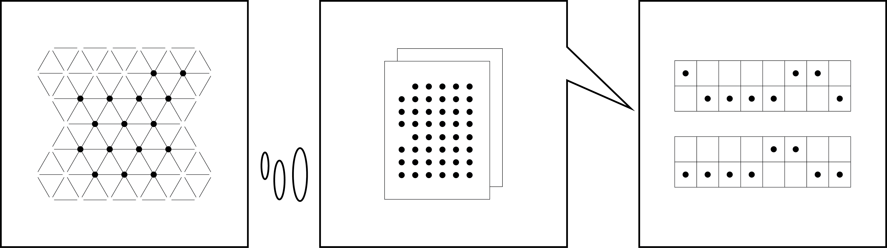

# Chapter 3: Form, Formula, Format

## Digital Formalisms

Text shapes the human body in strange ways. After a lifetime of reading
shoulders begin to stoop as if books were exerting pressure against the solar
plexus. Continual exertion deteriorates eyesight. Tendons and other supporting
structures in the wrist swell from the repetitive stress of striking keys. The
word takes its toll. A further profound change happens when we read and write
along with the machine. As we interpret it, it interprets us.

Machine learning algorithms track the speed by which readers advance from
paragraph to paragraph, creating a "fingerprint" that points to markers of
gender, age, race, ethnicity, and economic status. Algorithmic agents follow
the movement of eye and finger to direct the reader's attention, and to
understand how the human brain connects topics. Heat maps are drawn to
represent the dynamics of boredom, fatigue, focus, and desire. Supervised
training algorithms use our collective philological output---sorting and
commenting---to classify information autonomously and curate content suited to
our predilections.

Deep neural networks mimic the brain to build models of human behavior. These
models are notoriously difficult to interpret as they are not *intended* for
human comprehension [@andrews_survey_1995; @karim_x-trepan:_2015]. A vast
archive of texts written by and for machines supports the tiny, in comparison,
corpus of human-compatible literature.

Despite its formative impact on the practices of comprehension, code---the
programmatic sign---does not often figure in our theories of meaning making.
Instead, we consign it to the ornamental "formatting" layer of document
structure. We do so at our peril. Unlike passive decorative
elements---fleurons, daggers, and pilcrows---the programmatic sign actively
molds text into context. Words are arranged in space.

At the maximally blunt limit of its capabilities, format governs access. For
example, commands can render some words and sentences visible on the screen
while suppressing others. The ability to hide text from view completely or to
make it so small as to be illegible affects not just the style but the
politics of text. Code determines its audience, privileging certain voices and
modes of reading. In this sense, the programmatic sign acquires its
non-representational, tactical character. Stripped of references,
resemblances, and designations the programmatic sign commands and
controls.[^ln3-bdrld]

[^ln3-bdrld]: Recall @baudrillard_simulacra_1994, 139-40.

Unlike figurative description, machine control languages function in the
imperative. They do not stand for action---they are action. More binding than
what J.L. Austin has called "speech acts"---edicts like "I pronounce you
husband and wife" and commitments like "I do"---control codes ensure
regulation. Code in that sense is an exercise of power, not its
representation. The difference between representation and control is one of
brute force. It lies in the distinction between a restraining order and
physical restraint. A restraining order *signifies* the calling forth of
codified power. Physical restraints like handcuffs *enact* the exercise of
codified power. Like all violence they do not stand for anything. The
handcuffs simply contort the body into the shape of submission. Absent a body,
the restraints draw an empty shape. Code similarly shapes the written word.
Located somewhere between the screen and the storage medium, formats relate
matter to content. They are techniques by which immanent inscription, the
electromagnetic charge, is transformed into transcendent digital objects:
novels, songs, films, or poems. Formatting imposes structure.

Think of a paragraph, for example. Writers use them to break up the flow of
thoughts on a page. Paragraphs contain information. Can one imagine an empty
paragraph? Could the shape of a paragraph persist outside of the material
confines of a page or screen? Can one imagine paragraphs that unfold spatially
not in two dimensions, a rectangle, but in one, along a straight line, or in
three, in the shape of a cube? These questions confound because paragraphs
draw a singular figure. They are a textual container of a type. Any other
shape less or more than the paragraph would go by another name, would
constitute another format. To imagine something like a one-dimensional
paragraph is akin to imagining a flat shoebox. A flat shoebox cannot contain
shoes. It can hold only images of footwear. A paragraph embodies a similarly
singular arrangement of elements. It is a container or a data structure of a
kind, made to hold a certain amount of sentences.

We may liken paragraphs, words, and sentences to nesting dolls: data
structures that contain within them further, smaller arrangements of
information: a word fits inside of a sentence, the sentence within a
paragraph, the paragraph within a chapter, the chapter within a book, the book
within an archive, and so on.

Formats like the book or the broadsheet newspaper are known entities: we
understand how they are made and how to unfold them in space.  Computational
formats, by contrast, change rapidly and proliferate. They contain further, as
yet unexplored structural possibilities: shapes like the paragraph on paper,
but native to new media. What you saw is what you got on the page. On the
screen, what you see is but a small part of what you could get.  We are
presented with *thick content*, beyond the visible image, the composite of all
that is contained within the three-dimensional page. In print, content can be
gleaned from the surface; there is nothing but surface on a page. The screen
is a laminate. Light and liquid crystal---the preferred media for contemporary
text---surge between the substrates in response to electrical signal. Screen
surfaces conceal further strata of codification, inscribed onto recondite
planes of inscription: hard disks, solid state drives, platters, drums, memory
sticks, layers of copper and oxide.

A byte, made up of eight binary bits, holds a letter. The string of letters
spelling out "hello world," as I have mentioned previously, occupies eleven
bytes on the hard drive: ten bytes for the letters and one byte for the space
character. A file in the Portable Document Format (PDF) containing the same
"hello world" takes up 24,335 bytes on my system. What sort of information do
these extra bytes contain? Historically, such data has included machine
instructions for the viewing and printing or even clandestine cyphers. The PDF
specification describes features that include "accessibility of content to
those with disabilities," "digital signatures to certify authenticity,"
"electronic forms to gather data," "preservation of document fidelity
independent of the device, platform, and software," and "security and
permission to allow the creator to retain control of the document and
associated rights" [@iso_portable_2008, vii].

These capabilities mediate between visible image and stored information: one
surface facing the human, the other, the machine. The formatting layer
specifies the *affordances* of electronic text. More than passive conduits of
meaning, electronic texts thus carry within them rules for engagement between
authors, readers, and devices. In our example, the PDF encodes among other
things ideas about "reading," "authenticity," "fidelity," "preservation," and
"authorship." Whatever literary-theoretical framework the reader brings to the
process of interpretation must therefore meet the affordances encoded into the
electronic text itself. Such an encounter happens not on the level of
representation or ideology, but on the level of the physical, the phatic, and
the imperative, where formatting and control codes reside. Thick content
accounts for the disparity between plain and fancy text.[^ln3-fancy] The
explication of such thick content requires thick description that draws on
material particulates. These further acquire tactical significance in
practice: the text that edits itself or one that collects its own fees
necessitates new formalisms and new strategies of interpretation.

The familiar paper paragraph structure already presents several interesting
problems for analysis. A paragraph, we intuitively believe, corresponds to a
unit of thought. But there is nothing inherently paragraph-like in the neural
arrangement of thoughts in our brains. Physiologically, the brain arranges
information in hexagons, along the entorhinal grid
[@stensola_entorhinal_2012]. There is also nothing inherently paragraph-like
in the arrangement of bits along the surface of electromagnetic storage.
Formats thus translate between disparate systems of ordering and
signification.[^ln3-symbolisms] We are presented with metaphors of order on
the screen: paragraphs, pages, files, and folders. These resemble their paper
counterparts, but they represent other, less familiar and nonequivalent
ordering structures on disk.

Formats mediate between data structures, transforming one into the other
according to predefined rules. Mental image, information stored in the head,
becomes inscription, information stored in the machine, which turns into a
projection, content arranged on the screen. The complexities of the
transformation stem from the fundamental incompatibility between what the
media scholar Alexander Galloway calls "incommensurate physicalities
[@galloway_interface_2012, viii]" between human and machine. Format
specifications govern the transference of data structures from one medium into
the other, at the point of contact between human, symbol, and machine.

[^ln3-symbolisms]: See @wittgenstein_philosophical_1974, 45.

In this chapter I would like to move us towards a systematic study of format.
The history of formalism, as I will argue, contains within it at least these
two contradictory intuitions about the nature of literary form. Going back to
the reception of Plato, Hegel, and the Russian formalists, the English "form"
renders at times the material, outward, and apparent shape of something said,
written, or pictured. Yet just as often, critics use "form" in the sense of a
Platonic ideal: abstracted from matter, inward-facing, and in need of
explication. Form in the latter sense is closer to the idea of an algorithm or
formula: it signifies according to implicit rules.

I would like to augment these two concepts of form with a third, format. In
the process, I will show how formats have developed from simple machine
instructions for typographical layout into complex meta-literary directives
related to the protection of intellectual property rights, constraints on
speech, trade agreements, the politics of surveillance, and clandestine
communication. The intellectual history of form drawn from the annals of
literary theory will meet the material history of format drawn from computer
science in the second half of the chapter. The chapter ends with the notion of
a "smart document," an increasingly common instrument of record capable of
policing its own encoded rules of reader engagement: what can be read, how,
and where.

## Concrete and Universal

The intellectual history of formalist literary theory contains within it at
least two contradictory ideas about form: one about the outward shape of the
sign and another about the inward structure or formula that governs semiosis.

The distinction leads to conflicting strategies of interpretation. In the
sense of "outward shape," form suggests the affective aesthetics or even
"erotics" of art [@sontag_against_1966]. In this view, the sign is forever
embedded into the specific contexts of inscription, or alternatively, in the
contexts of its reception. The individual peculiarity of the word in context
renders it forever different from the same word used elsewhere. Formalism in
this sense is concerned with the distinctive, palpable, and outward physical
attributes of a text. As formula, form suggests a more analytical approach,
one that explicates the inward structures---universal rules, patterns, and
archetypes---that shape the production of text from within.  Formal analysis
so conceived studies not specific traces or utterances, but rather the
development of ideal forms, which exist somewhat independently of their
specific instantiations.[^ln3-levine] Form in the sense of formula embodies an
abstraction, leading to generalized historical categories like genre and
period. Our ideas about "the novel," for example, or "modernism," or "science
fiction" reflect formal groupings of the kind Lisa Gitelman has called "a mode
of recognition instantiated in discourse" [@gitelman_paper_2014, 2-4]. Where
palpable form leads to immanent material artifacts, the abstracted notion of
form leads to transcendent ideal categories.

[^ln3-levine]: See the Introduction to @levine_forms:_2015, for example.

The notion of "format" occupies the conceptual space somewhere between form as
intrinsic formula and form as extrinsic shape. In what remains, to my
knowledge, a singular article-length treatment on the topic in literary
studies, G. Thomas Tanselle approaches the concept of formatting from the
perspective of textual criticism---the practice of compiling, editing,
annotating, preserving, and publishing scholarly critical editions of
canonical texts. For Tanselle's narrow purposes, the concept of formatting
encompasses something like the "number of page units placed on the press at
one time" [@tanselle_concept_2000, 112-3]. He acknowledges, however, formats
refer also to the "nature and the order of the contents"
[@tanselle_concept_2000, 67-8]. The genre of "soap opera," for example, evokes
both a medium, daytime television and the specific kind of a story told in
that medium, melodrama and pulp. The format of a journal may be "broadsheet
daily" or "tabloid."

The notion of a format identifies matter both of particular shape and content.
The soap opera is a kind of a daytime melodrama of a certain length, for
example. It has certain audiences in mind. The format thus speaks both to the
physical properties and to the ideational subject matter of the thing. The
novel is a genre, where the paperback its common format. The novel is
infinitely malleable, where the paperback is fixed by its methods of
manufacturing and distribution. We do not expect scientific textbooks in
paperback, for example, just as we would not expect tabloids to be printed on
expensive stock or to support long-form investigative journalism. The format
captures something about the shape, the design, the style, and the thematics
of the subject matter; it connects, in other words, the where to the what, the
how, and in what order.

Whatever the tradition of writing about form, the concept is usually
contraposed to some idea of content: as in form and content. Content in that
sense refers to the stuff being shaped or arranged, whether by intrinsic law
or extrinsic forces. R.G. Collingwood famously described the distinction
between classical and romantic art in terms of the form-content divide:
"classical art," he wrote, "stands for form; romantic art for content"
[@collingwood_form_1929, 335]. The distinction is evoked in other fields as
well. In her recent work on computational text generation, the computer
statist Kathleen McKeown wrote that to produce discourse, writers and speakers
"must decide what to say and how to present it effectively"
[@mckeown_text_1992, 1]. Similarly, in her influential essay "Print Is Flat,
Code Is Deep," Katherine Hayles discussed "the interplay between a text's
physical characteristics and its signifying strategies" [@hayles_print_2004,
72].

The distinction between text, its content, and presentation, its form, entails
the distinction between the work of art in the abstract sense and the object
of art in the sense of the material artifact. In this way, two slightly
diverging editions of the same text---the various editions of *King Lear*, for
example---nevertheless refer to the same work of art. The work of art is a
transcendent idea; the individual editions are contained within its immanent,
formal characteristics.

As an aside, note that what counts for matter belonging to the contingent
physical characteristics of a text and what counts for the content belonging
to its signifying strategies differs from object to object. When reading a
novel, for example, we commonly ignore variations in line length. The length
of an average line in Herman Melville's *Moby Dick* changes with the edition.
Line lengths are not usually important in novels, we would say; they carry no
meaning. But when reading poetry, the reader does understand line length to be
an integral part of the text's signifying strategies. The distinction between
form and content in that sense propagates a kind of value formation, by which
we separate those attributes of the text that are meaningful from those that
are not. Form thus identifies physical attributes of the text that can be
omitted from interpretation and reproduction. A printer can discard
information about the color of a manuscript's ink for example, or do away with
the idiosyncrasies of a writer's handwriting when typesetting a manuscript.

Theorists also use the word form to refer to the opposite: the essence of the
text. Under canonical, Platonic definitions, "form" denotes the essential, not
merely contingent, properties of an object. For Plato, the "essence" of
something (like a chair) exists in an ideal, metaphysical state, somewhere
beyond the confines of the material universe. By contrast, a physical
instantiation of that object (a specific chair) embodies a somewhat more
limited, corrupted even, version of that perfect idea. The philosopher's task,
then, becomes one of reconstructing the single ideal chair from its many
imperfect exemplars.

A computer scientist will recognize in this chain of reasoning some of the
principles behind object-oriented programming: a way of building software that
works by defining abstract "object classes" and invoking them into "class
instances" [@hoare_record_1965; @nygaard_history_1981]. The abstract class can
further be modified or extended when called into action. In this way, the
abstract category of "chairs" becomes a given chair, complete with individual
flaws and imperfections. I could, for example, modify the chair by attaching a
small desk. The modified chair remains a chair. As before, flaws and
emendations are considered insignificant when compared to the perfected form
of the ideal chair. In the idealist tradition, ideas provide us with lasting
universal "templates" for instantiation within the contingent and always
changing physical confines of the material world.[^ln3-descartes]

So far, I have been using the term "form" quite liberally, relying on the
reader's familiarity with its contradictory everyday usage. A closer look at
the canonical texts in the original will help us identify the conflicting
meanings that become obvious in translation. In Plato's dialogues we find a
number of words that are sometimes reasonably rendered into the English
"form." These include *eidos* (essence), *idea* (idea), *morphe* (shape), and
*phainomena* (appearance). Compare, for example, the following several
translations from Plato's *Timaeus*. In *Timaeus*, we see the titular
character discuss the nature of the physical world with his collocutor. In a
passage that anticipates the famous "molten wax" analogy in Descartes, Timaeus
notices that some elements, like water, change their appearance
[*phantazomenōn*] while remaining essentially the same substance. Benjamin
Jowett translates the passage as follows:

> Thus, then, as the several elements never present themselves in the same
> form [*phantazomenōn*], how can anyone have the assurance to assert
> positively that any of them, whatever it may be, is one thing rather than
> another?  [@plato_timaeus_1998, 49d]

Compare the above with the translation of the same passage by W.R.M. Lamb, who
renders the Greek *phantazomenōn* into the English "appearance":

> Accordingly, since no one of these ever remains identical in appearance
> [*phantazomenōn*], which of them shall a man definitely affirm to be any one
> particular element and no other without incurring ridicule?
> [@plato_plato_1955, 48d]

Both translations of the Greek *phantazomenōn*, form and appearance, capture
the plain meaning of the passage: the essence of a thing remains even as its
outward appearance changes, taking on a phantasmal, fantastic, ghostly,
imaginable, and even "virtual" shape and appearance (all reasonable English
approximations of the Greek *phantazomenōn*). Accordingly, Jowett translates
*phantazomenōn* (that which is changeable) as "form" and Lamb as "appearance."

Contrast the *Timaeus* passages with the ones in *Cratylus*, about
name-giving. In *Cratylus*, Socrates and Hermogenes discuss the ways in which
words signify things by convention. "What has the carpenter in view when he
makes a shuttle?" Socrates asks. "Is it not something the nature of which is
to weave?" Hermogenes answers. "Well, then, if the shuttle breaks while he is
making it, will he make another with his mind fixed on that which is broken,
or on that form [*eidos*] with reference to which he was making the one which
he broke?" Hermogenes agrees the carpenter would fix his mind on the ideal
form. In that case, we should properly call *that* the real shuttle, Socrates
concludes---his point being that the exact outward appearance of individual
shuttles does not matter as much as the abstracted idea of shuttles. The
abstraction endures even as given instantiations shatter. There exist
different types of shuttles, some used to weave wool and some for linen, but
all of them, in Jowett's translation, "must contain the form or ideal
[*eidos*] of shuttle" [@plato_dialogues_1937, 389a-b]. In *Cratylus*, *eidos*
stands for the "universal lasting ideal" of all shuttles: exactly the opposite
of *phantazomenōn* as "ephemeral instantiation" in the previous passage! Yet
both *eidos* and *phantazomenōn* were reasonably translated into the English
"form," indicating the way in which the concept is often made to carry both of
these conflicting meanings.[^ln3-plato]

The overdetermination of form persists similarly in many English translations
of G.W.F. Hegel, whose discussion of Platonic forms is another paradigmatic
text. In his *Lectures on Aesthetics*, Hegel posits classical art as striving
to reach an equilibrium between its ideational, spiritual content and "the
configuration of sensuous material" [@hegel_hegels_1998, 70].
Characteristically, Hegel's prose is marked by technical and sometimes
idiosyncratic vocabulary. Rather than define the terms precisely, Hegel
saturates his text with semantic cognates. On the side of "content" [*Inhalt*,
*Gehalt*], he evokes words like inner life [*Innere Lebendigkeit*], feeling
[*Empfindung*], soul [*Seele*], and spirit [*Geist*].  All of these convey a
movement inward to a location (if it can be called such) beyond the physical
world, accessible only to the spirit [*Geist*] or mind [*Gedanken*,
*Verstand*]. On the side of "form" (same in German), Hegel accumulates words
like expression [*Ausdruck*] and presentation [*Darstellung*], but also lines,
curves, surfaces, carvings, colors, tones, word sounds, and generally matter
or material [*Linien*, *Krümmungen*, *Flächen*, *Aushöhlungen*, *Farben*,
*Tönen*, *Wortklängen*, *Material*] [@hegel_werke:_1986, *Einleitung*]. The
semantic cluster of words related to "form" conveys physical (palpable, of
this world) and outward-facing properties, available for examination to the
senses (*Sinne*).

In contrasting the dominant aesthetic modes of classical and Romantic periods,
Hegel paints Romanticism as an art that seeks to disengage itself from matter,
reaching the realm of pure self-reflective Spirit. Romanticism, in his words,
is "freed from this immediate existence which must be set down as negative,
overcome, and reflected into the spiritual unity" [@hegel_hegels_1998, 81]. He
writes: "Poetry is the universal art of the spirit which has become free in
itself and which is not tied down for its realization to external sensuous
material; instead, it launches out exclusively in the inner space and the
inner time of ideas and feelings" [@hegel_hegels_1998, 89]. Finally,
"inwardness celebrates its triumph over the external and manifests its victory
in and on the external itself, whereby what is apparent to the senses alone
sinks into worthlessness" [@hegel_hegels_1998, 81]. Romantic art can, in this
way, triumph over the external, material world, reaching, at its apex, what he
calls the stage of "free concrete spirituality" [*freie konkrete Geistigkeit*]
[@hegel_werke:_1986]. The idea overcomes matter to become both free from the
constraints of the deterministic physical universe, yet gaining a measure of
solidity in its tangible instantiation.

Several lines in Hegel's exposition of Plato's idealism give us a glimpse of
his struggle with the Platonic concept of form. In his "Lectures on
Philosophy," Hegel writes that, the "idea is nothing but what is current with
us under the name of the Universal, when this word is not taken in the sense
of *formal* Universal [*formell Allgemeine*]." The formal universal for him is
"merely a property of things," whereas in his interpretation Plato must be
concerned with the "implicitly" universal (as contrasted with explicitly, or
formally universal). This internal "essence" and "in-and-for-itself existent"
lays a claim to truth alone. Hegel writes: "We translate the Greek word
*eidos* by 'genus' or 'species,'" but when "genus" or "species" are "seized as
a number of similar determinations collected by reflection from several
individuals, to serve as a *mark* for the convenience of the understanding,
then we have the Universal in quite an external form" [@hegel_philosophy_1870,
250]. In other words, as soon as *eidos* is instantiated, it moves from being
an ideal form into an apparent shape, as an epistemological category.

I understand Hegel's problem with "formal Universal" as follows. Imagine
someone were to write "all these cats are subsumed under the category of
'feline.'" The labeled category of "feline" captures a snapshot of what it
means at the moment of its naming. But for Hegel, the true ideal cannot exist
in the name alone: it must continue to exist and develop in the real world. It
is not, in other words, a socially constructed (as we would say today)
category, but something that "internally distinguishes itself" while remaining
"free in its infinitude and independent" from all attempts to fix it
categorically. By way of comparison, we may think about the evolutionary
process that continues in the species, even as the taxonomy describing that
evolution may remain tied to its fixed ways of expression. No matter what we
call cats, the feline species will continue to change. New and radically
different cats may come into existence---ones no longer covered by the
"external mark" of being "feline," that is by our taxonomical categories. Yet
this would only mean that the ideal of "feline" has developed past human
understanding. Zoologists could, at that point, simply adjust their categories
to include new forms of feline being. Ideal feline being moves on immediately
thereafter, continuing to develop and leaving behind only the husk or a
snapshot of what it meant to be a cat in times already past. Hegel argues that
one should not confuse that static categorical snapshot with the animate
ideal. That it why he disparages the "formal universal" as a corrupted, "mere"
form of the ideal.

In contrast to the "formal universal," Hegel's "concrete universal" exists in
the real, physical world. It is more than a category. We can understand it as
capturing both *eidos* and *phantazomenōn*---idea and appearance---both
reasonably transcribed to "form" in English. In an essay on Hegel's concept,
John Crowe Ransom likens the concrete universal to a "formula of a chemical
reaction," "the recipe for a dish," and "the blue-print of a machine."
Crucially, the Hegelian universal becomes concrete when the machine "has been
materialized," and is "working properly" [@ransom_concrete_1954, 387]. Like
Wittgenstein, Ransom imagines a perfected kind of a machine, which represents
the ideal of an aesthetic object.

## Format Theory

The above notes on Plato and Hegel point to series of related folds and
creases in the formalist tradition.  W.K. Wimsatt once observed that literary
theorists often persist in making statements that understand a work of
literary art to be, in a peculiar way, "a very individual thing or a very
universal thing or both" [@wimsatt_structure_1947, 262]. A work of art, a
poem, understood as something which "cannot be expressed in other terms" leads
to the kind of criticism that emphasizes the contemplation of the outward,
affective, palpable elements of the text. The function of such criticism,
according to Wimsatt, is to create "approximate descriptions of poems" and
"multiple restatements of their meaning," which aid the reader in coming to
their own "intuitive and full realizations" of literature
[@wimsatt_structure_1947, 280]. Understood as an end product of a living ideal
or formula, the analysis of literature seeks to recover latent universal
mechanisms, laws, and deep structures that give rise to surface phenomena.

The dual motion of literary criticism, at once towards the extrinsic shape and
intrinsic formula---poetics and hermeneutics---is perhaps most starkly visible
in the intellectual legacy of early twentieth century Russian formalism. The
influential series of "OPOYAZ" publications gave voice to a collective of
literary scholars that included Viktor Shklovsky, Osip Brik, Lev Yakubinsky,
Boris Eichenbaum, and Roman Jakobson. The group struck out in two distinct,
but complementary directions.

Several essays by Brik, Shklovsky, Yakubinski, and others contraposed "sound"
[*zvuk*] to "symbol" [*obraz*]. Brik wrote: "I believe that elements of
symbolic and sonic [*zvukovoi*] art exist simultaneously, and that every given
piece of [poetic] work comprises an equilibrium of these two heterogeneous
poetic impulses" [@shklovksy_sborniki_1917, 25]. Of the sixteen or so unique
essays that appeared in the three collected volumes, thirteen contain the word
"sound" [*zvuk*], or some variation thereof, in the title, in combinations
like "sound image," "sound gesture," and "sound repetition." To this cluster
of essays we may attribute the Russian formalist concern with
*zaum*---literally, beyond sense or *beyonsense*---trans-rational, nonsensical
sounds that nevertheless elicit an affective, lived response, giving voice to
ideas that are difficult to explain rationally [@khlebnivkov_collected_1987,
179; @khlebnikov_king_1990, 151; @labelle_lexicon_2014, 63].

Poetry in the symbolic mode encodes meaning inwardly: the elephant "stands
for" memory, or the like. *Zaum* poetics instead evoked affect through
external shape, sensually and affectively. Khlebnikov wrote that "mystical
incantation and beyonsense are appeals 'over the head' of government straight
to the population of feelings, a direct cry to the predawn of the soul"
[@khlebnikov_king_1990, 152]. Shklovsky similarly defined *zaum* as "without
words but with sound," appealing to the senses rather than the intellect.
"Thought and speech," he wrote:

> cannot keep up with inspired experience, and for this reason artists are >
> free to express themselves not only in language of common understanding, but
> also in private language---language that has no settled sense [...] Lilacs
> are beautiful, but how deformed [*bezobrazno*] the word "lilac," plundered
> and exhausted. This is why I call a lilac "uao," restoring its primal
> clarity [@shklovksy_poetika_1919, 13].

The word *bezobrazno*, in the meaning of hideous or deformed, literally
translates as "without an image." The word "lilacs" has lost its verbal,
linguistic shape, the author implied. Formalism of the outward kind thus aimed
to restore the sensation of an image, returning form, in the sense of a shape,
to habituated content. Formal techniques like chanting or neologism helped
revitalize the external sound image. The word loses its sense through
repetition, while gaining a distinct physical sound signature, which goes
unnoticed in everyday use.

Three of the sixteen essays these volumes struck in another direction, away
from shape and towards formula. Shklovsky's "Art as Technique," "Linkages
between Plot and Style Device," and Eichenbaum's "How the *Overcoat* Is Made,"
dealt with narrative structure rather than phonetic image.[^ln3-propp] All
three authors cited a common source of influence for this direction of
research, the work of Alexander Veselovsky, a nineteenth century Russian
historian of literature who did not attain the renown enjoyed by his pupils in
the West. An early pioneer of comparative literature, he advocated philology
as a "historical" and "genetic" study of "poetic consciousness and its forms."
Citing literary explorations by Goethe, Friedrich Schiller, and Georges Polti
as his inspiration, Veselovsky almost always used the word "form" in the sense
of "formula," and not at all in the sense of "shape" or "sound." In this, he
imagined a rather Hegelian model of literary evolution, which proceeds through
the development of universal constants and narrative plot sequences, which
further influence the development of literary particulars.  Veselovsky called
these genetic constants "vagabond formulas" [@veselovsky_sobranie_1913, 185].

> Somewhere, someone gave these plots [*siuzhety*] an apt expression, a
> formula, elastic enough to fit, if not new content, then new interpretations
> of plots rich in their associative possibilities. The formula endures.
> Writers will return to it, altering its significance, expanding its meaning,
> and adopting it to new types. As the formula of "desire" was and continues
> to be repeated, so also are repeated the plots of *Faust* and *Don Juan*
> across the distance of centuries [...] We are connected to a tradition. We
> expand within it---not to create new forms, but to attach to them new
> sentiments and concerns. This dynamic could be considered a kind of a law of
> conservation of energy [@veselovsky_sobranie_1913, 475-47].

[^ln3-propp]: To this strain of formalism one could also adduce Vladimir
Propp's well-known *Morphology of the Folktale*, a text that finds a limited
number of universal principles of composition in the multiplicity of folktale
traditions.

The Hegelian influence is unmistakable in these lines. Like the world spirit,
literary formulae exist and develop across time and space. Veselovsky's
formulas resemble concrete universals, which develop independently of
individual texts. Formulae in this sense have a life of their own, in a trans-
or meta-human way, not fully accessible to the individual author or reader.
They are invoked indirectly. They exist in the ether of culture, attaining
historical momentum through a process of gradual evolutionary development. It
is exactly the opposite of form in the sense of a private utterance, by which
an individual author breaks with ossified tradition, as was the case with
Shklovsky's idiosyncratic naming of the flower, *uao*. In one case, the author
participates in the formation of shared culture; in the other, the author
attempts to dissent from the shared cultural norm.

The tension between extrinsic shape and intrinsic rule lies at the heart of
literary theory, manifesting at times under differing yet essentially related
vocabularies. The emphasis on extrinsic shape logically leads to the poetics
of affective reading of the kind that privileges apparent surface phenomena.
The emphasis on intrinsic rules by contrast leads to a hermeneutics or an
archaeology of text, by which the critic's role becomes to discover the
non-apparent deep structural regularities.

Most recently, that theoretical distinction between shape and formula has been
negotiated in terms of depth and surface. Two types of reading become evident
in this model. The "symptomatic" literary critic reaches beyond the
"ephemeral" external appearances to uncover internal and eternal metaphysical
truth within. For a Marxist critic like Terry Eagleton or Frederic Jameson
that latent meaning may have something to do with hidden machinations of
capital and ideology. The psychologically minded critic reads in search of
hidden drives, desires, or cognitive structures. By contrast to symptomatic
reading, Stephen Best and Sharon Marcus describe a constellation of reading
practices concerned with "what is evident, perceptible, apprehensible in text:
what is neither hidden nor hiding; what, in the geometrical sense, has length
and breadth but no thickness, and therefore covers no depth." The authors
identify a constellation of related interpretation practices at the surface:
reading for material surface, reading for verbal structure, reading for
affect, reading for description, reading for pattern, and finally, reading for
literal meaning or "just reading" [@best_surface_2009, 9].

In making the argument for surface reading, Best and Marcus gesture toward the
kind of formal poetics advocated by Susan Sontag in the late 1960s. At the
time, Sontag wrote about "the need for more attention to form in art."
Interpretation can be liberating, she wrote, but it can also stifle
creativity. It "depletes" the world in some way, placing the critic in a
privileged and unnecessarily meddling position between reader and text. "If
excessive stress on content provokes the arrogance of interpretation, more
extended and more thorough descriptions of form would silence," she wrote,
"the best criticism, and it is uncommon, is of this sort that dissolves
considerations of content into those of form" [@sontag_against_1966, 8-9].

Marcus and Best remind us that Sontag's manifesto was also an "affective and
ethical stance" [@best_surface_2009, 10]. Strategies of "deep" interpretation
carry with them a claim to authority, as well as an imbalance of interpretive
acumen. The critic asserts to uncover what the lay reader does not and
supposedly cannot see without expert guidance. As an ethical stance, reading
for external forms by contrast flattens the hierarchy between the lay reader
and the professional interpreter. In this sense, Best, Marcus, and Sontag
continue in the liberal, Lutheran tradition of vernacular exegesis. All
readers are priests at the surface; all readers are capable, the critics
suggest, of forming their own interpretation.

Interpretation at the level of meaning alone, for Sontag, was an intellectual
and ultimately reactionary activity. It aims to find the "maximum amount of
content" within. It is reactionary because it serves only to multiply the
available "levels of analysis." In explicating the work of art, the critic
merely creates alternate copies that diverge from the original. Each layer of
criticism thus only adds to the content of the work, placing additional burden
on the readers to come. Sontag believed that to "design" a work of art that
can be experienced in this way---always on multiple and diverging levels of
ideation---might have been "creative" and "revolutionary" in the age of
aesthetic paucity, when creativity and interpretation were limited to a few
privileged individuals. But her epoch, she believed, was one of creative
abundance. "Think of the sheer multiplication of works of art available to all
of us," she wrote. Contemporary culture had become based on "excess" and
"material plenitude" which dull the senses [@sontag_against_1966, 9-10]. In
such conditions, the production of further critical variations on the theme
only adds to the dulling clutter.

By "interpretation," Sontag meant a "conscious act of the mind" that
illustrates a "certain code" or "certain rules" of literary engagement. It
was, for her, "virtually" a type of translation. The critic "transforms" and
"revamps" the text: X turns out to be A, Y turns out to be B, and so on
[@sontag_against_1966, 3]. By "form" Sontag meant the apparent, perceptual
properties of the work: one sentence is long, for example, another short. A
critic could "make something out of" the variation, but Sontag wanted to stop
us short of meaning making. A discipline of careful perception---of paying
attention to---could sharpen readers' sensibilities, allowing them to
interpret independently. There is no need to explain under this model, only
describe. The history of interpretation Sontag objected to was one that
privileged content over form. The words "explication" and "exegesis" imply the
movement from the inside to the outside. For a psychoanalytical critic
interpretation in that sense may mean revealing the hidden psychological
drives behind expression. A Marxist critic may instead look for the concealed
operation of ideology. Fredrick Jameson, a prominent Marxist critic, wrote
that:

> the process of criticism is, not so much the interpretation of
content, as it is a revealing of it, a laying bare, a restoration of the
original message, the original experience, beneath the distortions of the
various kinds of censorship that have been at work upon it; and this
revelation takes the form of an explanation of why the content was so
distorted and is thus inseparable from a description of the mechanisms of the
censorship itself [@jameson_marxism_1972, 404].

Form in the sense of "outward shape" suggests an emphasis on what Susan Sontag
deemed the "sensory experience" or the "erotics" of art. In "Against
Interpretation" Sontag mentions the ideal of transparency as the "highest,
most liberating value in art and in criticism today [...] transparency means
experiencing the luminousness of the thing in itself, of things being what
they are. [@sontag_against_1966, 9]" Rather than show what a work of art
*means*, Sontag urged critics to show "how it is" and "that it is"
[@sontag_against_1966, 10]. Form, as she saw it, mirrors McKeown's "shape" and
the "text's physical characteristics" of Hayles.

## Tactics of Reading

If reading for sensory experience implies an erotics of art and reading for
hidden formulae implies a hermeneutics, what would it mean to read for format?
To borrow from Tanselle's vocabulary, formats bridge the "physical structure
of finished books" and their "intellectual content." This connection happens
through what he calls "printing-shop routines," which is what I identified as
a technique for the transformation of ideas into inscription-things. Textual
scholars have traditionally arbitrated in the conflict between divergent
editions of the same text.[^ln3-printers] They reveal how works become texts
and the other way around. It is in this sense of arbitration that C. Deirdre
Phelps described the notion of physical form. When instantiating the ideal
text into its concrete being, publishers introduce textual changes that may or
may not correspond to either authorial intention or reader expectation.  An
inexpensive edition of Blake's poetry, for example, could be printed without
illustrations to save costs, though we know his illustrations to be an
integral part of the text. Were all other editions of Blake's poetry lost,
textual critics would reconstruct the texts' genealogy from extant remnants.
They could, for example, infer the missing illustrations based on reception
history. "The textual critic," Phelps wrote "is concerned mainly with the fact
of the [textual] change itself. [@phelps_edition_1994, 65-6]" Reading for
format thus involves a series of value judgements about what the text should
be and what it is.

[^ln3-printers]: See for example the discussion on the limits of the inductive
method in bibliographic study in @mckenzie_making_2002, 16-17. See also
@mcgann_socialization_1991; @tanselle_textual_1996.

Different schools of textual criticism emphasize differing aspects of the
publication process. Some privilege the notion of authorial intent, others a
tradition of reception. Whatever such choices imply, they continue to
determine value, in a process that separates those physical attributes
meaningful to the work from those that are not. For example, in a contemporary
online edition of Claude McKay's *Harlem Dawn*, the series' editors encoded
for indentation, thus preserving the poems' visual line structure. However,
they have also allowed for the text to wrap when viewed on small devices, in
effect "soft wrapping" those lyrical lines that are too long to fit on a small
screen [@mckay_harlem_2015]. The end result is a compromise between authorial
intent and reader convenience. The layout respects line indentation but not
line length.

Other solutions were possible, of course. The editors could have recreated an
exact facsimile of a particular print edition, but that would not render well
on small screens, due to the disparity in size between the printed page and
mobile device. Judgements about formatting are value judgements. In an extreme
case, an editor could try to preserve all of a text's details, down to its
molecular structure. Such a text could be accompanied by a potentially
unlimited amount of metadata describing the precise physical contexts of the
universe surrounding the authoritative version. To reproduce the text
faithfully would also mean to reproduce the world around it. Contingent stains
or scratches in the manuscript, typos in the critical edition, printer error,
pages inadvertently bound upside down, and other flaws are however usually
discarded in reproduction. They are not seen as meaningful for the
understanding of a text.

Format belongs neither wholly to a text's physical medium (pixel or paper) nor
to the ideational content of the work. Rather, it lies somewhere between the
two worlds: in the shape of the letters, in the structure of the narrative,
and in the patterns of stress and intonation of the spoken word. We do not
quite know which of these elements belong to the content of the play and which
are linked to the contingent material artifacts of the printing or staging
process: the way the fonts look, for example, or the way lines break on the
page. Some matters of format matter to readers (line breaks in poetry), while
others usually do not (font kerning). Textual criticism reminds the literary
theorist of the transition that happens between literary texts and literary
works. It is always a fraught process, because a theorist's abstract beliefs
must be continually weighed against the material affordances of a concrete
textual witness. A word or comma omitted, a forgotten line, cannot ever become
a part of the meaning making processes. Format stands at the gates of
hermeneutics.

[^ln3-remind]: See for example @shillingsburg_being_2006;
@greetham_textual_1989.

In an essay on pictographs and pictographic logic, Johanna Drucker and Jerome
McGann discuss how the "presentational form of texts" usually masks its
"logical operations in a surface rhetoric that dominates and controls our
conscious attention." At the same time, what the authors call the "holistic
repleteness of images" also keeps us from perceiving their "conceptual order
[...] as if the graphic character of the work were completely obvious"
[@drucker_images_2010]. Their insight captures the dual movement of
formatting: at once towards the physical and the mental characteristics of
text, matter and content. The reader understands the text as an idea, that
takes shape in the mind. The book thus retreats from grasp, as Percy Lubbock
wrote in *The Craft of Fiction* [@lubbock_craft_1921]. Subsequently, readers
tend to treat text in a disembodied fashion---as surface rhetoric---reading
past the material structures that support mental phenomena. As visual
phenomenon, a unified image, the page presents itself in its entirety, at
once, in what the Drucker and McGann call its "holistic repleteness." It is as
if it was always so: these words were always in this order, at these
coordinates. However, the printer and the book designer know the image to be a
carefully constructed composite. They understand and can name the particulates
of page composition invisible to a lay reader. Drucker and McGann conclude
that "systems of graphic presentation are operational, not merely passive
schematic structures [...] active agents for creating meaning, instructions
for reading, viewing, comprehending information [@drucker_images_2010].
Choices were made, in other words, that would later affect meaning making.
Apprehension precedes comprehension. The processes of interpretation have
commenced and in some cases concluded before the reader laid eyes on a page.

We are finally confronted with several concrete differences between print and
digital formats.

Print editors and textual scholars negotiate the shape of the text in advance
of publication. The choice to exclude certain words, versions, or visual
elements is fixed into the final proof, where it remains static for the
duration of a book's existence. The book itself provides a stable platform for
a range of reading practices, which include the annotation, copying, and
preservation of written work. To the extent that books determine the
affordances of reading, those affordances exhibit historical continuity. The
print book requires as a precondition of reading certain physical capacities:
manual dexterity, for example, a level of cognitive development, and eyesight
within a specific range of vision. Readers falling outside of these normalized
ranges are prevented from accessing the text in the manner specified. The book
further affords abilities like highlighting and the taking of notes. Empty
space on a page around the text facilitates marginalia. For the highlighter or
the pen to function well the printing medium must be made of a porous
material, and not, for example, plastic, which would make marking the page
difficult while affording other capabilities, like reading under
water.[^ln3-notes]

[^ln3-notes]: See @blair_note_2004; @daston_taking_2004; @piper_note_2012.

The affordances of the electronic book are more diffuse. They now exist in a
multitude of competing digital formats, each vying to supplant print as the
singular, unified reading platform.

Software made by Adobe Systems, the company behind the popular Portable
Document Format, includes Adobe Digital Editions, which the reader can use "to
download and purchase digital content, which can be read both online and
offline." The platform's "features" include the ability to "download and
transfer books between devices" and to "search eBooks." The format supports
multiple languages, the ability to borrow books, printing, limited support for
visually impaired readers, bookmarking, highlights, notes, and file
organization [@_plans_2016]. The company's own competing Adobe Document Cloud
reading platform includes the Free, Standard, and Pro versions of Acrobat
Reader, "the global standard for reliably viewing, printing, and commenting on
PDF documents" [@_adobe_2016]. Only the most expensive Pro version allows one
to "create and validate PDFs to meet accessibility standards for people with
disabilities." The free version does not support bookmarks or document
editing. The Pro version enables readers to "redact and permanently remove
sensitive information in PDFs" and to "compare two versions of a document to
see what's changed" [@_plans_2016].

Another popular electronic book format, the Amazon Kindle reader, by
comparison to PDF, includes a feature called "Public Notes" which allows
Kindle customers to "make their highlights and notes available for anyone to
see" [@_amazon_2015]. The frequently asked question page further explains that
"if someone you follow has highlighted a passage in a book and has turned on
Public Notes for the book, you'll see that passage highlighted along with the
name of the person who highlighted it." The FAQ continues to tout the benefits
of their platform:

> Now authors, thought leaders, passionate readers, professors and all Kindle
users can opt-in to share their notes with other readers, helping friends,
family members, and other Kindle users who choose to follow them to get more
from their reading. If someone you follow has highlighted a passage in a book
and has turned on Public Notes for the book, you'll see that passage
highlighted along with the name of the person who highlighted it. You'll also
see the notes that they made in the book [@_amazon_2016].

The Google Play Books platform does not have the public note features nor does
it support book editing. It does however add the ability to translate words
and passages and to search for selected phrases using the company's search
engine [@_read_2016].

Encoded ideas about intellectual property are another stark manifestation of
inter-platform incompatibility. Whatever its comparative affordances, reading
software always emulates the logic of ownership. To own a book electronically
means to have access to the bits that bring the simulation of that book into
existence. At some lower level of abstraction, however,  the variety of
reading platforms rests on the same computational substratum. Both Amazon and
Adobe books rely on the underlying capabilities of the personal computer. This
hyper-media, as Lev Manovich has called it, lies at the base of all competing
ebook formats [@manovich_software_2013]. Whatever it means to own a book on
that level, must involve manipulating hardware states. A common act of
epistemic disobedience, to borrow a phrase from Walter Mignolo, therefore
includes accessing the book bits directly, through channels not afforded by
the publisher [@mignolo_epistemic_2009]. One can in this way disentangle the
mechanisms of book ownership as defined by Google or Amazon, from the book's
"content" proper, by other definitions. The so called "ripping" of proprietary
book libraries involves reformatting individual books into other file formats
which could hypothetically enable unfettered copying and circulation of the
text, not constrained by the original platform. The activity need not be
illicit. The extraction of plain text from the Portable Document Format
commonly constitutes the initial step in corpus-based natural language
processing. Readers routinely "liberate" content in other ways as well: they
lend books to friends, read them out loud, and make photocopies.

These examples illustrate that unlike print, the electronic book is not a
single format, but many. Software, governed by specific socio-economic
exigencies, determines the affordances of reading, taking notes, sharing, and
storing books on each platform. Thus a book available in North America, might
be be available on other continents, or it could be available elsewhere in a
redacted form, its content tailored to the reader's geography dynamically. In
case of the aforementioned platforms we observe an attempt to supplant the
affordances of the book with a range of other, competing affordances
particular to their proprietary document formats, not compatible with one
another. Furthermore, the potentialities of electronic reading change
dynamically, with each software update. Where print evolved by centuries,
digital text changes on a monthly, if not daily, basis. A careful book history
of electronic formats would reconstruct the meaning of the book in much
shorter evolutionally stages to keep pace with the medium's rapid development.

In each of the above examples, the reader confronts some aspect of formatting
instrumentally, for a particular purpose like copying, analysis, or
preservation. In that sense, the lay reader engages with a task similar to
that of a textual critic. In reading the book out loud or making a photocopy,
readers make value judgements that distinguish those physical aspects of the
book crucial to interpolation from those that are not.

Reading for format explicitly, would similarly involve the deconstruction,
both literal and figurative, of the textual laminate. Whatever interpretive
activity readers hope to enact at the surface level of content is grounded in
the deep material affordances of the book. The conflicted properties of
electronic text entail the added burden of materialist poetics. Reading
digitally one can no longer take the stability of print for granted. A number
of agents intercede in the transformation between form and content, the
inscription as information on a disk and its representation, as pixels on the
screen. These intercessions may be benign, as when the electronic book changes
the layout of the text to fit a smaller screen when displaying text on mobile
devices; or it may be totalizing as when a book platform is designed also to
censor or to surveil its readers for commercial or political purposes.
Reading for format reveals the structure of the transformation between media:
the liquid crystal, the floating gate, and the entorhinal grid. Formats govern
and control in the sense of shaping the encounter between otherwise
incommensurate media, hardware and wetware---storage, screen, and brain.

## Kernel and Shell

Formats do not merely inform the tactics of reading, they are encoded into the
structure all contemporary digital documents. The following case studies from
the history of formats help us understand how the above theoretical principles
are instantiated in practice.

*EDIT* was one of the first text editors, designed for the GE635 36-bit
mainframe computers in use at Bell Labs in 1968. I look to its blueprints to
recover a model of document structure. "The publication editor is divided into
three related sections," wrote one of the system's engineers. These included
the "facility" for "document layout," "editing," and "printing"
[@kaiman_computer-aided_1968, 66]. The "layout," in Kaiman's vocabulary,
contains such things as justification, indentation, and spacing.  These
"primitive requests" can be combined to describe more complex "structures of
the printed text." The creators of *QED*, another influential early text
editor (created for the SDS-930 time-sharing system at Berkeley) similarly
encouraged the writer "to think in terms of structure" of the text.  *QED* and
*EDIT* were some of the first text editors to separate notions of "content"
and "formatting," which were meant to be recombined later and imprinted onto
external storage media.  Kaiman explains that "the user types the document
layout file and the text file, then produces a proof or master copy of the
text by printing the text according to the directions of the layout file. The
text file contains layout marks to be interpreted by the layout file." "Text,"
in this schema, constitutes content meaningful only to the user, whereas
layout contains some elements meaningful to the human and some elements as
code instructions intended for device control. Crucially: "no document text
may appear in the layout file" [@kaiman_computer-aided_1968, 66-8]. Layout in
that sense asks the human editor to make a distinction between semantic and
spatial units: words and their coordinates. These two separate streams of data
are then stored in two discrete locations, in effect embodying the dichotomy
between format and content.

![EDIT Document Model, 1968 [@kaiman_computer-aided_1968, 66].](images/edit.png)

The same distinction can be observed in FORMAT and TROFF, both early and
influential text processors developed in the 1960s-1970s. IBM's FORMAT text
program, written in FORTRAN IV for OS/360 devices in 1968, discusses
formatting in terms of "text control." "All input to FORMAT is free-form, in
that there are no positional constraints," the author of the program writes
[@berns_format_1968, 85; @berns_description_1969, 141]." Text control under
the FORMAT model was limited to several "command words" that included "P" for
"begin new paragraph," "T" for "tab," and "A" for "print 'as is', maintaining
spacing of the input" [@berns_description_1969, 141]. EDIT also had the
capability of building an index, in effect listing all the unique words in any
given document, along with a rudimentary facility for search, or in its own
words for "locating text words, phrases, and strings in the input stream"
[@berns_format_1968, 91; @berns_description_1969, 145]. In another formative
paper in the history of contemporary textuality, Brian Kernighan and Joseph
Ossanna describe TROFF, a text processor written circa 1973 for the PDP-11
outputting to Graphic Systems Cat typesetter. In 1979, Kernighan reports
modifying the original program to produce output for a greater variety of
typesetters. Kernighan explains, "TROFF produces its output in a
device-independent form," and its output "must be processed by a drive for
that device to produce printed output" [@kernighan_troff_1992]. Neither
program makes an ontological claim on the textual artifact. Rather, the idea
of text independent of its medium and "free of form" is present in both
specifications as matter of contingency. The writer enters text in one
location, without knowing its output in another. For this reason, the
program's designers must differentiate between the content of the document and
its spatio-temporal characteristics; some elements are to be represented,
while others control the structure of representation.

More than a decade later, reflecting on the proliferation of text editors, a
group of computer scientists from the University of Washington advanced the
following unified theory of format. "A *document* is an object composed of a
hierarchy of primitive objects," the group writes. The objects are further
divided into "abstract" or "logical" objects and their "concrete"
instantiations. The authors explain: "an abstract object is denoted by an
identifier and the class to which the object belongs." By contrast, concrete
objects occupy "one or more two-dimensional page spaces and represent the
possible formatted images of abstract objects" [@furuta_document_1982, 418].
In other words, the concrete object gives physical shape, layout, or style to
the instantiation of abstract universal classes like paragraphs and sentences.
Concrete objects are abstract paragraphs and sentences "laid out" in page
space. In this schema, the word "cat" embodies a concrete object, a physical
inscription at a given location. It further denotes the identifier for the
idea of "cat," which belongs to the class "word". Note that by this model,
cats are not classified under the their semantic category of "felines."
Rather, we are concerned with the abstract type of the identifier itself:
"cat" belongs to the category "word." Other primitive classes include
paragraphs, chapters, titles, and footnotes, for example. A document can
subsequently be expressed as a hierarchical ordering of such primitive
objects. In this way, we may think of a "novel" as an abstract succession of
"chapters," which in turn encapsulate "paragraphs" that contain "sentences and
words," further composed of "characters." These abstract units must then find
their physical manifestation on a page. They stand in a hierarchical
relationship to each other because paragraphs contain sentences, and sentences
words, and not the other way around. Together, primitive object classes
constitute more sophisticated abstractions like "letters," "articles,"
"books," and "journals" [@furuta_document_1982, 417-19; @shaw_model_1980].

The class / instance distinction gives us the vocabulary to discuss editing
and formatting tasks in terms of state transformations. In this way, editing
the document involves the transition between abstract states, as when the
author corrects spelling for example. Concrete to concrete editing transitions
can involve the sequential rearrangement of sentences or paragraphs, or moving
data from one table to another. Crucially for our discussion, the authors
define formatting as the reification of abstract classes into the real: the
application of font styles, for example. Formatting in that sense converts
what the authors call the "intended document" into the "visible concrete
document." Between these two polarities we observe the document description,
at which stage content and physical text specifications are mixed together and
laid out for viewing on a particular device [@furuta_document_1982, 419-22].
This last part is important, as many systems are designed to display text
without "knowing" in a sense the ultimate physical dimensions of target
output. We can think for example of document files that are rendered in more
or less the same way on a multitude of screens of varying sizes. Nothing in
the code guarantees the dimensions of the visible concrete document. We are
only assured of their proper structure: that the paragraphs will have a
certain spacing, that the footnotes appear on the bottom of the page not on
the top, and so on.

One can think of examples of other formatting operations which move in the
opposite direction: from concrete to abstract for example. This happens in
optical character recognition (OCR), as part of a process by which images of
physical pages are converted into an "intended," abstract structure, the
"content" thereby lifted from the physical page. A text in the portable
document format (.pdf) remains a graphic image---a concrete, indivisible
object---until the text is recognized. One can read it of course but it does
not, from the machine's point of view, contain text or "abstract objects" as
such. Leaving aside the somewhat strained language in which machines have
views and cognitive states like recognition---recognition in this case implies
more narrowly the conversion of image into text, converting "image" type data
structures into "text" types. Text, in that sense, lies at the innermost
location within a series of nested "outer" containers. Lacking a model of
"comprehension" or "understanding," the machine posits text as "content" in
the sense of it being the "innermost" object of human recognition.

The "recognition" of letters does not exhaust the variety of abstract document
objects that could be gleaned from the bibliographic image, which besides
letters and words also includes paragraphs, tables, titles, and footnotes
along with numerous other elements. These also must count as "content," in
some sense of the word because they are semantic, rather than purely graphic
units. They mean something to the reader. It is essential therefore to know
"where text resides on the page," since many elements of text positioning in
themselves carry meaning. For instance, proper names carry different
connotations depending on their positioning on the page. A name in the "author
field" means something distinct from any other name mentioned in the body of
the document. Lawrence O'Gorman, an influential researcher in the field of
document image processing, calls the recognition of this sort of object, at
the intersection of concrete and universal, "document lay-out understanding,"
which consists of "functional labeling of blocks [...] distinguished in some
way by their physical features (such as by font size) and by the 'meaning' of
the block [@ogorman_document_1993, 1162-63; @ogorman_document_1995, 82-99 (in
the reconstructed edition)]." Note also that document layout (alternatively
"formatting" or the arrangement of "concrete objects") could also incorporate
meaningless (to humans) structures, such as the incidental "rivers" of empty
space formed between the words. That sort of concrete structure goes
unrecognized because it does not correspond to any abstract objects in the
available document object taxonomy.[^ln3-river]

[^ln3-river]: There are also genres of literature where the rivers do become
meaningful, as in concrete poetry, for example.

![Method for extracting document structure based on "nearest-neighbor clustering
of page components" [@ogorman_document_1993, 1164].](images/docstrum.png)

Finally, we may describe *viewing* or *printing* a document as a chain of
formatting operations that transform one type of concrete object, bits
arranged spatially on the disk into another type of concrete object, pixels
arranged in space on a screen or ink on a page. Something called the Document
Object Model describes that chain of transformations in detail, containing in
essence an intermediary map or a blueprint of the intended document. The
blueprint is not quite concrete, however, because the machine must anticipate
a number of possible two-dimensional spaces like pages and screens of
differing sizes, signifying relationships between elements within a range of
possible concrete objects.[^ln3-dom] In order to materialize, the hierarchical
model must be arranged and fixed into the surface of an actual medium,
according to predefined rules specified in the model. These media have actual
dimensions.  In this way, a footnote specified "at the bottom of the page" at
the level of the model can then be rendered one way at the bottom of a
specific page of a certain size, like A1 (841mm × 1,189mm) for example, and in
another way at the bottom of another specific piece of paper of a much smaller
A4-sized sheet (210mm × 297mm).[^ln3-iso216] Viewing and printing operations
constitute a movement opposite to that of optical character recognition. In
printing a document, the machine creates a static image, which flattens out
the layers of content and visual style. Abstract objects specified by the
abstract model are then reified into a set of relationships between specific
concrete objects on the page [@furuta_document_1982, 419-20;
@kimura_structure_1984].

SCRIPT and the related Generalized Markup Language (GML) developed in the late
1960s by IBM (originally for use on the CP67/CMS time-sharing system), and now
at the basis of ubiquitous XML and HTML markup languages through ISO 8879,
describes a number of such text transformations that occur to "generate the
proper output form." In the process of formatting, SCRIPT represents the
"logical topology" of text in its "canonical form" to produce an "intermediate
data structure," which it then "'unfolds' all at once" by "'peeling' the data
structure one level at a time" [@madnick_script_1968, 97].

!["System Command and Data Flow." Flows and transformations between data
structures at "disk file" level and text structures at the "user terminal" and
the "line printer" levels [@madnick_script_1968, 98].](images/script.png)

The idea format must not be reduced to the mere application of visual style to
words. Formatter designers from TROFF to FORMAT explicitly describe their
programs in terms of instrumental *control*. For example, Richard Berns, the
IBM engineer-developer of FORMAT, writes that in his program, "text control"
aims to accomplish four "basic" tasks: "to read the input, to interpret and
convert the input as required; to keep the document flowing smoothly from line
to line, column to column, and page to page, unless otherwise instructed, and
to break this automatic flow as directed." In FORMAT, the document consists of
text and intermixed "command words" [@berns_description_1969, 141]. The *TROFF
User's Manual* describes text processing in terms of accepting "lines of text
interspersed with lines of format control information" [@kernighan_troff_1992,
3]. Because format concerns both meaning-carrying and purely decorative
elements, text control can involve operations like "replace word," "make
invisible," or "insert file." These commands intertwine with "free-form"
abstract and ideational content at the formatting level, to come apparent in
the "viewing" stage of text processing, where the layers flatten across "a
two-dimensional space" in view of the user. In this onion-like, layered way
formatting instructions govern the reification of abstract content models into
specific documents, shaping the idea in the process of becoming a thing.

## Smart Contracts

Reading for format involves the reconstruction of rules that govern the
transformation of text, thereby creating a notion of literal surface and depth
that differs from their figurative senses. Metaphorically speaking, textual
depth refers to concealed structures of meaning, literary formulae,
signification, or ideology. In another, more literal sense, depth refers to
the formation of literary laminates that hold the inscription in suspense
between layers of glass, plastic, liquid crystal, aluminum, iridium, and
oxide. The move between paper and such *composite media* carries with it a
profound shift in the physical affordances of the everyday document. Not much
space separates ink from paper. There, textuality lies flat, in two
dimensions. What you see is truly what you get. Not so on the screen connected
to other drives, keyboards, and screens. Networked textuality extends into the
third dimension, away from the reader and deep into the bowels of the machine.

Stretched between the sites of its archive and its projection, the solid state
drive and the screen, the inscription travels along a long "pipeline" of
protocols, undergoing arbitrary transformations throughout. On one device,
that pipeline may extend just a few inches, connecting disk storage to output
display. On a networked device that pipeline can stretch across continents,
spanning widely divergent regions of legal and administrative governance. The
data that assembles the nearby object we call an electronic book may be stored
on a server on the other side of the country. Whatever the case may be, the
reader encounters the "protocol stack" from without on the periphery of the
onion-like network. When paging through an electronic book, usually an
OSI-compliant device, the reader has access only to the outputs emanating from
the application layer, and, at that, only at the exposed "window" level of the
document-object model. The perceived "content" therefore comprises only a
small fraction of the underlying formal topology. What you see is far less
than what you get.

I would like to conclude this chapter with a glimpse of several obvious
formatting structures that increasingly mediate in numerous everyday acts of
contemporary reading. The Open Systems Interconnection (OSI) reference model
of communication, implemented in every computer including electronic book
readers, describes no less than seven layers of communication involved in the
simple act of sending an email, taking notes in the margins of a networked
book, or reading a newspaper online.[^ln3-osi] It includes, among others, the
Application Layer, concerned with the semantics of "all services directly
comprehensible to the user," the Presentation Layer, which defines the syntax
for the "representation of the data to be transferred," and the Physical
Layer, providing the "mechanical, electrical, functional, and procedural
characteristics" of communication.[^ln3-layers] The specifics of the technical
documentation are not important for now. Consider only the complexity of the
entire stratified structure, in which whatever is meant by "content" is
enveloped within a multiplicity of standards, references, models, and formats
[@miller_iso_1981, 285; @ncs_open_1981; @ncs_national_1988;
@day_revised_1995].[^ln3-domlayer] These are not hypothetical considerations.
They define the medium---the physical preconditions---of digital, simulated
text.

![A zoomed out view of the connected OSI model. Single node structure on the
left. Connected devices on the right. The user has access through the top-most
(application) level, outermost to the network [@piatkowski_iso-ansi_1980,
114-15].](images/osi.png)

In his book on protocols, Alexander Galloway discussed the Open Systems
Interconnection model in reference to what he calls the distributed and
decentralized networks of control [@galloway_protocol_2006, 28-54]. The OSI
standard can be called distributed to be sure, although to what extent it is
decentralized is a matter of some debate. Like a good soldier, each device in
the network of textual machines connected to other textual machines
internalizes dozens if not hundreds of protocols that enable the system to
function seamlessly as a whole, in the way, for example, that your portable
electronics can at one moment connect to one wireless access point, and at
another moment to another, with minimal loss of connectivity. Nevertheless,
communication protocols and document object model hierarchies are also densely
consolidated. They are, for example, legislated by specific international
governing bodies like the World Wide Web Consortium, with a member list that
includes government organizations and large corporate interests.[^ln3-w3c]

The reading subject interacts with the application layer and therefore with
the dynamics of text transformation only superficially. Access to deeper
layers is sometimes merely obscured by the complexity of technology. At other
times, it is made illicit outright, as is arguably the case with U.S. Code,
Title 17, Chapter 12, §1201, titled "Circumvention of copyright protection
systems," a law passed as part of the Digital Millennium Copyright Act (DMCA)
in 1998. A literary scholar may be familiar with similar provisions of
American copyright law governing text as surface representation: US Code,
Title 17, for example, extends "exclusive rights" to "copyright owners" of
"literary works." The rights include the ability to "reproduce," "to prepare
derivative works," "to distribute copies," and "to perform and to display
publicly" (17.1.106). Surface representation is further subject to
professional rules of conduct, embodied in practices of quotation, citation,
and attribution (or lack thereof, as plagiarism). In practice, the easy
reproducibility of digital media has served to erode the efficacy of copyright
restrictions. The work of art in the age of digital reproduction has lost much
of its already tenuous hold on the material substratum.[^ln3-illusion]
Photocopiers, desktop printers, inexpensive digital storage drives, and
peer-to-peer file sharing networks reduce the carries to the copying and the
dissemination of media.

The response from the film, game, music, and publishing industries has been to
transpose mechanisms of copyright enforcement from legal down to the
infrastructural levels of enforcement, as software and hardware: from Code to
code. In the words of Charles Clark, the late British publisher and prominent
copyright attorney, "the answer to the machine is in the machine
[@clark_copyright_1996, 81-82]"---by which he meant that copyright enforcement
should be taken up on the device level by the International Standards
Organization, the same legislative body responsible for maintaining the
standards for the Document Object Model and the OSI communication protocol
stack [@clark_copyright_1996, 84]. As an example of how that might work, Clark
cites the Copyright in Transmitted Electronic Data Report (CITED), which
suggests building "a tamper proof software module which acts rather like
indestructible tachometers installed on long-distance coaches and lorries,
recording everything that happens to the copyrighted or commercially valuable
material [...] The basic idea is to link the 'valuable material' of
intellectual property to a specific piece of software and hardware"
[@consortium_c.i.t.e.d._1994; @clark_copyright_1996, 83-84].

The emergence of such embedded contractual enforcement mechanisms can be
subsumed under the broader idea of "smart contracts." In his seminal article
on "Formalizing and Securing Relationships in Public Networks," Nick Szabo
explained that "smart contracts combine protocols, user interfaces, and
promises expressed via those interfaces to formalize and secure relationships
over computer networks" [@szabo_formalizing_1997]. Clark, CITED, and Szabo
were instrumental in the rise of smart contracts in the 1990s in an attempt to
redress the fading efficacy of legal copyright protections.[^ln3-smart] US
patent 5845281, issued in 1998, containing the "Method and System for Managing
a Data Object so as to Comply with Predetermined Conditions for Usage," is
instructive in this regard. Greg Benson and Gregory H. Urich, both of Sweden,
write:

> The data object owner may want to have permanent secure control over how,
when, where, and by whom his property is used. Furthermore, he may want to
define different rules of engagement for different types of users and
different types of security depending on the value of particular objects. The
rules defined by him shall govern the automated operations enabled by data
services and networking. The owner may also sell composite objects with
different rules governing each constituent object. Thus, it is necessary to be
able to implement variable and extensible control.

The data object, in this case, stands for any media content, from books to
music, video, and software. Rather then legislating rules for copying and
distributing media, the inventors suggest that the medium itself should
contain a control layer that would "comply with predetermined conditions of
usage," in a way that can be "universally adapted to the needs of both the
owner and the user of the data object" [@benson_method_1998, 2:55].

!["Concatenated control data and AVI file in memory"
[@benson_method_1998].](images/avi-control.png)

!["Concatenated and encrypted control data and AVI file in memory"
[@benson_method_1998].](images/avi-control2.png)

The associated schematics (pictured here) show data and control codes
"concatenated" into the same underlying data structure (in this case, AVI
media container format). The seemingly innocuous "text control" layer that we
saw emerge in the 1960s, used to specify formatting and visual style, is now
extended to carry mechanisms for legal policing and control, tied to specific
acts of legislation.

The idea of smart contracts entails a notable side-effect of implementation,
relevant to our discussion on surface reading. To the extent that control
codes are legible to the interpreter, they are also open to "abuse and
circumvention." For this reason, encryption plays a key part in the smart
contracts system. Data and control structures embedded into modern documents
are encoded in such a way as to prevent "unauthorized access." The reader
is by these means able to access the encrypted information only through
sanctioned means. Any mode of access other than the official is deemed
illicit. Encryption brings us to the glaring problem at the heart of smart
contracts. The spirit of contractual law by its nature demands explicit
consent. In the language of English common law, contracts involve promises as
"manifestation of intention," which "adopt an external or objective standard
for interpreting conduct [@american_law_institute_restatement_1973, §1-2.]"
The key words in this passage are "external," "objective," and
"interpretation." By contrast, smart contracts, as described in the patent
archive, must rely on encrypted---that is, not human-legible---forms of tacit
compliance: neither external, objective, nor available for interpretation. The
idea of encrypted consent stands in stark opposition to a tradition of
contract law---and textual interpretation more generally---that relies on
models of comprehension and consent that involve expressed, mutual, explicit,
and uncoerced forms of acquiescence. Even if smart contracts were to be
accompanied by legible documents, written in plain text---as Terms of Service,
for example---the reader of an electronic book would be compelled to blindly
trust in the correspondence between the expressed letter and the implicit
mechanism. The contract is meaningless if its implementation is enacted beyond
scrutiny, in the form of hidden, encrypted, and purposefully illegible
scripts.

Moreover, the Digital Millennium Copyright Act (DMCA) stipulates that "no
person shall circumvent a technological measure that effectively controls
access to a work protected under this title (17.1201.a.1.A)." The letter of
the law further specifies that to "circumvent a technological measure," in
this case, means "to descramble a scrambled work, to decrypt an encrypted
work, or otherwise to avoid, bypass, remove, deactivate, or impair a
technological measure, without the authority of the copyright owner
(17.1201.a.3.A)." A technological measure that "effectively controls access"
is further defined as a measure that "in the ordinary course of its operation,
requires the application of information, or a process or a treatment, with the
authority of the copyright owner, to gain access to the work (17.1201.a.3.B)."
For a literary scholar, that means that, when encountering a text on a digital
device, reading sometimes *must* limit itself to surface phenomena. An attempt
at reading for depth---to discover the implemented terms of a smart contract,
for example---may carry a penalty, censure, and reprobation.[^ln3-fairuse]

The short history of DMCA "anti-circumvention" provisions is already littered
with ambiguous case law, which the Electronic Frontiers Foundation believes to
have the effect of "stifling a wide range of legitimate activities," "chilling
free expression and academic research," "jeopardizing fair use," and "impeding
innovation [@von_lohmann_unintended_2010]." Several incidents stand out as
particularly relevant to the study of literature. In one, a security
researcher exploring the activity of censorship filters on public library
computers was threatened and forced to seek DMCA exemption from the Librarian
of Congress [@fry_circumventing_2009]. In another, a Russian programmer
speaking at a security conference was jailed and detained for several months
for developing software that converts Adobe electronic book files into `.pdf`
format, in a process that could potentially remove embedded digital rights
management protections [@ferullo_major_2004; @mueller_reinventing_2004;
@postigo_information_2010]. Finally, in 2005 Agfa Monotype Corporation took
Adobe Systems to court in a dispute over the Adobe Acrobat "Free Text" tool,
which allowed users to "change text annotations using Plaintiff's TrueType
fonts" without a license [@_agfa_2005; @lipton_c_2009;
@von_lohmann_unintended_2010]. The precedent of these cases could
theoretically be used to physically limit the efficacy of reading digital
texts. Readers and literary scholars could soon find themselves prohibited
from studying the dynamics of censorship, prevented from using computational
methods that rely on text mining, and unable to extract the fruits of their
philological activity from proprietary annotation platforms.

The impact of DMCA and smart contracts on the practices of reading, writing, and
literary analysis is potentially immense. In the language of the DMCA, the
electronic book is not a book at all, but a "data object," in which the modest
copyright symbol gives way to "control layers [@fischer_digital_2003]." An
essay in the *Yale Journal of Law & Technology* explains it this way:

> While e-books and their print counterparts embody essentially identical
> content, from a transactional standpoint they differ considerably. Books are
> tangible goods that can be owned, sold, and passed on without express
> limitation--the Uniform Commercial Code (U.C.C.) governs their sale, while
> copyright law protects their content. But despite appearances, Kindle e-books
> are not, according to Amazon, sold at all: they are distributed under
> restrictive license terms, similar to downloaded software
[@seringhaus_e-book_2010, 150].

In these conditions, literature is forced to relinquish its ontological status
of the indeterminate. The DMCA attempts to arrest the movement of texts
between their concrete and universal manifestations. Reified into a concrete
object the book becomes a device, no longer lasting and transcendent, but
rather immanent and contingent, firmly determined by its instrumental
affordances. The literary device adapts itself to the situation, "to the needs
of both the owner and the user," by logics that we are not allowed to see.  We
could imagine such adaptations taking on a benign function, of the kind
suggested in "*Remix: Literatur*," where Michel Chaouli imagines a device akin
to a "literature equalizer," empowering readers to "tune" any given text to
their liking [@chaouli_remix_2009]. Don't really like intensifiers? Just turn
the "adverb knob" down! I hold on to the possibility of building such a device
with Chaouli. Meanwhile, existing electronic book software and hardware
devices adapt themselves to the reader in less creative ways. Some prevent
simple copy and paste actions. Others can be used to censor and surveil.

For a textual critic, such instability of medium means analysis cannot be
confined to reading for surface meaning alone. How can close or distant
reading practices persist, when the reading device reconfigures a text
dynamically, to fit individual taste, mood, or politics?[^ln3-modern] Or, when
it simply prevents access to some of the content? Formats shape the very
structure of interpretation. The seemingly innocuous control and formatting
layer contains the essence of machine control. Long a marginal concept in
literary theory, formatting is therefore central to the contemporary practice
of computational poetics. Far from mere inconsequential embellishment, formats
govern the interface between meaning and matter, thought and page. They have
the capability to embellish, obscure, censor, sanction, discipline, and
control.

<!-- notes -->
<!-- notes -->
<!-- notes -->

[^ln3-fairuse]: DMCA 1201 provides for a number of complicated exemptions,
which may, under some interpretations, sanction limited use for academic
purposes. See @liu_dmca_2003; @ku_critique_2004; @herman_catch_2005;
@armstrong_digital_2006.

[^ln3-dom]: See @furuta_document_1982, 418: "Concrete objects are defined over
one or more two dimensional page spaces and represent possible formatted images
of abstract objects."

[^ln3-illusion]: Matthew Kirschenbaum puts it this way: "Computers are unique
in the history of writing technologies in that they present a premeditated
material environment built and engineered to propagate an illusion of
immateriality; the digital nature of computational representation is what
enables this illusion---or else call it a working model---of immaterial
behavior" [@kirschenbaum_mechanisms:_2008, 135].

[^ln3-iso216]: A series of paper sizes are governed by the International
Standard ISO 216. In the Imperial System these equate to 33.1in × 46.8in and
8.27in × 11.7in respectively
[@international_organization_for_standardization_writing_1975].

[^ln3-layers]: The full OSI protocol stack includes Application, Presentation,
Session, Transport, Network, Data Link, and Physical layers
[@piatkowski_iso-ansi_1980; @miller_iso_1981; @ncs_open_1981; @day_osi_1983;
@day_revised_1995].

[^ln3-modern]: Note that these effects are not limited to contemporary
literature at all. In purchasing a medieval text, the reader still buys not a
text or a work but a device, which, despite the content being out of copyright
protection, may still restrict access to other, protected layers of device
function.

[^ln3-move]: "Move" in the sense that *Harai Goshi* is a "Sweeping Hip Throw"
"move" in Judo, and a part of *Koshi-Waza* or "hip technique."

[^ln3-mechanisms]: In this approach I build on the work by @galloway_protocol_2006;
@conti_visual_2008; and @kirschenbaum_mechanisms_2012.

[^ln3-osi]: Drafted in 1978 as ISO/TC97/Sc17/N46 and adopted by the
International Organization for Standardization in 1984, as ISO 7498.

[^ln3-plato]: My reading of Plato would be impossible without help from the
Perseus Digital Library Project, which allows the reader to explore the Greek
originals side-by-side with translations, maps, dictionaries, and other
parallel texts. Sources consulted on Plato's theory of forms include
@hegel_philosophy_1870; @rist_platos_1975; @dixsaut_ousia_1991;
@woods_form_1993. I would also like to thank Stathis Gourgouris for his
generous comments on these passages.

[^ln3-root]: @stoltz_is_2013.

[^ln3-smart]: For examples see @grundy_information_1994;
@robshaw_abuse-resistant_1995; @hasebe_licensee_2003.

[^ln3-reading]: All of the technologies I list here exist today (in the second
decade of the twenty-first century) commercially, much beyond the prototype
stage.

[^ln3-translate]: Translations are mine, unless cited otherwise.

[^ln3-barthes]: "The work is a fragment of substance," he writes. The work is
"moderately symbolic" where text is "radically symbolic." The work "occupies
space of books," where the text is "a process of demonstration," "experienced
only in an activity of production." He writes also that "the Text cannot stop
(for example, on a library shelf); its constitutive movement is that of cutting
across (in particular, it can cut across the work, several works)"
[@barthes_work_1978, 156-7].

[^ln3-descartes]: It is difficult to resist quoting from Descartes's
*Meditations on First Philosophy* when discussing idealism. He writes: "Let us
consider the things that people ordinarily think they understand best of all,
namely the bodies that we touch and see. I don't mean bodies in general---for
our general thoughts are apt to be confused---but one particular body: this
piece of wax, for example. It has just been taken from the honeycomb; it still
tastes of honey and has the scent of the flowers from which the honey was
gathered; its color, shape and size are plain to see; it is hard, cold and can
be handled easily; if you rap it with your knuckle it makes a sound. In short,
it has everything that seems to be needed for a body to be known perfectly
clearly. But as I speak these words I hold the wax near to the fire, and look!
The taste and smell vanish, the color changes, the shape is lost, the size
increases; the wax becomes liquid and hot; you can hardly touch it, and it no
longer makes a sound when you strike it. But is it still the same wax? Of
course it is; no one denies this. So what was it about the wax that I
understood so clearly? Evidently it was not any of the features that the senses
told me of; for all of them---brought to me through taste, smell, sight, touch
or hearing---have now altered, yet it is still the same wax."

[^ln3-marinetti]: !!! Original quote in Italian to go here. Fonts other then
English are not rendering at the moment.

<!-- "Il nostro amore crescente per la materia, la volontà di
penetrarla e di conoscere le sue vibrazioni, la simpatia fisica che ci lega ai
motori, ci spingono all'uso dell'onomatopea." [from Lo splendore geometrico a
meccanico e la sensibilità numerica] -->

[^ln3-echenbaum]: !!! Original quote in Russian will go here.

<!-- "Что касается 'формы', то формалистам было важно только
повернуть значение этого запутанного термина так, чтобы он не мешал постоянной
своей ассоциацией с понятием 'содержания', еще более запутанным и совершенно
ненаучным" [@echenbaum part3 of Teoria Formalnogo Metoda] -->

[^ln3-translate2]: "In our discussion of this text we have been using an
authoritative French translation of Plato, the one published by Guillaume Bude.
In the case of *Phaedrus*, the translation is by Leon Robin. We will continue to
refer to it, inserting Greek text in parenthesis [@derrida_dissemination_1981,
71]."

[^ln3-gurevich]: Kittler mistakingly attributes "Algorithms in the World of
Bounded Resources" to Brosl Hasslacher. The author is rather Yuri Gurevich,
Principle Researcher at Microsoft Research and then a professor at the
University of Michigan. Hasslacher's essay entitled "Beyond the Turing Machine"
appeared in the same volume of collected essays, @herken_universal_1988.

[^ln3-bottom]: For example, in the Open Systems Interconnection (OSI) model of
communication, the top-most layer of protocols and interface method is called
the "application layer" and the bottom-most layer the "physical layer"
[@peterson_computer_2007, 26-28]. Timothy Colburn and Gary Shute describe it as
being "responsible for encoding bits onto a transmission medium, whether wires,
fiber optics, or radio broadcast, in ways that maximize the transmission rate
and minimize sensitivity to noise [@colburn_abstraction_2007, 181].

[^ln3-abstraction]: This is a topic of some contention in the literature. In
his influential paper on the topic, James Moor includes the immateriality of
software as one of the "three myths" of computer science. "As a practical
matter, what we regard as computer instructions, and consequently what we
regard as computer programs, is determined by computers available," he writes
[@moor_three_1978, 215]. Nurbay Irmark argues that software is instead a purely
abstract artifact, akin to a musical work [@irmak_software_2012]. See also
@turner_programming_2013; @colburn_software_1999.

[^ln3-turing]: The intellectual history of the Turing machine is well
established, in multiple works on the subject. It follows the Greek Diophantus,
René Descartes, Georg Cantor, David Hilbert, Gottlob Frege, Bertrand Russell,
Kurt Gödel, Ludwig Wittgenstein [@petzold_annotated_2008;
@herken_universal_1988; @grattan-guinness_development_1981].

[^ln3-alt]: "We have to think (in a completely novel way) the relation between
a science and the ideology [...] the fact that such an investigation confronts
us with the observation that every science, in the relationship it has with
ideology it emerged from, can only be thought as a 'science of ideology, would
disconcert us, were we not forewarned of the name of the *object* of knowledge,
which can only exist in the form of ideology" [@althusser_reproduction_2014,
46].

[^ln3-derr]: See @derrida_writing_1978. I am alluding particularly to
statements like "ethnology-like any science-comes about within the element of
discourse," and "this moment was that in which language invaded the universal
problematic; that in which, in the absence of a center or origin, everything
became discourse-provided we can agree on this word-that is to say, when
everything became a system where the central signified, the original or
transcendental signified, is never absolutely present outside a system of
differences. The absence of the transcendental signified extends the domain and
the interplay of signification ad infinitum" (278-294).

[^ln3-flip]: There is a long-standing joke in Marxist literature that involves
flipping Hegel, who prioritized the transcendent spiritual over the physical
and material forms of life, over "back to his feet." See for example
@marx_marx-engels_1978: "The form of wood, for instance, is altered, by making
a table out of it. Yet, for all that, the table continues to be that common,
every-day thing, wood. But, so soon as it steps forth as a commodity, it is
changes into something transcendent. It not only stands with its feed on the
ground, but, in relation to all other commodities, it stands on its head, and
evolves out of its wooden brain grotesque ideas, far more wonderful than
'table-turning' ever was" (320). See also @engels_ludwig_1941: "Thereby the
dialectic of the concept itself became merely the conscious reflex of the
dialectical motion of the real world and the dialectic of Hegel was placed
upon its head; or rather, turned off its head, on which it was standing
before, and placed on its feet again" (44).p5

[^ln3-domlayer]: The DOM technically exists at the application layer of the OSI
model.

[^ln3-w3c]: The International Standards Organization (ISO) in the case of OSI,
the Internet Engineering Task Force in the case of TCP/IP, and the World Wide
Web Consortium (W3C) in the case of the DOM.

[^ln3-fancy]: The Unicode Consortium defines fancy text as "text
representation consisting of plain text plus added information"
[@unicode_consortium_unicode_1990].

\newpage
