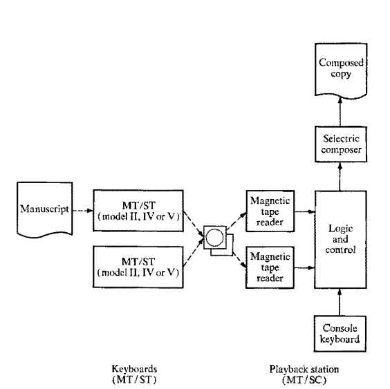

# Chapter 5: Recondite Surfaces

The scholar Wendy Hui Kyong Chun views magnetic storage as an "enduringly
ephemeral" medium, which "creat[es] unforeseen degenerative links between humans
and machines" [@chun_enduring_2008, 148]. If the floating gate transistor,
where my text now lives, can be called enduring and ephemeral, I will call my
liquid crystal display, where the text shows itself, fading and
persistent.[^ln2-gate] This is not to suggest that digital text transcends its
material contexts. Only to observe that it drifts from surface to surface,
beyond the field of vision, in ways that erode trust its general permanence.
If we are to dwell on surfaces, I do not know where to look: the screen or the
floating gate. I do not trust the text appearing before my eyes.

Where does text reside? We know the answer for print: it is there, on the
page. Computational media complicate our ability to situate inscription. We
point at screens, but without certainty; their surfaces remain in flux. They
are sites of fleeting projection, which emanates from hidden storage media and
passes through multiple filters and transformations on the way to the surface.
Though we observe the inscription on screen only, it embodies a complicated
figure, stretched across at least two sites. The sign strains and splits:
between the configuration of magnetic pulse and circuit state at one end, and
in the phases of liquid crystal on the screen at the other. Both locations
afford distinct constraints to interpretation. Familiar actions like "reading"
and "writing" imply distinctly differing operations depending on the surface.

Thus when Michael Heim refers to the "ephemeral quality" of the electronic
text or when Pamela McCorduck describes it as "impermanent, flimsy, malleable,
[and] contingent" they are correctly identifying a facet of digital
inscription at its site of projection. McCorduck tells the story of a
rabbinate court, which, when interpreting a law that prohibits observant Jews
from erasing God's name, deemed that words on a screen do not constitute
writing, and therefore sanctioned their erasure [@mccorduck_universal_1985,
51; also quoted @heim_electric_1987, 192].

Conversely, when scholars like Johanna Drucker, Katherine Hayles, and Matthew
Kirschenbaum respond to Heim and company with hardened materialism, they are
also rightly locating properties of digital inscription, but this time at the
site of its archival immanence. The two schools of thought disagree because
they speak neither of the same phenomenon nor at the same site. The former
group highlights ephemeral, transcendent qualities of the projected word. The
latter foregrounds the "uniquely indelible nature of magnetic storage"
[@kirschenbaum_mechanisms:_2008, 51], the "drives, tracks, and disks," the
"fundamental physical supports," and the "material substrates of computing"
[@drucker_performative_2013, para. 2]. Screen and hard drive partition the sign
between surface and depth, projection and archive. At the site of projection
one speaks of texts that are---I have kept a list of adjectives when reviewing
the literature---*ephemeral*, *shimmering*, *electric*, *flimsy*, *contingent*,
*malleable*, *impermanent*, *flowing*, *transcendent*, *ghostly*, and
*radiant*. At the archival site language changes to inscription that is
*enduring*, *solid*, *persistent*, *permanent*, *indelible*, *hard*,
*immanent*, *lasting*, *palpable*, and *concrete*.

The seeming immateriality of digital media has real-world effects: the costs
of replication plummet, for example. Computational text can be copied
effortlessly, with minimal cost, and near-perfect fidelity.
Hyper-reproducibility of the sort was unthinkable for most of the twentieth
century. Lowered costs of copying further reduce barriers to access and
conveyance. Symbols that adhere lightly to their medium are easy to store and
transport. Public knowledge works like search engines and massive open online
encyclopedias claim to organize "all of the world's knowledge." Such projects
unfold by the logics of immateriality, total archives, and universal
accessibility.[^ln1-google] When representation appears to weigh nothing, one
imagines a weightless totality of all representation, available immediately
and everywhere. The perceived weightlessness of text has other side-effects as
well. A text that adheres lightly to its medium is difficult to contain. It
becomes onerous to govern digital representation, to enforce censorship or
intellectual-property rights.

Despite appearances, text cannot be unmoored from its material foundations.
Rather, it splits in two: with one half arising visibly, a weightless and
apparent screen simulation, and the other half, opaque, etched into hefty and
hidden material contingencies. The material substrates of computational text
likewise carry real-world affordances and consequences. First and foremost
they are hidden from view. Drives and tapes reside inside of boxes encased in
plastic and aluminum. If only because they carry electrical current and are
thus flammable, they are regulated. They contain heavy and rare metals, often
hazardous to touch or ingestion. Flash memory cards, USB sticks, solid state
storage devices, and magnetic disk drives contain circuitry to prevent
unauthorized access and resist tempering. Within them, text intertwines with
machine internals, sealed hermetically and hermeneutically, in a way that
resists human interpretation. It is inscription not compatible with humans; a
literature for machines.

Form and content lie flat in print. Print interfaces are paper thin. Ink
adheres to paper in a way that pixels do not to screens. Textual fissure
complicates the traditional structuralist distinctions between form and
content. The computed inscription occupies at least two distinct sites, each
entailing drastically differing affordances for interpretation. Were we to
untangle the tightly wound coil of the circuit, we would find ample distance
between the hard drive and the screen. Some readers measure that distance in
inches, as when reading documents locally for example, stored on their own
computer; and in miles when reading documents remotely, stored on far away
"cloud" servers. Where print is flat, multiply planes of inscription stratify
computed text.[^ln2-hayles]

How did this multiplicity come to be? And what effect does it have on the life
of the mind? In this chapter I will make visible the gap between projected
sign and archived inscription. I will begin by providing a historical account
of a letter's passage from paper to pixel. My narrative arc proceeds in three
stages, which I summarize here and expand upon later.

First, with the advance of telecommunications, at the turn of the twentieth
century, we observe an emerging divide between human-readable text and
machine-readable code. Removable storage media like ticker tape and punch
cards constituted a machine instruction set, meant to actuate mechanisms which
in turn produced human-legible inscriptions. Unintelligible control codes
"driving" the machine were thereby mixed with plain text, the content of
communication. Inscription split between storage, which contained an expanded
character set, and projection, which contained only human alphabets.

Second, where ticker tape and punch cards were legible without specialized
reader devices, magnetic tape storage made for an inscrutable medium. In the
1950s and 1960s, machine operators worked "blindly," using complicated
workarounds to verify equivalence between input, storage, and output. Writing
began to involve multiple "typings," "printings," and specialized magnetic
reading devices to establish the correspondence between input, storage
content, and output of entered text.

Finally, the appearance of Cathode Ray Tube (CRT) displays in the late 1960s
restored a measure of legibility lost to magnetic storage media. The familiar
sign reemerged on the screen. Crucially, it now constituted a simulation of
the archived inscription. Typing a word on keyboard produced one sort of a
structure on tape or disk and another on the screen. The two relate
contingently, without necessary equivalence. The lay reader has no means to
ensure the correspondence between visible trace and stored mark. An opaque
"black box" of computation began to intercede between reading and writing.

A number of textual machines will illustrate the above history. Three
mechanisms will serve as milestones along our journey: the Controller patented
by Hyman Goldberg in 1911; the Magnetic Reader introduced by Robert Youngquist
and Robert Hanes in 1958; and, for a lack of a better name, the Time Fob,
introduced by Douglas Engelbart in 1968. Goldberg attempted to heal the rift
between human and machine alphabets by inventing a mechanical punch card that
could move minds and levers alike. His device untraced an alphabet understood
by humans and machines both. Youngquist and Hanes gave human operators a
glimpse into the hidden world of magnetic polarities and electric charges.
Engelbart's Time Fob belongs to what Peter Denning, a prominent computer
scientist has called the "third generation" of computer systems. It is an
assemblage of storage, input, and output technologies that continue to shape
our contemporary encounter with text today.[^ln2-denning] Together, these
devices tell a story of a fracture.

## A. Perforation

First, some background to telegraphy. The turn of the twentieth century was a
pivotal period in the history of letters. It saw the language of people and
the language of machines combine. The Morse and Baudot codes paved the way for
language automation. The great variety of human scripts was finally reduced to
thirty-two discrete and reproducible characters. So regularized, type was
converted into electrical signal, sent over great distances, and used to
program machines remotely. But these new affordances came at a price of
legibility. A cadre of specially trained machine operators was required to
translate human alphabets into machine transmittable code. Eventually,
specialized equipment automated this process.

The advent of programmable media---punch cards and ticker tape---coupled
human-compatible alphabets with machine control code. Reduced to a discrete
and reliably reproducible set of characters, natural languages could now be
conveyed as electric signals. In such a transitive state language became more
mobile than ever before. It was transmitted efficiently across vast distances.
The mechanization of type introduced new control characters into circulation,
that affected machine state changes at a distance. Initially, such state
changes were simple: "begin transmission," "sound error bell," "start new
line." With time, they developed into what we now know as programming
languages. Content meant for people was being routinely intermixed with code
meant to control machine devices. Such remote capabilities were used to
control everything from radio stations, to advertising billboards, to knitting
machines [@hough_wired_1931; @adler_knitting_1933; @casper_remote_1934].

Language compressed and pushed through the wires underwent a number of
transformations. Donald Murray, the inventor of the popular Murray telegraph
alphabet, conceived of telecommunications in terms of time and space. Advancing
a self-professed metaphysics of telegraph signalling alphabets, he described
spatial writing symbols that "appeal to the eye," and temporal, "telephonic"
signals that "appeal to the ear" [@murray_setting_1905, 36]. Paradoxically,
space signals (like words on a billboard) occupy little space, but persist in
time.  "For instance," Murray wrote, "a signboard may extend over 10 feet and
100 years" [@murray_setting_1905, 36]. Time signals, by contrast, are
ephemeral: "a Morse signal in a wire may extend over half a second and 500
miles" [@murray_setting_1905, 86]. The signal is long duration but short on
space.

<!-- rewrite this to make clear -->
In print, the reader could mentally assemble consecutive physical markings
into sentences, paragraphs, and chapters---abstract categories not otherwise
accessible to the mind. Electric signs were not readily visible either.
Besides reassembling the sign in time the reader must also walk the length of
the inscription to discern its shape. The inscription gains a complex new time
signature which extends away and beyond the reader's field of view.

As telegraphy spanned national boundaries, agreements were needed to
standardize conventions for equipment and message encoding
[@international_telegraph_union_journal_1899, 82-91]. They were handled on a
regional, ad-hoc basis until 1865, when the International Telegraph Union
(ITU) was created. The International Telegraph Conference (ITC) in Paris, held
between March 1 and May 17 of 1865, adopted, among other things, the use of a
modified Morse code character set, containing 33 Latin letters (including
characters from the French, German, and Spanish alphabets), 10 numbers (0--9),
14 punctuation marks (including a fraction bar), and 10 control codes
(including "end of service," "attention," and "error")
[@international_telegraph_union_documents_1865]. In specifying the conversion
tables for the Morse alphabet, the 1865 ITU rules required a silence equal to
three dots (or one dash) to indicate the space between two letters, and a
silence equivalent to four dots (later changed to seven) to indicate the space
between words.

Although Morse code is commonly imagined as a binary code, comprising ones and
zeroes, it is technically ternary, because it uses three elements: dots,
dashes, and silences. In Morse code, characters are of variable length: one
dash for "t," for example, and six dots for the number six. The transmission
of variable length codes thus required the presence of a human operator who
could "translate" from natural to machine language using a "key" which when
depressed vertically would complete an electric circuit to produce the signal.

Writing in 1929 for the journal *American Speech*, Hervey Brackbill preserved
some of the specialized language associated with Morse code culture. "Morse
telegraphy is commonly referred to as a 'game,'" he wrote, "and the operator
'works a wire'" [@brackbill_telegraphers_1929, 288]. Operators tapping keys
used "bugs," which where insect-like machines that had "long slender levers and
springs." Bugs had trade names like "Lighting Bug," "Gold Bug," and "Cootie"
(for a small model) [@brackbill_telegraphers_1929, 288].

Operators using "straight keys" achieved speeds upwards of 25--30 words per
minute, limited by the shortest possible length of the smallest transmitted
unit (a dot), fixed by the American and the International Morse Code
conventions to 1/24 of a second in duration.

At the time, companies like Vibroplex began manufacturing semi-automatic keys,
which made use of a horizontal switch capable of emitting a rapid succession
of dots to one side of the action, and dashes to the other
[@martin_telegraphic_1904; @boyd_telegraph-key_1916]. A bug was said to "run
away" when adjusted for too high of a speed. Vibroplex keys would greatly
alter the "fist," or the operator's individual transmission style. They also
allowed for speeds approaching 50 words per minute and above, if not following
the minimum signal length specifications [@mcnicol_american_1913, 207;
@u.s._bureau_of_labor_statistics_displacement_1932; @halstead_genesis_1949].
Despite the improvements, Morse code was showing its age. Although the
convention stipulated fixed length, the actual length of silences between
meaning-carrying units varied greatly with the vagrancies of transmitting
media. Cross talk between wires and weather interference was common;
communicating in Morse still required a human operator for efficient ciphering
and deciphering. In a long-chain of time-sensitive transformations between the
message and its recipient, the human posed a limiting factor.

Telegraph operators working a "hand sender" often developed partial paralysis
in their wrists or arms. The condition was commonly known as "glass arm"
[@brackbill_telegraphers_1929, 288;
@u.s._bureau_of_labor_statistics_displacement_1932]. Senders were called "hams"
or "bums" when they "fell down" or made frequent errors
[@brackbill_telegraphers_1929, 288]. To "put someone under the table" in
sender's lingo was to transmit faster than a receiver could transcribe
[@brackbill_telegraphers_1929, 289]. The "reader" was "burnt up" when he fell
behind. He had to "break," or interrupt the sender to ask for repetition
[@brackbill_telegraphers_1929, 289]. To "paste" someone was to deliberately
burn him up.[^ln4-men]

[^ln4-men]: See @brackbill_telegraphers_1929, 288-9. The operators at the time
were all almost exclusively male.

The 1908 ITC in Lisbon, ratified two additional alphabet standards for
international use: Hughes and Baudot. Both were developed in response to
Morse's limitations and allowed for fully autonomous telegraph operation. The
Hughes telegraph, an 1855 design modification of the 1846 American Royal E.
House model, was a capricious machine that relied on a tuning mechanism to
transmit individual characters. It was inspired by the player piano and even
looked like one, complete with a keyboard and rotating drum. Its sending
device struck a tone which, when transmitted by electrical current, initiated
the rotation of a similar drum in the receiving apparatus "at the pleasure of
the distant operator." A length of time---between the initial synchronization
signal and struck chord---corresponded to a letter, which the machine then
printed to tape using a letter wheel. Hughes referred to his invention as a
"Compound Magnetic and Vibrating Printing Instrument," a name that hints at
its fragility. When the sending and receiving drums fell out of sync, the
message became impossible to decipher [@hughes_improvement_1856;
@hayles_print_2004, 145-147; @noll_evolution_2007, 20-21]. Coordination
between the various machines and their operators was of paramount importance.

The number and size of telegraph cables further limited the system's
"information density." Independent developments in communication technology
led to a range of techniques for sharing the same wire to send multiple
messages, known as "multiplexing." These fell into two categories:
time-division and pulse-amplitude modulation [@rowland_multiplex_1901;
@hausmann_telegraph_1915]. Pulse-amplitude modulation involved filling the
available space (bandwidth) with simultaneous signals of different types.
Imagine someone speaking loudly and quietly at the same time into the same
channel. In this way, all loud messages could be sorted to the one side and
all quiet ones to the other, which would effectively utilize the whole sonic
spectrum.[^ln3-multi] Initially, pulse-amplitude modulation was difficult to
implement. Cross-channel noise and device sensitivity hampered reliable
reception and decoding across multiple simultaneous wave frequencies.

Emile Baudot, among others, noticed that the prevailing Morse and Hughes
telegraph systems also failed to make full use of the *time* allotted for
message transmission. Hughes telegraphs in particular extensively used long
silences, which could have been condensed to extract more channel utility.
Baudot-type time multiplexers utilized synchronized rotating mechanisms at the
sending and receiving end. These distributed units of time among multiple
operators. One operator could, for example, send messages on top of the hour
and the other at the bottom. In this way, receivers could sort messages based
on time signature: all those sent on top of the hour go into one pile, all
those on the bottom, into another. A "duplex" printing telegraph, of the
Murray type, involved a complicated synchronization device, known as the
"distributor," capable of orchestrating two distinct streams of transmission
along the same channel. Taking turns to transmit, to the regular tolling of a
tuning bell, two operators would send separate messages along the same
channel. The receiving machine would then separate one message from the other
based on its time signature [@murray_setting_1905].

![Multiple Printing Telegraph, 1905 [@murray_setting_1905,
574].](images/multiplex.png)

It was important to maintain unison in such multiplexed systems. Time-shared
device operators had to know when it was their turn to type. The Baudot
multiplexer used time- or cadence- "tapper" mechanisms to indicate turns. In
some devices, they locked keyboards to prevent out-of-turn input. In a
quadruplex system, up to four operators could engage in an intricate dance of
fingers, keys, tappers, and signals, synchronized by the rotation of the
telegraph distributor.

Synchronization was also needed for Morse code devices, to distinguish
non-meaning carrying silence (the receiver is turned off) from the
meaning-carrying one (the receiver pauses to indicate a dot). The receiving
device needed a measure, a duration of silence to differentiate between "dots"
and spaces between words, which was indicated by silences of different length.
When the devices went out of sync, or if communication lagged for some reason,
the coherence of the message faltered. Sending and receiving machines had to
be tuned to a cadence of common information exchange. The system of operators,
transmitters, and receivers, was, in aggregate, tuned to a specific but
arbitrary rhythm by which certain messages made sense only in particular (also
arbitrary) units of time. In early telegraphy, these units of time were slower
than natural human time, enough so for the operator to remain idle. Later
systems increased the pace to a rhythm beyond natural human abilities of
comprehension, to a point where human operators could no longer decipher
signals without machine assistance. In the language of wiremen, bugs were
"running away" with the whole "game" [@brackbill_telegraphers_1929, 288]. A
human operator examining wire signals directly would find a jumble of data.
This, in fact, is a good definition of data: information beyond human time,
not available to attempts of unmediated, direct interpretation.

Hundreds of alphabet systems were devised to speed up automated
communications. These evolved from variable-length alphabets like Morse and
Hughes, to fixed-length alphabets like Baudot and Murray. The systematicity of
the signal---always the same length, always at the same time---moved the dial
further from natural human languages, which rely on affect and variation, to
artificial codes, which necessitate consistency and reproducibility.

The discovery of binary arithmetic belongs to Gottfried Leibniz, who,
influenced by hexagrams of the *I Ching*, articulated his own system in his
1979 *Explication de l'Arithmétique Binaire* [@leibnitz_explication_1703].
But, Francis Bacon deserves credit for articulating a fixed-length binary
code. In the sixth book of his *De augmentis scientiarum*, an encyclopedic
treatise on the "partition of sciences," Bacon boast of inventing a "highest
degree of cipher" that can signify "all in all" (*omnia per omnia*).
[^ln2-bacon] He proceeds to describe a "fivefold," "bi-literarie" alphabet,
which encodes each letter of the English language using a five-character long
string of As and Bs. The letter A, for example, became "aaaaa." B became
"aaaab," C "aaaba," and so on to Z, rendered as "babbb." "Neither is this a
small matter," Bacon wrote:

> these Cypher-Characters have, and may performe: For by this *Art* a way is
> opened, whereby a man may expresse and signifie the intentions of his minde,
> at any distance of place, by objects which may be presented to the eye, an
> accommodated to the eare: provided those objects be capable of a twofold
> difference only; as by Bells, by Trumpets, by Lights and Torches, by the
> report of Muskets, and any instruments of like nature [@bacon_advancement_1987,
> 266].

Writing more than two centuries before the telegraph's invention, Bacon
eloquently described its essence, which lay in expressing and signifying the
human mind at a distance.

The fixed-length property of Bacon's cipher, later implemented in the 5-bit
Baudot code, signaled the beginning of the modern era of serial communications
[@jennings_annotated_2004]. The Baudot and Murray alphabets were designed with
automation in mind.[^ln1-murray] Both did away with the "end of character"
that separated letters in Morse. Signals were be divided into letters by
count, with every five codes representing a single character. Additionally,
the Murray code was more compact than Morse and especially more economical
than Hughes, which used up to 54 measures of silence to send a signal
representing double quotes.[^ln1-zero] The signal for "zero" in Morse code
occupied 22 measures.  By contrast, all Baudot and Murray characters were a
mere five units in length, with the maximum of ten used to switch the
receiving device into "figure" or "capital letter" states (for the total of
ten units) [@murray_setting_1905; @beauchamp_history_2001 380-397].

![Murray Keyboard Perforator, 1905. Note the QWERTY arrangement of the keys
[@murray_setting_1905].](images/murray-keyboard.png)

<!--
![Table of Alphabets, 1901 [@vansize_new_1901, 23].](images/alphabets-vansize.png)
-->

Fixed-length signal alphabets further separated human and machine
communication. Significantly, the automated printing telegraph decoupled
encoding from transmission. Fixed-length encoding could not be done in
advance, with more facility and in volume. The prepared message could then be
fed into a machine without human assistance. In 1905, Donald Murray wrote that
"the object of machine telegraphy [is] not only to increase the saving of
telegraph wire [...] but also to reduce the labour cost of translation and
writing by the use of suitable machines" [@murray_setting_1905, 557]. Baudot's
and Murray's codes were not only shorter, they were simpler and less
error-prone, and thus resulted in less complicated and more durable devices.

With the introduction of mechanised reading and writing techniques, the
telegraph diverged from the telephone to become a device of asynchronous
communication, displacing the act of communication in time as it did in space.
The essence of algorithms lies in their ability to displace execution: a
cooking recipe, for example, allows novice cooks to follow instructions
without the presence of a master chef. Similarly, displaced communication
happened in absentia, according to predetermined rules and instructions.

<!--- work on this paragraph, the point here is programming -->

The new generation of printing telegraphs was "programmed" using removable
storage media, like a player piano was "programmed" to play a piece by means
of a music roll. They decoupled inscription from transmission, just like the
perforated music roll decoupled music-making from performance. By means of
external storage media, like ticker tape and punch cards, a message could be
prepared in advance and "fed" into the mechanism for transmission at rates
that far exceeded the possibilities of hand-operated Morse telegraphy. After
encoding common Latin characters, the Baudot schema left space for several
special "control" characters. The "character space" could thus further be
expanded by switching the receiving mechanism into a special "control mode" in
which every combination of five bits represented an individual control
character (instead of a letter).

As Bacon's early writings on the language arts suggest, the roots of
telegraphy lie in cypher-making and cryptography. It is no surprise, then,
that the encoding of human languages for machine use was intimately connected
to war-time, diplomatic, and otherwise clandestine communications. The
seemingly innocuous problem of machine translation was therefore inextricable
from questions of access and legibility: who gets to understand the encoded
message and when?

For example, the Final Protocol to the Telegraph Regulations, ratified in
Madrid in 1932 by the governments of more than seventy countries, included
a special provision delineating the difference between transmitting "plain,"
and "secret" language. The protocols grouped "secret languages" into "code" and
"cypher" categories. "Plain language" was defined as words which present "an
intelligible meaning in one or more of the languages authorised for
international telegraph correspondence, each word and each expression having
the meaning normally assigned to it in the language to which it belongs"
[@itu_telegraph_1932, 12]. By contrast, "code language" was defined as
"composed either of artificial words, or of real words not used with the
meaning normally assigned to them in the language to which they belong and
consequently not forming intelligible phrases" [@itu_telegraph_1932, 12]. Codes
were not permitted to contain more than five characters and were charged at
6/10th of the agreed tariff rate. Upon request, the sender of the telegram in
code language was required to "produce the code from which the text or part of
the text of the telegram has been compiled" [@itu_telegraph_1932, 13].
Otherwise, the language was considered to be a secret "cypher," defined as
"groups or series of Arabic figures with a secret meaning"
[@itu_telegraph_1932, 13]. The terms of the convention were binding.
Participants agreed to accept and pass telegrams in plain language through
their jurisdictions. They also agreed to let secret communications pass,
although they were not obligated to accept or help deliver such messages
[@itu_telegraph_1932, 13].

<!-- transition missing -->

By the late 1920s the "Morse men" were being replaced with more efficient
automated substitutes. By the 1930s, devices variously known as "printer
telegraphs," "teletypewriters," and "teletypes" displaced Morse code
telegraphy as the dominant mode of commercial communication. A 1932 U.S.
Bureau of Labor Statistics' report estimated more than a 50 percent drop in
Morse code operators between 1915 and 1931. Morse operators referred to the
tele-typists on the sending side as "punchers" and on the receiving side as
"printer men."[^ln2-printermen] The printer men responsible for assembling
pages from ticker tape were called "pasters" and sometimes, derisively, as
"paperhangers" [@brackbill_telegraphers_1929, 290]. Teletype automated this entire
process, rendering punchers, pasters, and paperhangers obsolete. Operators
could now enter printed characters directly into the machine, using a keyboard
similar to the typewriter, which, by that time, was widely available for
business use. The teletype would then automatically transcode the input into
transmitted signal and then back from the signal onto paper on the receiving
end. Operators did not need to concern themselves with machine code. Machine
control receded out of sight.

![Goldberg's Control Cards [@goldberg_controller_1915].](images/control-2.png)

Hymen Goldberg's 1911 Controller addressed the telegraph's legibility problem.
"You must acknowledge that this is readable without special training," Goldberg
wrote [@goldberg_controller_1915, sheet 3]. "My invention relates to all
controllers" [@goldberg_controller_1915, 1]. His controller was made "to
provide [a] mechanism operable by a control sheet which is legible to every
person having sufficient education to enable him to read"
[@goldberg_controller_1915, 1]. In an illustration attached to his patent,
Goldberg showed "a control sheet in which the control characters are in the
form of the letters of the ordinary English alphabet"
[@goldberg_controller_1915, 1]. Rather than using ticker tape, he proposed the use
of perforations that where capable of actuating machine levers and also formed
letters. To counteract illegibility, Goldberg imagined using cards, perforated
in the shape of English letters. His cards thus did the "double duty" of
carrying human-readable content and mechanically manipulating machine "blocks,"
"handles," "terminal blades," and "plungers" [@goldberg_controller_1915, 1-4].

Human and machine language coincided on the same plane, if only for a time.
The inscription remained visible at the surface of Goldberg's control sheet,
as a perforated figure, punched through the medium. Magnetic tape, mute and
inscrutable, soon replaced punch card and ticker tape as the preferred medium
for data storage.

## B. Magnetic Reading

"Historically unforeseen, barely a thing, software's ghostly presence produces
and defies apprehension," Wendy Chun wrote in her *Programmed Visions*, an
influential monograph that continues to shape the field of software studies
[@chun_programmed_2011, 3]. She quotes several prominent computer scientists
and media historians to the same effect. But what gives software its ephemeral
quality?

Embossed onto ticker tape or punched into the card, early software protruded
through the medium. In the age of the telegraph, the biggest barrier to the
comprehension of software was encoding. Morse code and similar alphabet
conventions left a visible mark on the paper. Once the machine alphabet
identified, it could be translated back into natural language using a simple
lookup table. The ticker tape gave the means to translate human language into
electric signal. Once mechanized the signal could be used to communicate and
to control machines remotely. But one could hardly call early programmable
media ephemeral or immaterial. Anecdotes circulate in the digital humanities
circles about Father Roberto Busa, the early pioneer in the field of
computational philology, who in the 1960s carted his punch cards around Italy
on a truck.[^ln2-busa] Codified inscription before its electromagnetic period
was fragile and unwieldy. Just like writing with pen and paper, making an
error on ticker tape entry required cumbersome corrections and sometimes
wholesale re-entry of lines or pages. On the surface of ticker tape, the
inscription still made a strong commitment to the medium. Once committed to
paper it was near-immutable.

Magnetic tape changed the nature of the commitment between inscription and
medium. It gave a temporary home to the word, where the word could be changed
and manipulated before committing to paper. A typist using the new generation
of magnetically enabled devices could manipulate words "in memory," on a
medium that could easily be erased and rewritten. The magnetic charge adhered
lightly to tape surface. The "light touch" of the magnetic inscription gave
the word its ephemeral quality. But it was also light enough as to be nearly
imperceptible. In applications like law and banking, where the fidelity
between input, storage, and output were absolutely crucial, the illegible
property of magnetic storage posed a considerable engineering challenge. After
the advent of teletype, but before the screen, machine-makers employed a
variety of mechanisms to restore a measure of congruence between invisible
magnetic inscription and visible paper representation.

The principles of magnetic recording were developed by Oberlin Smith (among
others), the American engineer who also filed several inventions related to
weaving looms at the end of the nineteenth century. In 1888, inspired by
Edison's mechanical phonograph, Smith made public his experiments with an
"electrical method" of sound recording using a "magnetized cord" (cotton mixed
with hardened steel dust) as a recording medium. These experiments were later
put into practice by Valdemar Poulsen of Denmark, who patented several
influential designs for a magnetic wire recorder [@smith_possible_1888;
@poulsen_method_1900; @engel_1888-1988_1988; @thiele_magnetic_1988;
@daniel_magnetic_1998; @vasic_coding_2004].

Magnetic recording on wire or plastic tape offered several advantages over
mechanical perforation. Tape was more durable than paper; it could fit more
information per square inch; and, most importantly, it was reusable. "One of
the important advantages of magnetic recording is that the record may be
erased if desired, and a new record made in its place," Marvin Camras, a
physicist with the Armour Research Foundation, wrote in 1948
[@camras_magnetic_1948, 505]. At the turn of the century, most of the
developments in magnetic storage were aimed at sound recording. The use of
magnetic medium for the storage of data did not take off in earnest until the
1950s [@dee_magnetic_2008, 1775]. Yet some of the early developers of
electro-magnetic storage and recording technology already conceived of their
work as having an impact on knowledge production broadly and on the history of
the book in particular. Addressing the Franklin Institute on December 16th of
1908 Charles Fankhauser, the inventor of the electromagnetic "telegraphone,"
said the following:

> To transport human speech over a distance of one thousand miles is a
> wonderful achievement. How much more wonderful, then, is the achievement
> that makes possible [...] its storage at the receiving end, so that the
> exact sentence, the exact intonation of the voice, the exact timbre, may be
> reproduced over and over again, an endless number of times.
> [@fankhauser_telegraphone_1909, 37-8]

Comparing magnetic recording to the invention of the Gutenberg press,
Fankhauser went on to say:

> It is my belief that what type has been to the spoken word, the telegraphone
> will be to the electrically transmitted word. [...] As printing spread
> learning and civilization among the peoples of the earth and influenced
> knowledge and intercourse among men, so I believe the telegraphone will
> influence and spread electrical communication among men"
> [@fankhauser_telegraphone_1909, 40].

In that speech, Fankhauser laments what he calls the "evanescen[ce]" of
telegraph and telephone communications [@fankhauser_telegraphone_1909, 39]. The
telephone fails to preserve "an authentic record of conversation over the
wire" [@fankhauser_telegraphone_1909, 40]. Fankhauser imagines his telegraphone
in use by "the sick, the infirm, [and] the aged":

> A book can be read to the sightless or the invalid by the machine, while the
> patient lies in bed. Lectures, concerts, recitations---what one wishes, may
> be had at will. Skilled readers or expert elocution teachers could be
> employed to read into the wires entire libraries
> [@fankhauser_telegraphone_1909, 44].

Anticipating the popularity of twenty-first century audio media formats like
the podcast and the audio book, Fankhauser imagines "tired and jaded" workers
who "soothe [themselves] into a state of restfulness" by listening to their
favorite authors [@fankhauser_telegraphone_1909, 45]. Poulsen's "electric
writing" will finally emerge "as clear and distinct as the writing by hand, and
an absolutely legal and conclusive record," Fankhauser concludes
[@fankhauser_telegraphone_1909, 41].

In the first decade of the twentieth century, Fankhauser imagined magnetic
storage as an audio format, combining the best of telegraphy and telephony in
one device. For the purposes of data storage, magnetic recording technology did
not mature until the 1950s, when advances in composite plastics made it
possible to manufacture tape cheaper and more durable than its paper
alternatives. The state of the art relay calculator commissioned by the Bureau
of Ordinance of the Navy Department in 1944 and built by the Harvard
Computation laboratory in 1947 still made use of standard issue telegraph "tape
readers and punchers," adapted for computation with the aid of engineers from
Western Union Telegraph Company.[^ln2-punch] The relay calculator was equipped
with a number of Teletype Model 12A tape readers and Model 10B perforators,
using 11/16-inch wide paper tape, partitioned into "five intelligence holes."
To give you a sense of the machine's storage capacity, each quantity entered
for computation took up thirteen lines of code [@staff_description_1949, 30].
The readers and punches were capable of running at 600 operations per minute.
Four Model 15 Page-Printers gave the means to compare the printed characters
with the digits stored in the ticker tape-based controlling print register. In
this setup, the numerical inscription was therefore already split between input
and output channels: with input stored on ticker tape and output on the printed
page for verification.

The Mark III Calculator which followed the Harvard Computation Laboratory's
earlier efforts was likewise commissioned by the Navy's Bureau of Ordinance.
It was completed in 1950. The "organization" (we would say "architecture"
today) of Mark III jettisoned tape in favor of multiple magnetic drums and a
system of reel-to-reel tape recorders. The drums, limited in their storage
capacity, revolved at much faster speeds than tape. They were used for fast,
temporary, internal storage. The surface of the magnetic drums was coated with
a "thin film composed of finely divided magnetic oxides of iron suspended in a
plastic lacquer, and applied to the drums with an artist's air brush"
[@staff_description_1952, 1]. Mark III employed twenty-five such drums,
rotating at 6900 rpm and each capable of storing 240 binary digits.

[^ln3-multi]: Technical literature makes a distinction between space- and
frequency- division multiplexing. On some level, space-division multiplexing
simply involves the splitting of a signal into multiple physical channels
(wires). Frequency-division better "fills" the space of a single channel.

In addition to the fast "internal storage" drums, the "floor plan" included
eight slow "external storage" tape-read mechanisms. Tape was slower than drums
but cheaper and easily extendible to multiple reels, approaching the ideals of
the Turing device, which called for "infinite tape." In practice, the tape was
not infinite, but merely long enough to answer the needs of military
computation. By contrast to stationary drums built into the machine, tape was
portable. Operators could prepare tape in advance, in a different room, at the
alloted Instructional Tape Preparation Table. The information on tape would
then be transferred to a slow moving magnetic drum, and, when the two drums
matched in speed, transferred again to the fast-moving internal drum for data
calculation, machine sequencing, and control [@staff_description_1952, 1-40].
Mark III was further equipped with five printers "for presenting computed
results in a form suitable for publication." The printers were capable of
determining the "number of digits to be printed, the intercolumnar and
interlinear spacing, and other items related to the typography of the printed
page" [@staff_description_1952, 34-5].

Data was recorded on tape using binary numerical notation. To enter the number
onto tape, the operator sat at the "numerical tape preparation table," another
piece of furniture separate from the main machine. The data was stored on tape
along two channels, running the length of the tape. The operator entered each
number twice, first into Channel A and then into Channel B. This was done to
prevent errors, since the operator worked blindly, without being able to see
whether the intended mark registered properly upon first entry. An error bell
would sound when the first quantity did not match the second, in which case the
operator would have to reenter the mismatched digits [@staff_description_1952,
143-88]. To further ensure "completely reliable
results"[@staff_description_1952, 35] the operator could use one of the five
attached Underwood Electric teletypes to print all of the tape's columns and
confirm visually.

I draw on a thick technical description throughout the chapter to make sure
that the reader understands the terms like "textual fissure" and "multiple
locations of the inscription" not in a metaphorical sense, but literally.
Where the typewriter or the hole punch transfered the inscription from
keyboard to paper directly, at the stroke of hammer and key, early
electromagnetic devices compounded the inscription across multiple surfaces.
The movement of the computed sign necessitated manifold "phase transitions"
between media: from one channel of the tape to another, from tape to drum,
from a slow drum to a fast one, and from drum and tape to paper. Where before,
on ticker tape, the inscription remained visible, at least before it entered
the wires as electrical signal, it now disappeared from view soon after key
press.  Submerged under magnetic surface inscriptions multiply, diffuse, and
resist direct observation. The computed sign undergoes a number of changes in
the process of displacement in time and in space. When using the Mark III or
similar tape-driven devices an operator could prepare a reel of tape today,
process it tomorrow, derive the necessary calculations and transmit them the
day after. The continual fissure of the inscription across surfaces, from one
format into another in effect constitutes what we mean by the "processing"
part of "word processing." Telegraphy entwined symbol and machine control,
making machine alphabets incomprehensible to a lay reader. Magnetic storage
further stretched the inscription across multiple recording surfaces,
concealing it in the process.

The potential incongruence between covert data storage and its apparent
representation posed a problem in the decades preceding the advent of screen
simulation. In a patent filed in 1954 on the behalf of the Borroughs
Corporation of Detroit, Michigan, Herman Epstein and Frank Innes describe an
"electrographic printer," involving an "electrical method and apparatus for
making electrostatic images on a dielectric surface by electrical means which
may be rendered permanently visible" [@epstein_electrographic_1961, 1]. The
electrographic printer anticipated the modern photocopier. Rather than storing
data in code, the inventors imagined forming letter shapes directly on the
surface of magnetic tape, in a kind of a magnetic tracing of each character. A
small printing head would convert binary input into a five-by-seven grid of
electromagnetic charges, capable of rendering the English alphabet. The
magnetic image could then be combined with a recording medium having the
"correct physical properties to adhere to the electrostatic latent images"
[@epstein_electrographic_1961, 2]. A light dusting of powder ink would reveal
the hidden magnetic image.

!["Images formed by a negative voltage," from Electrographic Printer by
Epstein and Innes
[@epstein_electrographic_1961]](images/magnetic-alphabet-epstein.png)

Advances in magnetic storage in the field of audio recording and in
supercomputer applications like the Mark III found their way into the business
and home offices a decade later, in the 1960s. In 1964, IBM combined magnetic
tape storage with its *Selectric* line of electric typewriters. The Selectric
typewriter is notable because it was one of the first typewriters to transform
the mechanical action of the keyboard into binary electric signal. For this
reason, it could serve as an input device for a variety of early computing
platforms. Combined with magnetic tape storage into the MT/ST unit, the
Selectric typewriter become one of the first true word processors
[@eisenberg_word_1992]. Word processing, in contemporary sense, identifies the
ability to record strokes and to print them onto paper in separate stages.
Temporary magnetic media storage is what enabled the gap between input and
output of text.

Built on a simpler architecture than its supercomputer cousins, the MT/ST used
a single tape read and write mechanism. An advertisement in the American Bar
Association circa 1968 calls it the \$10,000 typewriter that is "worth every
penny." Before, the typist would have to stop and erase every mistake, the copy
reads. But with IBM MT/ST it is possible to "backspace, retype, and keep
going." The mistake is changed on magnetic tape, "where all typing is recorded
and played back correctly at incredible speed" [@association_aba_1966,
998].<!--I can't find these quotes anywhere! I went through the attached PDF
and the 1966 January issue, but no luck.--> But just as it was with the Mark
III, information stored on magnetic tape was absolutely invisible to the
typist. At the time, the only way to verify the magnetic inscription was to
print it out.

What was gained in the freeing of text from the confines of immutable media
like ink and paper, was gotten at the price of legibility. Encoding used by
the IBM MT/ST typewriter retained the familiar underlying structure of a 7-bit
encoding scheme, not dissimilar from Bacon's secret writing. But on tape, the
encoding scheme ceased to be recoverable by the naked eye. The inscription lay
literally beyond human sense. On tape, "magnetic domains" and "polarities"
took place of visible albeit encoded alphabets.[^ln2-magnet] The developers of
these early systems recognized the problem of congruence between the visible
and the invisible sign. The machine operator needed to ensure that the input
correspond to the stored quantity. But the only way to check the stored
quantity was to once again transform it into another inscription. Direct
access to the site of storage was near-impossible.

The engineers working on Mark III attempted to address the problem of
congruence by asking the operator to input quantities twice. Other solutions
included making the magnetic mark more apparent. For example, the "magnetic
reader" patented by Robert Youngquist and Robert Hanes in 1962 promised a
"device for visual observation of magnetic symbols recorded on a magnetic
recording medium in tape or sheet form." Youngquist and Hanes wrote:

> Magnetic recording tape is often criticized because the recorded signals are
> invisible, and the criticism has been strong enough to deny it certain
> important markets. For example, this has been a major factor in hampering
> sales efforts at substituting magnetic recording tape and card equipment for
> punched tape and card equipment which presently is dominant in automatic
> digital data--handling systems. Although magnetic recording devices are
> faster and more troublefree, potential customers have often balked at losing
> the ability to check recorded information visually. It has been suggested
> that the information be printed in ink alongside the magnetic signals, but
> this vitiates major competitive advantages of magnetic recording sheet
> material, e.g., ease in correction, economy in reuse, simplicity of
> equipment, compactness of recorded data, etc." [@youngquist_magnetic_1961,
> 1].

The magnetic reader comprised a flat box that resembles a book. Youngquist and
Hanes proposed to fill the cover plate of their box with a transparent liquid
to host "visible, weakly ferromagnetic crystals." When sandwiched between the
two plates, a piece of magnetic tape would activate the crystals to align with
the embedded inscription. In this way, the top plate would reveal the "visibl[e]
outline[s]" of the underlying magnetic symbol [@youngquist_magnetic_1961, 1].

!["The positioning of a magnetic recording card for visual observation of
symbols recorded thereon," from
[@youngquist_magnetic_1961]](images/youngquist.png)

Yet the problem remained. Data arrangement along the length of the narrow
magnetic tape had a fundamentally differing structure from data arranged on
a broad sheet of paper. The next generation of IBM Magnetic Selectric
typewriters added a "composer" control unit to further address that difference.
The IBM Composer could restore some of the formatting lost in the transition
between paper and magnet. It added capabilities for margin control and text
justification. The original IBM Composer unit achieved margin justification
(its chief innovation over the typewriter) by asking the operator to type each
line twice: "one rough typing to determine what words a line would contain, and
a second, justified typing" [@morgan_ibm_1968, 69]. After the "first typing,"
an indicator mechanism helped the operator calculate the variable spacing
needed to achieve paragraph justification. The formatting and content of each
line thus required separate input passes to achieve the desired result.

+-------------------+---------------+-------------------------------+
|  Model            | Year          | Technologies                  |
+===================+===============+===============================+
| Selectric         |               | - electric                    |
| Typewriter        | 1961          | - binary code                 |
|                   |               | - replaceable font element    |
+-------------------+---------------+-------------------------------+
| MT/ST             | 1964          | - magnetic tape               |
|                   |               | - Selectric typewriter        |
+-------------------+---------------+-------------------------------+
| Selectric         | 1966          | - justification               |
| Composer          |               | - spacing                     |
|                   |               | - typesetting                 |
+-------------------+---------------+-------------------------------+
| MT/SC             | 1968          | - magnetic tape               |
|                   |               | - Selectric typewriter        |
|                   |               | - Composer                    |
+-------------------+---------------+-------------------------------+
| MC/ST             | 1969          | - magnetic card               |
|                   |               | - Selectric typewriter        |
+-------------------+---------------+-------------------------------+

Table: Generations of IBM Selectric line of word processors.

IBM's Magnetic Tape Selectric Composer (MT/SC) combined the typing
capabilities of the Selectric line of typewriters, magnetic tape from the
MT/ST line, and the formatting capabilities of the Composer. Rather than
having the operator type each line twice, the MT/SC system printed the entered
text twice: once on the "input station printout" which showed both the content
and the control codes printed in red ink, and the second time as the final
"Composer output" printout, which presented the final typeset copy. The output
operator would still have to intervene manually, however, to make decisions
about paper loading, type font changes, and hyphenation decisions. What was
once a monolithic unit on the page was thereby systematically separated into
several distinct layers in the process of composition and decomposition.

Like other devices of this generation, the IBM MT/SC suffered from the problem
of invisible storage. Error checking on paper via multiple printouts was aided
by a control panel consisting of "11 display lights." The configuration of
lights could be used to "peek" at the underlying data storage during otherwise
blind entry. In an attempt to achieve greater congruence between visible data
and data archived on the magnetic medium, IBM briefly explored the idea of
using magnetic cards instead of tape. Where on tape information had to be
stored serially, as one long column of codes, on a magnetic card the spatial
relation between elements could be preserved. The 1968 patent for "Data
Reading, Recording, and Positioning System" describes a method for arranging
information on such a card "recording and playback system which accurately
positions each character recorded relative to each previous character recorded"
[@clancy_data_1970, 1]. In 1969 IBM introduced magnetic card storage units into
its Selectric Composer line of word processors. Fredrick May, whose name often
appears on word processing related patents form this period, would later
reflect on magnetic cards, writing that a "major reason for the choice of
a magnetic card for the recording of medium was the simple relationship that
could be maintained between a typed page and a recorded card" [@may_ibm_1981,
743]. The card could be thought of as a miniature page, making the magnetic
card a "unit record of storage for a typed page" [@may_ibm_1981, 743].

![IBM Mag Card II, introduced in 1969 for use in the Magnetic Card/Selectric
Typewriter (MC/ST) in 1969. A "simple relationship ... could be maintained between
a typed page and a recorded card" [@may_ibm_1981, 743]. Image by Pointillist
under GNU Free Documentation License, Version 1.2.](images/ibm-card.png)

The Mag Card soon passed from use due to its limited storage capabilities and
a capricious feeding mechanism. The card offered a measure of topographic
similarity between page and stored signal. Yet, like all magnetic media it
remained resistant to direct observation. Speaking at the 1967 symposium on
electronic composition in printing, Jon Haley, staff director of the
Congressional Joint Committee on printing, put it this way: "compromises with
legibility [...] had been made for the sake of pure speed in composition and
dissemination of the end product [@technology_electronic_1967, 48]. The
automation of type made the word faster. The magnetic storage made it lighter
and more compact. It allowed for processing before commitment to a paper
medium. But these gains were made at the cost of legibility. The move to
magnetic and later solid state storage media would have tremendous social and
political consequences for the republic of letters. Magnetic storage reduced
the costs of copying, in a sense freeing the word from its more permanent
material confines, creating the illusion of ephemerality. Yet, the material
properties of magnetic tape itself continued to prevent direct access. They
separated readers into those able to effect the mixture of content and control
that shapes the literary encounter and those who observed passively, at the
shimmering surface of archival projection.

The structure of textual artifacts---from a simple leaflet to a novel in
multiple volumes---has remained remarkably stable since the invention of
movable type. One rarely finds a sentence that spans several paragraphs, for
example. Nor would a contemporary reader expect to find pages of different
length in the same tome.  Long-standing historical conventions guide the
production of printed text.  Semantic and decorative units on a page exist
within a strict hierarchy, so familiar to us as to become almost invisible. No
book of serious non-fiction will be typeset in cursive font, for example. But
unless something out of the ordinary attracts our attention, readers will tend
to gloss the "inconsequential" details of formatting in favor of content. The
material contexts of a well designed book fade from view during reading.

For a few decades after the advent of magnetic storage media but before screen
technology, the outward shape of the sign disappeared altogether. It is
difficult to fathom now, but at the time after the introduction of magnetic
tape in the 1960s but before the wide-spread advent of cathode ray tube
displays in the 1980s, the typewriter operator and the computer programmer
often manipulated text blindly. Where the page or the punch card gave
immediate visual feedback, the magnetic tape was inscrutable. The word could
be "processed" or altered with codes that controlled attributes like indent
size or justification *before* committing ink to paper. A paper describing the
popular IBM Magnetic Tape Selectric Typewriter (MT/ST) introduced in 1964
describes the novelty of the system as follows:

> It could be emphasized for the first time that the typist could type at
> "rough draft" speed, "backspace and strike over" errors, and not worry about
> the pressure of mistakes made at the end of the page [@may_ibm_1981, 742].

The IBM Magnetic Tape Selectric Composer (MT/SC) further added a "programmable
control" unit to separate the input from the output. Final printing would be
accomplished by:

> mounting the original tape and the correction tape, if any, on the
> two-station reader output unit, setting the pitch, leading, impression
> control and dead key space of the Composer unit to the desired values, and
> entering set-up instructions on the console control panel (e.g., one-station
or > two-station tape read, depending on whether a correction tape is present;
> line count instructions for format control and space to be left for
> pictures, etc.; special format instructions; and any required control codes
> known to have been omitted from the input tape). During printing the operator
> changes type elements when necessary, loads paper as required, and makes and
> enters hyphenation decisions if justified copy is being printed
> [@bishop_development_1968, 382].

The tape unit and the control unit thus intervene between the keyboard and the
printed page. The "final printing" combines roughly the "prepared...copy" with
"control" and "reference" codes and "printer output" [@bishop_development_1968
382; @may_ibm_1981]. The materials from the time often speak of three distinct
human operators that could be responsible for each stage of the production: one
entering the copy, one specifying the control codes, and one responsible for
handling the paper output. The machine operators could hypothetically work in
isolation from one another. The typist would see only elements of the copy; the
typesetter or the controller only formatting and control codes; and the printer
only the interpolated results.

<!--

-->

Researchers working on these early IBM word processing machines saw the
separation of print into such distinct strata as one of their major
contributions to the history of print writ large. A consultant writing for the
*IBM Journal* in 1968 imagines the "evolution of composition" that proceeded
from handwriting, to wood engraving, movable type, letterpress, and, finally,
to the IBM MT/SC. "The IBM Selectric Composer provides a new approach to the
printing process in this evolution," he writes. He concludes to say that the
IBM Composer finally empowers the writer to once again write books "without
the assistance of specialists" [@frutiger_ibm_1968, 10]. Marketing language
aside, the separation of the sign from its immediate material contexts
constituted a major milestone in the history of writing and textuality.

## C. Restored Sight

In decoupling input and output, magnetic storage and solid state media afford
the injection of time and space, in arbitrary intervals, between the process
of inscription and comprehension. Content coupled with control code and
encoded into an electrical charge sinks beneath the matte surface of an
inscrutable medium. The final movement in the textual fissure restores a sense
of immediacy into the process of inscription through screen projection. Text,
invisible in its material substratum, reappears on the screen, but, crucially,
the correspondence between the archived inscription and its projected image
can no longer be guaranteed. The very admixture of formatting and control code
which we saw emerge in the first stage of the movement towards simulation
remains out of sight. The condition of simulated text is as liberating as it
is perilous: liberating, because loosely coupled to their material substratum
texts become both more fluid and more portable; and perilous because the flows
of power and control can now be submerged beneath the visible surface of the
screen. Plainly put, the systematic barriers to copying, sharing, exchanging,
editing, remixing, and disseminating texts are reduced to a minimum, while the
barriers to comprehension increase.

I propose to treat the year 1968 as the year in which the contemporary textual
condition took its present, completed form. Subsequent generations of
computational devices would change in terms of size, speed, and ubiquity. But
they also retain essentially the same architecture, comprising (i)
programmable storage media; (ii) internal memory, magnetic, solid or other
types of external storage; and (iii) keyboards and screen displays for
human-machine interaction. The addition of the screen completed the circuit
between human-initiated input and human-legible output. The screen "opened a
window" onto the submerged world of magnetic storage.

In theory, the screen updates multiple times per second to give an accurate
up-to-the moment view of the system's internal states, which are otherwise
opaque and illegible. In practice, the machine operator must have trust in the
design of the system to render its own internal states faithfully. And because
system control characters grew from several machine instructions in the first
decades of the twentieth century to complicated and infinitely extensible
"Turing-complete" programming languages by the 1950s, much of the systems
internals are habitually hidden from the average machine user. For
convenience's sake, and later for loftier reasons like intellectual rights
management and system security, the user is given access to partial, simulated
representations of machine internals. Such compromise informs the architecture
of most computer systems, from digital cameras to mobile phones, and to
electronic book readers.

On December 9, 1968 Douglas Engelbart, then founder and primary investigator
at the NASA- and ARPA-funded Augmentation Research Center lab at the Stanford
Research Institute, gave what later became known colloquially as "the mother
of all demos" before the audience of roughly one thousand or so computer
professionals attending the Joint Computer Conference held at the Convention
Center in San Francisco [@rogers_demo_2005; @tweney_mother_2008]. The flyer
advertising the event described it as follows:

> This session is entirely devoted to a presentation by Dr. Engelbart on a
> computer-based, interactive, multiconsole display system which is being
> developed at Stanford Research Institute under the sponsorship of ARPA, NASA
> and RADC. The system is being used as an experimental laboratory for
> investigating principles by which interactive computer aids can augment
> intellectual capability. The techniques which are being described will,
> themselves, be used to augment the presentation. The session will use an
> on-line, closed circuit television hook-up to the SRI computing system in
> Menlo Park. Following the presentation remote terminals to the system, in
> operation, may be viewed during the remainder of the conference in a special
> room set aside for that purpose [@engelbart_doug_1968].

The demo announced the arrival of almost every technology prophesied by
Vannevar Bush in his influential 1945 piece for *The Atlantic*, "As We May
Think" [@bush_as_1945]. During his one hour or so lecture, Engelbart features
functional  prototypes of the following: graphical user interfaces, video
conferencing, remote camera monitoring, links and hypertext, version control,
text search, image manipulation, windows-based user interfaces, digital
slides, networked machines, mouse, stylus, and joystick inputs, and "what you
see is what you get" (WYSIWYG) word processing.

In his report to NASA, the agency which sponsored the research, Engelbart
described his lab as a group of scientists "developing an experimental
laboratory around an interactive, multiconsole computer-display system" and
"working to learn the principles by which interactive computer aids can
augment the intellectual capability of the subjects" [@engelbart_human_1969,
1]. Cathode Ray Tube (CRT) displays were central to this research mission. In
one of many patents that came out of his "intellect augmentation" laboratory,
Engelbart pictured the "display system" as a workstation that combines a
typewriter, a CRT screen, and a mouse. The patent schematics show the
workstation in action, with the words "NOW IS THE TIME FOB" prominently
displayed on the screen. Although Engelbart did not explain the meaning of the
message, the system's user is evidently in the process of editing a sentence
and about to correct the nonsensical FOB into a FOR.[^ln5-timefob]

!["NOW IS THE TIME FOB." Schematics for a "display system"
[@engelbart_x-y_1970].](images/engel.png)

Commenting on the use of "visual display systems" for human-computer
interaction, Engelbart writes:

> One of the potentially most promising means for delivering and receiving
> information to and from digital computers involves the display of computer
> outputs as visual representation on a cathode ray tube and the alternation
> of the display by human operator in order to deliver instructions to the
> computer" [@engelbart_x-y_1970].

The short-lived screenless word processors of the early 1960s (like the IBM
MT/ST) necessitated the cognitively arduous task of continuously keeping the
underlying document structure in the mind's eye. The screen removes that
burden by reconstructing the document structure topographically, along the
*x/y* axes. It restores a sense of apparent and organized space to data stored
in ad-hoc and impalpable structures along the surface of then magnetic storage
and now solid state medium. The contemporary "digital" document may resemble a
page on the screen, but beneath it, it is a jumble of bits, split into the
various regions of internal memory. The screen attempts to restore unity. It
recombines the bits to once again produce something resembling a paragraph, a
page, or a book, recreating some of the natural affordances of print, like
"turning the page," "writing on the margins, and "bookmarking." But these
actions are mere simulations of paper formats. Even as it gives the machine
operator some familiar visual cues guided by the physics of paper and ink, the
simulation itself follows the laws of physics that govern magnets and
electricity. The simulated text does not transcend matter, it merely
dissembles, concealing most of its material properties while simulating
others. The act of continual dissemblage---one medium imitating the
other---gives rise to the ephemeral illusion, by which pages fade in and out
of sight, paper folds in improbable ways, and words glide effortlessly between
registers of copy and paste.

Humans reading and writing on magnetic media with the aid of the screen for
the first time reported a feeling of freedom and liberation from paper. An
anonymous account included in Engelbart's report offers the following
phenomenological self-assessment:[^ln2-follow]

```
    1B2B1 "To accommodate and preserve a thought or
    piece of information that isn't related to the work
    of the moment, one can very quickly and easily
    insert a note within the structure of a file at such
    a place that it will nether get in the way nor get
    lost.

    1B2B2 "Later, working in another part of the file,
    he can almost instantly (e.g. within two seconds)
    return to the place where he temporarily is storing
    such notes, to modify or add to any of them.

    1B2B3 "As any such miscellaneous thought develops,
    it is easy (and delightful) to reshape the structure
    and content of its discussion material.
```

In other words, what the typist previously perceived as an ordered and
continuous activity of writing one word after the other, could now be
performed in a more disjointed way. The typist describes deriving delight from
shaping physical paragraph structure in ways that more closely match the
perception of his own mental activity. For the typist habituated to
typewriters, the addition of the screen restored some of the facility with the
word lost to the rigid mechanism that forced sequential, line by line entry.
The author could now think two thoughts at the same time if you will,
documenting both at different parts of the file as one would on a sketch pad
or in a notebook. The author suggests that this new way asynchronous and
multi-threaded way of writing better resembles the natural, spontaneous
operation of the human mind.

Interested in documenting such empirical phenomenological reflections of
system use, Engelbart recorded what must count as some the most evocative
passages to appear on the pages of a NASA technical report. The "Results and
Discussion" section of the report contain the following anonymous
contemplation:

```
1B4 "I find that I can express myself better, if I can
make all the little changes and experiments with wording
and structure as they occur to me." [Here the user
experiments a little with using structural decomposition
of a complex sentence.]
```

A decomposition follows indeed, as the author deviates dramatically from the
conventions of a technical report. Numbered passages along with unexpected
enjambment heighten the staccato quality of the prose, which at times reaches
towards the lyric:

```
    1B4A "I find that I write faster and more freely,

        1B4A1 "pouring thoughts and trial words on the
        screen with much less inhibition,
        1B4A2 "finding it easy to repair mistakes or wrong
        choices

            1B4A22 "so while capturing a thought I don't
            have to inhibit the outpouring of thought and
            action to do it with particular correctness,

        1B4A3 "finding that several trials at the right
        wording can be done very quickly

            1B4A3A "so I can experiment, easily take a look
            and see how a new version strikes me--and often
            the first unworried attempt at a way to express
            something turn out to be satisfactory, or at
            least to require only minor touch up.

        1B4A4 "Finding that where I might otherwise
        hesitate in search of the right word, I now pour out
        a succession of potentially appropriate words,
        leaving them all the while the rest of the
        statement takes shape. Then I select from among
        them, or replace them all, or else merely change the
        list a it and wait for a later movement of the
        spirit.
```

When input and output coincide in time, as they do on paper, mistakes are
costly. Once inscribed, the sign gains permanence. It is difficult to emend.
An eraser of some sort can help remove a layer of physical material.
Alternatively, writers use white ink to restore the writing surface.
Engelbart's anonymous subject reports the feeling of freedom from such
commitment to a physical medium. He or she can simply "backspace" and start
over.

The previous generation of word processors allowed for dynamic erasure, but
with the introduction of the screen the writer can now follow along and "see"
the changes in real time. Freed, seemingly, from the immediate and permanent
commitment to a medium like paper or punch card writing "comes easy" and
"uninhibited." Instead of carefully selecting the right words for the final
draft the writer "pours" them all out and then "selects" the ones that seem
appropriate, without hesitation. The highly hierarchical and blocky paragraph
structure, along with its repetitive refrain, "finding" and "I find that,"
gives the prose a hypnotic drive forward. The cadence matches the reported
experience of liberation.

Anonymous continues to report:

```
    1B4B "I find that,

        1B4B1 "being much more aware of

            1B4B1A "the relationships among the phrases of a
            sentence,
            1B4B1B "among the statements of a list,
            1B4B1C "and among the various level and members
            of a branch,

        1B4B2 "being able

            1B4B2A "to view them in different ways,
            1B4B2B "to rearrange them easily,
            1B4B2C "to experiment with certain special
            portrayals,

                1B4B2C1 "not available easily in unstructured data
                1B4B2C2 "or usable without the CRT display,

        1B4B3 "and being aware that

            1B4B3A "I can (and am seeking to) develop still
            further special conventions and computer aids
            1B4B3B "to make even more of this available and
            easy,

        1B4B4 "all tend to increase

            1B4B4A "my interest and experimentation
            1B4B4B "and my conviction that this is but a
            peek at what is to come soon.
```

The passages appear too contrived to be spontaneous admissions of
phenomenological experience. Despite their experimental structure, the words
advance key elements of Engelbart's research program, which aimed to develop
new data structures in combination with new ways of displaying them. Yet I
cannot help but be carried away by the fluency of the prose and by the sheer
audacity of the project.

Engelbart's research into intellect augmentation created tools that augment
research. In an image that evokes Baron Münchhausen pulling himself out of a
swamp by his own bootstraps, Engelbart described the methodology employed by
his lab as "bootstrapping." Bootstrapping for Engelbart involved the recursive
strategy of "developing tools and techniques" to develop better tools and
techniques. The "tangible product" of such an activity was "a constantly
improving augmentation system for use in developing and studying augmentation
systems." It is an appealing vision, but only as long as it remained
recursive. The lab benefits from creating its own tools and methods.  But
Engelbart also hoped that his system could be "transferred---as a whole or by
pieces of concept, principle and technique---to help others develop
augmentation systems for many other disciplines and activities." Undoubtedly,
Engelbart's ideas about intellect augmentation have had a broad impact on
knowledge work across disciplines. However, Engelbart's vision loses the
property of self determination in the transfer outside of the narrow confines
of his lab. At large, it no longer involved a community pulling itself by the
bootstraps. Rather it became augmentation enforced from without, adhering to
values and principles no longer comprehensible to the entity being augmented.

Contemporary word processors enable us to drag and drop passages with
unprecedented facility. But readers and writers hardly comprise a
"bootstrapping community" of their own, of the kind Engelbart imagined for his
laboratory peers. The contemporary writer is bootstrapped passively to
whatever prevailing vision of intellect augmentation. The very discussion
about what "intellect augmentation" means, passes from view as the tools of
augmentation become a commodity. They are beyond reading or critique as they
are no longer legible to the community of readers and writers.

To bring his system into being, Engelbart convened a bootstrap community which
through recursive self-improvement could lift itself up towards a smarter,
more efficient, more human way of doing research. To accomplish their task,
the group crafted novel instruments for input and output. They wrote new
programming languages, compilers to interpret them, and debuggers to
troubleshoot. They invented word editors and format control languages. Here's
how Engelbart diagrams a *part* of his text-manipulation language in the same
report:

!["State--chart portrayal of part of text--manipulation control language"
[@engelbart_human_1969, 36].](images/engel-edit.png)

The diagram shows care and love for the craft of writing. But there is also
complexity. The feeling of transcendence the anonymous author describes in
using the system engages a sophisticated mechanism. But it was not the
mechanism that lifted the community up, it was the process of creating it.
Engaged in a methodical discipline of self-reflection the architects of
intellect augmentation followed traditional Delphic ideals of self actuation.
The very metaphor of bootstrapping suggests the impossibility of using one's
bootstraps to pull others out of the Platonic cave. Engelbart's liberatory
research program therefore left another less lofty imprint on the everyday
practice of modern intellectual life. Text, which before the advent of the
cathode ray was readily apparent on the page in all of its fullness, finally
entered a complex system of executable code and inscrutable control
instruction.  The material lightness of textual being came at the price of
legibility.

[^ln2-gate]: Solid state memory technology, flash memory for example, store
information in capacitor "circuit states." This by contrast with
electromagnetic storage that works by modulating electrical charge over
a magnetic surface. Solid state capacitor storage was used in the earliest
computers, but was prohibitively expensive to manufacture until well into the
twenty-first century, when solid state drives began to replace electromagnetic
storage in consumer electronics [@kahng_semipermanent_1967, 1296]. In an early
(1967) paper on "A Floating Gate and Its Application to Memory Devices," Kahng
and Sze explain: "A structure has been proposed and fabricated in which
semipermanent charge storage is possible. A floating gate is placed a small
distance from an electron source. When an appropriately high field is applied
through an outer gate, the floating gate charges up. The charges are stored
even after the removal of the charging field due to much lower back transport
probability [...] Such a device functions as a bistable memory with
nondestructive read-out features. The memory holding time observed was longer
than one hour" [@kahng_floating_1967, 1288]. See also @horton_experimental_1962
and @frohman-bentchkowsky_fully_1971 on "floating gate avalanche injection."

[^ln2-printermen]: According to the U.S. Department of Labor statistics, women
comprised 24 percent of Morse operators in 1915 (before the wide-spread advent
of automated telegraphy). By 1931 women comprised 64 percent of printer and
Morse manual operators [@u.s._bureau_of_labor_statistics_displacement_1932,
514].

[^ln2-bacon]: This volume is also commonly translated as "Of the Dignity and
Advancement of Learning," following the Spedding edition. The first two books
of *The Advancement* appeared first in 1605. Together with books 6-9 published
in Latin in 1623 they are sometimes referred to as "Of the Advancement and
Proficience of Learning or the Partitions of Sciences," following the Oxford
1640 edition. I will follow the 1640 English edition here. Volume 10, in the
new Oxford Collected Works, containing *The Advancement*, was not out at the
time of my writing this book (2015).

[^ln2-brain]: We will later entertain the (real) possibility of
non-representational communication, suggested by early experiments in direct
brain-to-brain or brain-to-machine interfaces.

[^ln2-denning]: These stages correspond roughly to the "three generations of
electronic computing" outlined in Peter Denning's "theory of operating systems"
[@denning_third_1971].

[^ln2-busa]: See for example @hockey_history_2004, "Father Busa has stories of
truckloads of punched cards being transported from one center to another in
Italy" (para. 8).

[^ln2-magnet]: See for example @stefanita_magnetism:_2012, 1-69 and
@ohmori_memory_2015.

[^ln2-loom]: These dates, as is usually the case with periodization, are
somewhat arbitrary. I suggest 1725 as an inaugural date when the French textile
worker Basile Bouchon used "drill paper" to automate industrial drawlooms
[@koetsier_prehistory_2001, 593-595; @randell_history_2003]. The inaugural
honors could also go to the brothers Banū Mūsā, ninth-century automata
inventors from Baghdad; to Jacques De Vaucanson, who delighted the public with
his lifelike mechanisms in the mid eighteenth century
[@riskin_defecating_2003]; or to Joseph Charles Marie Jacquard, who improved
upon and popularized Bouchon's looms on an industrial scale around the same
time.

[^ln2-follow]: I reproduce the text verbatim and preserving the line breaks,
since formatting is an important part of the reported experience.

[^ln5-timefob]: The source for the cryptic phrase is likely
@weller_early_1918, 21 and 30: "We were then in the midst of an exciting
political campaign, and it was then for the first time that the well known
sentence was inaugurated,---'Now is the time for all good men to come to the
aid of the party;' also the opening sentence of the Declaration of
Independence [...] were repeated many times in order to test the speed of the
machine."

[^ln2-punch]:  See [@staff_description_1949, 1-40]. "Two means are available
for preparing the functional tapes required for the operation of the
interpolators. First, when the tabular values of *f(x)* have been previously
published, they may be copied on the keys of the functional tape preparation
unit [...] and the tape produced by the punches associated with this unit,
under manual control. Second, as suitable control tape may be coded directing
the calculator to compute the values of *f(x)* and record them by means of one
of the four output punches, mounted on the right wing of the machine" (33-4).

[^ln2-hayles]: See also @hayles_print_2004.

[^ln1-google]: "Google's mission is to organize the world's information and
make it universally accessible and useful" (@google_about_2015).  See also
Johanna Drucker's discussion on "the totalizing drive of the digital" in
[@drucker_digital_2001, 145].

[^ln1-murray]: The Australian Donald Murray improved on the Baudot system to
minimize the amount of "designed to punch as few holes as possible," allotting
fewer perforations to common English letters (@murray_setting_1905, 567).

[^ln1-zero]: Twenty-eight measures to indicate the numerical "figure space" and
26 to indicate double quotes (which shared the encoding length with the letter
"z").

\newpage

<!-- What we see cannot always be what we get.
Our inscriptions elude us, even as we learn how to recover a sense of literacy
from physicalities ever retreating, illegible, encrypted, and opaque. -->


