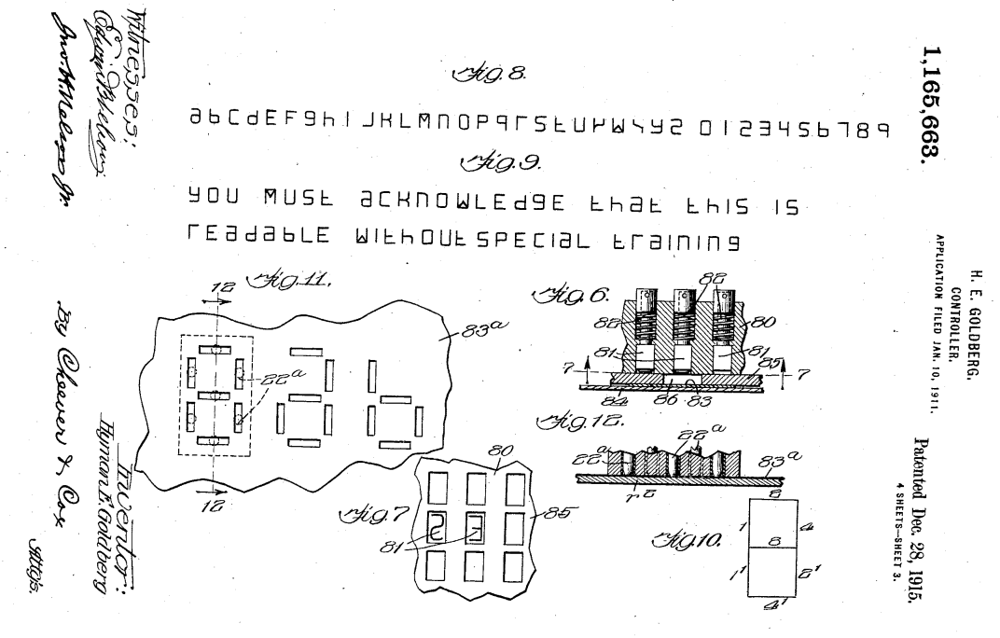
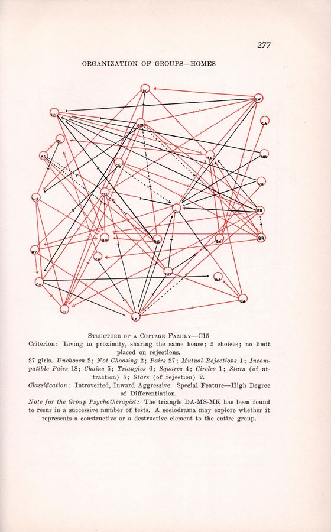
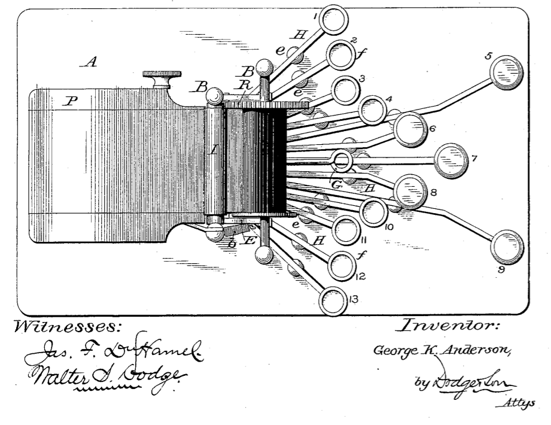

## Chapter 0: Introduction

Reflecting on the development of Morse Code in 1949 in the *Proceedings of the
American Philosophical Society*, Frank Halstead notes that "it is hard to say
to what particular field of the arts or sciences that signal code development
pertains." "It is a matter somewhat related to the general art of cryptology,
yet it is not wholly divorced from electrical engineering nor from general
philology [@halstead_genesis_1949, 456]."

In an ASCII-rendered plain text file, byte count corresponds to character
count.[^ln11-char] Let these words soak in for a moment. I will spend the rest
of the book unpacking this idea. We will have to come to terms with what "plain
text," "ASCII," and "bytes" really represent. But for now, a common-sense
understanding of the sentiment should suffice. It is enough to have the
intuition that texts and characters are concepts meant for humans and that
bytes have something to do with (and for) machines. Remarkably, under the
singular conditions of plain text (and even then, not always, and with many
caveats), a unit of information meaningful to me (a human for the most part)
gains a measure of equivalence to a byte, a unit of information "meant for" a
computer.[^ln11-human], [^ln11-meaning]

Not all texts are created equal. In print, traditional distinctions between
form and content lie flat. The printing press firmly embeds letters into paper,
leaving no space between ink and page. From the early days of the internet, the
writing of media-minded critics like Jerome McGann [@mcgann_radiant_2004],
Johanna Drucker [@drucker_digital_2001], and Katherine Hayles
[@hayles_print_2004] has compelled literary scholars to re-evaluate textuality
in its media-specific contexts. Their work reminds us that the flatness of
digital text endures only as an illusion. A substantial gap separates
presentation from source material. Low-level, operational intuitions governing
textuality--ideas about form, content, style, letter, and word--change
profoundly as text shifts its confines from paper to pixel. Forces of capital
and control often exploit that gap, relying on technological obscurity and
institutional momentum to promote their ends (for better or for worse).

I contend here that some of the higher-level social ills of the contemporary
public sphere, mass surveillance or online censorship, for example, are related
to our failure to come to terms with the changing conditions of digital
textuality. A society that cares about the long-term preservation of complex
discursive formations like free speech, privacy, and deliberation online, would
do well to take heed of textual building blocks at their foundation. Text
matters because how it is encoded, transmitted, and stored decides who gets to
decode, receive, and access.

[^ln11-char]: There are many caveats here, to be explored later. Follow along
with exercises related to the discussion in the Technical Appendix.

[^ln11-human]: Recent theory challenges the conceptual boundaries between
humans and machines in a concerted way. Perhaps, such boundaries were never
that clearly articulated in the first place. It is also likely that other
modalities of being are possible on the spectrum between human and machine, or
human and complex system. We will have a chance to explore these possibilities
in second half of the book. For now, I ask that the reader simply rely on the
colloquial, pre-theoretical understanding of both person and instrument.
However intertwined the hand and the hammer can become, there is an intuitive
way in which a child can separate one from the other. There is deep-rooted
instinct at work in that distinction, one that cannot and should not be
dismissed as mere naiveté. The concept of a human is in itself a powerful
theoretical construct, and, as I will argue throughout, one necessary, not only
for the understanding of key concepts in literary theory and computer science,
but also in articulating an ethics of critical computation.

[^ln11-meaning]: I write "meaning" in quotation marks, because the question of
whether it makes sense to talk about meaning for artificial agents is a
question that will remain unresolved, at least until the later chapters, when
we have the chance to discuss notions of data and information as
meaning-carrying units.

### Theory & Method

The idea that "meaning" is always in some sense "operational meaning" is a
proposition implicit in several related philosophical traditions. The first of
these is pragmatism, broadly conceived. William James articulates that view
when he writes that "reality is seen to be grounded in a perfect jungle of
concrete expediencies [@james-pragmatism-conceptionoftruth]." For James (and,
to some extent, for his fellow travellers in American pragmatism, Charles
Sanders Peirce and John Dewey)[^ln-pragma-truth] the pragmatic answer to the
question of truth could be reduced to the questions efficient causes and
effects. In his essay "Pragmatism's Conception of Truth," James asks: "How will
the truth be realized? What concrete difference will its being true make in
anyone's actual life? What experiences will be different from those which would
obtain if the belief were false?" Frank Ramsey, the young British philosopher
close to Ludwig Wittgenstein, was influenced by the Americans and would later
write that meaning "is to be defined by reference to the actions to which
asserting it would lead [@ramsey-foundationsofmath p.155]."

[^ln11-pragma-truth]: For a more thorough discussion on the topic see
@seigfried, @pihlström, and @putnam-james-theory.

For the pragmatist, truth-carrying propositions of the shape "X is" (as in,
"the author is dead" or "art is transcendent") beg the questions of "Where?,"
"When?," "For Whom?," and "What's at stake in maintaining that?" Following
James's and Ramsey's pragmatic insight, I will maintain throughout that
abstract categories like "text" cannot possibly be (although they often are)
reduced to a number of essential, structural features. Rather, to borrow from a
conversation on categories in Wittgenstein's *Philosophic Investigations*,
categories denote a related "family" of practices, which may or may not share
in any given familial characteristic
[@Wittgestein-philo-invest].[^ln11-more-witt] To visualize this "familial"
model, imagine a Venn diagram, where overlapping fields (of textuality, in our
case) intersect and diverge in a historically (culturally, practically)
contingent and arbitrary ways. These fields lie in relation to specific
communities of practice, which often do not in themselves employ a controlled
vocabulary. What counts for "code" and "poetry" in one domain, like computer
science, may not account for the very same in another domain, like creative
writing. An engineer's evocation of code as poetry can diverge from a poet's.
There's no sense in trying to reconciling divergent languages, where concepts
like "poetry" exist only in their social instantiation. The language of poetry
morphs from literary period to literary period: those who write code by day and
poetry by night might employ differing if not outright contradictory
vocabularies.

[^ln11-more-witt]: For more on the connection between Wittgenstein and James
see @goodman-wittandjames.

The intellectual legacy of pragmatism is wide-ranging and diffuse. It is
perhaps most pronounced in the teacher colleges, where James and Dewey are
still read widely, which could explain the ascendancy of such pedagogical terms
as "situated cognition"[@lave&wenger, @johnseelybrown] and "experiential
learning"[@kolb]: both terms denoting some sense of necessary synthesis
between of knowing and doing. In the field of linguistics, philosophy of
language, and communication studies, pragmatics are well-encapsulated by the
"language-as-action tradition," which harkens back to the Oxford language
philosophers like J.L. Austin, Paul Grice, and John Searle [@Trueswell].
Austin's "How to Do Things with Words," is perhaps the paradigmatic formulation
of the idea that words don't just mean things, but that they enact change in
the world.

When applied to task of writing media theory, history of science, or the
philosophy of technology, the pragmatic tradition suggests we move beyond
intellectual history, that is beyond mere words, into the examination of
real-world materials, practices, and institutions that sustain ideas.


Several broad intellectual movements tangentially related to pragmatism
influenced my approach to writing this book. The first is experimentalism.
Writing in the mid-19th century against the tradition of inductive
"generalizers," Claude Bernard, a pioneer in experimental medicine, argues for
the necessity of both theory and practice. "We cannot separate the two things,"
he writes, "head and hand." The "science of life" he writes, "is a superb and
dazzlingly lighted hall which may be reached only by passing through a long and
ghastly kitchen ." "We shall reach really fruitful and luminous generalizations
about vital phenomena only in so far as we ourselves experiment and, in
hospitals, amphitheaters, or laboratories stir the fetid or throbbing ground of
life [@bernard, p.3-15]."

It is my belief also that the lighted halls of contemporary literary and media
theory can be best through the long and ghastly kitchen of everyday practice.
Take the example of a media scholar analyzing the last two decades of film
production or photography without grasping the fundamentals of electronic
photodetectors, RAW image formats, complementary metal–oxide–semiconductor
(CMOS), digital editing tools, computer-generated imagery (CGI), or Photoshop
image manipulation techniques. Such a study is in great peril of being terribly
misguided by theoretical models that have no basis on reality. It is not that
one cannot say anything about photography without knowing these things, but
rather that one can say much more when he does. To my mind, theory must be
continually checked and refined against practice, just as practice must be
continually checked and refined against generalized insight. Similarly, it is
my contention here that the fundamental theoretical concepts driving literary
studies--word, text, narrative, discourse, author, story, book, archive--are
thoroughly enmeshed in the underlying physical substratum of paper and pixels
(but also ink, wood, and integrated circuit). These operational concepts cannot
attain their full expressive potential without an internalized understanding of
the technology and the daily practice that gives them rise. This book is an
attempt to develop knowledge "at hand" and "fingertip knowledge" (both
discussed in the later chapters).

It is likely that this line of reasoning is itself a part of experimental and
material "turns" steering the academy toward critical practice, especially in
fields long-dominated by theoretical reflection. The turn represents a
generation's dissatisfaction with "armchair" philosophizing.  Recall the
burning armchair, the symbol of "experimental philosophy" movement proposed by
Joshua Knobe and Shaun Nichols, who write that "many of the deepest questions
of philosophy can only be properly addressed by immersion oneself in the messy,
contingent, highly variable truths about how human being really are
[@knobe-nichols, p3]." In the field of media and literary studies, it is almost
impossible to avoid the influence of "archeology of knowledge," as advanced in
its many permutations by Michel Foucault and his followers. Yet, such
archeologies deal with "artifacts" and "excavations" only as metaphors for what
remains, methodologically, a history of ideas.

In the recent decade or so, a number of scholars are "making good" on the
metaphor by turning their attention to actual artifacts and excavations, in
what sometimes they dub as the history of craft or "artifactual knowledge." In
preface to a recent volume on *Ways of Making and Knowing*, edited by Pamela
Smith, Amy Meyers, and Harold Cook, the editors write that the "history of
science is not a history of concepts, or at least not that alone, but a history
of the making and using of objects to understand the world [@smith, p12]." As a
historian of science in the Early Modern period, Smith translates that insight
in the laboratory, where along with her students she bakes bread and smelts
iron to recreate long-lost artisanal techniques. The major insight from Smith
and her colleagues is that traditional "book" knowledge--the kind of
information that finds itself into novels, textbooks, and technical
manuals--represents only a small part of the sum total of human expertise. Much
of our knowledge is instead secreted into the artifacts and institutions where
it unfolds in daily practice. For literary and media scholars interested in key
operational concepts that means supplementing theoretical insight with a robust
sense of curiosity about the world. Digital technology, from typesetting
software to e-book readers and word processors, shapes our everyday encounters
with literature and textuality. That medium, as I will argue throughout, should
not be taken as a value-neutral conduit of information. Typesetting software,
e-book readers, and word processors contain in themselves implicit models of
text and discourse-formation.  They very literally contain system-level
definitions of what a word is or what counts for a document. It is our job then
to recover latent forms of textuality still extent on devices from mobile
phones, to laptops, and super computers, and to expose them to critical
interrogation. The task of media archeology on the level of the operating
system is a literary scholar's version of baking bread and smelting iron.

### Materialism

Finally, this book, and any notion of critical practice, owes a debt to the
legacy of critical theory. In the past few decades, the project of critical
theory (and related "schools" like cultural studies) has lost some of its
evocative power. Rather than rehashing a dry academic debate, allow me
enumerate some reasons for its decline in my own thinking. The first is the
movement's overt political goals. Patently the "stock" of Marxism, socialism,
communism and related ideologies has declined. Major critical theorists like
Roberto Unger and Michel Berube are now legitimately writing about the left's
political crisis [@cite]. Moreover, the political aspirations of critical
theorists were always somewhat difficult to defend in the face of other,
contradictory academic values like objectivity, neutrality, and critical
thinking. However problematic those terms are in themselves, we must
acknowledge that they represent a set of deeply-seated beliefs about the nature
of scholarship. Already present in Socratic or Confucian models of rhetoric,
these values place an emphasis on questioning received knowledge and on
empowering students to arrive at their own conclusions. In that light, the task
of critique should be to expose political assumptions rather than to promote a
particular political ideology.

As journals, departments, and libraries struggle financially, a whole industry
of middlemen thrives on the monetization of knowledge that rightly belongs to
the public domain. Libraries spend inordinate amount of money to essentially
buy back the research produced within their own community. Academic journals
that operate on principles of peer review and volunteer labor are then entered
into private circulation. Prices of $30-60 per article in the humanities are
not unusual. In perpetuating these conditions we reduce the notion of critique
to a meaningless rhetorical trope. The examination of our own immediate
material contexts of knowledge production and dissemination are crucial to
conversations about "world literature," "public discourse," "collective
memory," or "politics in the archive."

*Plain Text* is an attempt to repay the debt of materialism. The alienation, as
I will argue here, begins with the roots of my profession: namely the
production of textuality in everyday life. It is quite likely that most of
readers spend the majority of their waking hours in front of a personal
computer, typing letters on a screen (among other things worthy of their own
examination, but outside of the scope of this book). My goal then is to reclaim
the ordinary material contexts of a dominant mode of knowledge production and
dissemination. It is one thing to theorize about notions of form and content,
and it is quite another to see how form and content are encoded in .txt and
.pdf formats and to further how these distinctions then affect material
divisions of labor between "knowledge workers," "content producers,"
typesetting sweatshops, and international conglomerates that control vectors of
literary distribution.


## Chapter 2: Literature Down to the Pixel
`literature, content, value, control, algorithm, microanalysis`

### 2.0 Abstract

Having established the grounds for digital textuality in the history of
character encoding, I begin the work of moving from "low level" first-order
concepts like "text" and "code" up to second-order concepts like "literature"
and "canon." The chapter starts by developing a theory of "microanalysis," the
closest possible kind of reading that pays attention to the material contexts
of knowledge production. I argue here that the concern with value in literary
criticism detracts from the explicit movement of control and power intimately
connected to digital textuality. Unlike scholars in the foucauldian tradition
(who often trace the machinations of power through discourse, on the level of
representation), I concentrate my analysis on mechanisms of control at the
material roots of literary practice. In doing a media history through primary
sources on early development of modern computing, I show the explicit admixture
of content and code: one meant to communicate messages to humans and the other
to program universal machines. This history is not entirely critical: rather,
it reveals an alternative genealogy of computing, contrary to the widely
accepted notions of computer as a device for reductive "mathesis" (in the words
of Johanna Drucker). I conclude to argue that Turing machines were anticipated
not just by the Babbage calculator, but in a series of advances in
communications, word processing, and media storage. A notion of text (as
opposed to number) is hence "baked into" the system.

### 2.1 In Search of a Subject

"Media determine our situation," Friedrich Kittler wrote in his seminal
*Gramophone, Film, Typewriter*[@kittler1999, xxxix]. The book channels its
metaphysical angst about the changing conditions of literary production from
the typewriter into the personal computer. Kittler concludes the book to say
that "under the conditions of high technology, literature has nothing more to
say [...] an automated discourse analysis has taken command [...] and while
professors are still reluctantly trading in their typewriters for word
processors, the NSA is preparing for the future: from nursery school
mathematics, which continues to be fully sufficient for books, to
charge-coupled devices, surface-wave filters, [and] digital signal processors
[@kittler1999, 263]." I share Kittler's interests in books, charges, waves,
filters, and signals but not what his translators call his penchant for
"technological apocalypse [@kittler_gramophone_1999, xxxiv]." Those who knew
Kittler personally often insist that his sometimes giddy trans-humanism was
rather a playful stance, performed in the spirit of Nietzschean irony
[@conway_solving_1988]. Whatever the author's intention, Kittler's text leaves
little room for apathy. Readers must either acquiesce to automated discourse or
themselves take command. As Geoffrey Winthrop-Young and Michael Wutz put it,
Kittler's work highlights the reader's inability to even pose (much less
answer) "the question of the subject [@kittler_gramophone_1999, xxxiv.]"

I take Arno Schmidt's letter (which concludes Kittler's book), then, as an
early waypoint (and a provocation) on the road to recovering the subject--a
sense of communal "us" in Kittler's lament about data flows "once confined to
books" but now increasingly "disappearing into black holes and black boxes
[...] as artificial intelligences are bidding us farewell on the way to
nameless high commands [@kittler_gramophone_1999, as xxxix]." It does not have
to be that way. For now, the action of the key press seems to vanish into a
machined rabbit hole, only to reappear shortly as a remote alphanumeric
character on someone else's screen. The task of microanalysis will be to
reconstruct a measure of material context underlying textual production and
dissemination. To trace the flows of governance and control that lurk beneath
(and of which Kittler warns us) must mean more than passive apprehension of
footprints indicating the "evanescent absence" of life ("the sign about which
Robinson Crusoe would make no mistake", in Lacan's words) [@lacan_seminar_1997,
167], but rather it would entail the proactive deployment of tools like
*tracert*, *pcap*, *ssh*, or *traceroute*: tools that "hop" across, "sniff"
packets in, burrow through, survey, traverse, and flood network topographies,
channeling itinerant streams of data back into mangroves of readability and
comprehension *for* readers and writers (as the very subjects whose loss
Kittler laments). Only in these encrypted tunnels and secure shells can
anything like the digital humanities take root.

"Algorithms are inherently fascistic, because they give the comforting illusion
of an alterity to human affairs," Stephen Marche wrote in his widely-discussed
piece for the Los Angeles book review. "Algorithms have replaced laws of human
nature, the vital distinction being that nobody can read them," he concludes
[@marche_literature_2012]. But although a number of prominent voices (that
include Stephen Hawkins, Catherine Hayles, and Elon Musk) have independently
echoed Marche's metaphysical concern about algorithmic alterity, his insistence
on the elision of the subject does not strictly hold true in the practice of
writing and reading algorithms. Writing and reading of algorithms entails forms
of literacy complementary but not equivalent to what Marche must mean by
"handmade insight." The question becomes not one of alterity (as codes and
codices are always extraneous to the individual), but one of legibility. An
algorithmic regime redraws the boundaries delineating human agency, influence,
and prestige, moving power towards a privileged class of readers and writers
capable of comprehending and further emending this otherwise obscure form of
regimental textuality. It is vital then that our notions of human literacy
include the ability to read, write, and comprehend algorithms.

We are accustomed to think of modern computing as a pinnacle of calculating,
computational devices. That is the story the reader gets in Marche's essay, in
Kittler's media history, and in David Golumbia's provocative *Cultural Logic of
Computation.* The cultural logic of computation inevitably leads to a bleak
vision of of Johanna Drucker calls "mathesis," the triumph of deterministic
quantification over indeterminate, anti-positivist forces of the humanities.
The historical links between computation and the military industrial complex
cannot be denied. But the links are contingent rather than necessary
connections. In moving towards a notion of critical computing, we are able to
draw on a multiplicity of historical practices that suggest an alternative mode
of engagement with the computational environment, one in which literature has
plenty to say.

### 2.2 Microanalysis

In a study on the construction of scientific knowledge, Bruno Latour and Steve
Woolgar perform what they call an ethnography of a science lab, tracing the
passage of ideas from applied experiment to textual inscription. For Woolgar
and Latour a laboratory functions as a factory of sorts, ingesting matter and
artifact to produce fact [@latour1986]. *Laboratory Life* brings the process of
inscription to the fore, showing that the output of a science lab is not some
abstract notion of "knowledge" or "discovery," but a publication record
[@latour1986]. A scientist may object that such publications are merely a
byproduct of the lab's research activity. Woolgar and Latour challenge that
view in showing how laboratory participants closest to the material conditions
of knowledge production are, at the same time, most marginalized members of the
group. Lab technicians handle the matter of mass spectrometers and bioassays.
Doctorate degree holders, by contrast, spend most of their time handling
inscription devices like printers and computer consoles. Were we to view the
laboratory from the outside, as a black box, we would see a flow
of instrumentation and bio-mass into the box, and after a long period of
gestation, a flow of inscriptions out.

Although much cited in the study of culture, science, and technology,
*Laboratory Life* has had curiously little impact on the study of literature,
even though Latour and Woolgar borrowed much the other way around. In the 1986
postscript to the American edition, they remark on the broad trend in literary
theory to treat texts as objects of interpretation, disavowing the kind of
criticism aimed at the "real meaning of texts," at "what the text says," "what
really happened," or "what the authors intended [@latour_laboratory_1986,
273]." Similarly, the authors want to aim research in the social study of
science at the "contingent character of objectification practices." Science, on
their view, is itself a type of a literary system, "generating texts whose fate
(status, value, utility, facticity) depends subsequently on interpretation
[@latour_laboratory_1986, 273]." Throughout the book, Woolgar and Latour use
the term literature to mean something "inscribed, printed, or published," a
combination of verbs that coincides with "literature" consistently throughout
[@latour_laboratory_1986, 47-53]. Viewed as a work of literary theory,
*Laboratory Life* reifies the research program started by the
post-structuralists. Where Jacques Derrida could offhand remark that
"everything is a text,"[^ln2-derrida] Woolgar and Latour make concrete the
literal transformation of matter into text. No longer was literature an
illustration of something that happens in the laboratory: Latour and Woolgar
showed the laboratory to function as a literary system.

[^ln2-derrida]: This is a bit of a post-structuralist caricature, but it is not
difficult to find direct sources expressing the idea. For example, see John
Caputo quoting Jacques Derrida in his *Deconstruction in a Nutshell: A
Conversation with Jacques Derrida*, "I often describe deconstruction as
something which happens. It's not purely linguistic, involving text or books.
You can de-construct gestures, choreography. That's why I enlarged the concept
of text. Everything is a text [@caputo_deconstruction_1996]."

The conventional way to understand Woolgar and Latour brings the interpreter
into the laboratory, breaking the illusion of scientific objectivity: instead
of "discovering" facts, scientist socially construct them. Paradoxically, as
Latour and Woolgar worked to undermine the empirical unity of science (turning
it into a kind of hermeneutics), they performed literary analysis as an
empirical method. To "read" the laboratory researchers observed the space in
person, embedded into the fabric of its everyday activity. The laboratory
becomes visible through a careful micro-ethnography. The reader gets to examine
floor plans, research samples, dialog transcriptions, time sheets, log books,
and other evidentiary materials on their way to literary output.

To view Woolgar and Latour as scholars of literature (and not just of
laboratories) is to open up the floodgates of textuality. The laboratory, the
court, the hospital--these institutions cannot be reduced to text, but the
lesson of *Laboratory Life* is that they are in part, literary systems. Beneath
every scientific discovery, every popular song, every film, radio, or
television serial, every art or architectural project, every political office,
every legal judgment, every restaurant meal, every doctor's prescription, every
website, and every machine manual--beneath that giant and perplexing pile of
human activity lies a complex network of circulating textual documentation. The
task of the literary scholar becomes to make visible that textual undercurrent,
to follow and to map its movements across culture, to expose the mechanisms of
its mutation and locomotion. It is an exciting prospect: to view the hospital
as a library, where cadres of physicians and administrators convert human
stories into diagnoses, into controlled vocabularies, into files, into billable
codes, into inscriptions, and into archives. Or to see the legal system as a
process of literary discovery, were legions of attorneys and paralegals pore
over terabytes of textual material, transforming inscription into evidence.
That is not all these institutions are, but they are also that and there is
much work to be done ther for a scholar of literature.

Such textual proliferation comes at a cost. Until recently, the bread and
butter of literary scholarship has been close reading. Close reading, like
critical thinking, is an idea easier to performed than explained, because the
details become contentious as soon as they are formalized.[^ln12-closereading]
I will tread carefully therefore by committing myself to a broad definition of
close reading that involves some notion of deliberate and reflective practice
aimed at deep comprehension. The Partnership for Assessment of Readiness for
College and Careers (PARCC), the organization responsible for the Common Core
standards being implemented in schools across the United States today, promotes
close reading as "thorough," "methodical," and "analytical" practice that
"enables students to reflect on the meanings of individual words and sentences;
the order in which sentences unfold; and the development of ideas over the
course of the text, which ultimately leads students to arrive at an
understanding of the text as a whole [@PARCC2012, 7]." The general movement
here is from "text" on the page to "work" (text as a whole, in the language of
the report). The model of textuality implicit in the institutional project of
close reading assumes an environment of recieved literary canons, naturally
accessible to the human intellect. For the duration of the "Gutenberg galaxy,"
the age of print, a well-educated person might have been expected to
internalize some several hundred or perhaps thousands major texts constituting
the canon. Close reading is tailored to deal with such an environment.

The expansion of the textual field and its relative liberation from physical
media have radically increased the cognitive demands of literary engagement.
The pipeline between text and work has lengthened considerably. On the one
side, the matter of canon formation can no longer be relegated to stable,
long-term systems of social filtration. Seen form the perspective of a literary
interface, the database, the social stream, and the search engine are tools for
dynamic, "on the fly," generative canon-formation. Consider the task of finding
an unknown (to me) factoid online, about the philosophy of Andalusian Spain in
the 9th-14th centuries, for example. Where in the past I might have started
with a subject catalog compiled by librarians, today I construct a search
query, using resources that I believe will return a reasonably authoritative
list of texts on the subject. The search engine in effect substitutes (or
rather complements) centuries-long processes of canon formation, for a
near-instantaneous list of results that become my ephemeral, but nevertheless
authoritative, collection of relevant literature. Each text still requires the
instrumentation of close, analytical interpretation. However, the same
discipline of critical and reflective deliberation exercised on the level of an
individual text needs to be exercised on the level of procedurally-generated
search engine results: Where to search? Using what engine? How to construct the
query? What are the implicit biases of the system?

The academic question of canon-formation, transforms into a (not yet critical)
practice of rapid, iterative, generative canon making. Whatever ideals motivate
close reading between "text" and "work" surely must drive the process on the
level of corpus composition. Almost every field of human activity has responded
to the condition in which canons are no longer accessible, in their entirety,
to the unaided (natural) human intellect: distant reading and macroanalysis in
literary studies[@jockers_macroanalysis_2013; @moretti_distant_2013],
culturomics in economy [@aiden_uncharted_2014], e-discovery in law
[@scheindlin_scheindlin_2009], and medical informatics in medicine
[@shortliffe_biomedical_2013], among others. At the foundations of these
nascent disciplines is a shared toolkit of statistical natural language
processing [@manning_foundations_1999; @jurafsky_speech_2008], automatic
summarization [@radev_centroid-based_2004; @nenkova_pyramid_2007], machine
learning [@rasmussen_gaussian_2006; @flach_machine_2012], network analysis
[@szell_measuring_2010; @opsahl_node_2010, @takhteyev_geography_2012], and
topic modeling [@blei_probabilistic_2012; @wallach_topic_2006].

```
                       DISTANT READING (Macroanalysis)
                      .----------------- canon
                      |                  corpus
                      |                  database
                      |                  search
                                         library
       Author > Text > Reader > Work     discourse
                                         recommendation engine
               |              |
MICROANALYSIS  |              |
               |              |
                              |  CLOSE READING
   personal computer          |
   file system                . _ _  interpretation
   word processor                    construction of meaning
   file format (encoding)
   physical media (paper and pixel)

```

Where distant reading and macroanalysis are concerned with text aggregates,
microanalysis, of the type suggested (but not carried out to its logical
conclusion) by Latour and Woolgar, occupies the other side of the text-work
equation. Note that contrary to what one may intuit, distant reading happens
before close reading and not the other way around. In most cases, the reader
must find the text before analyzing it. Canons, copora, collections, libraries,
and archives are all aggregates that mediate the process of discovery.
Microanalysis too constitutes a study of mediation, on the level of physical
minutia otherwise not available to unaided human perception. The instruments of
microanalysis may coincide with computational tools, designed to find hidden
patters at scale. But such instruments might also include a screwdriver, a
binding needle, or a sautering iron: sharp tools that serve to dispell the
magic of opaque textual boxes.

In the premodern model of literary transmission short physical distances
separated authors, texts, and readers. Were I to write these words in front of
you, on paper, I would simply pass the page into your hands. In receiving this
text, you could be fairly certain that no third party meddled in the process of
passing the note. When communicating in this way, it makes sense to talk about
notions like "authorial intent" and "fidelity of the original," because the
author and his work occupy contiguous space and time. The advent of cheap
mechanical reproduction of print (for the sake of brevity let's say the
printing press) has introduced a range of devices made to mediate between the
author and the reader. Distance, time, and mediation subsuequently weakened all
notions of fidelity and authorial intent. At the very least, we know that
editorial practices, publishing markets, and communication technologies can
introduce an unitended element of noise into the channel. At worst,
long-distance, asynchronous communication is susceptible to "man-in-the-middle"
attacks, by which the content of communication is maliciously altered by a
third party [@needham_using_1978].

Changing material conditions of textual transmission push against familiar
literary critical ideas. For example, as mechanical reproduction of print
weakens the material basis for authorship attribution, the notion of authorship
itself undergoes change. That is not to repeat after Barthes that the author
dies. Authors continue to live and to collect royalties from the sale of their
works. The weakening of the authorship function merely makes certain ways of
talking about things like "authorial intent" and "fidelity to the original"
difficult to sustain. Massively collaborative writing projects like Wikipedia
and procedural narrative generation further erode ideas of authorial production
based on individual human agency. Yet, it would be a mistake to believe that
the myth of autopoiesis (the literature that "writes itself," writing that
writes, discourse that speaks) can displace the myth of the
author.[@barthes_rustle_1989, 5; @varela_autopoiesis_1974; @nuttall_new_2007,
6-25][^ln2-barthes] A discipline of close attention to the atomic particulars
of encoding, transmission, storage, and the decoding of text at the site if its
application to the human condition ultimately aims to recover the subject in
motion. This may seem strange at first: to recover the subject in the physical
minutia of the literary system. But it is not, for the subject disappears at
the moment of contact and it is precisely that compressed moment that needs to
be unpacked with great precision.

[^ln2-barthes]: How did I know that I would find this quote in Barthes, when I
searched for "literature writes itself"? Because it follows logically from
Barthes.

[^ln12-survey]: I can only give anecdotal evidence here, as I often put this
question before my graduate students at the beginning of the semester,
with the reported results.

[^ln12-closereadging]: See [@lentricchia2003] and [@fish2011].

### 2.3 Ghost in the Machine

What is the field of literary application? And what is at stake in drawing its
boundaries?

The reading of short stories, novels, poetry, and plays is at grave risk,
concluded the last survey of Public Participation in the Arts conducted by the
Census Bureau on the behest of the National Endowments for the Arts (NEA). "For
the first time in modern history, less than half of the adult population now
reads literature, and those trends reflect a larger decline in other sorts of
reading. Anyone who loves literature, or values the cultural, intellectual, and
political importance of active and engaged literacy [...] should be gravely
concerned [@readingrisk2004]." I, for one, am not concerned about the report,
because the numbers about other forms of reading--textuality at large--tell
quite a different and an entirely more optimistic story.

On an average day in 2008, at home, an average American read around 100,500
words a day. At 250 words per page, that is around 402 printed pages. Between
the years of 1980 and 2008, the consumption of information in bytes--a measure
that would obviously privilege storage-heavy content like sound and video--grew
at a modest 5.4% per year. Reading, in decline until the advent of the
internet, has tripled in the same period. Reading in print accounted for 26% of
verbal information consumed in 1960. That number fell to 9% in 2008, but the
consumption of words digitally increased to 27% of total consumption, which
means that reading has increased its share of the overall household attention
span [@bohn2009, @hilbert2012]. The first decade of the 21st century saw a 20%
increase in library visitation [@imls2013]. According to UNESCO data, literacy
rates continue to rise globally, as the world calibrates imbalances of access
along the lines of gender and geography [@unesco2013]. By a conservative
estimate, the number of scientific publication grows at about 4.7% per year,
which means that amount of published research roughly doubles every 15 years or
so (and the numbers are much, much higher in some fields) [@larsen2010,
@archambault2005, @crespi2008] The number of books published in the United
States almost tripled from 2005 to 2009 [@bowker2010]. All measures point to a
drastic expansion of the textual field.

Something does not add up. As a society we are reading, writing, and publishing
more each year. With these figures in mind, I ask: What is at risk, literature,
or merely one of its many definitions? Does the diffusion of the textual field
somehow cheapen the literary enterprise of art for art's sake, or protect it?
What is the source of modern metaphysical anxiety about the status of a
literary text?

In the 1990s, the ire of the metaphysically disaffected coursed against visual
culture and television [@stephens1998, @merrin199]. A decade later it turned
against the internet and computation, which to many threaten the very
foundations of humanity and the humanities [@golumbia2009, @marche2012,
@fish2012].[^ln12-internetet] My thesis, presented here and throughout, is that
the aims of such metaphysical angst are misaligned. Reconstructing the physical
conditions of textuality, the work began in the first chapter of the book,
makes plain the profound alienation from material contexts of literary
production on the part of readers and authors. Although literacy thrives, the
very nature of what constitutes a literary text changes with the advent of new
material conditions. Changing circumstances destabilize established modes of
literary production, access, and distribution tied to the circulation of paper
and ink.

[^ln12-internet]: The NEA study has this to say on the topic of "What is
responsible for the decline of literary reading?": "If the 2002 data represent
a declining trend, it is tempting to suggest that fewer people are reading
literature and now prefer visual and audio entertainment. Again, the data –
both from SPPA and other sources – do not readily quantify this explanation
[...] the Internet, however, could have played a role. During the time period
when the literature participation rates declined, home Internet use soared
[@nea2004, 30]."

In his 2004 *Humanism and Democratic Criticism*, Edward Said wrote about the
"fundamental irreconcilability between the aesthetic and the non-aesthetic,"
which must be sustained "as a necessary condition of our work as humanists."
The aesthetic exists in opposition to "quotidian" experiences that we all
share, writes Said: "To read Tolstoy, Mahfouz, or Melville, to listen to Bach,
Duke Ellington, or Elliott Carter, is to do something different from reading
the newspaper or listening to the taped music you get while the phone company
or your doctor puts you on hold." A corollary to my main thesis is an argument
against that commonly-held belief about the relationship between literature and
aesthetics. To my mind, the distinction is impossible to define, let alone
maintain in practice. Bias in favor of the aesthetic is bias in favor of a
specific, historically- and materially- contingent idea of the aesthetic. That
preconceived idea carries with it a hidden cost, introducing numerous blind
spots into the study of literature at large, limiting the critical task in
scope and relevance. Textual diffusion threatens not the humanity (or the
humanities), but the existing socio-economic order that governs who gets to
access, to interpret, and to archive literature as text and document. I begin
with several propositions then: one that the literary field, understood in
broad terms, is expanding, and two, that with a quantitative expansion comes
qualitative change in the material make-up of the literary text. Where I start
with a top-down, theoretical reconceptualization of literature as an
epistemological category, I end with a bottom-up media history that traces the
passage of pixel into text.

When surveying the introductory literature on literature, the reader will
invariably find a version of Said's "fundamental irreconcilability" position.
For example, in Austin Warren and Renee Wellek's *Theory of Literature* the
authors write that the "term 'literature' seems best if we limit it to the art
of literature, that is, to imaginative literature […] the main distinctions to
be drawn are between the literary, the everyday, and the scientific uses of
language [@wellek, 22]." Similarly, Raymond Williams defines it to mean "mainly
poems and plays and novels," as opposed to other kinds of "serious" writing
that are "general," "discursive," or "the sub-literary [@william1976,
152-153]."[^ln12-engell] Sharing the bias in favor of aesthetic reading with my
colleagues, I would rather spend my free time reading Kincaid or Coetzee than
poring over arcane printer and telegraph manuals. Implicit in that bias is
an idea--professed by Immanuel Kant, Friedrich Schiller, and, more recently,
Tzvetan Todorov and Elaine Scarry--the belief in the connection between beauty
and justice, beauty and the good, beauty and the upright moral life. I wish to
avoid disturbing the foundations of that intellectual edifice, and only want to
point out that, for some, beauty can also reside outside of artful discourse,
and that others find beauty in the strangest of places, and that texts--their
movement within and across cultures--present many problems not exhausted by the
ethic or the aesthetic realms. Reading fiction (of a kind) for pleasure (of a
kind) may indeed be a vanishing pastime, but that is not to say that our
society has gotten interested in literature of all kinds. On the contrary,
whole new disciplines have sprung up to deal with textual saturation: natural
language processing, narrative generation, automatic translation and
summarization, computational text analysis, discourse analysis, corpus
linguistics, and digital humanities among others.

Matters always central to the field of literary studies remain vitally
important to the functioning of modern society. Literature broadly conceived
provides fertile grounds for collaboration between diverse disciplines
interested in the changing dynamics of narrative, interpretation, language,
form, prosody, composition, dialog, discourse, story, genre, authorship,
influence, and text. It is in this core conceptual cluster of operational terms
that I want to locate a notion of poetics, poetics capable of addressing not
only the machinations of poetry and prose, but also of code, document,
inscription, file, record, note, manual, journal, list, script, and archive.
Rather than picky eaters, I imagine my fellow travelers as voracious omnivores
of text.

This is not to say that I advocate ignorance, nor do I follow the Russian
formalist poet Vladimir Mayakovksy who in the beginning of the last century
called on his peers to "cast Pushkin, Dostoevsky, Tolstoy, et.al. overboard
from the ship of Modernity." I hold instead that in the implicit perusal of the
subjectively beautiful discourse literary scholars have abandoned vast and
fecund textual vistas. In privileging the aesthetic, the study of Literature
has tied its fate to that of an increasingly vanishing pastime--the leisurely
reading of poetry and fiction, of a specific kind, holding a privileged form,
sold in preferred manner.

Hampered by an artificially-limited field of activity, the study of literature
excavates a small, sacred patch at the tip of an immense textual iceberg.  The
results of all that iceberg-digging sink to join the mass of its submerged and
unexcavated bottom. Texts multiply and produce other texts: that's more or less
the point of Roland Barthes's 250-page exegesis of a 30 page short story by
Honoré de Balzac. Despite my fond appreciation of Barthes as a scholar, I
suspect that exponential growth and diminishing returns will eventually (if not
already) make such relentlessly exegesic mode of scholarship unsustainable. The
value of each new "Barthes" and associated commentary plummets as texts
multiply exponentially, quickly reaching the human limits of comprehension.
There are no winners in such an arm race between footnotes, only eventual
irrelevance.

Non-positivistic disciplines like literary studies lack a methodology for
definitively settling any research program. For this reason, citation patterns
in the humanities journals privilege well-established sources
[@tenen2014-displacement], where the sciences will usually defer to the "last
word" on any given question. Without robust mechanisms for condensing and for
pruning accepted knowledge the archive expands precipitously. Its combined
weight necessarily devalues the literature of the present, creating a curious
kind of a gap in contemporary material. A "modernist" in literary studies
denotes a specialist who works on documents which are now more than a century
old. And most departments of literature cover only a limited range of
best-sellers from the "post WWII period." A competent graduate literature
student can likely name dozen or so contemporaneous literary movements emerging
at the turn of the twentieth century. Few in the field are likely to name more
than a handful at the turn of the twenty-first.[^ln12-survey]

The logic of Said's eloquent defense of the aesthetic merely continues a
tradition of exclusionary distinction-making, which, before Said, denied
writers like Naguib Mahfouz and musicians like Duke Ellington a place in the
curriculum. The logic of exclusion on aesthetic basis places the critic in the
awkward role of a taste-maker, limiting research to texts that in a sense were
already "blessed" by the establishment. Scholars working on "lesser" or
"unknown" texts and writers must expand considerable energy justifying the
aesthetic merits of their chosen subject. At stake in the binary logic of
aestheticism are the very notions of "beautiful" and "quotidian" as markers of
prestige--notions that encourage disciplinary infighting, tug-of-war style, by
which much energy is spent in struggling to pull material from one category
into the other. In the meantime, the shoring up of the aesthetic detracts from
the larger aims of literary scholarship, reducing literature to its ornamental
function, as a "neat illustration" for otherwise empirical accounts of the
human condition.[^ln12-menand]

[^ln12-menand]: I am echoing Louis Menand's "the version of the humanities that
would make many non-humanists most comfortable today is the version in which art
and literature are ornaments on or neat illustrations of empirical accounts of
human life" [@mendand2005, 10-17].

To limit the literary to a historically-contingent ideal of the aesthetic is to
limit the project of literary analysis to a moralizing, prescriptive
enterprise. A whole tradition of Marxist criticism reminds readers that
prescription cannot be ideologically neutral. "Literature does not exist in the
sense that insects do," Terry Eagleton writes in his introduction to literary
theory. "Value judgments by which it is constituted are historically variable,"
he concludes, having "a close relation to social ideologies." For Eagleton,
values are more than simple assertion of private taste, instead they refer to
assumptions "by which certain social group exercise and maintain control over
others [@eagleton1983, 15-47]. Who controls what? My interpretation of Marxist
materialism is considerably more literal than Eagleton's. I am interested here
in physical mechanisms of control, not only in their more ephemeral ideological
justifications.

In trying to understand the incongruity of NEA's dour prognosis with broad
theoretical models and demographic trends that describe the proliferation of
text, I am confronted with two possible explanations. The writers of the report
hint at the first themselves: to treat the ebbing of literary reading (in a
particular mode) as cause and symptom for the general decline of the arts (and
perhaps of civilization itself). I find that reading unacceptable, (1) because
it is depressing and (2) because it smacks of historical exceptionalism. I
strongly suspect that humanity's potential for innovation and creativity has
remained relatively stable through history. The material conditions for
creative expression may change (as in the times of political oppression,
pestilence, or war), where the spirit endures.

The second, much more palatable (and likely) explanation would question the
very definitions of literary reading. Consider the possibility of online or
digital literature that evolves according to a logic of its own, where previous
ideas of "genre" or "literary movements" no longer apply. To restrict literary
reading to "novels, short stories, plays, and poetry" is to deny some measure
of literariness to song-writing, computer game making, software design, and, in
an obvious way, to non-fiction or, let's say, to long stories of arbitrary
length. Imagine, for example, excluding reality television from the survey on
television habits, because the genre does not confirm to some normative sense
of what television should be. Do the survey makers consider literature as a
medium, like television, or a grab-bag of "serious genres" like comedy and
drama? As it turns out: both. The authors of the report concede the point in
sometimes classifying readers by the number of books read in any genre,
effectively equating literature with "books [@NEA2004]." But even that
concession confuses form with function. What if "reading a book" begins to
involve something other than moving one's eyes from left to right over
sequentially numbered blocks of text? Or what if books were more like pills, or
prosthetics, than parchment? The conundrum reveals a strong methodological bias
favoring a definition of literature as specific matter and form. A report that
initially looks like objective, quantitative, descriptive analysis (that's the
way things are) hides a qualitative, proscriptive program (thats the way they
should be).

[^ln12-engell]: See also @engell1988.

Staring with the late 1960s, a generation of scholars (Northrup Frye, Murray
Krieger, and E. D. Hirsch, among others) took up the problem value in literary
criticism in a concerted fashion. Their conversation splintered into three
camps: the separatists--those who viewed the production of value as a detriment
to the discipline; the inseparatists (to coin a term)--those who believed that
value creation is inseparable from the study of literature; and the
compatibilists, or those who attempted to integrate the two opposing positions.
Frye, for one, argued that value production should not be a part of the
scholar's task, because the concept of value itself is "individual,
unpredictable, variable, incommunicable, indemonstrable, and mainly an
intuitive reaction to knowledge." "The more consistently one conceives of
criticism as the pursuit of values," writes Frye, "the more firmly one becomes
attached to that great sect of anti-intellectualism [@frye_value_1968, 317]."

To this Murray Krieger responded in pointing out the inevitability of value
formation in the work of even the most analytically-inclined critic. Krieger
writes: "The categories [of the literary, the poetic] define their subject and
erect value criteria for admission, so that for the work to attain the
definition is for it to qualify as a valued individual in a valued class. The
work comes to be discovered, defined, and valued as poetry only by a way of a
preexisting generic characteristic which the critic began by adopting as his
perspective glass to envision it." All this to say that even for scholars like
Frye, the process of valuation happens before the encounter with the text. In
designating the poem as a poem, the critic already has brought with him a set
of preconceived notions that distinguish what constitutes poetry, and what does
not; who is in and who is out. On this view, abjuring the task of explicit
value formation borders on the irresponsible.

Critics like E. D. Hirsch offered a compromise between these two positions,
arguing that although value-making contaminates all acts of interpretation, the
scholar can and should adopt an interrogatory stance towards value creation as
such, which ultimately allows her to "form new judgments of value and
significance [@hirsch1968, 331]." In this camp we also find "Contingencies of
Value," by Barbara Herrnstein Smith, published in 1983. At the time, Smith
urged her peers to make the examination of social value-creating mechanisms a
part of their academic discipline. "What are commonly taken to be *signs* of
literary value, are also its *springs*," Smith writes [@smith1983, 30]. And the
springs unmistakably push the whole enterprise towards the Western,
economically privileged, model of the canon. Texts that survive in the teaching
and the selling of literature survive as long as they do not radically subvert
the prevailing ideology. Smith stops short from offering a way out of the
conundrum. For even as the canon grows to include previously excluded voices,
those voices take on the shape of soft acquiescence. The custodians of the
Western canon "cannot grasp or acknowledge" that alternative forms of
literariness and textuality can take on the functions of Dante or Homer for
others [@smith1983, 1-35]. I am appropriately galvanized by Smith's fiery
rhetoric, but must admit that not much has changed since the 1980s. The
compromise does not approach the very peculiarity of the question itself. Must
we value the object of our study?

To understand the peculiarity that question, try asking: Does an anthropologist
observing cock fighting, condone animal cruelty? Does a historian writing about
war, sanction violence? Does a philosopher working on the problem of other
minds, love solipsism? In each case, synonyms for value-making--loving,
sanctioning, condoning--appear out of place, incongruent with the inquiry at
hand. Something is rotten in the very formulation of the question. To put it
differently: Must we study *only* what we value? I cannot think of a way to
defend the answer to the affirmative. A zoology that singularly insists on the
study of beautiful animals is itself a strange creature.[^ln12-zoo] A more
radical compromise compels us to seek value in the importance of the inquiry
itself: in the quality of the questions raised, and in the relevance of the
answers given. If literary reading of a certain kind has the power ascribed to
it by the NEA report (increased civic participation, etc.), literary humanities
need not concern itself with the protection of the literary. The survival of
the field (and not of literature itself) depends on the freedom of its cadres
to pursue the literary function everywhere, indiscriminately, even in the
discarded textual detritus of human activity, however quotidian. A conception
of a more neutral, broad literary domain can include and preserve all existing
forms of textuality.

[^ln12-zoo]: There are several studies that explore the effect of perceived
aesthetics on zoology and conservation. See esp. @frynta2009 and @stokes2007.
The short of it: cute animals get more funding.

I am trying to burrow (impatiently, because the archive is thick, and the
bedrock far) from a big idea, like literature, down to its more modest textual
forms, and into the material substratum underlying all print media: paper,
digital or otherwise. For this, we'll need an operational definition
of literature, free (to the extent it is possible) from its normative baggage:
something like "the systemic application of textuality to human life," and
textuality as "the site of literary activity." But I am not yet ready to move
beyond the obvious tautology.

### 2.4 Content and Control

With the site so defined, we can begin the work of recovering the material
contexts of literary production, with the hopes of locating a sense of human
agency, however circumscribed by the affordances of the system. A tack opposite
to estrangement is familiarization, but which it becomes possible to bring
ghosts out of the shadows and into the revealing light. I want to foreshadow
now what will become the punchline of this chapter later: namely that the ghost
in the machine cannot be reduced to some vague notions of value--these are
merely a distraction that lies plainly upon the surface. The conspicuous
ghostly apparition (indicating the absence of a living subject) is agency
itself, which, for now, necrotically attaches itself to dead things like
systems, mediums, and automated discourses. If all this talk of value, ghosts,
and necrosis sounds familiar, the reader will not be surprised when I advance
Karl Marx as a preeminent theorist of the textual algorithm and someone able to
help us reason about Kittler's computational conundrum. On towards Marx then,
through the machine that although intimately familiar to every writer and
consumer of text by touch, remains alien and alienating in its hidden
possibilities, soothing and threatening all at once.

The personal computer governing the production of textuality today emerged from
an amalgam of automated devices, chief among them the telegraph, the typewriter
and the calculator. In his seminal 1937 paper "On Computable Numbers," Alan
Turing describes an automatic machine (a-machine) capable of transposing the
problem of calculability into "effective calculability." Where all previous
calculators were special-purpose mechanisms, engineered to augment a specific
type of computation, the a-machine was a universal device. In theory (and it
was conceived as a thought experiment, at first), it could imitate any other
mechanism for calculation because its internal state was represented as a
symbolic state. The device would receive input by means of a paper ribbon
containing discrete symbolic inputs. At its bare minimum, the device would need
only the ribbon, a means of "reading," and the means of "writing," the symbols
onto the tape. Mechanically, its movement could be restricted to one axis or to
the movement of the tape through he machine. What makes such a device a
*universal* Turing machine is its ability to internalize the symbol as part of
its mechanism. The symbolic input can represent computable data (letters and
numbers), but it can also function as control code ("move left," "erase mark")
altering the movement of the mechanism. In fact, the Turing machine does not
properly differentiate between content and control code. Its internal state
(Turing purposefully uses terms of sentient awareness throughout) "is
determined by m-configuration *q<sub>n</sub>* and the scanned symbol
[@turing1936, 231]." In other words, whatever initial configuration the
physical mechanism is in, its next state is defined by the its initial physical
configuration *and* the scanned symbol. The material and the symbolic fuse into
one. Software is also hardware. This transition of symbols into machine
configuration states effectively defines modern programming. A universal
machine, unlike other, definite, single-purpose and limited-state mechanisms
(like a clock for example), contains the ability to take on differing internal
symbolic configurations. It can imitate a clock, an abacus, a scale, and,
Turing thought that with time it would be able to imitate a human as well.

This ambiguity between hardware and software leads to some confusion in the
critical literature, as evidenced by Lev Manovich's playful response to
Kittler's "there is no software" argument. If I understand it correctly,
Kittler's short but often cited essay picks up the thread of Kittler's earlier
work to posit what he calls a "postmodern writing scene." "We do not write
anymore," writes Kittler: "human-made writing passes through microscopically
written inscriptions which, in contrast to all historical writing tools, are
able to read and write by themselves [@kittler_there_1995]." According to this
schema, Kittler sees the paper-bound design blueprints of the first integrated
microprocessor as the last "real" piece of writing. Everything written after
that point is hardware (because software is hardware). Manovich inverts
Kittler's argument into "there is only software," by which he means that in a
pragmatic sense, the affordances of a given medium are determined by software.
The printed page begins to differ from the screen only when the readers are
able to do something on the screen that they could not on paper. To this end,
Manovich encourages his readers to become active developers of software, rather
than its passive consumers [@manovich_there_2011, 274]. In that, Manovich
reasserts the possibility of writing in the silicon age. Kittler could object
to that line of reasoning in maintaining that chip architecture (the last
written work, according to him) still determines (as foundation) all higher
levels of textuality "floating" above the silicon bedrock. And no amount of
learning to code can give an ordinary subject the resources required to write
in silicon--a process so advanced and expensive as to be limited to a handful
of international chip manufacturers. In opening a successive nested series of
black boxes, the post-silicon writer hits the impenetrable bedrock of chip
architecture. Under these conditions, is it even worthwhile to follow
Manovich's call for new literacies? Is writing still possible?

[ln2-gurevich]: Kittler mistakingly attributes "Algorithms in the World of
Bounded Resources" to Brosl Hasslacher. The author is rather Yuri Gurevich,
Principle Researcher at Microsoft Research and then a professor at the
University of Michigan. Hasslacher's essay entitled "Beyond the Turing Machine"
appeared in the same volume of collected essays, @herken_universal_1988.

This ontological complication has its roots deep in Cartesian dualism. Where
does a brain end and a mind begin? Similarly, at some imperceptible point
software disappears into hardware. But before we ourselves get lost in that
liminal space between matter and idea, let us recover a measure of oddity found
in the now ubiquitous operation of Turing machines. The first thing to note is
that Turing's original formulation happens at the level of a thought
experiment. A Turing machine is an idea, which takes on the structure of other
ideas expressed symbolically. The second thing to note is that although Turing
describes the Turing machine in the language of mathematics (where his most
significant contribution lies), giving it its perfect, universal shape, his
description also contains the bare minimum of a mechanical device. No matter
how symbolic a Turing machine can be, no matter how ascendant to the realm of
the ideal, it needs a bare minimum of matter to operate. Turing machines
implemented in the Wireworld universe (a cellular automaton simulation) or in
Minecraft (a procedurally-generated sand-box world-exploration game), must be
viewed as recursive, second-order ideational constructs, built on top of a
first-order physical mechanism (a personal computer, for example). If we
disregard the dizzying levels of recursion (a Turing machine, simulating a
Turing machine, simulating a Turing machine and so on), we can observe the
turtle on the bottom, which has its head in the symbolic and its feet in the
physical world. The critical literature on Turing machines tends to confront
Turing machines as second-order symbolic representations, rarely paying heed to
that strange bottom-most turtle. As a mechanism, that first-order Turing
machine borrows from a number of extant designs, that together and
incrementally bring the universal computer into material existence. The history
of its development *as a device* differs from its symbolic, mathematical
provenance in interesting and instructive ways.

Although Turing's original article did not include any drawings, he describes
his "a-machine" in terms of paper tape medium, scanning, erasing, "writing down
notes," "external operators," and "moves" of the mechanism. From the
construction standpoint, Turing's machine can be reduced (1) to the mechanism
for "reading" and "writing" symbols onto and from paper storage media, and (2)
to the paper tape storage medium itself (as seen in Mike Davey's
reconstruction). In the United States, these elements would find prior art in
the mechanisms like the "Numeral adding or subtracting attachment for
type-writing machines" (US517735, filed in 1893 and issued in 1894), "Combined
Type-Writing and Computing Machine" (US990238, 1896-1897), "Computing
Attachment for Typewriters" (US1162730, 1908-1915), "Computing Mechanism"
(US1105170, 1908-1914), and "Combined Type-Writing and Adding Machine"
(US1244398, 1910-1917) among others.


By the end of the 19th century a number of lesser mechanisms anticipate the
functional elements of Turing's mechanism. By 1930s, these inventions not only
anticipate the modern computer, but are brought to mass market in wide-spread
manufacture of computing scales, dial recorders, electric tabulating machines,
and computing typewriters made by companies like Underwood Computing Machine,
Electromatic, and International Business Machines (IBM). Rather than a singular
eureka moment, the invention of the universal machine should be viewed as a
gradual historical process that culminates with Turing's ideal specifications.
Three key stages, each in itself encompassing a long lineage of technological
development, stand out as absolutely necessary for the complete development:

1. The mechanization of type. With the invention of the movable type and the
   typewriter, the variability of hand-written script can be normalized to a
limited set of discrete characters. The process of normalization continues
today as contemporary technologies like natural language processing and optical
character recognition struggle deal with non-Western writing systems.

2. Remote communications (geographical displacement). Mechanical type can now
   be converted into electrical signals. The telegraph removes writing from its
immediate physical environment. Authorial presence, already weakened by writing
as such, is further distanced from the contexts of utterance. The telegraph
lengthens the chain of technological and political mediation in the
transmission of information. The telegram differs from the letter in that it is
transcribed, encoded, decoded, and transcribed again. The lengthening further
weakens the authorial function: where a letter must be "forged" to
mis-represent authorial intent, third parties (like the telegraph clerk) are
explicitly present in the act of telegraphic transmission. In the absence of
the identifying "hand," the telegraph clerk's (or the censor's) mark cannot be
distinguished from the author's (a common literary plot device in the fiction
of the period). The notion of the telegram's "fidelity" therefore becomes an
attribute of the communication channel as a whole.

3. Automation and programmable media (temporal displacement). Programmable
   media like perforated tape removes the human previously needed to mediate
between mechanical and electrical signal. "Content" intended for humans can now
be mixed with "control code" intended to alter the operation of the receiving
device.

Where the first two of these developments are well covered in the literature of
new media and communications studies, the third is most crucial to the
development of Turing machines, and least understood. A number of inventions at
the end of the 19th century pertain to "circuit-controlling devices controlled
by a traveling perforated strip or tape" (from US patent number 500226, filed
Charles Cutriss in 1893 [@cutriss1893]). Prior to perforated tape, the
transmission of messages by telegraph required the presence of a skilled
operator, able to transcribe messages from text to Morse code, and into the
physical motion of a lever-operated circuit. In this system, the human operator
acted as a mute interface between text and machine. The transcription of text
into signal, and back onto paper, required the real-time presence of human
encoders and a decoders. The perforated tape decoupled the human from the
machine. In US1187035 (filed 1911, issued 1916) on "Telegraphy" Albert and
Ralph Bumstead explain, "the object of our invention is to provide a system of
telegraphy which does not require skilled operators for the transmission and
reception of messages." Instead, the message was transcribed into perforation
mechanical means and then fed into the device. The tape mechanics of the type
writer could then be coupled with the electrics of the telegraph, with
perforated tape as the mediator between the two "worlds." A number of devices
emerged at the time with the aim of transforming mechanical action of the
typewriter into perforation, and, consequently, perforation into script,
completing the circuit between automated "encoding" and "decoding". As one
device converts human input into mechanical states, and into signal, another
device converts the signal into mechanical states and into a human-legible
message.

A flood of inventions appeared at the turn of the 20th century to capitalize on
such decoupling. These include machines for tape-controlled telegraphic
transmission (US158156, 1874-1874; US794242, 1905-1905; US1187035, 1911-1916),
tape-controlled printing (US985402, 1908-1911), printing telegraphs (US1721952,
1928-1929), and remote broadcast programming or radio and television content
(US1974062, 1932-1934; US2031074, 1931-1936). With the invention of punch cards
and perforated tape (also used in Jacquard looms, as early as 1801), a message
meant for another human became also a physical medium--bumps and holes--used to
mechanical movement of the transmission apparatus. For example, of the 33
asserted claims in the Bumstead brothers patent, the first 13 relate to the
"transmission of intelligence [...] adapted to initiate a succession of
electrical impulses all of which have a character representing significance, a
receiver adapted to detect variations in time intervals elapsing between
successive impulses, a plurality of interpreting relays selectively actuated by
said receiver, and a printed mechanism responsive for the combined action
[@bumstead1911, 12-13]." Up to this point, the patent describes a device for
transmission information, from type to print. Starting with clause 14, the
language changes to describe a more general "telegraph system," involving
"an impulse transmitter having means to vary the time intervals between
successive transmitted impulses, each time interval having a character
representing significance, a receiver responsive to said devices, and signal,
distributing, interpreting, and recording devices *responsive to the contiguous
significant time intervals define by the impulses* [@bumstead1911, 14 (emphasis
mine)]." For the automated telegraph the control code and the message are one:
that is, the arrangement of perforation on the ticker tape affects the internal
mechanical configuration of the machine. Another way to put this would be to
say that the state of the tape-driven telegraph machine at any given time is
also, in part, a message meant for the human recipient. The printing telegraph
of Brothers Bumstead, along with their subsequents and antecedents contain all
the necessary parts for a Turing machine: discrete symbolic language,
removable storage medium, and a device that can alter its internal state based on
the reading and writing passing symbols.

"If we disregard the small class of telegrams that merely express emotions, the
essence of telegraphy is control [...] Telegraph systems, therefore, belong not
to the class of producing or distributing, but to the class of controlling
mechanisms @murray_setting_1905, 556]."

Where we began with mechanisms of direct inscription (like pens and
typewriters) we end with machines that look like typewriters, but involve
"control circuits" capable of distinguishing "significance" and of
"interpretation." The telegraph signal that initially had one-to-one
correspondence of output to the human input is now processing signals. Content
intertwines with control. And the issue of who gets to control what comes to
the fore right away. In US1165663, filed in 1911 and issued in 1915, Hyman
Goldberg writes: "the object of the invention is to provide mechanism operable
by a control sheet which is legible to every person having sufficient education
to enable him to read." Goldberg invention involves a perforated "control
sheet in which the control characters are in the form of ordinary language."
Rather than using ticker tape, Goldberg's perforations form letters: the
language of machines and the language of humans coincide. But it is not until
much later, with the invention of higher level programming languages, that
literature for humans and literature for machines would coincide on one and the
same sheet. The early history of computing is punctuated by the ticker tape and
the punch card as the preferred control and storage media of choice.

With this history in mind, I am interested in reformulating the metaphysical
anxiety about literature and value formation in terms of text and control. If
you are reading these words on a screen, my message has reached you through a
long chain of transformations: from the mechanical action of my keyboard, to
the arrangement of electrons on magnetic storage media, to the modulation of
fiber-optic signal, to the shimmer of the flowing liquid crystal. Many, many,
third parties were involved in that act of communication. And some part of
that message was used to control the electrical circuits of the device in your
lap, in your hand, near to your eye, embedded, or embodied. Close reading
limited to the parsing of content risks missing the machinations of naked
control. It looks like you are reading a book, but this book changes its
internals as it receives instructions to inform and to control. For now I ask
only who controls the device? But if the book is a pill or fused with the
neural circuitry of the brain, do you know what you are reading?

### 2.5 WYSINAWYG (What You See Is Not Always What You Get)

By the 1960, multiple competing character encodings existed in the United
States and globally. 

ASCII.

By 1932 the ITU documents list two new standards, International Telegraphic
Alphabet No. 1 (ITA-1) and International Telegraphic Alphabet No. 2 (ITA-2).
The ITA formats, like the Baudot, represented latin characthers in a system of
fixed-lenght "bit" codes, For example, in ITA-1 the letter "A" and the number
"1" are both represented by `-++++`; "X" and "," by `+-++-`, and the "error"
code by `+++--` [@ITA1932, 34]. Because the devices are not synchronized, the
pause between each transmitted character can vary in length. For this reason
ITA-2 includes two extra bits for indicating "start" and stop" elements. The
letter "A" and a hyphen in ITA-2 would be encoded as `0110001`, where ones and
zeros represent the absence and the presence of current[@ITU1932,
36].[^ln13-current]

"You must acknowledge that this is readable without special training," reads
the schematic illustration to a Goldberg's 1911 patent for a "controller." "My
invention relates to all controllers," Goldberg writes. "The object of the
invention is to provide a mechanism operable by a control sheet which is
legible to every person having sufficient education to enable him to read. To
illustrate my invention, I produce a control sheet in which the control
characters are in the form of the letters of the ordinary English alphabet
[@godberg1911, 1:9-19]." The invention never caught on, but the patent makes it
clear that Goldberg, among others, was aware of the problem: the mechanization
of type, automation, and remote control required specialized training. With the
advent of the automated telegraph, content meant for people was now being
intermixed with machine-controlling code. To combat mutual unintelligibility,
Goldberg imagines using cards, perforated in the shape of the English alphabet.
Besides carrying (human-readable) content, the perforations do "double duty" to
mechanically manipulate the machine's "blocks," "handles," "terminal blades,"
and "plungers."


Concern with human comprehension. 

Related to secrecy.  Plain language and

secret language (telegraph regulations 1932).  "Plain language is that which
presents an intelligible meaning in one or more of the languages authorized for
international telegraph correspondence, each word and each expression having
the meaning normally assigned to it in the language to which it belongs"
[@ITU1932, 12]. "Code language is composed either of artificial words, or of
real words not used in the meaning normally assigned to them in the language to
which they belong and consequently not forming intelligeble phrases" [@ITU1932,
12].  TROFF

Plain text in Unix. Human readability.
Further separation. On benefits of computer-aided document preparation. "The
style or format of the document can be decoupled from its content; the only
format control information that need be embedded is that describing textual
categories and boundaries, such as titles, section headings, paragraphs, and
the like [@kernighan1078, 2116]

Plain and fancy Text Unix system. What you see is not what you get. What is
plain text. Unix ideas of plain text. ASCII. From form and content to content,
semantic markup, and typesetting. Semantic markup as part of the
extra-linguistic meaning making.

http://www.unicode.org/reports/tr29/ The concept of Grapheme Clusters.

Semantic markup is interesting because it contains both material and ideal. The
way textuality is encoded mediates between idea and matter. Mediation. Visible
form and hidden form.

The theory of preaching. Lectures on homiletics (1892). Plain text vs. obscure
text.o

John Charles Ryle
Expository Thoughts on the Gospels: For Family and Private Use. With the ...

"One plain text is worth a thousand arguments."


Words: Their Use and Abuse
Say plain things in a plain way.

Time and truth reconciling the moral and religious world to Shakespeare: the
 By B. S. Naylor
"Thus it is, that the plain text, the obvious meaning, of Shakespeare, is
dostorted by Commentators and beclouded by Illustrators" (p64)

"One plain text is worth a thousand"

Signal Book, United States Army: 1916

We have now traveled from the pixel down to magnetic storage media and back
from the storage media to the screen. The passage opens up space between
visible content, media, and the imposed forms that govern any and all higher
notions of literary activity "floating" above this nominally "digital" layer.
Technology does not determine the literary space: it has only the potential to
hide implicit mechanisms of machine control, or, to offer possibilities for
transformation not otherwise available to other forms of textuality. Loosely
coupled to its material contexts, text can continue its relentless drive from
matter to idea and into other matters as long as its passage is not hampered by
regimes that prohibit further sharing, remixing, and transmediation. I say nothing
yet of the potential necessity of such regulation. Under certain conditions, in
the name of privacy, security, or property rights, it may become necessary to
flatten out and to treat text as more of an analog, media-bound modality of
communication, limited in its ability to move across minds and cultures. But,
it is also in our broadly human, civic interest to keep such mechanisms of
constraint visible to view, under continual scrutiny of critical, close, and
closest possible reading.


### 2.6 Algorithm as Fetish

I can only begin to work of re-inscribing the A more careful microanalysis of
the textual condition in the passage between typewriters and personal
computers, reveals plenty of space for human agency. Media determine our
situation only to the extent that we continue to treat the everyday
transformation of thought into pixel (and thereto into literary control systems
that structure human experience) as mystical and mystifying black-box
mechanism.

The real danger comes not from a metaphysical source, but from the superficial
similarity of print and pixel. Where the pen or the typewriter inscribe the
image directly into their paper medium, digital type passes through a series of
transformations between the keystroke and its corresponding pulse of the
cathode ray, or the flow of the liquid crystal. Secrecy and surveillance
technologies that rightly worry Kittler exist in the gap between text as medium
and text as content. They threaten literature (the something to be said) only
in so far as the mechanisms of literary production (how it is said) remain
hidden from the critical view. When the veil is lifted, we can begin to reclaim
the passage of textuality.  In this process, technology remains a relatively
neutral conduit, enabling liberation and oppression alike. The physical control
of expression cannot and should not be reduced to something as seemingly
self-contingent as "the conditions of high technology." Systems of control
naturally obscure the pathways of agency. Letting go of agency as a critical
concept plays into the hand of those (human agents) that benefit directly from
the illusion of disempowerment. I view "control" in that sense not as an
ideology, but as the ability to physically alter the material conditions of
literary production, dissemination, and consumption. The transition from
mechanical typewriter to electrical word processor precisely couples code as
content and code as control.

Derrida calls Marx "first thinkers of technics, or even, by far and from afar,
of the tele-technology [@derrida_specters_2012, 213].

Let me make my intentions visa vis Marx perfectly clear. I have no interest in
mobilizing the entire weight of Marxist critique. A whole subset of Marxist
terminology (dictatorship, proletariat, capital) falls outside of my purview
here. Rather, I would like to co-opt Marx's discussion on the fetishism of
commodities and import it, wholesale, to the conversation on algorithms. My
interest lies in the humanism of Marx, whose thought, despite being perpetually
out of time, continues to surprise with penetrating insight.

"All these software mutations and 'new species' of software techniques are
social in a sense that they don't simply come from individual minds or from some
'essential' properties of a digital computer or network. They come from
software developed by groups of people and marketed to large number of users
[@manovich_there_2011, 272-273]."

"An [algorithm] is therefore a mysterious thing, simply because in it the social
character of men's [agreements] appears to them as an objective character stamped
upon the product of those [agreements]." "There it is a definite social relation
between men, that assumes, in their eyes, the fantastic form of a relation
between things." "The relations connecting the [agreements] of one individual with
that of the rest appear, not as direct social relations between individuals at
work, but as what they really are, material relations between person and social
relations between things." [@marx-english, 321] "These quantities vary
continually, independently of the will, foresight and action of the producers.
To them, their own social action takes the form of the action of objects, which
rule the producers instead of being ruled by them." To strip the "mystical
veil," algorithms as contracts between "freely associated men [@marx-english,
327]." "this automatism outside the head" .Necromancy.

Hijack the whole conversation from the

The subject is back. Unlike natural-language texts where meaning is derived in
conversation between reader and author, algorithms and control codes have
unambigious meaning, that ensure reliable reproduction. The environment is
controlled. The codes are tested. The will is there!

Derrida "If one follows the letter of the text, the critique of the ghost or of
spirits would thus be the critique of a subjective representation and an
abstraction, of what happens in the head, of what comes only out of the head,
that is, of what stays there, in the head, even as it has come out of there,
out of the head, and survives outside the head [@derrida_specters_2012, 215]." 

In religion people make their empirical world into an entity that is only
conceived, imagined, that confronts them as something foreign
[@marx_collected_1976, 159].

imagined commodity =
algorithm labor = contracts, agreements

## Chapter 3: Phenomenology of a Photocopier
`content, matter, form`

### 2.0 Abstract

The chapter builds on the history of character encoding to include two major
standards underlying the contemporary encounter with digital text: ASCII and
Unicode. I approach the subject through the confused history of the distinction
between form and content: two theoretical concepts crucial to understanding the
distinction between binary and plain text. In the theoretical discussion, I
find that going back to Plato and Hegel, "form" is at times used to indicate
physical structure, and, at other times, to indicate immaterial categories in
the ideal realm. A critical treatment of a more contemporary conversation about
"surface" and "depth" of meaning reveals "form" as a mediating concept between
thought and matter. A case study in extreme surface reading, in the bowels of a
photocopier, opens a way to the distinction between print (where matter, form,
and content lie flat) and screen (where the three layers come apart, providing
only the illusion of flattened textuality).

### Authenticity (problem of copies)

It is quite odd, if you think about it, to believe that objects somehow retain
an aura or a trace of their history: "a handkerchief used by Princess Diana,"
or "the cigar box owned by President Kennedy." In some real sense, the
historical patina covering these objects is only imagined. President Kennedy's
fingerprints and the tears of Princess Diana have long disappeared from their
physical medium. Their trace cannot be reduced to "mere" physical
characteristics: that is, to actual scratches, stains, or molecules,
recoverable from the object. Rather, the object had to "be there" in some way,
acquiring a patina of authenticity. "Having been there" is what gives the
object value, sentimental or otherwise, in a condition that refuses formal
reduction to a set of merely material properties. The high price contemporary
society places on authentic artifacts is therefore a type of magical thinking.
Walter Benjamin's famous essay on the work of art in the age of mechanical
reproduction appears to both celebrate and lament the demise of such magic.
"The technique of reproduction detaches the reproduced object from the domain
of tradition," wrote Benjamin. "By making many reproductions it substitutes a
plurality of copies for a unique existence. And in permitting the reproduction
to meet the beholder or listener in his own particular situation, it
reactivates the object reproduced. These two processes lead to a tremendous
shattering of tradition which is the obverse of the contemporary crisis and
renewal of mankind [@benjamin_work_1969, 217-253]." And yet, for Benjamin, the
easy reproducibility of modern art forms like film and photography also
"emancipates the work of art from its parasitical dependence on ritual
[@benjamin_work_1969, 217-253]." One could read Benjamin's famous essay as a
piece of technological nostalgia, or as an expose on the magic and superstition
latent in modernist art. Crisis or emancipation? Benjamin feels both, and in
doing so he captures the metaphysical anxiety of the modern age. We desire for
our Vermeers to stay special but also for a Vermeer to hang in every home,
peering back at us from a multitude of anonymous reproductions.

The modern world faces the challenge of authenticity, which we have only began
to assimilate: politically, economically, and philosophically. The ubiquitous
holographic certificate of authenticity on a luxury handbag or on a "Digital
Versatile Disk" (how antiquated the DVD sounds already!) is a cheap band-aid
hiding the immaterial nature of these artifacts. Fashion and software companies
are reluctant to talk publicly about piracy,[^ln11-counter] because the so
called "knock-offs" are essentially exact duplicates, often "leaked" from the
very same factories producing the original.

Note that it makes no sense to talk about "what was meant" by the designer of
the handbag, the way textual critic may talk about authorial intention. Nor
would it make sense to "correct" some perceived flaw in the painting by
Vermeer. The practice parallel to "textual criticism" in visual arts is
restoration. Although similar to textual criticism in its aims to recover some
notion of the original, crucially, the practice of art restoration takes place
without reproduction. Unlike a critical volume, which essentially reprints the
work in its reconstructed entirety, restoration happens at the site. All
"unauthorized" copies constitute a forgery that competes for attention with the
original. One could say that for painting and handbags "matter is synonymous
with meaning," but the sentiment strains at the limits of critical vocabulary
in the tradition that gives us only the binaries of form and content.

The context-dependence of an artifact is not even medium-specific, as
Goodman would suggest. Texts are more allographic than handbags and paintings,
but Vermeers and Louis Vuitton purses are also in some sense perfectly
reproducible, like texts. They are texts, and I do not mean it in some
post-structuralist notion of "everything is a text."[^ln11-derrida]

Technologies like 3D scanning and printing increasingly reduce physical objects
to their textual representation, as is the case with the stereo lithographic
document (STL) format that describes objects for 3D printing.  Here, for
example, I reproduce code that describes "a surface" of a functional gun (the
code made available online by *Defense Distributed*, a self-described civic
liberty activist group):

```
22=(
BOUNDED_SURFACE()
B_SPLINE_SURFACE(1,2,((#34104,#34105,#34106),(#34107,#34108,#34109)),
 .UNSPECIFIED.,.F.,.F.,.F.)
B_SPLINE_SURFACE_WITH_KNOTS((2,2),(3,3),(15.1641909236141,15.3257778193699),
(2.99329024107099,3.14159265358979),.UNSPECIFIED.)
GEOMETRIC_REPRESENTATION_ITEM()
RATIONAL_B_SPLINE_SURFACE(((1.,0.997252058758362,1.),(1.,0.997252058758362,
1.)))
REPRESENTATION_ITEM('')
SURFACE()
);
```

This piece of code exists in its Platonic ideal *before* the physical artifact.
As costs of reproduction approach zero, so does the line between an object and
its description. Imagine a world where to think "gun" is also to seamlessly
bring one into existence. The erosion of boundaries between object and idea has
a pronounced effect on the governance of goods, felt precisely at the
distinction between the autographic and the allographic. Governments currently
regulate the manufacture and the distribution of guns as artifacts, but how
does one regulate guns as texts and ideas? Any such effort amounts to
censorship. What was first regulated under the regime of property law, now
increasingly falls under the regimes of intellectual property and rights to
speech. Where does that leave the practice of textual criticism? In such a
world there can be no distinction between works and texts. Unlike millions of
reproduced Vermeers (which no doubt occupy this world in the form of postcards,
posters, and photographs), text is text. It lies before us in glorious
flatness, as thick as a sheet of paper. Paint layers. Paint layers.  Reading
for depth vs. reading for surface. But what is depth. It is the the depth of
dicourse, which attaches to the text in the process of interpretation.

Text as I have already began to define it Chapter One, is a digital mode of
representation, defined, at least in part, by a relative lack of "stickiness"
to its physical medium. Textual artifacts therefore exhibit the dualism between
text and work to a much greater extent than other forms of art and
communication. A Vermeer is always a work. Not so with *Hamlet*. "Hamlet" may
indicate a category of relate, or, an individual instance of a given work.
Philosophers Nelson Goodman and Catherine Elgin explain this peculiarity by
making the distinction between "works of art whose identity depends on their
history of production" and works whose identity does not. The former they call
"autographic" and the latter "allographic [@goodman_reconceptions_1988, 65]."
These terms will be useful for us throughout the book. Architecture and
painting, in this view, are strongly autographic disciplines. An exact copy of
a Vermeer or of a building by Frank Lloyd Wright could never rise to the status
of the original. The originals have what Walter Benjamin called an "aura or
authenticity." No amount of precision, down to the molecular level, could
substitute for the historical patina of the original artifact.

### Form and Content (hegel, plato, and surface reading)

What lies beneath a text? In talking about texts of all kinds, literary
scholars and computer scientists often make a distinction between form and
content.  "Classical art, in a word, stands for form," R.G. Collingwood wrote
in 1929, and "romantic art for content [@collingwood_form_1929, 335]." In a
much more recent work on computational text generation, Kathleen McKeown writes
that to produce discourse, writers and speakers "must decide what to say and
how to present it effectively." A machine that generates text should, among
other things, be able to determine "content and textual shape" of what needs to
be said or written [@mckeown_text_1992, 1]. Similarly, in her influential essay
"Print is Flat, Code is Deep," Katherine Hayles writes about "the interplay
between a text's physical characteristics and its signifying strategies"
[@hayles_print_2004, 72]. In each case, the model underlying textual production
involves the bifurcation between some notions of shape and meaning, or form and
content.

Let's dwell on the history of that distinction between text's physical
characteristics and its signifying strategies for a few paragraphs. I'll give
you the standard version first, but then return to revise and to complicate.
The traditional version, as I will argue, hides a rather serious confusion, one
that will become increasingly central to our conversation.

Like many foundational dichotomies in the Western tradition, the distinction
between form and content has its roots in Platonic thought. For Plato, the
"essence" or an "idea" of something (like a chair) exists in a sort of an
ideal, metaphysical state, somewhere beyond the confines of the material
universe. By contrast, a physical instantiation of that object (a specific
chair) embodies a somewhat more limited, even corrupted, version of that
perfect idea. The task of the philosopher, then, becomes to reconstruct the
single ideal notion of the perfect chair from its many imperfect
instantiations. A contemporary computer scientist will recognize in this chain
of reasoning the principles behind object oriented programming: a way of
building software that works by defining abstract "object classes" and invoking
them as "class instances" [@hoare_record_1965, @nygaard_history_1981].
Similarly, for Plato and later René Descartes, G.W.F. Hegel, and for other
so-called "idealists," ideas provide us with lasting universal "templates" for
the contingent and always changing material world.[^ln11-descartes]

It is Hegel who gives perhaps the paradigmatic expression to the dichotomy
between form and content in the literature on aesthetics. In his *Lectures on
Aesthetics*, Hegel posits classical art as striving to reach an equilibrium
between its ideational, spiritual content and "the configuration of sensuous
material [@hegel_hegels_1998, 70]." Whole books have been written on Hegel's
rather technical and sometimes idiosyncratic vocabulary. Rather than define
terms precisely, Hegel likes to bombard his reader with semantic cognates. On
the side of "content" (*Inhalt*, *Gehalt*), he evokes words like inner life
(*Innere Lebendigkeit*), feeling (*Empfindung*), soul (*Seele*), and spirit
(*Geist*). All of these convey a movement inward and a location beyond the
physical world, accessible only to the spirit (*Geist*) or mind (*Gedanken*,
*Verstand*). On the side of "form" (same in German), Hegel accumulates words
like expression (*Ausdruck*), presentation (*Darstellung*), but also lines,
curves, surfaces, carvings, colors, tones, word sounds, and generally material
(*Linien*, *Krümmungen*, *Flächen*, *Aushöhlungen*, *Farben*, *Tönen*,
*Wortklängen*, *Material*) [@hegel_werke:_1986, *Einleitung*]. The semantic
cluster related to "forms"  conveys physical (palpable, of this world) and
outward-facing properties, available for examination to the senses (*Sinne*).

In comparing the dominant aesthetic modes of classical and Romantic periods,
Hegel posits Romanticism as an art that seeks to disengage itself from matter,
reaching the realm of pure self-reflective spirit. Romanticism, in his words,
is "freed from this immediate existence which must be set down as negative,
overcome, and reflected into the spiritual unity [@hegel_hegels_1998, 81]." He
writes: "Poetry is the universal art of the spirit which has become free in
itself and which is not tied down for its realization to external sensuous
material; instead, it launches out exclusively in the inner space and the inner
time of ideas and feelings [@hegel_hegels_1998, 89]." Finally, "inwardness
celebrates its triumph over the external and manifests its victory in and on
the external itself, whereby what is apparent to the senses alone sinks into
worthlessness [@hegel_hegels_1998, 81]." Romantic art can, in this way, triumph
over the external, material world, reaching, at its apex, the stage of "free
concrete spirituality" (*freie konkrete Geistigkeit*) [@hegel_werke:_1986,
???]. The idea overcomes matter to become both free from the constraints of the
deterministic physical universe, yet gaining a measure of solidity in its
concrete and tangible instantiation.

Free *and* concrete! Where does that leave literary criticism? Not all text is
art, of course. But, if critics are to believe in the potential for textual
expression to reach such lofty Hegelian heights, they must also place value on
the act of interpretation. The Hegelian literary critic reaches beyond the
external, ephemeral material facade to uncover internal and eternal
metaphysical truth within. Stephen Best and Sharon Marcus describe this mode of
literary interpretation as "symptomatic reading," a strategy that seeks to
uncover latent and concealed meaning beneath the evident surface of the text.
For a Marxist critic like Louis Althusser or Frederic Jameson that latent
meaning may have something to do with hidden machinations of capital and
ideology. The psychologically-minded critic reads in search of hidden drives,
desires, or cognitive structures. By contrast with symptomatic reading, Marcus
and Best describe several contemporary theoretical trends that run counter to
the Hegelian tradition, preferring instead to read at the surface of the text:
descriptive reading, reading for form, for material, or "just reading
[@best_surface_2009, 1-12]."

The history of literary scholarship is punctuated by these moments of revolt
against reading for latent content. In the late 1960, Susan Sontag wrote about
"the need for more attention to form in art." Interpretation can be liberating,
she wrote, but it can also stifle creativity. It "depletes" the world in some
way, placing the critic in a privileged and unnecessarily meddling position
between reader and text. "If excessive stress on content provokes the arrogance
of interpretation, more extended and more thorough descriptions of form would
silence," she writes. "The best criticism, and it is uncommon, is of this sort
that dissolves considerations of content into those of form
[@sontag_against_1966, 8-9]. In yet an earlier counterinsurgency, at the turn
of the 20th century, Russian and Italian formalists strove to break with
Hegelian normative aesthetics by wedding literary criticism with descriptive
linguistics. Seeing art as an economy of formal "devices" like rhyme and meter,
the formalists downplayed the role of content and symbol. In this vein the
Italian futurist Filippo Marinetti wrote about the "grotesque funeral" of
romantic notions of beauty, and the rise of a new "geometric and mechanical
splendor." His generation was instead "in love with matter," wanting "to
penetrate it and to understand its vibrations [@marinetti_marinetti:_1972,
???]."[^ln11-marinetti] Art cannot be reduced to "thinking in symbols," Viktor
Shklovsky, a prominent Russian formalist, wrote in 1917. Meaning "dies" and
becomes invisible through frequent use. Such dead and transparent language
language can no longer evoke wonder or curiosity. Truly vital art counteracts
death by "resurrecting the word" in "making the form difficult
[@shklovsky_hod_1923, ???]." Form, in that sense, resurrects content. The study
of poetic language (not necessarily poetry) therefore pays attention to the
devices that aid in the process of linguistic renewal.

[^ln11-descartes]: It is difficult to resist quoting from Descartes'
*Meditations on First Philosophy* when discussing idealism. He writes: "Let us
consider the things that people ordinarily think they understand best of all,
namely the bodies that we touch and see. I don’t mean bodies in general – for
our general thoughts are apt to be confused – but one particular body: this
piece of wax, for example. It has just been taken from the honeycomb; it still
tastes of honey and has the scent of the flowers from which the honey was
gathered; its color, shape and size are plain to see; it is hard, cold and can
be handled easily; if you rap it with your knuckle it makes a sound. In short,
it has everything that seems to be needed for a body to be known perfectly
clearly. But as I speak these words I hold the wax near to the fire, and look!
The taste and smell vanish, the color changes, the shape is lost, the size
increases; the wax becomes liquid and hot; you can hardly touch it, and it no
longer makes a sound when you strike it. But is it still the same wax? Of
course it is; no-one denies this. So what was it about the wax that I
understood so clearly? Evidently it was not any of the features that the senses
told me of; for all of them – brought to me through taste, smell, sight, touch
or hearing – have now altered, yet it is still the same wax."

[^ln11-marinetti]: "Il nostro amore crescente per la materia, la volontà di
penetrarla e di conoscere le sue vibrazioni, la simpatia fisica che ci lega ai
motori, ci spingono all'uso dell'onomatopea." [@from Lo splendore geometrico a
meccanico e la sensibilità numerica]

[^ln11-echenbaum]: "Что касается 'формы', то формалистам было важно только
повернуть значение этого запутанного термина так, чтобы он не мешал постоянной
своей ассоциацией с понятием 'содержания', еще более запутанным и совершенно
ненаучным" [@echenbaum part3 of Teoria Formalnogo Metoda]


The traditional dichotomy between form and content obscures the complexity of
this dynamic. Formalism overloads the concept of form to bear functions of
material and design, which should not be treated at the same layer of analysis.
In Plato we find a number of words that, depending on the translation, stand in
for the English "form." These include *eidos* (essence), *idea* (idea),
*morphe* (shape), and *phainomena* (appearance).  Compare for example the
translations from Plato's *Timaeus*. In the dialog, Timaeus, the titular
character, explains the nature of the physical world. Similarly to the passage
about wax by Descartes (quoted in a footnote earlier), Timaeus notices that
some elements, like water, change their appearance (*φανταζομένων*) while
remaining essentially the same substance. Benjamin Jowett translates the
passage:

> Thus, then, as the several elements never present themselves in the same
> form,(*phantazomenōn*) how can anyone have the assurance to assert positively
> that any of them, whatever it may be, is one thing rather than another?
> [@plato_timaeus_1998, 49d]

In another translation, W.R.M. Lamb translates the Greek *phantazomenōn* as
"appearance:"

> Accordingly, since no one of these ever remains identical in appearance,
> which of them shall a man definitely affirm to be any one particular element
> and no other without incurring ridicule? [@plato_plato_1955, 48d]

The idea in both of these translations is that matter has some sort of essence,
but often changes in appearance. Jowett understands that which is changeable as
"form." Contrast the *Timaeus* passages from the one in *Cratylus*. Here
Socrates is talking to Hermogenes about "name-giving," a discussion about the
ways words signify things through convention. "What has the carpenter in view
when he makes a shuttle?" asks Socrates. "Is it not something the nature of
which is to weave?" Hermogenes agrees. "Well, then, if the shuttle breaks while
he making it, will he make another with his mind fixed on that which is broken,
or on that form (*eidos*) with reference to which he was making the one which
he broke? " Hermogenes agrees it's the form. "Then we should very properly call
that the real shuttle (*estin kerkis*)?" The exact appearance (I am going to
use that word now) of the shuttle does not matter for Socrates. There are
different types of shuttle weave wool and linen, but all of them, in Jowett's
translation, "must contain the form or ideal (*eidos*) of shuttle
[@plato_dialogues_1937, 389a-b]." Here then *eidos* is the universal idea of
the ideal shuttle: exactly the opposite of *phantazomenōn* in the previous
passage! Yet both were reasonably translated into the English "form." Unlike
the changing appearance of water, the eternal form of the shuttle exists in the
ideal world, with individual shuttles being somewhat corrupted (and even
broken) instantiations of the essence.[^ln11-plato]

[^ln11-plato]: My reading of Plato would be impossible without help from the
Perseus Digital Library Project, which allows the reader to explore the Greek
originals side-by-side with translations, maps, dictionaries, and other
parallel texts. Sources consulted on the Plato's theory of forms include @rist_platos_1975,
@woods_form_1993, @dixsaut_ousia_1991, @hegel_philosophy_1870.

Several lines in Hegel's own exposition on Plato's idealism give us a glimpse
of his struggle with the Platonic concept of form. He writes, "The Idea is
nothing but what is current with us under the name of the Universal, when this
word is not taken in the sense of *formal* Universal--which is only a property
of things--but as the in-and-for-itself existent, as the essence, as that which
alone is true.  We translate the Greek word *eidos* by 'genus' or 'species'
(*Gattung* or *Art* in German) [...] When 'genus' or 'species' is seized as a
number of similar determinations collected by reflection from several
individuals, to serve as a *mark* for the convenience of the understanding,
then we have the Universal in quite an external [superficial] form
[hegel_philosophy_1870, 250]." I am attracted by the idea of the "formal
Universal," which Hegel is quick to dismiss as not quite the essence of the
ideal. The formal universal seems to function for Hegel as an indeterminate
mediator between the ideal and the material worlds. I think what he means is
that the form of the chair, for example, is still of this world and a property
of the chair. But the ideal of the chair is not so much a property of the
chair, but the universal idea of chairs, which determines all real-world
members of the genus. The "formal ideal" contains a bit of both idea and
physical property. It mediates. When we think of *Hamlet*, the form of the play
belongs neither to the material substance of the text (pixel or paper) nor to
the ideational content of the work. The form is something in-between the two
worlds: it is in the shape of the letters and in the sounds of the words. The
form is indeterminate, because we do not quite know which of these elements
belong to the content of the play and which are the contingent material
artifacts of the printing process: the way the fonts look, for example or the
way lines break on the page.

Where we started with a dichotomy, we arrive at a model of textuality that
contains three parts: material, form, and content. The history of Western
aesthetics can be so reformulated as an attempt to pull the work of art through
one or several of these layers of analysis, as when Sontag entreats her reader
to pay more attention to form. But the very words "work," "form," and "text"
often tangle in the conceptual confusion. I am trying to understand, for
example, what Roland Barthes means by the distinction between work and text in
his seminal essay on textuality.[^ln11-barthes] For Barthes, the work has
something to do with paper, bookshelves, and generally substance. By contrast,
text is something "radically symbolic," something that moves across works, not
bound to any specific matter. Barthes's "texts" sound like ideas, where his
"works" sound like books. This usage stands in direct opposition to the
tradition of textual criticism, where "source texts" constitute specific,
materially-bound editions or manuscripts, and "works" generally denote the
abstraction of an artistic unity: the idea of Shakespeare's *Hamlet*, for
example, in opposition to variance found in the multiplicity of individual
*Hamlets*.

Where Barthes wants to liberate text as symbol from the embodied work, scholars
like Johanna Drucker, make a strong case for returning the text to its
underlying material contexts. Almost the entirety of her critical oeuvre serves
to remind the reader that ideas cannot exist outside of their material form
[@drucker_digital_2001], that paper and typography are the formal medium for
the production of meaning in language, and that even electronic, digital text
formats have their material embodiment [@drucker_speclab_2009]. I am
sympathetic to the message, but only in so far as it adds a dimension of
materiality to a properly three-dimensional, thick description of text. Simply
put, I am greedy and want to have the whole layered cake.

A clarification of terms allows us to perceive the history of textual
technology as one of gradual peeling apart of the layers of matter, form, and
content. Textuality comes unglued. This allographic property of text is worthy
of preservation. I am not only against the theoretical move to flatten it back
out, but I think of such attempts as practically, politically imprudent. The
easy stratification of electronic text represents the hard-won struggle on the
part of writers, literary scholars, and software engineers to liberate ideas
from their material and formal contexts. As an extreme example, imagine
discourse that could never be separated from a specific medium. Communication
would be difficult, if not impossible! Moreover, deeply-seated values in favor
of free speech and unencumbered exchange of information depend on a loose
coupling between ontological categories. Our abilities to remix, translate,
re-mediate, recycle, transmit, transform, transcend the ideas of others, relies
on their ephemeral nature. Ideas deposited in ossified matter, in fixed shapes,
do not travel well. And there are plenty of entities that would like us to
return to a time of singular thought, etched in monolithic tablets, whether
made of silicone or of stone.

It is a commonplace sentiment now that the printing press brought with it the
Protestant Reformation [@dittmar_information_2011, @febvre_coming_2010,
@mcluhan_gutenberg_1962, @eisenberg_word_1992]. Movable type is responsible for
at least a part of that story. The mechanization of print is what turned
writing from an autographic into a supremely allographic art. The Gutenberg
press helped place a copy of the bible into the hands of every ordinary
believer. That meant also minimizing the role of the priest as a privileged
interpreter. Without books in hand Martin Luther could not have written "all
who are in the church are priests [@hillerbrand_protestant_2009]." Movable type
lifted text from rarefied media of leather and parchment. But until well into
the middle of the 20th century, the printing press remained in the realm of big
technology: expensive, centralized, unwieldy, and relatively easy to suppress.
The liberatory potential of media independence comes into its full fruition
after the age of the typewriter. After a historically brief flowering in the
wild, our daily textual practice is once again in danger of returning to
controlled, media-bound, and tightly-regulated conditions of existence.

At least two important technological developments in the early 20th century
aided in the liberation of text from its material contexts. The first is the
copy machine. It is an entirely unglamorous job to ponder the phenomenology of
reading from the point of view of a photocopier. Yet the impact of the humble
Ditto and Xerox machines has only recently began to get the scholarly attention
it deserves. In the United States, the copy machine placed a smaller version of
Gutenberg press into every office. And it allowed for the flourishing of a
vibrant samizdat (self-publishing) scene, usually connected to underground
culture movements without access to conventional publishing: punks, skinheads,
computer- and game- geeks, feminists, fans of science fiction and queer-core
music [@klanten_behind_2011, @piepmeier_girl_2009, @duncombe_notes_2008].

The word "xerox" firmly entered the English lexicon by the
mid-1960s[^ln11-xerox] along with stencil duplicators, mimeograph machines,
microfiche, spirit duplicators,[^ln11-spirit] hectographs, and dot-matrix
printing. A whole industry of photocopying still exists to seamlessly peel the
content away from one material medium and plaster it into another.

From the "point of view" of a photocopier, the text exists only as pure form.
The electro-photographic process at the basis of modern photocopying (invented
in the 1930s, but with patents dating back to the middle of the 19th century)
describes documents in terms of "electric charge patterns," "photoemissive
layers," and "sheet surfaces [@carlson_electron_1940,
@carlson_electrophotography_1942, @carlson_graphic_1953]." The photocopier is
a device for total graphesis and extreme surface reading.[^ln11-ooo]. There is
no word or content for the photocopier: only paper and image. The photocopier's
"job", if you will, is to lift a picture from one page and to impress it into
another. It does so by temporarily imaging text (as picture) onto
a photo-sensitive drum. Ink powder sticks to the electrically charged surfaces
of the drum in correspondence to the shapes on the page. The shapes are then
rolled onto a new page, re-inscribing the image into the new medium. The text
is never immaterial. But for a moment it finds shape as an invisible electric
charge. The transformation should not be reduced to some sort of mystical,
metaphysical moment. On the contrary, in instrumental terms we observe the
relatively mundane process of media independence. Let's linger on that moment
for just a few more sentences. The process of textual transcription by hand
involves a similar transformation. When a scribe copies a page from the bible,
for example, he also "lifts" content from paper. Not unlike a photocopier, the
human stores text in the electro-chemical pathways of the brain, before
reproducing it once again into another medium. And like the photocopier, the
process can be performed on a purely formal, visual level. In fact, the
historical record is full of errors that suggest that pre-modern scribes wrote
at widely varying levels of literacy [@goudsmit_illiterate_1974,
@bucking_training_2007].[^ln11-literacy] In the Muslim tradition, the prophet Muhammad
himself is sometimes called "the unlettered prophet," to emphasize fidelity and
lack of mediation in the transcription of the message [@calder_ummi_1990,
@gunther_muhammad_2002, 1-26]. In other words, the Qur'an claim to authenticity relies on
the prophet's ability to copy the message "verbatim." On the conservative
Muslim view, anything but a faithful transcription of the original text amounts
to an interpretation, not self-identical to the letter of the text (a
translation, for example) [@tibawi_is_1962, @fatani_translation_2005, @wilson_first_2009].[^ln11-quran]

### Copy Text (textual criticism)

My short history of the distinction between form and content is necessarily
reductive. The situation on the ground was and continues to be more nuanced
than the dichotomy would suggest, with a number of reasonable positions between
extreme idealism and extreme materialism. It is enough however to give a sense
of what's at stake: not just a dry academic debate about the nature of art,
but the very capability of art (and don't necessarily think "high art" here) to
transform humanity. For Hegel, true art reaches for truth beyond visible forms,
transcending the deterministic material universe. The early formalists rejected
Hegel, emphasizing instead the text's outward formal properties as "devices"
capable of revitalizing stale metaphors and ossified ways of thinking.

The division of text into form and content makes a difference in more
utilitarian ways as well. For example, imagine the challenge of compiling all
known commentaries on Shakespeare's *Hamlet*, by hand or programmatically. The
problem of what edition to use as the "base" for such a project presents itself
immediately. In the words of Barbara Mowat and Paul Werstine, the editors of
*Folger Digital Texts*, "readers assume that there is a single text for the
plays: what Shakespeare wrote. But Shakespeare's plays were not published the
way modern novels or plays are today: as a single, authoritative text. In some
cases, the plays have come down to us in multiple published versions,
represented by various Quartos (Qq) and by the great collection put together by
his colleagues in 1623, called the First Folio (F). There are, for example,
three very different versions of *Hamlet*, two of *King Lear*, *Henry V*,
*Romeo and Juliet*, and others. Editors choose which version to use as their
base text, and then amend that text with words, lines or speech prefixes from
the other versions that, in their judgment, make for a better or more accurate
text [@mowat_textual_2012]." In other words, where the readers expect to
encounter *Hamlet* as a single, unified idea, they instead encounter a
multiplicity of slightly diverging textual "witnesses." Errors in transcription
and editorial interventions accumulate. The proliferation of unlicensed copies,
translations, and imitations further adds to the complexity of the problem.

Editors of classical literature will often solve the problem of diverging
copies by designating one version as canonical, preserving the formal
characteristics of the given version down to individual line breaks, as is
often done with Platonic dialogs. It then becomes possible to collate
commentaries, connecting each to individual words and passages at their
canonical location. The problem remains in the abstract: which version to count
as canonical? The act of deciding on what constitutes an authoritative edition
can quickly become a contentious issue, particularly when the text in question
carries religious or political significance.

A whole field of textual criticism exists in the service of negotiating
"critical" editions which in some way preserve the struggle to reconstruct a
measure of authority. But what should count for being authoritative? A number
of logical possibilities find as many ardent adherents. For some, the act of
deriving the authoritative text lies in reconstructing authorial intent, using
the author's notes, for example, or from first-hand witness testimony. Others
place a premium on reconstructing and analyzing the writing process itself, in
what has been dubbed as "genetic criticism  [@deppman_genetic_2004, 1-36]." Yet
another approach will compare multiple editions of the same text to derive a
possible meta-text, preserving all extant variations. Yet others will simply
rely on their judgment to produce what they believe is a "true" text based on a
number of personal and eclectic considerations [@bowers_rationale_1950,
@bowers_shakespeares_1954, @mcgann_radiant_2004]. Such approaches to textual
criticism have at least this one thing in common: behind the fuzzy profusion of
textual material they perceive the outlines of a single, unified work. As G.
Thomas Tanselle (a prominent textual scholar) puts it, "one must be able to
distinguish the work itself from attempts to reproduce it."[^ln11-tanselle] For
a textual critic of his kind, all real-word variants and reproductions are
suspect because possibly corrupt in some way. Despite its careful attention to
the materiality of the text as artifact, textual criticism in this vein remains
a classically idealistic pursuit. The work exists as an ideal form in the realm
of the ideal.

[ln11-tanselle]:  "Whatever concept of authorship one subscribes to, the act of
reading or listening to receive a message from the past entails the effort to
discover, through the text (or texts) one is presented with, the work that lies
behind [@tanselle_rationale_2010, 13-18.]."


### Surface Cleaning (preservation and restoration)

Restoration and Anti-restoration. Eugene-Emmanuel Viollet-le-Duc (for) and
William Morris and John Ruskin (against). Also Teoria del restaruo by Brandi.

"To restore an edifice means neither to maintain it, nor to repair it, not to
rebuild it; it means to reestablish it in a finished state, which may in fact
never have actually existed at any given time." [@price_historical_1996, 314;
orig from @viollet-le-duc_foundations_1990, 195]

"It is for all these buildings, threfore, of all times and styles, that we
plead, and call upon those who hve to deal with them to put Protection in the
place of Restoration, to stave off decay by daily care, to prop a perilous wall
or mend a leaky roof by such means as are obvioiusly mant for support or
convering, and show no pretence of other art, and othrwise to resist all
tampering with either the favric or ornament of the buildings as it stands; if
it has become 

But whose who make the change wrout in our day under the name of Restoration,
while professing to bring back a building to the best time of its hisory, have
no guide but each his own individual whim to point out to them what i s
admirable and what contemptible; while the very nature o their task compels
them to destroy something and to supply the gap by imagining what the earlier
builders should or might have done." Data munging. Irreversible changes.
@price_historical_1996, 320; orig in "William Morris, "The Principles of the
Society as Set Forth Upon its Foundation," Builder 35 August 1877.

Ruskin lamp of memory.

"It is impossible, as impossible as to raise the dead, to restore anything that
has every been great or beautiful in architecture [...] That spirit which is
given only by the hand and eye of the workman, never can be recalled. Another
spirit may be given by another time, an it is then a new building; but the
spirit of the dead workman cannot be summoned up, and commanded to direct other
hands, and other thoughts. And as for direct and simple copying, it is palpably
impossible. What copying can there be of surfaces that have been worn half an
inch down [@staniforth_historical_2013, 2]?"

"But it is said there may come a necessity for restoration! Granted. Look the
necessity full in the face and understand it on its own terms. It is a
necessity for destruction. Accept it as such, pull the building down, throw its
stones into neglected corners, make ballast of them, or mortar, if you will'
but do it honestly, and do not set up a Lie in its place
[@staniforth_historical_2013, 3]."

On the Restoration of The Circumcision by Signorelli. "At Volterra, over the
alter of a Company in the Church of S. Francesco, he painted in fresco the
Circumcision of Our Lord, which in considered beautiful to a marvel, although
the Infant, having been injured by damp, was restored by Sodoma and made much
less beautiful than before. And, in truth, it would be sometimes better to
leave works half spoilt, when they have been made by men of excellence, rather
than to have them retouched by inferior masters." 1550 Tim's Vermeer.

picture cleaning as removing as removal of "varnishes and other encrustations,
by which a paininting may be obscured, but by which it is usulaly also in some
measur protected from injury." [@bomford_issues_2004, 60] Original in the
Report from the Select Committee on the National Gallery, London 1853, vi-xi.

Colliveau set about [restoring]this picture with uncommon solenity, because it was his
own. He began with the most delicate pumice stone, and very soon got into the
walls of th building, but was astonished to find the apearance of bricks and
mortar still, although not guite soneat; he soon cleared away the wall on
discovering a room beyond, and pictures, furniture, &c. most beautiful.
Gracious powers! how was he agitated; forgetting totally the mischief he was
commiting, his elbow went like a fiddler's; every thing vanished.--However,
finding a bed, the curtains of which (a dark green) were drawn close, he went
to work upon it ver tenderly; presently a pot de chambre came  in sight!--His
whole souldwas absorbed; his face all one ghastly grin; his legs (like German
flutes) tottered under him. Not that great philosopher Guffin Ragba, was more
agitated while cutting the leather from off his bellow, to disover how wind was
make, than was Monsieru Collifeau while scroring off the bed cloaths; at last
he found a lady asleep, very beautiful, because very fat, and a Dutch woman.
Now this part I did not see, and I believe but very few besides himself; but
alas! hew was soon to be at the end of his discoveries. Having got a glimpse of
some gilding, he redoubled his efforts, when he found it was an inscription; it
was in Dutch, and nearly thus, as translated by Mr. Peter La Cave:--"Now
caitiff, meditate on th havoc though hast made throughout thy lie, and go thang
thyself. In this picture, wretch! though have destroyed, what to the end of the
world, can never be replaced." [@bomford_issues_2004, 44-45]. Originally from
Julio Caesar Ibbetson, An Accidence, or Gamut, of Painting in Oil and water
Colous . London: Darton and Harvey, 1803, 5-14.

"The sculptor wastes away th rudo block til he has accomplished the desired
form. not so the painter. he builds up his forms from a blank surface, and
hides, as he rogresses all the preliminary layers upon which the etxternal
colours depend for durability and lustre. And hence, not on the meaning and
spririt of the work must be understood; the restorer must also be familiar with
he naure of the materials and the manner of their employment.
[@bomford_issues_2004, 70]. Original from @merritt_dirt_1854, 67-72


The wound
that heals.

Just giving you a taste of restoration vs. preservation. What would


[^ln11-counter]: A documentary on counterfeit goods produced by BBC4
interviews Christophe Zimmerman, Senior Technical Officer at World Customs
Organization, who deplores the industry's lack of cooperation with law
enforcement [@bbc4_counterfeiting_2013].


### Dry Writing


Fluid text.

## Chapter 4: Recursive Encounters with Oneself
`document, vector, archive, media being`

### Abstract

This chapter begins with a close-reading of Beckett's *Krapp's Last Tape*,
positing magnetic storage media as the "media being" of the play's title
character. Krapp helps to unfold the problematic of documents: not as passive
completed texts, but as vectors that mutate and move through time and space.
Documents, as I argue here, constitute a "platform" for media being. Pushing
off the communication model described in the last chapter, I ask: What is being
communicated? And answer: It is the subject itself. The chapter ends with an
explication of Sartre's idea of an "appointment with oneself," which I take to
happen at the document level, through a series of encounters with one's own
external manifestations of consciousness (i.e. tape and other portable storage
media).

We often think of literary works as completed products. *To the Lighthouse,*
*Hamlet,* *Moby Dick* seem to circulate as complete, fixed entities. Textual
critics, in charge of creating a work out of a multiplicity of texts, remind us
that the work is a carefully-crafted illusion. The text multiplies, always
threatening to undermine the unity of the work. Think of something substantial
you have written recently: a paper or a proposal perhaps. 

"It is that the word or sign man uses is the man himself" Pierce as quoted
@weel2012.  What does it mean to know something?  Sartre and Beckett.  ###
Recursive Encounters with Oneself

Text as vector. Barthes: text as "an organism which grows by vital expansion
[@barthes1978, 161]." " "The metaphor of the Text is that of the *network*
[@barthes1978, 161]."

Wikipedia as a Turing complete language. The power of versioning. Text as a
vector. The problem of annotation. What are we annotating? Annotation solutions
force a platform. Is Hamlet a platonic object? A family of related objects?
Standard English editions in Europe.

Nature of knowledge. Find the actual percentage of recieved knowledge. Hobbes
on secret knowledge (p43-44!)

Goodman's "Art and Authenticity." Benjamin. Immanence and transcendence.
Goodman: thinking about the perfect copy. But there is a confusion here: fake
art is not necessarily about a copy, it is about provenance. Autographic vs.
allographic art. Whether forgery is possible. Digital vs. analog art. Analog
art is medium bound. Digital abstracts from the material.

Duplicates in Computer Science. Almost 30% of webpages are "very similar to
other pages [@fetterly2003]."

### Book / Gun Moreno
"Robots have also the attribute in common of being able to affect human beings
or other targets 'at a distance,' a book, a radio or a television sender can
entertain or teach at a distance, like a gun, a rocket and an atomic bomb can
kill people and destroy at a distance. The book is a robot par excellence
[@moreno_who_1953, 238]." So wrote Jacob Moreno, a contemporary adversary of
Sigmund Freud and one of the pioneers in sociology and group therapy.
Computational sociologists may be familiar with Moreno's work as one of the
early examples of network analysis. I want to take 



Telecommunications. At once remote and communal.

Zoomatics -- the relationship of man to man and the relation of man "to certain
peculiar products of his mind, which when separted from him, can fucntion
independently." "Agression coming from robots." [@moreno_who_1953, 237] The
first is sociometry. The second is "creative revolution." Robots = cultural
conserves and machines. 238. "A book, a film, an atomic bomb, they do not
perish in the human sense, the same capacity is always there, they can be
reproduced ad infinitum. A maook may have to be reprinted, a film copied on
andoff, but if anything perishes it is not their essence but some material
entourage. oOur human world is increasingly filled with robots." 239

A text is a special type of a gun. It can be reduced to textual description,
transmitted, and manufactured cheaply. As the pendulum of textual scholarship
swings back from treating text as pure idea, the materialists must acknowledge
the aberrant specificity of textual material. Text routinely separates from its
physical medium. The ability to change form is what gives it the ability to act
at a distance. Gun as matter, shape, and idea.
### 5.1 First Tape

Last Tape Beckett sets the stage for his 1958 Krapp's Last Tape on
"a late evening in the future."1 The reason for this rather ambiguous dating is
probably technological. The first personal tape-recorders were manufactured in
Germany in the early 1930s, with public demonstrations of the device happening
as early as 1933 in Europe.2 The play makes it clear that Krapp is in the habit
of reviewing and recording his tapes on the eve of his birthday. On this
particular evening, he is turning sixty-nine, and he is listening to a
recording of his thirty-nine year-old self, who in turn reports listening to a
ten-to-twelve year-old tape. This dating sequence places the work well into the
mid-1970s by a conservative estimate—a date which is ironically, more than a
decade after the invention of the compact cassette tape (1962) by Phillips and
only a few years before the introduction of the iconic Sony Walkman product
line (1979).3 It is likely that Beckett wanted to protect the chronological
integrity of the plot by shifting the time of the play forward. What he could
not have predicted is the increasing pace of technological innovation in the
twentieth century.

These modest annotations to Beckett's work are not meant to be facetious. The
multiplicity of Krapp's fictional selves is made logically possible by the
literary and the technological device alike. The seeming unity of Krapp's
consciousness and indeed, the stage appearance of consciousness itself are
aided by the use of the tape-recorder. The device on the stage creates the
illusion of Krapp's inner life; it allows the author to shift the narrative in
time; it multiplies and refracts the images of the main character of the play.
The reel-to-reel player functions both as the audience and the actor,
alternatively speaking and listening, recording and transmitting. And
ultimately, Krapp's fate is not only linked to the tape-recorder, it is created
by and for this technological medium.4

But just as Krapp is created by the tape, the tape is Krapp's
creation—technology itself being inextricably enmeshed in the narcissistic
activity of human culture. The tape-recorder cannot occupy the center stage—it
must recede into the background to become invisible. The player exists to
reflect Krapp's image back to Krapp and in the process, to record the encounter
for later reevaluation and re-recording.5 This almost mythical recursion
promotes Krapp's character to the archetypal role of the librarian, whose task
is to collect, to preserve, and to curate his own personal experience—a
librarian of the self. In this light, the specificity of the tape as a medium
is not terribly important. The story would be similarly plausible were it set a
century prior, using a conventional diary as its medium, or written some
decades later under the title of Krapp's Last Facebook Page.6

Krapp's status as a librarian is confirmed in his elaborate filing system, by
which he stores and organizes his recordings. He goes through several of his
filing cabinets, "peering and poking at the boxes" as if to check the integrity
of his collection, before settling on the tape from his thirty-ninth birthday
("Box Three, Spool Five" he says with relish.) The cardboard storage boxes, the
drawers, the ledger, and the very word itself—"spool," "spooool"—make him
increasingly happy. Beckett presents Krapp's archival activity as a kind of a
Chaplinesque comedy routine, with erotic overtones: Krapp remains a moment
motionless, heaves a great sigh, looks at his watch, fumbles in his pockets,
takes out an envelope, puts it back, fumbles, takes out a small bunch of keys,
raises it to his eyes, chooses a key, gets up and moves to front of table. He
stoops, unlocks first drawer, peers into it, feels about inside it, takes out a
reel of tape, peers at it, puts it back, locks drawer, unlocks second drawer
peers into it, feels about inside it, takes out a large banana, peers at it,
locks drawer, puts keys back in his pocket. He turns, advances to edge of
stage, halts, strokes banana, peels it, drops skin at his feet, puts end of
banana in his mouth and remains motionless, staring vacuously before him [...]
He treads on skin, slips, nearly falls, recovers himself, stoops and peers at
skin and finally pushes it, still stooping, with his foot over the edge of the
stage into pit. He resumes his pacing, finishes banana, returns to table, sits
down, remains a moment motionless, heaves a great sigh, takes keys from his
pockets, raises them to his eyes, chooses key, gets up and moves to front of
table, unlocks second drawer, takes out a second large banana, peers at it,
locks drawer, puts back his keys in his pocket, turns, advances to the edge of
stage, halts, strokes banana, peels it, tosses skin into pit, puts an end of
banana in his mouth and remains motionless, staring vacuously before him7 

These stage directions exude a nervous energy one would expect before an erotic
encounter: Krapp is being clumsy and excited. Box Three, Spool Five does indeed
contain an account of a past romance, but the encounter Krapp is excited about
is with the archive—that is with himself. The suggestive stroking of the banana
punctuates the onanistic nature of Krapp's archival activity.

Let us envision Krapp's archiving habits for a moment. The stage directions
specify a den and a small table containing two drawers that open towards the
audience. The table holds a tape-recorder, a microphone, and "a number of
cardboard boxes containing reels of recorded tapes."8 How many reels are there?
Krapp is sixty-nine, and after more than forty years of recording he must have
accumulated somewhere around forty reels (assuming that his recording sessions
lasted around a reel each). Reading from the ledger, Krapp counts nine boxes.
The reel from his thirty-ninth birthday is in box three, spool five. What of
his tape-recorder? In 1958, when Beckett began writing his play (he continued
to rework it well into the 1970s) there were at least several dozen
tape-recorders on the market, with the most popular brands being Ampex, Crown,
Magnetophon, Magnecorder, Sony, Webcor, and Wollensak (see Appendix, Table 1).
The smaller portable, battery-operated versions of these recorders ranged in
price from two to three hundred dollars, which adjusted for inflation would
give us a range between 1,500 and 2,200 in 2009 dollars. The expense of the
device contributes to the image of Krapp as a man of independent means, who has
perhaps fallen on some hard times: he is wearing ill-fitting trousers, a black
sleeveless coat, and a "surprising pair of dirty white boots, size ten at
least, very narrow and pointed."9

Krapp's collection too has seen better times, for even the archetypal librarian
of the self must face the problems faced by any librarian. The theoretically
perfect recursion of the medium strains under practical scrutiny:
classification systems deteriorate, descriptions lose their meaning,10 and even
Krapp's own auditory mirror image betrays him when Krapp is forced to look up
the word "viduity" in the dictionary (a word that made sense to him thirty
years ago). Krapp's Last Tape, as it is conventionally interpreted, is a
cautionary tale about "the last"—time, memory, desire, and nostalgia.11 But it
is also a commentary about the "tape." Reel-to-reel recorders too will need
further and progressively more expansive annotations for the play to continue
to produce meaning. Thus, with the curtain drawn, we the audience, the readers,
and the custodians of this work are almost immediately implicated in Krapp's
narcissistic archival habits. Krapp's Last Tape is also a tape in our own
collection—a tape that will continue to comfort and to unsettle us well into
our own dotage.

In examining the encounter between Krapp, his tape-recorder, and his past self,
I would like to shift the focus of the conversation about archives from the
public to the private sphere. Jacques Derrida's "Archive Fever," given as a
lecture in 1994 during a conference entitled "Memory: The Question of Archives"
and later published in Diacritics, remains perhaps the paradigmatic text in the
tradition that takes the archive to be a predominately public space, subject to
the power dynamics between the patrons and the custodians of the institution.
For Derrida and his followers, the archive "has the force of law, of a law
which is the law of the house (oikos), of the house as place, domicile, family,
lineage, or institution."12 Such a place preserves but also shelters the
documents within. It remembers and forgets, so to speak. The word
itself—archive—suggests arkheion: "initially a house, a domicile, and address,"
but also archons, or "those who commanded."13 In Derrida's understanding, the
archive is thus both a location and a power structure. And ultimately, it is an
institution, like the Freud Museum, where the paper was first given.

Consider by contrast Krapp's dingy collection. It is hardly an institution—it
receives neither grants nor visitors, and Krapp himself is hardly a proper
archon (he throws the tapes down in anger, and unlike Freud, he leaves no heirs
to continue his lineage). In contrast to the Freud Museum, his collection
mostly consists of documents that have only a deeply personal significance. His
archive has less to do with social power structures and more to do with the
mechanisms of private identity formation, remembrance, and nostalgia. To mimic
Derrida here, we could say that his collection is a recollection—it is not a
house, but a yearning for a house (nostalgia, from the Greek nostos, a
homecoming14).

Of course, Krapp is only an archetype, the harbinger, and a symbol of a new
type of an archivist. But even symbolically, his collection could not exist
without the particular technology of the tape-recorder. That is to say that the
semiotics of the private archive are enabled by the applied particularities
(pragmatics) of the specific archiving practice (See Table 2).  Type: Paper
Record / Cylinder Magnetic Tape Digital / Cloud Portability high low average
device-independent Capacity low low average virtually unlimited Time shift
quick, tactile, imprecise quick, tactile, imprecise slow, linear, imprecise
near instant, precise Search indexed none, visual seek, mechanical indexed Size
small large small irrelevant Shape square round long fuzzy Price cheap
expensive affordable cheap Power source none mechanical, electrical batteries,
electrical batteries, electrical

Table 2: Media comparison, 20th Century This chart is by no means complete. We
have not accounted for the distinctions between digital storage devices, laser
disks, film, or stone tablets for that matter. What matters is that the medium
is largely independent from the type of information stored on it, and this
contrary to Marshall McLuhan infamous "the medium is the message" dictum.15 The
world itself "medium" is misleading in this context. We could for example say
that paint is the medium of painting. But what about the photograph of a
painting? Or its digital reproduction? The situation is even more confusing
when we begin thinking about music, for example. What is the medium for J.S.
Bach's Double Violin Concerto: the violin or the music sheet which contains the
score? We are on yet more precarious terrain when considering hybrid "media,"
like film or television that comprise multiple sources and that use multiple
modes of transmission.  The confusion enters the conversation when we conflate
the modality of the information (e.g. music, image, text) with the physical
channel of its transmission (the medium proper). Modality may very well be the
message. Thus, it may be true that when one plays the violin, the music can be
said to express itself in musical terms. But not the violin! I could use a
violin to transmit a picture of an orchestra over a dial-up modem, for example.
This would only involve the question of how to encode the visual information
into a state transmittable by the violin (a primarily auditory instrument).
The channel of communication—the medium proper—is in fact,
information-agnostic. That is to say that it has no preference about the
message being transmitted (nor can it have a preference for anything at all,
formally speaking—preference being a property we ascribe to objects that are at
least animate). We could therefore transmit a sonata by playing a violin, as
sheet-music, on a vinyl disk, recorded on tape, or by using an illegal
peer-to-peer network. In each case, the information transmitted remains more or
less the same, depending on the quality of your violin playing, the fidelity of
your speakers, or the compression ratio of your digital encoding. It would be
wrong too to consider any of these sources as somehow primal, with others being
something like "mere copies" of the original. We could for example, start by
composing music on paper. Alternatively, we could first play a piece of music
and then transcribe it into musical notation. In an extreme but perfectly
plausible case, we could compose by magnetizing a length of ferrous tape first,
and only then play the violin to reproduce what we have "written." The medium
does not know anything about the message. The way in which we store, access,
and retrieve the encoded information is determined by the medium, however. We
are the ones being shaped by the media. I do mean this rather literally: the
stage directions for Krapp's Last Tape would be very different were Krapp
writing a diary, or browsing his online social networking profile, or if he
were to embed a memory chip in his brain that was able to store and retrieve
the same messages from his thirty-nine year-old self as the tape-recorder. The
actor's body would move differently in each of these cases—his senses and his
thought would be altered in many subtle ways, depending on the channel of
communication.

The separation between mode and medium allows us to retain a certain clarity of
vision in a rather muddled conversation about "media history." Modalities such
as visual arts, music or literature do not necessarily evolve, in the normative
sense of the word. Yes, it may be true that Filippo Brunelleschi invented the
optical linear perspective in 1425. But the normative evolution of art could
only make sense only against some concrete pragmatic goals, which the aesthetic
realm lacks by definition. Nothing is gained or lost when the fashion changes
from square-toed to pointy-toed shoes, and then back again—to use an example
that would surely please Mr. Krapp. Neither is "better" or "worse" for the
participants in that sphere of cultural activity. By contrast, the concept of
the medium does contain some sense of normative valuation, also by definition.
That is to say that the medium has a job, which is to facilitate the storage,
the transmission, and the retrieval of information. And there is such a thing
as doing this job better or more efficiently. More is always better in this
case: more storage, faster access, more reliable transmission. When the quality
of the information is not sacrificed, there are no instances were less would be
preferable by anyone with limited time and resources. For example, I would like
to be able to read or write faster. I value both of these activities, but my
time to perform them is limited by my lifespan. Assuming I could gain speed
without any degradation in clarity or comprehension, and barring any
psychological ill effects, the idea of more in this case must be a good onto
itself.

Armed with these insights, we can now return to the perhaps obvious idea that
Krapp's collection could not exist without the particular technology of the
tape-recorder. Krapp's Last Tape was made possible by the storage capacity, its
portability, power source, size, search capacity, price, and yes, even the
shape of the reel and the tape recorder. It is at this point, that I am able to
restate the broadly historical thesis of this section: that these very same
attributes have enabled a shift in the collecting practices of the western
world—transposing the locus of our archival practice from the institutional to
the private sphere.

Who are you communicating with? Pushing yourself through the pipe. The
appointment with myself. The sum-total of material substratum. Building a wider
platform. Todo, email, diary, music collection. Burning building-we grab our
memories, and hoarding the disfunction of that personal sediment. You are the
sum-total of your modalities. Commitments to self. Attunement of self. The
message is you. Preserving ourself from entropy. 

Books are not media they are platforms. Platform is all of the above. Plus the
economic / cultural contexts. Amazon Kindle is a platform. Who are you
communicating with? Yoursef. What is the message. Ultimtely, it is a message of
self-identity.

### 5.2 Problem of Drafts

Problem of Drafts and Versions Documents as vectors. Not completed things.
Files as cognitive scaffolding for collective memory. Vissman.

Science lecture vs. humanities. Stuff that is known. Stuff that is not known

What does it really mean to "know" something? Or to have "read" a book? I have
had the following conversation countless times. Someone asks, "Have you read
Nabokov's *Pale Fire*," and I respond, "Yes I have." But there is a world of a
difference between reading it yesterday, last week, or ten years ago. The book
as an interface leaves an organic trace in the human mind--an imprint that
begins to fade as soon as it is created.

How much knowledge is there in the world? According to a recent paper published
in Science, 295 exabytes (or billion gigabytes).[@hilbert]

Whatever consciousness is, it is propelled forward on a thin edge of material
substratum. Reality exists only in the now, where the past is a memory and the
future only a possibility. Imagine whispering something to a friend. It does
not have to be very complicated, something like "I love you" or "I miss you."
The whisper dissipates as soon it is uttered. The percussion of the speaker's
breath creates temporary order: giving shape and pushing air molecules into
waves of pattern and form. That order begins dissipating as soon as it is
created. Within milliseconds, molecules return to their natural state of chaos.

To steel ourselves against entropy, we change the substratum from air to stone.
It's molecules are more stable. Etched in stone will be the same message. It
will last longer now. But it will also take longer to create. You will have to
carry around your tablet and chisel. The message etched in stone will outlive
the whisper and indeed will

Repercussion? How we preserve ourselves today affects the future. Appointment
with self.

The essay by Heidegger. Uxcull phenomenology.  Leroi-Gourhan, André.

The book as an interface between human and ?. We must see it in the context of
interfaces.

### 5.3 Media Being

> Modern man finally drags a huge crowd of indigestible rocks of knowledge around
with him, which then occasionally audibly bang around in his body, as it says
in fairy tales. Through this noise the most characteristic property of this
modern man reveals itself: the remarkable contrast between an inside to which
nothing on the outside corresponds and an outside to which nothing inside
corresponds, a opposition of which ancient peoples were ignorant. Knowledge,
taken up to excess without hunger, even in opposition to any need, now works no
longer as a motive which reshapes and has a drive toward the outside. It stays
hidden in a certain chaotic inner world, which that modern man describes with a
strange pride as an “Inwardness” peculiar to him. Thus, people say that we have
the content and that only the form is lacking.

On the Use and Abuse of History for Life
Friedrich Nietzsche
(Find a better source)

### 5.2 Human Revealment (Heidegger)

It is tempting to think that alientation come from phase one. Human
displacement from the hand. Some notion of analog as natural and digital as
artificial

The passage between thought and its physical manifestation, whether
intra-cranial, as a configuration of neurons and synapses, or external, as a
note to self or a novel, is an unsolved problem in science. Like the gap
between mind and brain, the distance between thought and text has not yet been
bridged.

What happened to our writing implements? First came the typewriter and
philosophers thought it would ruin humanity. Then, with the computer, software
engineers thought they saw a glimpse of textuality capable of transcendence.
Then came Microsoft Word. And worse yet, the box: the ubiquitous internet
browser text box that just does very little. Ctrl-Copy, Cntrl-Paste.

Containing an argument for text as an interface between human and machine.
Isomorphism. Search. Protocol - interface. What you see is what you get. What
you see is not what you get. Argument for text. Desktop publishing. Stream vs.
Object containers.

What is a well-formed thought? Is being able to communicate one's reasoning
clearly an integral part of clear reasoning? Can one think well, but write
poorly? Or does thinking well in a sense also mean writing well? I don't mean
to ask these questions to start an argument about cognition or rhetoric.
Rather, I would appeal to the intuitive sense of connection between the written
and the mental worlds and to simply note the natural correspondence between the
two. There is a bit of magic in that correspondence—the kind of magic that
becomes transparent (and disappears from view) through acclimation. Here is a
simple to-do list from my partner. For some moments after reading it, her will
has become my command. My arms and legs move under the spell of her bidding.
For her part, she has ensured that the list reflects what she wants me to do.
That is, it reflects what she wants. And in her absence, the to-do list did
represent her volition accurately. I read it as a testament to her will; I was
able to internalize the instructions; and then I acted on their behalf. We may
say that the to-do list was used to synchronize an aspect of our mental lives.
It was an interface of sorts, which has allowed us to bridge two separate
mental worlds, mediated by a piece of paper. And yet how quickly we discard it!
The interface itself is perhaps too thin and transparent to hold our (critical)
attention.

An interface is literally a point of contact. The elevator button, for example,
is a quintessential interface between you and the mechanism of the elevator.
The button allows the will of the operator to become one with the action of the
machine. It is an interface designed to accept human input. But, from the
elevator's point of view, the human finger is the interface to the human. In
the combined operation of human and elevator it is thus difficult to pinpoint
the exact physical boundaries of the contact. The interface is paper-thin, we
may say—it happens when a thing slides into the other, and for a moment both
become one: a shared physiology and a shared intentional apparatus. We could
say that our to-do list is a point of contact between two people. But before
being that, it was a point of contact between a person, a piece of paper, and
writing. For the purposes of this dissertation, a literary interface is a
specialized point of contact between the mental, the symbolic, and the
technological modes of being.

Let's examine the piece of paper more closely. A literary interface is first
and foremost mediated by language. But language alone is not enough to
constitute even a simple to-do list. We must also have writing—a way to record
language for later recall or further dissemination. The to-do list also
requires a pen and a piece of paper or any transferrable storage medium. I
therefore insist on "literary" and not merely "textual" or "linguistic"
interfaces, because my concern here is not with any individual text or
utterance, but already with a system of such recorded texts or utterances—a
physical, artifactual system, which encompasses a range of possible activities.
These may include the ability to read and to write, but also to select,
highlight, underline, format, annotate, review, redact, skim, commit to memory,
store, archive, retrieve, search, borrow, lend, tag, comment, ruffle through
the pages, digest, process (as in word processing), type, scribble, click,
zoom, drag, drop, cut, and paste. It is this system as a whole that I propose
to designate as "literary" (and this in contrary to some more specialized
definitions of the same).

A literary interface is secondly an artifact of mental (cognitive) activity. To
my mind, a text, like the to-do list for example, is always a privileged
symbolic representation. I say this because I think it, and because what I
write can be said to represent the state of my mind. Or at least I want it to
represent accurately the state of my mind. Even if I wanted to deceive you as
to the state of my mind, the deception would at least represent my desire to
deceive (we will deal with truly un-intentional texts also in the scope of the
dissertation). A text is a snapshot of sorts, which captures a fleeting moment
from the stream of private, internal, and generally invisible mental events in
the shape of a symbolic (representational), but nevertheless tangible,
material, externalized and therefore visible artifacts. By contrast, spoken
language is never fully externalized. At the exact moment of utterance my
speech is still a part of my body. It is inside of me literally: on its way
out, but still inside, near the tongue and the palate, still contained within
my larynx. But in typing these words (rather than merely speaking them) I
intend to spend much effort to enforce the congruity between what I think and
what you read, asynchronously, through the intermediacy of language, text, and
word-processing software (in my case). That intermediacy between the mental and
the written is a part of the interface, in a way that the "interface between
science and the humanities" may signify a common boundary between two distinct
disciplines. The literary interface is privileged not just because it encodes
an aspect of one's mental world, but because in the moment of contact, it is an
aspect of that mental world. And for that moment, it is as dear to me as a toe
or a finger, or perhaps as a dream or a recollection.

And finally, a literary interface is a material artifact. By this I mean that
something like a pen, paper, a computer screen, or a keyboard is involved in
the practice of using literary interfaces. Just like an elevator button,
literary interfaces are physical objects. They come into being through usage,
and make no sense as discrete objects, as in the case of the elevator control
panel removed from the passenger and the mechanism of the elevator. Or rather,
I should say that elevator buttons make no sense removed from the action of
pressing buttons and transporting things and people between floors. An
interface is a kind of a verbalized noun—its understanding must come not just
in the examining the artifact, but in examining the artifact in action. Only in
action can we observe the momentary unity between the literary, the cognitive,
and the artifactual.


"A text editor is often the primary interface
between a user and the system, and the program with which most user time is
spent. Accordingly, an editor has to be easy to use, and efficient of the
user's time--editing commands have to 'flow off the fingertips.'
[@kernighan1978, 2117]."

Containing an argument for text as an interface between human and machine.
History of combinatorial languages and logic.  Stack as a model of
communication

"Pen is Mightier than a Sword" by Pam A. Mueller and Daniel M. Oppenheimer.

Southall. Interfaces between the designer and the document

It may seem at first a bit odd to put the words "style" and "cognition" in the
same sentence, but the concept of "cognitive style" is well-articulated in the
scientific literature on the psychology of personality. The idea of cognitive
stylistics was developed first by the American followers of Carl Jung, who like
Katharine Cook Briggs and her daughter Isabel Briggs Myers (of the still
ubiquitous Myers-Briggs Type Indicator offered by career placement centers
across the country) were interested in applying insights from
quantitatively-based psychological observation (psychometrics) to problems of
labor and education. In the early 1950s, the idea of "personality type" gave
way to "cognitive style" in the work of psychologists George Klein, Philip
Holzman, Riley Gardner, and Herbert Schlesinger.1 For this new generation of
scholars, the concept meant something like "the individual differences in
adaptive modes of organizing and experiencing the stimulus world."2 That is to
say that people simply have or develop a preference for a particular mode of
thinking about and perceiving the world. Or even simpler: "everyone does it in
his own way."3 Thus, in an early experiment Gardner observes a group of people
categorizing objects by size, shape, and color. Predictably, different people
perceive the differences between size, shape, and color in differing
gradations.4 The converse of this experiment suggests also that certain modes
of material organization favor a particular style of thought. We may assume,
for example, that certain ways of organizing the world attract or "make sense"
to a particular type of person. In the literature on education, the concept is
therefore popular within the discussion of learning styles, by which teachers
are encouraged to present their material in ways accessible to students with
varying preferences for visual, auditory, tactile, or kinesthetic learning.

The hypothesis of cognitive styles underlies a particular belief about the
connection between mental organization and the organization of objects in the
real world. It is what Heidegger called "the correlation between being, word,
gathering, hand, and writing"5 and perhaps what Nietzsche meant when he wrote
that "our writing tools are also working on our thoughts."6 Heidegger in
particular is often cited in this regard. In his meditation on Parmenides,
delivered as a series of lectures during the war at the University of Freiburg,
Heidegger is clearly bothered by what he perceives as the "irruption of the
typewriter into the realm of the world of handwriting."7 Ever in search of
essences, he imagines hand-writing to possess a special kind of magic, denoting
"an original essential nexus, to which the indicating writing-hand belongs." He
continues to say that: [...] in handwriting the relation of Being to man,
namely the word, is inscribed in beings themselves. The origin and the way of
dealing with writing is already in itself a decision about the relation of
Being and of the word to man and consequently a decision about the comportment
of man to beings and about the way both, man and thing, stand in
unconcealedness or are withdrawn from it.8

The typewriter somehow disturbs this idyllic picture, withdrawing "from man the
essential rank of the hand, without man's experiencing this withdrawal
appropriately and recognizing that it has transformed the relation of Being to
his essence."9 In my favorite bit of condescension from the old master,
Heidegger goes as far as to suggest that his readers misunderstand him
precisely because type-setting is so groundless. "The typewriter is a signless
cloud," he writes, "a withdrawing concealment in the midst of its very
obtrusiveness […] not showing itself to its essence." "Perhaps that is why most
of you, as is proven to me by your reaction, though well-intended, have not
grasped what I have been trying to say."10

What is Heidegger trying to say here? And what precisely is being concealed by
the typewriter? In "The Question Concerning Technology," originally published
in 1954, Heidegger explains that technology is primarily a mode of revealing
truth. To make this point, Heidegger begins with an analysis of a specific
artifact—a silver chalice used for ceremonial rights. Initially, it seems that
the primary purpose of the artifact is to facilitate something, the
administration of ceremonial rites in this case. The cup is an instrument for
something, in other words; it is a means to an end. Another way to put it would
be to say that the ceremony is the cause for the cup's very existence. But
there is more than just causa finalis, as Heidegger puts it. The physical
properties of silver (causa materialis) also constitute a cause, as does the
shape of the cup (causa formalis), and as does the silversmith who has
fashioned the vessel (the silversmith being causa efficiens). In fact the cup's
very instrumentality is grounded in this chain of causation. The cup is an
occasion to bring forth the ceremony; to bring forth a certain property of
silver; to bring forth the water-containing property of the vessel's shape; and
finally to bring forth the craft of the silversmith. The making of the cup is
not mere "handicraft manufacture," Heidegger writes, nor is it "only artistic
and poetical bringing into appearance and concrete imagery," but rather a
"bringing-forth, "poiesis in the highest sense."11

At its best, technology reveals truth. At this point of the essay Heidegger
makes a distinction between traditional technology or "handicraft," and modern,
machine-powered technology.12 Modern technology also reveals, writes Heidegger.
But it does not "unfold into a bringing-forth in the sense of poiesis." Rather
modern technology is a challenge or a provocation [Herausfordern] to nature.
The figure of the natural betrays the extent of Heidegger's romanticism. "The
revealing that is modern technology is a challenging, which puts to nature the
unreasonable demand that it supply energy which can be extracted and stored as
such," writes Heidegger.13 "But does it hold true for the old windmill as
well?" he asks. And answers, No. Its sails do indeed turn in the wind; they are
left entirely to the wind's blowing. But the windmill does not unlock energy
from the air currents in order to store it. In contrast, a tract of land is
challenged in the hauling out of coal and ore. The earth now reveals itself as
a coal mining district, the soil as a mineral deposit. The field that the
peasant formerly cultivated and set in order appears different from how it did
when to set it in order still meant to take care of and to maintain. The work
of the peasant does not challenge the soil of the field. In sowing grain he
places seed in the keeping of the forces of growth and waits over its increase.
[By contrast] agriculture is now the mechanized food industry. Air is now set
upon to yield nitrogen, the earth to yield ore, ore to yield uranium, for
example; uranium set upon to yield atomic energy, which can be released either
for destruction or for peaceful use.14

The passage is remarkable for its apparent prescience of the contemporary
environmental conservation movement, which often implies a similar conservative
romanticism about handicraft technology. Both ideologies contain a particular
notion of "authentic" or "unadulterated" state of nature, which is
"challenged," to use Heidegger's terminology, by the tools of modern
technology. Handicraft, by contrast, is seen as an activity that operates in
harmony with nature, without undue disturbance. This view is of course
historically incorrect. Pre-modern hunting practices and agriculture have often
led to large-scale ecological disturbances: pollution, species extinction, and
deforestation. In this context, the distinction between modern and pre-modern
itself begins to seem arbitrary. The latent romantic naturalism strains under
further scrutiny. The silver chalice, for example, can be seen as the
culmination of a long and destructive process of mining, ore processing,
smelting, and manufacture, which at each stage involves the very opposite of
Heidegger's ideal non-disruptive poiesis.

A more chartable reading of the passage would attempt to place Heidegger's
critique of modern technology in the context of his phenomenology. Heidegger's
phenomenology is a weighty, but well-explored topic, and for this reason I will
limit our discussion to its most generally-known and relevant features. For
Heidegger, our knowledge of the world comes in two flavors: presentness-at-hand
[Vorhandenheit] and readiness-to-hand [Zuhandenheit]. When we think of some
object in the world—a hammer, to use the famous example—we first imagine
something like the formal definition of a hammer in a series of knowable facts
about the object: a hammer is made of metal and wood, we use it to pound nails,
it is man's first tool, and so on. The type of epistemological knowledge about
the world, the knowledge that combines the readily observable properties and
our shared understanding of the object, is called "present-to-hand" in
Heidegger's system. "Ready-to-hand" knowledge by contrast is practical. I know
something about the hammer, but I also have used a hammer—and in using it I
understood the tool in an applied manner. But more than that, in using the
hammer I understand something about the nail. An essential property of the
transition between theoretical and applied knowledge of the world, is the
disappearance of the tool. For Heidegger, the tool literally becomes a kind of
"sight," helping us identify properties of the world that are particularly
well-suited for its application. "Action has its own kind of sight," Heidegger
writes in Being and Time.15 The hammer helps us experience the nail in a
hammering kind-of-a-way. Hammering reveals something about the nail, and by
extension, about metals in general. At the bottom of this experience is man's
relationship to nature itself. All "good" technologies work in that way for
Heidegger. "Technology comes to presence in the realm where revealing an
unconcealment take place, where aletheia, truth, happens," he writes in "The
Question Concerning Technology."16 The plow reveals something about the earth,
just as the windmill reveals something about the air current.

Modern technology reveals too, but it breaks the "natural" phenomenological
experience in two important ways. First, the tool fails to fully disappear into
the experience. I imagine this to be the same kind of a feeling a musician has
when playing an unfamiliar instrument. The instrument "stands in the way" of
the unity between man and music. Second, the modern instrument introduces a
kind of a perceptual bias. It treats nature as a reserve of energy [Bestand]—as
a kind of a storehouse, an inventory, or a collection. Whereas the farmer's
plow reveals the earth as fertile ground, the tractor reveals it to be a mere
resource for mechanized agriculture. The earth ceases to be an object of
knowledge, amenable to other ways of knowing. In this way, modern technology
works to "order" or to "enframe" matter, interfering with the very process of
truth-formation. Moreover, just as the earth ceases to be the object of
knowledge, the ordering—or to use the very un-Heideggerian term, the
commodification—of natural resources threatens to turn the human into a
resource. For Heidegger, modern technology disrupts the status of the human as
a proper subject:

Only to the extent that man for his part is already challenged to exploit the
energies of nature can this revealing which orders happen. If man is
challenged, ordered, to do this, then does not man himself belong even more
originally than nature within the standing–reserve? The current talk about
human resources, about the supply of patients for a clinic, gives evidence of
this. The forester who measures the felled timber in the woods and who to all
appearances walks the forest path in the same way his grandfather did, is today
ordered by the industry that produces commercial woods, whether he knows it or
not. He is made subordinate to the orderability of cellulose, which for its
part challenged forth by the need of paper, which is then delivered to
newspapers and illustrated magazines.

The commodification of both subject and object commodifies phenomenology
itself. One can perceive more than a hint of Marx in this line of critique.  If
the plow reveals something about the earth, the pen reveals something about
language. The relationship between man and language is of a primary importance
to Heidegger. In the realm of language, man stands in relation to being itself.
Heidegger's own discourse often progresses through a series of etymological
reconstructions, which contain an almost mystical sense of reverence for the
veracity of meaning contained in the original, Greek understanding of a given
concept. By similar logic, the hand represents a "pure," unadulterated
relationship of man to language. The hand "contains an essence of the human
being because the word, as the essential region of the hand, is the essential
ground of being human."17 In the metaphoric juxtaposition between word and
ground, the analogy between pen and plow becomes apparent. And just like
mechanized agriculture, mechanized writing "deprives the hand of dignity in the
realm of the written word and degrades the word to a mere means for the traffic
of communication."18 The typewriter commodifies language in other words,
turning it into the "standing reserve" of information. "In mechanized writing
all humans begin to look the same," writes Heidegger.19 Intermedia as
Syncopation between Human, Machine, and Language It has been suggested that
Heidegger's distaste for mechanized writing stemmed from his inability to
type.20 Don Ihde, a contemporary authority on Heidegger's philosophy of
technology, suggests that all new mechanisms go through an awkward stage of
sorts, in which they still feel unfamiliar to us, and therefore disruptive in
the way an unfamiliar instrument is "in the way" of music for a musician. But
with time, these technologies once again become transparent to us, and the link
between man and language is once again restored in the fluent hands of a nimble
typist.21 Such an attempt to "de-romanticize"22 Heidegger's argument cannot
fully diffuse the rhetorical force of his critique. Heidegger's romanticism
continues to exert considerable influence on contemporary thought, particularly
when it comes to the discussion about emerging technology, and especially in
the fields of literary and cultural studies. Perhaps the most visible (in a
sense of well-known and often-cited) example of this trend is Friedrich
Kittler's 1986 Gramophone, Film, Typewriter. In the conclusion of this
book-length study, Kittler brings the Heideggerian rhetoric to its natural
paranoiac crescendo: "A simple feed-back loop—and information machines bypass
humans—their so-called inventors […] Electronics, a tube monster since
Bletchley Park, replaces discourse, and programmability replaces free will […]
Under the condition of high technology, literature has nothing more to say. It
ends in cryptograms that defy interpretation and only permit interception." As
evidence for this vision, Kittler submits a letter/poem which resembles a
nonsensically-encoded communiqué addressed to Truman, Roosevelt, Stalin, and
Churchill.23 A more tempered position, along the same Heideggerian lines, was
advanced by Erich Kahler, a prominent American literary critic writing in the
1960s, who saw the history of the avant-garde movements in the 20th century
following a downward trajectory of formal disintegration—from the initial
purging of sentiment in the nouveau roman, to the dissolution of language in
the final "typographical stage" of literary development.24 Kahler's ultimate
worry was over what he called "the triumph of incoherence," which leads to "the
dissolution of the linguistic form," "the divorce of language from its human
source," and finally, to the destruction of consciousness itself (when
consciousness for him is defined as coherent perception of the world25). "What
started as poetry," writes Kahler, "ends up in typography."26 "Under the
fanfares of thrilling innovations sounding everywhere, from Brazil to Iceland,
literature fades away, not only into graphics, but into motley sound
associations and mechanistic regimentation:" The overwhelming preponderance of
collectivity with its scientific, technological and economic machinery, the
daily flow of new discoveries and inventions that perpetually change aspects
and habits of thought and practice, the increasing incapacity of individual
consciousness to cope with the abstract anarchy of its environment, and its
surrender to a collective consciousness that operates anonymously and diffusely
in our social and intellectual institutions—all this has shifted the center of
gravity of our world from existential to functional, instrumental, and
mechanical ways of life. At the same time the hypertrophy of functional
rationalization has produced an overcompensating irrationality, reversing to
the bodily concrete or spiraling to the absurd. Hence the products of the
avant-gardes display a strange blend of erratic imaginative vagaries with
technological and pseudo-scientific aspirations. Fragments of unconscious and
sensory experience are in a ghostly manner treated with an exactitude derived
from the rational consciousness and information.27 

I take Kahler's reaction to concrete poetry as an eloquent, if somewhat
misguided, expansion of Heidegger's "typewriters are ruining things" thesis.
The argument is again a restatement of the connection between technology,
language, and consciousness—a triad that resurfaces every few decades as a
manifestation of our collective technophobic hypochondria.

In my understanding, the practice of concrete poetry stands in diametric
opposition to the thesis advanced by Heidegger, Kittler, and Kahler—a vision of
literary dissolution under the conditions of high technology. The artifice of
Emmett Williams's "Sometimes" (Figure 4.1) lies in the reinserting of the
writing implement into the protected world of the poetic. The poem is
impossible without the machine. Reading or reciting it is not enough: we are
meant to type, or at least to imagine typing the poem. Classical scansion is
not sufficient either. We must be able to imagine the rhythm of the typewriter:
the sharp hammer-like movement of its type-bars, the clicking of the platern,
the whizzing sound and the bell of the lever-operated carriage return. The
typewriter "thinks" in so far as it suggests a particular style—of writing,
thinking—a style that has an impetus, a logic, and a poetry of its own. The
rhythmic impetus of the typewriter pulls the poem along a particular metric
trajectory. The poet disrupts that logic with a correction. The resulting
grapheme, documents the interruption, and in the process pulls the material
world into the literary. The smudge of the ribbon, the rejected versions of the
poem, the mark of the proofreader, and yes the typewriter itself—all of these
"extra-literary" elements of the creative process are elevated to the status of
the poetic. Another way to describe the dynamic between literature and
technology in this case, would be to say that the concretist aesthetic
appropriates the extra-functional elements of the writing mechanism. What
initially seems a mere artifact of literary production becomes art. Literature
thus taints technology, stripping away the pretense of pure functionalism.
Under the condition of the literary, to reverse Kittler here, technology gains
a new voice.  Nothing is determined about the encounter between human, machine,
and language. Each element of this triad contains a mere suggestion of rhythm
and pace. The resulting symphony is a syncopation of all three elements. There
is of course nothing particularly modern about his dynamic. The printing press
introduced a particular poetics into the language as well. It is just that
after a time, the cognitive style of the printing press has become transparent
to us, particularly after publishing had congealed into a relatively stable
system of production and distribution. The advent of the typewriter, of desktop
publishing, and of distributed, online models of publication destabilizes the
established stylistics. With each of these advancements we worry anew about the
impact of technology on our way of thinking—a concern that goes back to the
introduction of writing itself, as in Plato's Phaedrus.

The history of concrete poetry can be seen as the culmination of one such
shift, spurred on by the transference of type-setting from the printer to the
author. This dynamic may explain the simultaneous eruption of concrete poetry
across multiple literary traditions. "The confused geography of its beginnings
reflects the universality of its roots," Williams writes.28 He then suggests
the following signposts upon this landscape: the "constellation" poetry of
Eugene Gomerenger; the posters of Carlo Belloli and F.T. Marinetti; the
Noigandres poets of Sao Paulo; the work of the Danish poet Oyvin Fahlstrom; the
ideagrams of Dieter Roth; the sound-poetry experiments of the East German poet
Carlfriedrich Claus; the collaborative work of the Vienna composer Gerhard
Ruhm, architecht Friedrich Achleitner, a jazz musician Oswald Weiner, and the
poets H.C. Atmann and Konrad Bayer in the early fifties; and finally Williams's
own work with the Darmstadt Circle, which included the Kitasano Katue of Japan
and the German dramaturgist Claus Bremer.29 To this topography we could add an
increasingly long list of "intermedial" work by Vladimir Mayakovsky and
Guillame Apollinaire in the early 1920s, several of Lewis Carroll's poetic
experiments, and much work from non-western traditions, in alphabets that have
always contained a strong visual element (Chinese, Arabic, etc).  In this
light, concrete poetry can be seen as the culmination of a particular
techno-cognitive style—a full-blown artistic movement which peaks at the
eclipse of the typewriter age. The cognitive style of concrete poetry, if one
may speak of such a thing, is one of cross-modal perception. It literally
attempts to engage areas of the brain not normally affected by passive reading.
Artists associated with Fluxus and concrete poetry were committed to the
development of what they called intermedia. In his 1966 "Statement on
Intermedia," Dick Higgins, the Cambridge-born poet, composer, and publisher,
writes: For the last ten years or so, artists have changed their media to suit
this situation, to the point where the media have broken down in their
traditional forms, and have become merely puristic points of reference. The
idea has arisen, as if by spontaneous combustion throughout the entire world,
that these points are arbitrary and only useful as critical tools, in saying
that such-and-such a work is basically musical, but also poetry. This is the
intermedial [sic] approach, to emphasize the dialectic between the media. A
composer is a dead man unless he composes for all the media and for his
world.30 The spontaneous invention of this artistic program in Switzerland,
Italy, Argentina, Germany, and the United States31 is contemporaneous with the
turn to cross-modal perception studies in post-war psychology. At the core of
this shared program is a new understanding of cognitive stylistics. As Marshal
McLuhan, himself associated with the Fluxus movement, wrote in his 1967
Verbi-Voco-Visual Explorations, "the physics of typographic lineality have
dominated our perception."32 But, as Kahler notes in his anti-concretist
polemic, this approach has also erased the boundaries between the
socially-constructed categories that separate the literary from the visual and
auditory arts. With that expansion come the loss of specificity and the
dissolution of the protective barriers that usually separate genre and medium.
Fluxus could thus be viewed as a type of cognitive calisthenics, designed to
loosen the rigidity of fixed mental perception—a mental rigidity reinforced by
the rigidity in cultural categories (epistemology).  ### 1.2.4 Engelbart
stenography Engelbart's dreams.

Transcription of speech was a major concern for the various stenographic
movements in the English-speaking world, which go back the publication of
Timothy Bright's Characterie: An Arte of Shorte, Swifte Secrete Writing by
Character in 1588. In the introduction to this slim volume, Bright writes that
his work was inspired by the "speedie kind of writing by character" mentioned
first in Plutarch's Life of Cato the Younger, improved upon by Seneca, and then
lost to history.1 

"The uses and diuers: short, that a swifte hande may therewith write orations
or publike actions of speach, uttered as becometh the grauitie of such actions,
verbatim. Secrete, as no kinde of wryting like, and herein (besides other
properties) excelling the wryting by letters, and alphabet, in that, nations of
strange languages, may hereby communicate their meaning together in writing,
through of sundrie tongues, it is reported of the of the people of China, that
they have no other kinde, and so traffike together many Prouinces of that
kingdom, ignorant one of an others speach. Their characters are very long, and
harde to make, that a dousen of mine, may be written and soone as one of
theirs; besides, they wanting an alphabet, fal into an infinite number, which
is a thing that greatlie chargeth memory, and may discourage the learner.2

The task of stenography then, from its early modern inception was first to
bring handwriting closer to the speed of speech, and second, to imagine a
universal alphabet that could be used by speakers of all languages and
dialects. In modern terms, we might say that stenography was concerned first
and foremost with our ability to cope with an increasing amount of information,
and second with the international standardization of character encoding (that
is, with the universal transmission of information). In The Elements of
Tachygraphy, first published in 1869, David Philips Lindsley writes: Though we
depend upon facilities to aid in mental and moral advancement, as much as in
physical, yet we have been slow to apply to the mental and moral elevation of
the race the principles that have enabled us to develop our material resources.
Inventions to aid in the commerce of ideas are no less essential than those
which we have realized in the interchange of coarser commodities. The art of
writing was the original lever by which the race was at first raised above
barbarism. Successive improvements in this art have marked the epochs of the
greatest mental activity.3

In this program we thus see the birth of the intellect augmentation movement of
the mid-twentieth century. The contemporary Unicode universal character
encoding standard, used for the representation of text for computer processing
is the natural development of this program. The unicode.org website mirrors
Bright's Characterie in defining Unicode as "a consistent way of encoding
multilingual plain text," which "brings order to a chaotic state of affairs
that has made it difficult to exchange text files internationally."4

By the late 19th century stenography existed as a full-blown international
movement concerned with universal spelling reform. John Westby-Gibson's The
Bibliography of Shorthand contains no fewer than twenty volumes on the subject
in the first half of the 17th century, thirty-six titles in the second half,
fifty-six titles in the 18th century, and more than four thousand entries for
the 19th century. This publishing activity was supported by the proliferation
of stenographic societies across France, Germany, England, and the United
States—many of these with regional chapters and publication organs.
Westby-Gibson himself was editor of Shorthand; President of The Shorthand
Society from 1886 to 18887; honorary member of the Shorthand Writers'
association, London Branch; honorary member of the Manchester Shorthand
Writers' Association; honorary Secretary and founder of the International
Shorthand Congress, 1887; and finally, Chairman-elect of the Historical and
Literary Section of the International Shorthand Congress.5 The meetings of
these societies were often accompanied by public speeches and poem recitations,
dully taken down by the stenographers in attendance. The 1843 issue of the
Phonotypic Journal, supported by Isaac Pitman's Phonographic Institution
contains the following several poems from the Nottingham and the Birmingham
Phonetic Festivals: From the proceedings of the

The stenographers of the 19th century understood their movement as the kind of
a global phenomenon that approximates our contemporary understanding of the
internet and social networking. Again Lindsley from The Elements of
Tachygraphy: When Tachygraphy shall be generally known and used, an electric
thrill of life will run through our communities, awakening new sympathies, and
forming bonds of union long dissevered. What railroads have done in bringing
friends together that could otherwise never interchange a visit during a
lifetime, brief writing will do, in bringing minds together that would, without
it, communicate with too much difficulty to be able to continue the
acquaintance begun in youth; and aid in extending that more valuable
interchange of thought among those of similar tastes, which tends both to the
perfection of our knowledge of science, and its general diffusion.6

In this project stenography and typewriting technologies compete for the same
vision of augmenting the natural human facilities of information processing and
knowledge dissemination.7 Stenography is understood here as a thoroughly modern
and modernizing technology that does for the mental and moral development what
the steam engine and areal flight did for the material realm.

### 5.5 Hyper-erudition

The flattening of the knowledge realm. It is not the absence of topography. It
is our ability to readily perceive topography, and to place ourselves within
that discourse. The knowledge of the mechanic vs. the knowledge of a surgeon.
The surgeon should get more money because of the subjective experience of
cutting people up. That part does not transfer. The technical literature is
actually quite understandable. Incommensurability of subjective experience.
Commensurability of knowledge. The fundamental problem of modern world is the
problem of expertise.

### Extended cognition

What does it mean to "know" something? Extended cognition. Pen, typewriter, and
word processor (with detours to Kittler and Heidegger). Writing together.
Models of co-authorship (and why we should pay attention).  The massively
multi-authored online novel (*Wu Ming* and *Lo zar non è morto*).

Enlightenment as mass deception by Adorno.

### 3.2.1 Cooperation

### 3.2.2 Writing together

Models of co-authorship (and why we should pay attention).
The massively multi-authored online novel (Wu Ming and Lo zar non è morto).

Auteur - genius romantic ideas of authorship. Lab life of writer's rooms.
Tangibility. Distributed authorship.

I've been thinking quite a bit recently about the "costs" of collaboration,
about writing (and researching) together, and about the tangled forests of
drafts, manuscripts, and versions that sprout in the wake of co-authorship.

This brings me to a strange (but meaningful) space between textual criticism
and version control

### 3.4.1 Introduction Code and poetry 

These words were meant to be together.


F. C. Bakewell's Copying Telegraph secrecy already built in.  Privacy, secrecy,
surveillance, and transparency.  Stuff about Lull here? Artificial
intelligence. Gwern and encryption. Cypher punk. Surveilence and privacy being
the same side of the coin. Hackable media. Ability to encrypt and decrypt.
Political potential. Enabled by plain text.

Internet is not rhyzomatic. Mediation is at stake. " But the bottom line is
that dumb-pipe email is unmediated, and therefore it's a business that Google
wants to get out of as soon as it can."

" It's also why I believe Google will kill Gmail as soon as it comes up with a
mediated alternative everyone loves. Of course, Google may offer an antiquated
"Gmail view" as a semi-obscure alternative to the default "Inbox"-like mediated
experience."

Alice, Bob, Caryl.
http://www.computerworld.com/article/2838775/why-google-wants-to-replace-gmail.html
Communication theory of secrecy systems, shannon

Zimmermann responded by publishing the source code as a book, an act that was
constitutionally protected as free speech. 

### Identity Anonymous authorship.  

## Chapter 5: The Medium is not the Message
`medium, message, mode`

### Abstract

In this chapter I make two significant interventions in media studies and
literary theory. First, I argue that media should not be confused with
messages. Starting with the (sometimes oversimplified) legacy of Marshall
McLuhan, I examine several models of communication, including ones proposed by
semioticians (Charles Sanders Peirce, Ferdinand de Saussure, Roman Jacobson),
engineers (Harry Nyquist, Claude Shannon), and animal anthropologists (Jakob
von Uexküll, Gregory Bateson, and Thomas Sebok). Corresponding to the mediating
of role of "form" in the previous chapter, I find that the "mode" of the
written communication act does something akin to "attuning" the reader
(receiver) to the encoding of the message (and to the corresponding cultural
techniques of apprehension). At the center of the chapter is a case study based
on a real-world text "written" by a troupe of Sulawesi macaques as part of an
art project at Britain's Paignton Zoo. (The text was subsequently published
under the title *Notes Towards The Complete Works of Shakespeare*, Vivaria
2002). The possibility of a randomly-generated zoo-text points to the
conclusion of the chapter, containing an argument against a "systems"
definition of information. In what Shannon calls a "strange feature" of this
communication theory, information is defined as amount of "freedom" or entropy
in the system. By contrast, I want to insist on an agency-based model of
information processing, in which texts mean things for free and conscious
beings.

### Intro
What happens in the change from speaking to writing? The violin (copy from
dissertation here).

Attunement of listener. Message stays the same. Put a ear, eye, hand to the
pipe. Same message, same medium, different mode.

### Modal Editing

The second advance influencing the definitive liberation of text from its
material contexts was the word processor. Word processing begins with the
invention of the modern typewriter in the middle of the 19th century. But the
naked typewriter offered few advantages over hand writing. Like the pen, the
typewriter applied ink to paper directly. In the early days of typewriting that
process was slower, more cumbersome, and more expensive than handwriting. By
the late 19th century stenography and short-hand writing systems were by far
the more important development in textual technology. Stenographic clubs,
societies, and journals sprouted all across Europe and United States, with the
aim of making writing faster, matching and exceeding the spoken word.



I am less concerned with the history of word processing here and more with its
material affordances. Besides the copy machine, the early 20th century saw the
wide-spread adaptation of automatic typewriters, which, with the introduction
of temporary magnetic storage media, developed into devices for general
composition, editing, typesetting, and printing of text. One of the first
mass-market products of that type was IBM's Magnetic Tape / Selectric
Typewriter (MT/ST). Unlike the typewriters and the automatic telegraphs that
preceded it, MT/ST introduced a buffer between the keystroke and its paper
imprint. Instead of transferring characters to paper directly, the machine
stored its input on 16mm magnetic tape, where it was temporarily available for
revision. The common setup included two reels of tape, capable of holding 25
kilobytes (25000 * 8kb) of information, which, at 7 bits per character, equates
to roughly 29,000 characters [@eisenberg_word_1992, 268-278]. The device had no
screen, but the machine operator could print the contents of the tape, and,
based on the location of the text, go back to revise the stored content. The
machine was capable of extending operations to characters, words, lines, and
paragraphs. For example, a word was encoded as any string of characters
separated by an empty space, where a line was any string of characters and
blank spaces separated by a carriage return, and a paragraph, any text
separated by two carriage returns. It was possible therefore to perform
operations like "underline this word," and "delete this paragraph [wang 1975??]."
Transformations performed on one magnetic reel would be incorporated into
a sequential string of encoded characters on another.

Before word processing, the transformation of thought into text happened in
real-time, in the process of inscription. Text, in that sense, is fixed and
"mediated"--that is, fixed into a stable medium, enabling further storage and
transmission. Transmediation--the process of transcribing text from one medium
into another (as in from paper onto parchment, or from book to notebook) is
always human transmediation. Word processing breaks the immediacy of transcription
by introducing a temporary storage medium, where text, although still material
(a sequence of magnetically charged marks on tape), exists in a sort of a limbo
between thought and its intended, more permanent place on paper as inscription.
The magnetic tape could act as medium of final destination, as when one office
would share a tape with another office as means for communication. But in daily
use the characters on the tape were impermanent, written and overwritten
multiple times before "emerging" in their "final" material form as a print out.

At no point of this process is text "immaterial." The magnetic corporeality of
the processed word is rather hidden from human view. The magnetic inscription
couples with its medium loosely, allowing for rapid re-mediation: from one reel
to another or from reel to paper. Where the pen and the typewriter inscribe,
the word processor re-mediates.

The word processor furthermore forces its operator to clearly differentiate
between formal features significant to the work from those that are not. If you
recall, autographic works of art are those in which all aspects of the work are
in some way significant. A molecular copy of a Rembrandt ceases to be a "true"
Rembrandt. The image is fully congruent with its medium. When processing words,
the writer is separated from the process of inscription. The work can therefore
only exist in its allographic form, as the material contexts of inscription are
unstable and shifted into the future. Text stored on magnetic medium today may
end up on paper or on the screen tomorrow. Yet because some of these formal
aspects of inscription may be significant to the writer, the word processor
creates an explicit "formatting" layer, which controls some of the aspects of
the document's layout. IBM's MT/ST machine encoded only a few of such
affordances: the ability to underline text or to force line breaks for example.
Conversely, MT/ST not encode the concept of a page break. Page breaks along
with other material properties of the text were left to the contingencies of
eventual print medium.

TROFF example from @kernighan1978, 2123. 

```
.de hd          \" begin header definition
'sp 1i          \" space 1 inch
..              \" end of header definition
.de fo          \" footer 'bp \" space to beginning of next page
..              \" end of footer definition
.wh 0 hd        \" set trap to invoke hd when at top of page
.wh -1i fo      \" set trap in invoke fo 1 inch form bottom
```

Serial. Voice syntehsizer. Diff. Spell.  RUNOFF.
http://web.archive.org/web/20141228030004/http://web.mit.edu/Saltzer/www/publications/CC-244.html

Into GML > @goldfarb1981

Pub! http://www.nomodes.com/pub_manual.html

Contemporary word processors encode many more elements of formatting than their
early MT/ST predecessors, but those elements necessarily remain limited in
number, and always amount to something less than the material totality of an
autographic work. The word processor forces an allographic model of textuality:
one that clearly delineates the differences between content, formatting, and
physical medium. In that model, "content" alludes to some notion of linguistic
communication and "formatting" to some notion of its significant non-linguistic
aspects (like italicized words and line breaks). Regardless of what we may
believe about the ontology of text, the word processor makes only the
allographic model available for use.

Modal editing. Before the mouse.

Far from being an instrumentally-neutral construct, the ontological model of
text affects (although cannot be reduced to) the material affordances connected
to many higher-level literary-theoretical constructs like story, discourse,
narrative, literature, and intellectual property. When taken to its extreme
logical conclusion, an autographic regime, where all texts are works, leads to
censorship. Functionally, there's little difference between maintaining that a
work cannot be reproduced and that it should not. A technocratic regime that
insists on autography is one where the circulation of ideas is necessarily
limited, if not outright impossible.  Imagine, for example, the prohibition of
speech (any speech) as a set of literal constraints on the transmediation of
thought, down to the neurological level, where singular thoughts are limited to
singular brains. Stated in instrumental terms, abstract political concepts like
"freedom of the speech" amount to physical control over transmediation. Under
the conditions of total autography, where everything is significant,
communication becomes impossible. Transmediation in that sense functions as a
political value.

There is a tradition in media studies that conflates the history of modern
computing with the development of Western military-industrial complex
[@lennon_digital_2014, @golumbia_cultural_2009, @kittler_gramophone_1999].
"Under the conditions of high technology, literature has nothing more to say,"
wrote Friedrich Kittler in his influential *Gramaphone, Film, Typewriter*. Text
so weaponized "ends in cryptograms that defy interpretation and only permit
interception [@kittler_gramophone_1999, 263]." The historical connection
between weapon and calculator cannot be denied. But, to the history of
computers as devices used for the decoding of secret messages and the
calculation of missile trajectories, I would like add a lineage of allographic
reading and writing devices that help decouple thought from its rigid material
contexts, bringing forth new affordances, cognitive regimes, and hitherto
unavailable political structures.

[^ln11-barthes]: "The work is a fragment of substance," he writes. The work is
"moderately symbolic" where text is "radically symbolic." The work "occupies
space of books," where the text is "a process of demonstration," "experienced
only in an activity of production." He writes also that "the Text cannot stop
(for example, on a library shelf); its constitutive movement is that of cutting
across (in particular, it can cut across the work, several works)
[@barthes_work_1978, 156-7]."

[^ln11-drucker]: See for example: "The notion of the 'immaterial' text has
become fixed in popular and even critical imagination. [...] Though digital
information is far more fungible than physical inscription, the codes on which
electronic texts are based are themselves material. More to the point, however,
the graphical and dynamic organization of texts continues to function as
textual information in the electronic format [@drucker_digital_2001, 145]."

[^ln11-xerox]: "In most American offices executives instruct subordinates to
'make me a Xerox of this report' rather than 'make me a copy of it.'" From *The
Economist*, 15 Oct. 1966, 299/3as as quoted in the online edition of Oxford
English dictionary. See also schwartz2013.

[^ln11-spirit]: The "spirits" in spirit duplicators have nothing to do with
Hegel. Rather, the device relied on alcohol-based solvents and inks, that gave
spirit copies their distinctive smell. In North America, spirit duplication was
advanced by the aptly named Ditto Corporation.

[^ln11-ooo]: I write "point of view" and "reads" in quotation marks to indicate
the presence of a metaphor. I do not believe objects can properly be said to
have a point of view, this contrary to the principles articulated in
object-oriented ontology [@bryant_onticology_2010, @harman_guerrilla_2005].

[^ln11-literacy]: For more on the European medieval scribal practices see the
influential @mckitterick_books_1994, @clanchy_memory_1979, and @goody_consequences_1963.

[^ln11-quran]: "And thou wast not (able) / To recite a Book before
/ This (Book came), nor art thou / (Able) to transcribe it / With thy right
hand: / In that case, indeed, would / The talkers of vanities / Have doubted
[@ali_meaning_1997, 29:48]."


### Semiotics of Saussure vs. Peirce

### McLuhan
McLuhan's Understanding Media is a fitting companion to the modern
conversation on extended cognition, first because it announces its allegiance
to the hypothesis openly and from the very first lines of the treatise, and
second because it so readily exceeds the hypothesis rhetorically, falling into
the traps of metaphoric imprecision and limitless expansion. For those
unfamiliar with the work, it would be useful to know that McLuhan conceives of
his project as a study "on the extensions of man." He writes: During the
mechanical ages we had extended our bodies in space, today, after more than a
century of electric technology, we have extended our central nervous system
itself in a global embrace [...] Rapidly we approach the final phase of the
extensions of man—the technological simulation of consciousness, when the
creative process of knowing will be collectively and corporately extended to
the whole of human society, much as we have already extended our senses and our
nerves by the various media.1 Granted, McLuhan's writing lacks the precision of
HEC, which is advanced from the platforms of analytic philosophy and cognitive
science. And yet, it is clear that throughout Understanding Media, McLuhan is
committed to a version of the extended mind hypothesis, which in his vocabulary
translates into a vision of global, limitless expansion of consciousness,
facilitated by technology. For McLuhan our collective "nervous system" is
"technologically extended to the whole of mankind."2 Such holistic monism is
declared literally as a matter of faith. "The aspiration of our time for
wholeness, empathy, and depth of awareness is a natural adjunct of electric
technology," he writes. "There is a deep faith to be found in this new
attitude—a faith that concerns the ultimate harmony of all being."3 And
elsewhere: "In this electric age we see ourselves being translated more and
more in to the form of information, moving toward the technological extension
of consciousness."4 And yet despite the frequency with which this refrain
appears in the book, the author does little to argue for it. We are asked to
subscribe to the extension thesis as a matter of apriori intuition. Nothing has
been said to bolster the claims of the extension, and most of McLuhan
subsequent argument hinges on the reader accepting this strong version of
extension.  Consider for example McLuhan's quintessential "the medium is the
message" argument. I have shown elsewhere that we cannot take this to be
literally true. The principles of information theory would hold that the medium
is precisely content-neutral, particularly when it comes to the transmission of
digital information. So what exactly does McLuhan means by "the medium is the
message?" We must begin by understanding what he means by "the medium" and "the
message." In one sense, he means the media to denote the conventional array of
transition channels: radio, cinema, literature, television. But in another
sense, he means these transition channels to act literally as extensions of the
human sense apparatus. For example, in the beginning of chapter he writes that
"the social consequences of any medium—that is, of any extension of
ourselves—result from the new scale that is introduced into our affairs by each
extension of ourselves, or by any new technology."5 Elsewhere he writes that
"[...] that our human senses, of which all media are extensions, are also fixed
charges [...]."6 The medium, for McLuhan, is thus a marked concept, different
from its dictionary definition in that it contains the hypothesis of
sense-extension.  The message in McLuhan's sense is equally specialized, and
again related to the extension hypothesis. "The 'message' of any medium or
technology is the change of scale or pace or pattern that introduces into human
affairs," writes McLuhan.7 In this sense the message should not be confused
with "content" or "information." The idea of content only obscures the fact "it
is the medium that shapes and controls the scale and form of human association
in action."8 If media and messages are beginning to sound the same according to
these definitions, it is because for McLuhan they explicitly are the same: "the
content of writing or print is speech,"9 he writes, and "the 'content' of any
medium is always another medium."10 But this really is no thesis at all.
McLuhan's dictum would not find cultural relevance if his famous dictum was
merely a tautology. "The medium is the message" roughly translates into the
proposition that all media, besides carrying their formal content (or no
content at all, as is the case with electric light in McLuhan's initial
example) affect our collective psyche in some way—in other words, a more
generalized, popular version of our extension hypothesis. But how committed is
McLuhan to the analogy between media and "extended consciousness" or
"externalized nervous system." Not very. The metaphor is alluring but
imprecise. For McLuhan everything has the potential to be mediafied—money,
labor, technology, culture. It is all vaguely "an extension of man," not just
the extension of the senses, corporeal, or cognitive extension. All products of
human culture end up reconfiguring human culture as such—that is the "message"
of McLuhan's thesis.  What is at stake here for us? What does the extension
hypothesis mean for the study of human culture? Well, for one let's note that
practically all examples of extended cognition in the wild—I dare say all
thought experiments mentioned or staged in the literature on HEC—involve
literary interfaces. Extended cognition in that sense requires the storage and
retrieval of information, facilitated by a symbolic notation system, and a
medium on which such information can be stored for later retrieval. For Otto,
this system involved a notebook, a calendar, or a planner perhaps. For the
pilots in the cockpit, the flow of information also proceeds across devices
which accept input and offer output in symbolic notation: the number on the
altimeter dial, the iconographic status indicators, the keypad, and the control
panel. It is also worth noting that all such systems and devices are
essentially dumb instruments. They become "cognitive" only in the moment of
interaction. Without Otto, the pen and paper does nothing. It comes to life
only at the point of interface.  The second observation we must make is that
the hypothesis of extended cognition brings the mind out of the head and into
the material sphere of existence. Taking HEC seriously means to supplement
fMRI-based cognitive science with anthropological, social observation of
cognition at work. And since we are talking about tools and habits of thought
(rather than neurons, or brain-matter) we must acknowledge that the formation
of the mind, at least in the extended sense, can span beyond one's own, private
mental development. Extended, the mind gains a shared history.  HEC also
implies that the long-standing anxiety over the impact of cognitive aids on our
natural human capacities—an anxiety that has been around at least since the
times of Socrates, an anxiety that is clearly expressed in Heidegger's
philosophy of technology, and that is featured prominently in the recent
cautionary tales of human decline by Richard Foreman and Nicholas Carr—that
anxiety has at least the merit of considering the mind in its embodied,
contextualized form. The critique acknowledges the impact of technology on our
mental habits. But the negative value assessment is the least interesting part
of that argument. Cognitive aids are only as "good" or as "bad" as the purposes
for which they are used. If calculators have diminished our capacity to do math
in our heads, they have also alleviated much tedium involved in mundane
everyday arithmetic—at the bank, at the supermarket, and at home. And few would
argue that mass literacy (as a technology) had anything but a positive effect
on our society, and that despite whatever effects literacy may have on our
"natural" ability to remember things without writing. "Natural" is, in this
case, an artificial construct, tied to one's willingness to engage in nostalgic
reverie about an idyllic state of unadulterated past.

Bohn consumer report on data vs. information..  Doctorow. Information "wants to
be free" Information is intentional. Against the "cybernatic" formal
definitions.

@nyquist certain factors affecting telegraph speed @hartley transmission of
information

Kant, Schiller on beauty as freedom on beauty as freedom Information as
entropy. The strangeness of Weaver's "information as entropy". How much
information in a brick? In a novel? Information as a possibility.

Freedom and information seem to have nothing to do with each other. They have
everything to do with each other.  Makukov. Directed pan-spermia.Life Sciences
in Space Research paper: http://arxiv.org/abs/1407.5618 Icarus paper:
http://arxiv.org/abs/1303.6739 

What is information? The difference that makes a difference. Bateson's
definition. Dorsality. Weaver's entropy. Explain. Amount of freedom. Confusion
in that paper. Noise and information seem to be the same! Thermodynamic
explaination. Transmitting things in stone (low entropy) vs. transmitting them
through the air (high entropy). Does a block of wood have more "information"
than a novel? This definition cannot account for it really.

Extended cognition hypothesis. Get this text from disertation. The monism
problem.

Formal vs. instrumental definitions. Information is that which moves form a
Mind > Encoding > Mediation > Decoding > Transmision. Coersion. Can information
be coersed? Both on the sending and the recieving end. Can someone admit
something is music by force? Can you force information. The deer and the tick.
The deer does not "send" bodyheat information. The tick receives information as
it does receive the action of gravity. Does a mountain erode from the top
because it recieves information from the outside? Information here is simply
used as a synonym for some material state of the univrse and the causal
relationship between forces. Causality alone is not information. Laws of
physics are not information. Well, unless...

Mis information. Man in the middle attacks. Information is intentional. Mind to
mind communication. Where does the thought originate? Freedom. Free intent.
Identity of coding and decoding is not necessery. What is however necessary is
the 

Leroi-goran. Constructor theory of information. SUperinformation.
http://arxiv.org/abs/1405.5563

 


## Chapter 6: Bad Links
`network, intertext, hypertext, symbolic links`

### Abstract

Where do the document vectors lead? In this chapter I triangulate between (1)
structuralist notions of literary intertextuality, (2) the promises and
failures of hyper-textuality in the 1990s, and (3) contemporary paradigms in
network analysis. In each of these historically distinct theoretical moments, I
find a similar promise of emergence: the idea that order can appear
spontaneously as the aggregate result of simple interactions at the level of
the system (the idea also at the core of Callon and Latour's actor-network
theory). Once again, I make the rhetorical move against the systems view
generally, and in literary studies in particular. In examining the heavily
hyper-linked and intertextual essays of Gwern, a mysterious contemporary
"researcher, self-experimenter, and writer," I contrast the structure of links
to that of lists. A discussion on "linked lists" in computer science leads to a
conclusion that relates to aesthetics of code and to the role of an individual
in relation to the assemblage.

### Processing Words (Engelbart)

Key terms: internet, rhizome, web, network, infrastructure,
hardware, and software.  ping, traceroute, the terminal way: multiple users.
personal vs. central computers

Internet is not a rhyzome. Central control. Surface vs. depth
structures--twitter is rhyzomatic on the surface. 

Actor-networks. We are pushing ourselves through the wires. Hardware in
control. 

rg Wilhelm Friedrich Hegel 

### Gwern
I can on only refer to you to an archived copy of *gwern*,^[LN1] and not *gwern*
itself. I hesitate to call it a website, because it is a site so hostile to the
web. "So I did not wish to write a blog," the eponymous Gwern writes: 

>  [...] most blog posts are the triumph of the hare over the tortoise. They
>  are meant to be read by a few people on a weekday in 2004 and never again,
>  and are
>  [quickly](http://web.archive.org/web/20140126034548/http://www.nytimes.com/2009/06/07/fashion/07blogs.html?_r=1&)
>  [abandoned](http://web.archive.org/web/20140126035203/http://www.caslon.com.au/weblogprofile1.htm)
>  - and perhaps as Assange says, not a moment too soon. (But isn’t that sad?
>  Isn’t it a terrible
>  [ROI](http://web.archive.org/web/20140126035340/http://en.wikipedia.org/wiki/Rate_of_return)
>  for one’s time?) On the other hand, the best blogs always seem to be
>  building something: they are rough drafts - works in progress.[^18] So I did
>  not wish to write a blog.

It contains no moving images, no pictures, to sound, and no code. It is a
static site, that is to say it is compiled once, on the authors box and not
generated dynamically, in response to a individual reader's visit. *gwern* is
static, showing its visitor "pre-printed" pamphlet-like pages. But prints and
pamphlets betray a vocabulary of paper, whereas *gwern* is "pixel dust" (to
misquote @Drucker).^[LN2] What is it, if it is not a blog?

Just to make sure *gwern* did not disappear, I took a "snapshot" on January
24th, 2014 using Internet Archive's Wayback Machine. The Wayback Machine, is a
mechanism to caputure a fixed version of the document. Unilike paper, text on
the web is never fixed. In fact, thinking of published documents (books,
newspapers, and journals) as a type of a "screenshot" helps understand the the
semantic slide between "paper" and "pixel." The medium does not matter (and
certainly not the message). In the few seconds that I am fixing the pixels into
a canonical version of the text, the author/s of *gwern* may have advanced the
same text conceptually, creating a new and diverging "branch" of the entity at
hand. That is why we must write "date accessed" in the bibliography. The
footnote traditionally points to material in the real world. The pixel is
virtual. The two differ in the state of being. One is emergent, and the other,
actualized. It is likely that the page has always acted this way: to serve as a
momentary textual glimpse into the eternal world of thought. The difference
lies in an evolving organism and its ossified imprint.

Internet archive. "Saved 152 times between May 5, 2011 and January 26, 2014."
That means that the page became static print 152 times. In all other
actualitites, it remained evolving and potentually infinite.^[Infinite in the
sense human lives are infinite in comparison to pages.]

Well connected: Kevin Kelly, Eliezer Yudkowsky's blog.  We read and archive our
experience of reading.

[LN1]: http://web.archive.org/web/20140126025146/http://www.gwern.net/About
[LN2]:
http://web.archive.org/web/20140126030328/http://lareviewofbooks.org/essay/pixel-dust-illusions-innovation-scholarly-publishing
[LN3]: [18]: Examples of such blogs:

1. [Eliezer
Yudkowsky’s](https://web.archive.org/web/20140126040858/http://en.wikipedia.org/wiki/Eliezer_Yudkowsky)
contributions to
[LessWrong](https://web.archive.org/web/20140126041017/http://lesswrong.com/)
were the rough draft of a philosophy book (or two)
2. John Robb’s [Global
Guerrillas](http://web.archive.org/web/20140126041136/http://globalguerrillas.typepad.com/)
lead to his [Brave New War: The Next Stage of Terrorism and the End of
Globalization](http://web.archive.org/web/20140126041301/http://www.amazon.com/exec/obidos/ASIN/0471780790/?tag=gwernnet-20)
3. [Kevin
Kelly’s](http://web.archive.org/web/20140126041441/http://en.wikipedia.org/wiki/Kevin_Kelly)
[Technium](http://web.archive.org/web/20140126041640/http://kk.org/thetechnium/)
was turned into [What Technology
Wants](http://web.archive.org/web/20140126042029/http://www.amazon.com/What-Technology-Wants-Kevin-Kelly/dp/0670022152/?tag=gwernnet-20).

An example of how not to do it would be [Robin
Hanson‘s](http://web.archive.org/web/20140126042143/http://en.wikipedia.org/wiki/Robin_Hanson)
[Overcoming
Bias](http://web.archive.org/web/20140126042246/http://www.overcomingbias.com/)
blog; it is stuffed with fascinating citations & sketches of ideas, but they
never go anywhere. Just his posts on
[medicine](http://web.archive.org/web/20131115012232/http://www.overcomingbias.com/)
would make a fascinating essay or just list - but he has never made one.
([“Showing That You Care: The Evolution of Health
Altruism”](http://web.archive.org/web/20140126042648/http://hanson.gmu.edu/showcare.pdf)
would be a natural home for many of his posts’ contents, but will never be
updated.) ### Hypertext Ted Nelson.  Rise of intertextuality. The promise of
hypertext. Bush w/ Memex. Nelson. Failure of intertext. Borrow from bad links
here.  It is my intention here to convince you that links are bad. They are bad
when it comes to writing for the web in general, bad for books, bad for
long-form journalism, and even worse in academic publication. It is not that I
am against the idea of links. As we will see here, the problem lies in the way
links are used. That is also to say that we can do something about using links
better. But first, why are links so bad?

To start with, links are opaque. The worst of lot are links like this and this.
Of the two “thises,” the first leads us to Google and the second to Bing. But
your readers would not know that just by looking at the text. The best they can
do is “hover” over the word with their mouse cursor, relying on the browser
interface to show them where the link is going. And once they get there, there
are no easy ways to get back. The writer must have faith in the browser to “do
the right thing” in guiding the reader through an intertextual maze. And that
is not right when it comes to writing. In most situations, the author should
architect that experience explicitly. If you think about it, the old-fashioned
apparatus of quoting an external text is itself a type of linking. But rather
than quoting the whole text, the author only quotes the relevant bits. Sending
readers away to do that work on their own is lazy and irresponsible. Imagine a
tour guide who tells his tourists to “just go over there and look at some
stuff,” and “come back when you’re done.” Links can be that disorienting.

Links disrupt the reading experience, and that is the second reason for why
links are bad. It is possible that you want the reader’s experience to be
disrupted. But in many cases you don’t. And the reader is already distracted by
the proliferation of parallel windows and devices that augment their reading in
some way. Do we need to make that distraction easier? Should I link the
Wikipedia article on media multitasking or is it enough for my purposes to
simply mention Wikipedia, or to trust my reader to look something up later, in
a reference source of their own choosing? Or better yet, should I help the
reader along by summarizing the findings? It mentions that most folks already
read with a second screen in tow. It is not that unusual to see someone look
something up on their phone or tablet while reading a newspaper or an e-book.
Why? Because they don’t want to leave the flow of the first screen. There is
great pleasure in immersive, uninterrupted reading.

Besides being disruptive, links are ugly. They are ugly together, as in when
many links conspire to produce a tangled mess. And they are also ugly when
naked on their own, like this:
https://docs.google.com/document/d/1TaGiFBG_WSEGKFey9sR0pafjjKK7Fuc0jhF5d4K1ouA/edit.
That string of characters is not meant for human consumption! The period at the
end kills me entirely. Meaningless punctuation inside of links coupled with
regular punctuation ruins the sentence and the paragraph. Of course, I could
just tell you to read something on Google Docs. That looks much better, but
then we are making the opaqueness problem worse by hiding the address behind
words that may or may not be related to the destination. It seems that we are
stuck compromising on either transparency, reading flow, or visual impact.

Links aren’t very secure to begin with, but hiding links behind words further
compromises security. You’ve probably heard of link-baiting: the purposefully
malicious attempts to trick a reader into revealing personal information when
following a link that masquerades as a legitimate destination. You can visit my
site to learn more about link-baiting. You shouldn’t have clicked that! (Don’t
worry, that was the real Google login page.) But even if one means well,
viruses and browser exploits can inject bad links into your otherwise
legitimate ones. A common technique is to install a browser script along with
some seemingly useful “search bar” that will redirect all legitimate links to a
site that makes money by advertising. Worse yet, you could end up on a site
that attempts to further compromise your computer. Links are not secure because
in linking, we outsource the relationship between reader and content to the
browser.

Links are opaque, disruptive, ugly, unsafe, and they rot. Links don’t last
because the content at the address is dynamic. It is not guaranteed to be there
decades, months, minutes after your initial visit. In that case, why even
bother? The link works best for ephemeral output (like a tweet). We must think
of something much more robust for any “serious” writing that hopes to survive
to the end of the week. And for the really good stuff, the kind of stuff that
is the purview of librarians, we need to cultivate sustainable, long-lasting,
responsible practices of online citation. It should work as well, if not
better, than the familiar bibliographic citation in print. This practice should
combat digital decay, not aid it. We need to think about the ways our links can
be accessed, mined, and preserved with the archive-grade zeal of the rare book
librarian.

Finally, links are terrible for accessibility. It is bad enough that clicking
on a small word like this is difficult for people with any sort of fine-motor
control problems. Being a little older in itself can make the online reading
experience painful. Things are much worse for those with Parkinson’s or for the
blind. Sina Bahram, a blind usability expert (who is himself blind) reports
that some sites contain thousands (!) of links in advance of actual content.
Screen readers for the blind must read each one of them out loud. For the
screen reader, there is no difference between garbage links and useful content.
If you thought looking at links is disruptive, imagine listening to a robotic
voice that pronounces every slash and every useless number in:
http://www.youtube.com/watch?v=92pM6hJG6Wo. And that is why Sina Bahram listens
to his reader at 950 words per minute.

Any one of these issues alone should give us pause. Together, they are a cause
of grave concern. How did we get here? And what can we do to make links good
again?

How did we get here is not an easy question. A part of the story is surely the
excitement we once felt about hypertext. Links were supposed to break the
hegemony of linear narrative, ushering in a new interconnected world. To some
extent the dream came true. But links also brought with them such things as
Search Engine Optimization (SEO). Google’s PageRank algorithm tracks, among
other things, the number of incoming and outgoing links. This bias for
connectivity encourages “link farms”: sites that attempt to game the system by
aggregating links or cross-linking their own content. A sure sign of a vacuous
SEO-driven piece of writing is a certain cynical and strategic use of links to
other popular sources. How long until the SEO logic infects poetry, fiction, or
investigative journalism?

What can we do to make links better? There are a few things we all can do now.
First, let’s use links sparingly. Think smartly about whether you need to link
or whether you can make do with a good, old-fashioned quote or citation.  Don’t
link just because you can. Second, link explicitly: Youtube.com is better than
this. Third, realize that online content is dynamic. It makes no sense to link
a dynamic resource when the intent is to create a link to a static version of a
document. Tools like the Save Page Now service, hosted by the Internet Archive,
do just that. You can find this essay at
http://sprintbeyondthebook.com/2014/02/bad-links/ but its earlier draft is best
captured in a snapshot here:
http://web.archive.org/web/20140208220625/http://sprintbeyondthebook.com/2014/02/bad-links/.
Finally, do not neglect the humble footnote. Footnotes provide a nice blend
between usability, transparency, and good knowledge design.

1:
http://web.archive.org/web/20140208220625/http://sprintbeyondthebook.com/2014/02/bad-links/

## Chapter 7: Engineering for Dissent

### Abstract

In this final chapter, I argue for the recovery and the preservation of plain
textuality in the day-to-day practice of modern computing. Returning to the
history of the `.txt` file format, I find that early documents from the
International Telecommunication Union (and later international bodies governing
the exchange of information across state borders) display unease with
encrypted, non-human-readable formats of information exchange. A theoretical
treatment of technological skepticism from Heidegger, to Mumford, Kittler, and
Golumbia concludes in a discussion about the subject's role in actively shaping
the material conditions of media being. As documents reflecting externalized
states of consciousness become increasingly more transparent, they are
susceptible to increased surveillance and control (through encryption, by
example). Plain text allows political subjects to decouple externalized mental
states from mechanisms of governance.  (In other words, to actively decide when
to opt in and when to opt out). This affordance is not however a deterministic
property of literature, the internet, or any other information exchange system.
Rather, the design of complex systems must itself become critical practice,
which, in complement to critical theory, can actively engineer for textual
mechanisms that make individual dissent possible.

### 7.1 ITU

Encrypted literature. Revealment and dissimulation. Notions of
textuality as embroiled in contemporary ideas of privacy, secrecy, and
transparency.  Computation does not necessarily work for the
military-industrial apparatus (as argued by Golumbia, Lennon, and McPherson).
Recovering and preserving textuality in computing.

Brooks Act 1965.
Man in the middle attacks.

### 7.2 Technological Skepticism

for Dissent Agency. Deliberation. Consensus. Dissent. Dissent is the least
developed of these. Engineering for dissent. The ability to create shared goals
and to exit. engagement with shared project. The subject of my next book. 

Metaphysical Dread about Computation Brian Lennon and Golumbia. The argument
basically boils down to the cultural logic of computation being complicit in
the military industrial complex. That complicity manifests itself in a shared
set of tools. By that logic: the we should also condemn the libraries' efforts
to help up archive and store information. Condemn the poets for using metaphors
because these are also used in advertising. Something perverse about that: it
is as if we would worry about knowledge because knowledge is used for
mechanisms of control.

Deeper metaphysical dread about computation, that should be understood
historically (where Lennon gets it right). You are not a gadget.


### 7.3 Parity

### 7.4 Dissent

Yet, to make the subjective experience strange again is to look at it
through the eyes of a stranger. Makhail Bakhtin writes (in what I think is a
previously untranslated passage):

> It is not I who looks out from the inside, but I look at myself with the eyes
of the world, strange eyes; I am possessed by another. There is no integrity of
internal and external here. To glimpse my own preocular image. The naive
confluence of self and the other in the mirror image. The surplus of the other.
There is no point of view outside of myself; I cannot access my own internal
image. From my eyes stare a stranger's eyes [@"The Man by the Mirror," Mikhail
Bakhtin]

[^ln7-bakhtin]: I reproduce the passage here it its entirety: "Falsehood and
deception, unavoidably peering out of their own correlation. The external image
of thought, feeling, the external image of the soul. It is not I who looks out
from the inside, but I look at myself with the eyes of the world, strange eyes;
I am possessed by another. There is no integrity of internal and external here.
To glimpse my own preocular image. The naive confluence of self and the other
in the mirror image. The surplus of the other. There is no point of view
outside of myself; I cannot access my own internal image. From my eyes stare a
stranger's eyes."
## Tech Appendix

### Prepare How to run the terminal. What is it. And why?  Intro to POSIX

### 1.1 Encoding Commands: pwd, ls, cd, cat, wc

Where am I? `pwd`, `ls`, `cd` Bits, bytes, and characters: `wc`
 
### 1.2 Processing Commands: grep, awk, sed Hunting the whale.  ## 1.3 Recursive
Encounters Vectors. SCP. 

### 1.3 Digital
`cat`
`xxd`

### 2.1 Medium and Message Fuzzing.

### 2.2 Freedom of Information

### 2.3 Digital

## Odds and Ends

### Infinity
See also @siegert_cacography_2011: "The step leading to from an analog, infinite set of signals to a finite and
limitable set of selectible signals." Also Max Bense, Information Aesthetics.

### Text

Lotman: "the material embodiment of a semiotic system." limited, hierarchical,
and structured [@lotman].  Derrida: "Everything is a text" .  TEI people: A
text is an "ordered hierarchy of content objects" [@derose]. Goodman and
Genette.

[@southall1988] "Visual Structure and the Transmission of Meaning" "Criteria
for resemblance between documents" 

Drucker "the totalizing drive of the digital [@drucker2001, 145]."


### Scratch Collector

Metadata k Code and comments. Collector of chair or
collector of scratches. Object oriented ontology. Object oriented languages.
Competing paradigms: separation of code and data. No separation (Haskell).  ##
Form and Content in legal thought

When it comes to the of handbags, texts, and paintings the American legal
system grants at least four differing layers of protection. Utility patents
protect the "functional" aspects of an object. Design patents protect the
"ornamental" "look and appearance" aspects of jewelry, fashion, furniture,
beverage containers, and computer icons. Under the US Copyright Law, Section
102, copyright law protects "original works of authorship" that are "fixed in
any tangible medium of expression." Finally, the Lanham Act protects commercial
identity and distinguishes the source of commercial goods. 

Putting aside trademark law, Under the law the text cannot be a mere object. 

Language about physicality.

A derivative work is defined as "a work based upon one or more preexisting
works such as a translation, musical arrangement, dramatization,
fictionalization, motion picture version, sound recording, art reproduction,
abridgment, condensation, or any other form in which a work may be recast,
transformed, or adapted." 17 U.S.C. § 101.

Look at a case. Threshold of originality. "non-eligibility of "textual
matter""Ets-Hokin v. Skyy Spirits Inc. Although a label's "graphical
illustrations" are normally copyrightable, "textual matter" is not—at least not
unless the text "aid[s] or augment[s]" an accompanying graphical illustration. 

U.S. Code: Title 35 - PATENTS

 Article One, section 8, clause 8 of the U.S. Constitution which states:

    The Congress shall have power ... To promote the progress of science and
useful arts, by securing for limited times to authors and inventors the
exclusive right to their respective writings and discoveries; 

design patents protect intellectual property textbook [@merges]  

35 U.S. Code § 171 - Patents for designs

Whoever invents any new, original and ornamental design for an article of
manufacture may obtain a patent therefor, subject to the conditions and
requirements of this title.  The provisions of this title relating to patents
for inventions shall apply to patents for designs, except as otherwise
provided.

@dumont @gorham-vs-white @egi-vs-swisa


The legal system "encodes" ideas of form and content. What is design? Confusion
in for Plato as well.

### Some old intro 

Athanasius Kircher's Universal Polygraphy George E. McCracken

Minimalism. Plain

Elegant Variation, Fowler

If you've never interacted with your computer through a text-based terminal,
understand for now that the command line is a sort of a call-and-response
dialog between you and your system. This way of interacting with computers
predates modern graphical user interfaces (GUIs) and is still commonly used by
professional programmers and system administrators.

More than an interface, the command line encapsulates a philosophy of
computing: write simple programs that do one thing well.

This philosophy contrasts sharply with alternative vision: where "things just
work," glossy visual interfaces. Surfaces and alienation. 

That computer interfaces entail politics is not an uncontroversial assumption
and one which will become central to the argument of my book.

Despite the ubiquity of Unix-like systems (which run a lion share of servers,
super-computers, Apple gadgets, and Android devices), the textual roots of
computing are obscured by visual 

The battle for the soul of computing. Whether the internet empowers
participatory governance, deliberation, and dissent, or whether it ushers in a
new era of mass surveillance and centralized control depends crucially on which
of these two models of computing prevails.
