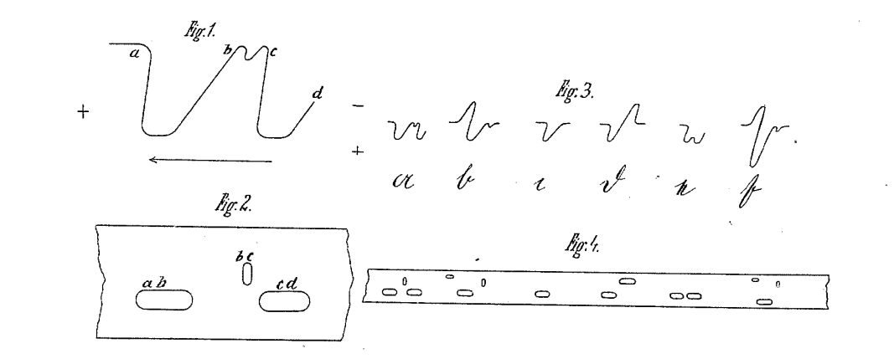

## Chapter 1: We Have Always Been Digital
Keywords: `digital, analog, binary, encoding, mediation`

### 1.0 Abstract

This chapter introduces the book's central themes and arguments, commencing
some of the historical work necessary to the development of a shared critical
vocabulary in use throughout. I argue that discourse around the digital
humanities needs a robust sense of the digital. Popular intuitions about the
"look and feel" of digital aesthetics suggest that sometimes the adjective
carries the connotation of "discrete," while at other times, it is used to mean
something more fluid and continuous, past the point of human perception. A
discussion of Liquid Crystal Display technology (LCD) flows into a section that
deals with digital representation from the perspective of analytic philosophy
and through the aesthetics of Nelson Goodman. My summary of that tradition
reveals that language and text are already in some sense "born digital," that
is "reproducible" and "differentiated" throughout. Furthermore, digitality
depends on "reliable processes of copying and preservation"---attributes that
can mean something different to a philosopher than to a librarian. From these
insights I take it that "being digital" is not an intrinsic ontological
condition, but rather a structure imposed from without. Case studies from the
history of telegraphy illustrate the concluding discussion on the nature of
binary and plain text formats, in a distinction that supersedes the dichotomy
between analog and digital media.

### 1.1 Digital Wake

What does the digital look like? It looks blue for one---not just any kind of
blue, but a particularly cool shade of pure blue, which passes from dark to
white, to translucent with starburst-like overtones. An online image search for
the word "digital" produces many sharp, sterile visuals of that kind.  Abstract
geometrical patterns predominate in the first dozen or so search results: often
forming curved, three-dimensional tunnels or lines that resemble circuit
boards. There are things too of course, cheap and expensive consumer things
like scanners, flash cards, circuit boards, and backup drives, but most of all
it is cameras---digital cameras, the very idea of which is meant to stand in
stark contrast to "traditional film photography." Few marketplace objects
exhibit such a strong sense of the opposition between the digital and the
analog as a consumer camera. These search pages also contain the outdated
clichés of yesterday's digital detritus: digital clocks, purple lightning
bolts, and the abstract chrome landscapes made widely available by graphic
editing software in the 1990s. There are numbers. The preferred arrangement is
in a torrential grid---the matrix---descending in the background, behind a
generic humanoid form, also translucent. Or better yet: alphanumeric characters
comprising a globe or a face. Ones and zeros are best arranged as an unending
string, which runs at a slight angle on the Z-axis and beyond the frame,
foregrounding whatever object that is meant to take on the digital as a
property: the digital wake.

When we constrict the image-search chronologically to the twenty-first century,
we see these cool-blue images give way to a more varied palette: bright prime
greens, yellows, and reds in retro-geometric pixelated shapes. Pixels take the
place of numbers here---not the small, invisible pixels of contemporary
computer screens, but the large and boxy pixels that by their very visible
boxiness flaunt the digital being of the image. Such an image alludes to the
time when pixels really did stand out as individual units---the technology not
being refined enough to produce the illusion of visual continuity. This faux
lo-fi aesthetic likely appeals to the romantic nostalgia many feel for the
early days of computing, and yet it also works as an assertion of independence
from that history. No longer shall the digital serve to emulate reality, nor be
judged merely by its degree of lifelike verisimilitude. The blocky world of
Markus Persson's *Minecraft* (2009) stands in antithesis to the magical realism
of Cyan's *Myst* (1995), the best-selling graphic-adventure PC game of the
twentieth century. Where the critics lauded the latter for its moody and
atmospheric photo-realistic environments, the former embraces the playful,
8-bit, low-fidelity aesthetic of gaming consoles from the 1980s. The
pseudo-pixelated world of Minecraft encourages its inhabitants to experiment
with deconstruction, producing cubist landscapes that foreground the
discontinuity of form and surface.

The iconography of the digital works in the other direction too, by approaching
and challenging the perceived continuity of the analog world. Liquid-metal
*Photoshop* font effects are thus supplanted by hyperrealistic renderings of
fire, smoke, and water: fluid elements that are by their very nature difficult
to render digitally, especially in movement. Digital alchemy approaches the
boundaries of technological possibility, but absent the constraints of realism
it pushes past reality, past nature, and past mere fidelity to the natural
world. A real-world explosion caught on film looks cheap in comparison to its
cinematic "special-effects" simulacrum. A blazing corporate logo rendered
digitally would lose much of its appeal were it produced by literally lighting
a logograph on fire. The burning digital logograph does not just say "We are
hot" or "We are on fire" (that would be too naive)---it says that our fire is
better than fire, more vivid and more lifelike. The digital fire is the ideal,
Platonic image of fire: an image that all fires should emulate.

I am eliciting these digital commonplaces to get at the conflicting popular
intuitions about "the digital" as something at once discrete, angular, and
therefore reductive and deterministic, but also shiny, smooth, perfect, and
liquid in the way that threatens to drown out and to transcend (instead of
reducing or determining) everything susceptible to the patina of time,
everything having distinct shape and anatomy. (Think here about the transition
between *The Terminator* and *Terminator 2*, where the "bad" robot that sets
out to destroy humanity is cast at first in the guise of an animatronic
mechanism, but then as an amorphous puddle of mercury that makes the original
mechanical Arnold look like a friend and savior. The first terminates with
shotguns and tire irons, where the second morphs into human shapes and pours
itself inside, threatening life from within.)

Like the terminators of yesteryear, digital sprites and bogeymen lose their
hold over popular imagination. Digital photography, digital clocks, and
digital humanities already ring archaic in their futuristic ambition, going the
way of e- or i- anything: the way of retro-suffixes like -bot, -mat, -lux, and
-tron.  The digital dissolves into the everyday as all clocks, all books, all
texts, and all human activity passes through some form of "digital being." My
aim here and throughout is to understand what is meant by its invocation: to
"come to terms," to make visible, to disturb it, to denature, and to make it
strange again.

### 1.2 Motion Blur

Televisions sold at the turn of 2010 started shipping with a feature called
"Motion-Compensated Frame Interpolation" (MCFI). The technology causes some
viewers to report what has been dubbed as the "soap opera effect": a condition
where even an expensively produced, big-budget film begins to look cheap and
unnatural. I am quite susceptible to this phenomenon: I can tell when MCFI is
in effect right away when watching something on someone else's television.
Everything in the dynamics of the shot looks somehow fake. The actors, even in
films that I've seen and love, appear to be acting. I no longer believe in
their characters as real people. I notice their makeup and their props and I
just know they are faking it. The sensation is akin to watching bad silent
cinema. The style of acting seems forced and over the top. One cannot imagine
people took *that* sort of thing seriously. The soap opera effect makes relics of
recent cinema.

The technology behind MCFI was developed in response to motion blur particular
to flat-panel liquid crystal displays (LCDs). LCDs work by passing light
through a liquid crystal medium, sandwiched between two polarized light filters
rotated at 90 degrees to each other. As light enters through one side, it
twists following the slightly curved molecular structure of the crystal,
allowing the beam to rotate and to pass through both filters. The structure
unwinds when it receives an electrical current, effectively blocking the light
from passing through the medium (into one, but not out of the other). By these
means, a series of small, pinhole-like pixels can be turned on and off to
create shapes, letters, and images on the screen.[^ln1-mishima]

[^ln1-mishima]: See @mishima_novel_2004.

![Liquid crystal in phase transition between polarizers. Schlieren texture
characteristic nematic phase to the left, and circular focal conic domains in
the smectic phase to the right. Image licensed under CC-BY-SA
3.0 [@polimerek_smectic_2004].](images/liquid.jpg)

Traditional film projectors advance from one frame to the next at a rate of 24
times each second to match the rate at which the film is captured by
traditional film cameras. The projector's light flickers two to three times per
frame to produce the effect of continuous motion, giving the projector a
"refresh rate" of 48–72 cycles per second, or Hertz (Hz). Without this strobing
effect, under continuous light, the succession of frames moving past the light
would appear as a blurry streak of undifferentiated images. An image persists
in the human visual field for about 16 milliseconds after cessation of a
stimulus, giving humans the temporal resolution of around 60 images per second.
Consequently, an average person begins to reach the state of "critical flicker
fusion," where the strobe light becomes unnoticeable at refresh rates higher
than 60Hz. At the limits of flicker fusion, the image begins to persist through
the gaps between frames, creating the appearance of continuous motion
[@efron_conservation_1973; @coltheart_iconic_1980; @brannan_applications_1992].
An LCD screen mimics the action of the analog projector by refreshing the
screen at intervals between 60 and 120Hz.

To complicate matters, human vision is more sensitive to rapid motion at the
periphery of vision, in a mechanism likely evolved to provide swift response to
predator attack [@burr_temporal_1981; @didyk_perceptually-motivated_2010]. As
humans move closer to their screens (as when sitting in front of a computer
monitor), more of the image enters the field of peripheral vision, making the
viewer more sensitive to screen flicker. Furthermore, being closer to the
screen increases the angular velocity of any depicted moving object. When
viewed from afar, the movement of several inches on the screen corresponds to a
change in the sight angle of several degrees, and likely a few millimeters of
iris movement. When viewed up close, the same several inches on the screen
represent a much larger angle, forcing the iris to move further laterally.

The human visual system is particularly adapt at tracking smooth, horizontal
movement, cognitively anticipating the perceived trajectory of a moving object,
while stabilizing the retinal image and keeping it at the center of the fovea
in what is called "smooth pursuit" lateral eye movement
[@rottach_comparison_1996; @purves_types_2001;
@didyk_perceptually-motivated_2010]. The "sample and hold" nature of the LCD
display frustrates the cognitive assumption of smooth movement. The object's
anticipated location does not correspond to its actual trajectory on the
screen, which appears to the eye as motion blur. To complicate matters further,
the phase transitions of the liquid crystal medium are not instantaneous. The
individual pixel "fades" instead of vanishing at once, leaving a physical (and
not merely a perceptual) trail of not-quite transitioned pixels in the wake of
object movement [@kurita_moving_2001; @pan_lcd_2005]. The motion blur is
exacerbated when viewing traditional film shot at 24 frames per second, since
even at high display sampling rates, the moving object appears at discrete
stationary locations punctuated by gaps in on-screen movement.

To compensate for motion blur, LCD manufacturers introduced MCFI, by which the
television itself inserts extra computed frames in between the original stock
footage. The extra frames should, in theory, make the motion appear more
natural, filling in the missing gaps that confuse the brain. Unfortunately for
the viewer, the effectively higher sample rates carry a major, unintended side
effect. Most viewers associate sampling rates of 40Hz and above with daytime
soap operas, which were, for a time, shot on lower quality video equipment as
opposed to expensive film equipment in use by the big-budget film industry.
Film is expensive because film cameras work by fixing the image onto the medium
through a photochemical process. Like traditional film photography, raw footage
must be developed and processed properly before it can be used for editing,
playback, and distribution. Video and more modern, digital recorders, by
contrast, transform light into fluctuations of the magnetic field, storing the
results on magnetic tape. The transducer (tape head) reads and writes directly
from and to tape, making magnetic storage significantly more compact and less
expensive than film, as it does not require chemical processing for playback
[@edgerton_columbia_2009]. Crucially for our story, video recorders operate at
60 frames per second, a recording resolution that together with a distinctive
color profile and audio aberration signatures give rise to what viewers
perceive as that "cheap video" look. By inserting extra frames into the moving
image, modern televisions in effect alter the expensive, slow format to match
its faster, cheaper video equivalent. The net improvement in sampling degrades
the perceived quality of the original. (It would be interesting to try to
create the reverse effect by reducing the fidelity of a "cheap" soap opera
video feed to 24 frames per second.)

The soap opera effect suggests a few questions for the media scholar.

First, it challenges the easy equivalence between "digital" and "discrete"
properties of the medium so often evoked in the critical literature. Another
mechanism must be in play here, since, according to accepted intuition, film
(the more discrete format of representation) is the one that more closely
approaches the analog (continuous) nature of observed phenomenon. Despite being
the more fragmentary medium, film is seen as the more analog format than video.
Under closer examination, film, usually discussed in the context of analog
formats, appears to be (in some aspects, as we will see) more digital than
digital video, particularly if "digital" is taken to mean "discrete" and
"differentiated." This incongruity points to a confusion in the common terms.

Second, it seems that the very material properties involved in our
understanding of "digital" and "analog" formats are also implicated in
higher-level functions of aesthetic judgment. Perception of quality in a given
recorded performance drifts with the vagrancies of encoding. "Good acting"
inexplicably falls apart with the introduction of extra frames.

Finally, where one would expect "artificial" digital discreteness to stand in
opposition to a measure of "natural" analog continuity, a thick description of
innate human perceptual apparatus reveals a complex patchwork of fragmentary
cognitive mechanisms, already to an extent digital and discrete in their
operation. At some level of analysis, gaps in the encoding format relate to
gaps in human visual processing. Neither can be said to represent reality with
perfect fidelity. Instead, brains and cameras stitch landscapes together from
an unevenly sampled landscape of variegated visual topographies, achieving a
measure of arbitrary synchronicity between human and machine.

Conventional notions of digital being further conflate the discrete nature of
digital media with human debasement, following the logic by which the perceived
material impoverishment in one sphere leads to the implied spiritual
impoverishment in the other.  The sentiment is everywhere in the popular press,
having deep intellectual roots in the history of thinking about technology.
Philosophers of technology from Heidegger to Kittler advance a powerful
"hermeneutics of suspicion" towards mechanization, digitization, and the
subsequent computability of human experience. To take that tradition seriously
is to direct hermeneutic suspicion to aspects of digital being that have
meaningful socio-political consequences.  If, as the case of motion blur
suggests, human experience is already and always "born digital," that is,
discrete and differentiated throughout, we must find ways of advancing critique
along theoretical distinctions that better capture the instrumental reality of
media practice. Nostalgia for "analog" oneness and continuity should itself
fall under the critical purview, examined alongside media marketing slogans
advertising gapless playback and lossless file formats.  Digitality, as I will
argue for the duration of the book, constitutes a part of the human condition
worthy of conservation. But, what I mean by "digital being" relates to the
practice of buying "digital cameras" or to promoting the "digital humanities"
in name only. To perceive what is at stake, we must do much more to
disambiguate digital cognates: electronic, binary, and computational.

### 1.3 Continuity and Mediation

Let us start with digital representation expressed more formally, as done in
computer science, aesthetics, and the philosophy of information.

The difference between discrete and continuous quantities defines the
conversation about digital media.[^ln1-maley] For example, in a popular book
about what a "well-informed person should know about computers," Brian
Kernighan writes about "analog" as something meant to convey "the idea of
values that change smoothly as something else changes" [@kernighan_d_2011,
526]. Much of the world is analog, Kernighan explains. A water tap, a pen, or
a car steering wheel are all examples of analog interfaces. For example, when
riding a bicycle, turning the handlebars one way results in a corresponding
motion of the machine. This motion is smooth. Compare that with the action of a
light switch. A properly functioning light switch takes on two discrete states
only: on or off. A range of pressure applied to the switch does not correspond
to any mechanical action of the lever. But once a certain threshold is reached,
the switch "flips" to change states. "Digital systems deal with discrete
values," Kernighan writes. The switch contains a limited number of state
possibilities (2), where the bicycle handlebars could be rotated in an infinite
number of minutely differing gradations.

[^ln1-maley]: See for example @maley_analog_2011: "The received view is that
analog representations vary smoothly, while digital representations vary in
stepwise manner. In other words, 'digital' is synonymous with 'discrete,' while
'analog' is synonymous with 'continuous.'" See also @kittler_there_1995,
"Confronted as they are with a continuous environment of weather, waves, and
wars, digital computers can cope with this real number-avalanche only by adding
element to element."

The philosopher Nelson Goodman (responsible for bringing the digital
conversation into the realm of aesthetic theory in the analytic tradition)
makes a further distinction in maintaining that digital systems must be more
than merely "discontinuous," but also "differentiated throughout." By contrast,
analog systems are "dense" and "undifferentiated to the extreme"
[@goodman_languages_1968, 159-164]. Written language and music notation, by
this definition, are digital systems par excellence, having the property of
reducing the undifferentiated, analog input (human thought) into discrete
semantic units (text or musical notation).[^ln1-goodman] Following Goodman's
logic one can reasonably maintain that the art of painting, unlike music or
language, cannot be reduced to the production of discrete semantic units, and
would be more of an analog system under the proposed definitions. In this
light, the language of cubist painting, which reconstructs shape into its
modular atomic components, can be viewed as an attempt to move painting from an
analog to a digital art form. The digital image, reduced to pixels of uniform
shape and size, takes the logic of cubism to its conclusion.

[^ln1-goodman]: Goodman differentiates between "syntactic" and "semantic"
density. Some notational systems like writing and the decimal system are,
according to Goodman, "syntactically differentiated but semantically dense."
The key distinction for him seems to be a "limit on the length of message," by
which I think he means something related to infinite divisibility. The decimal
system as a whole can continue to approach a quantity indefinitely, reaching an
arbitrary point of precision. The computer limits decimal precision to some
arbitrary "depth" of approximation, making it semantically discrete. I find
this part of the argument unconvincing.

An interesting corollary to the continuous property of analog systems is our
inability to duplicate their states exactly. I can approximate the pressure
someone else puts on their bicycle handlebars with some arbitrary measure of
precision that can never reach perfect reproducibility. This means also that
while more digital art forms like literature are, in some sense, perfectly
reproducible, analog forms, like painting, are not. Following a similar chain
of reasoning, the late great American philosopher John Haugeland amends
Goodman's foundational definitions of digital representation to include
"flawless copying and preservation." This property further has the effect of
freeing digital representation from its medium. A Rembrandt is bound to its
canvas in a way that Shakespeare's *Hamlet* is not. Digital systems are media
independent. *Hamlet* can be reproduced on paper or stone, in Morse code, or
bound in liquid crystal, and still be *Hamlet* in some natural understanding of
the work. To the definition of Goodman's digital systems, Haugeland therefore
adds the notion of "feasible procedures" that can lead to "positive and
reliable" processes for reading and writing digital tokens
[@haugeland_analog_1981, 213-225]. In the case of the soap opera effect, we may
think of film as something like an "irreproducible series of paintings" and of
video as "perfectly copyable magnetic facsimiles." (This would at least restore
film to the conventional understanding of analog formats.)

Writing more than a quarter of a century later, Matthew Katz offers two further
important addenda to the discussion between Goodman and Haugeland. First, Katz
maintains that Goodman's notions of discreteness and differentiation properly
affect the format and not the medium of representation. Second, he maintains
that the distinction between digital and analog formats could sometimes relate to the person involved, and not on the medium itself.
To illustrate these two amendments, Katz gives the example of an approximate
measuring system that uses a supply of marbles in a large beaker.  The unit of
measurement could be something like a "number of handfuls." Even though marbles
are a perfectly discrete medium, the system is analog because no convention is
established to reproduce a "handful" with any sense of precision. My
two handfuls will be different from another's. A corollary to the distinction
between medium and format, then, lies in the user's ability to perceive quantities.
The reader (viewer, listener) matters. Were humans endowed with the magical
ability to perceive the exact number of water molecules in a beaker, previously
analog systems (like unmarked beakers) would in effect become digital (under
the expanded definition). Similarly, were all humans endowed with hands of a
definite size and volume, "handfuls" would also be counted as discrete and
therefore digital quantities. From similar thought experiments Katz concludes
that the physical, perceptual, and cognitive capabilities of the "user"
(reader, audience, perceiver) affect the ontological status of the system
[@katz_analog_2008].

The movement from medium to user radically destabilizes Goodman's original
insight. Where Goodman begins with defining digitality in terms of physical
properties (divisible, or indivisible, dense, or continuous), Katz ends with it
as format imposed on matter from without. Undifferentiated matter like cake is
only analog until someone cuts it into pieces. Furthermore, the ontological
status of cake changes depending on the person doing the cutting. The cake is
more digital, in a sense, for someone armed with a laser cutter and a
microscope.  Similarly, painting can be thought of as a perfectly digital art
if we consider it at the scale of art gallery as a series of discrete,
replaceable, and reproducible frames(!) of canvas.[^ln1-art] What does it mean
to digitize text then when text is already, by some definitions, a digital
format?

[^ln1-art]: "Replaceable" and "reproducible" as in the sense that an art
gallery perseveres through the continual loss and rearrangement of its
constituent art works.

These conundrums reveal a problem in the very formulation of the question: What
*is* digital representation? Under examination, properties related to the
digital--analog distinction cease constituting an ontological category. Rather
than a state of being, they indicate a systematic imposition of structure. The
more appropriate question then is: What *makes* for digital representation?

From the instrumental point of view, to make something digital is to liberate
representation from its medium. To digitize means also to allow for "copying
and preservation," actions that, when taken outside of their philosophic
context acquire an immediate practical implication (for a librarian, for
example). That is not to say that digitization makes thought wholly ephemeral
or immaterial; rather, that it allows for the continual advancement and
transmediation of thought---the ability to change specific material contexts as
afforded by the very property of "media independence." Digitization, in that
sense, is a necessary prerequisite for culture (in the common sense of
"collective intellectual achievement"). Without digital portability, all
representation (art and knowledge) attaches itself irrecoverably to
untranslatable and irreproducible conditions of its material production.

The digital being of representation, initially seen as a property of the
medium, arises then as a political property regulating the very transmission of
thought. Text on paper or screen remains digital only in so far as the medium
is not fixed. Truly digital text can be copied and placed into other hands and
minds, feasibly and reliably. The possibility of these procedures is what
ultimately gives representation its digital form. A document restricted or
classified in any way loses some of the necessary preconditions for being
digital. This also means that technologies like "digital rights management"
(DRM), which work to fix representation into a specific medium, transform
digital content back into its media-dependent, irreproducible, and analog
forms. Another way to put it would be to say that on "protected" devices (like
proprietary e-book readers) the content is digital for some users and analog
for those without permissions to copy, share, and transform.

The word, already a discrete quantity, comes into digital being as form when
coupled loosely to its material contexts. Ontologically, text is by nature a
digital format: first because it represents discrete units of information about
the world, and second, because it allows for some measure of "flawless copying
and preservation." Copying and preservation constitute the logic compelling the
historical advancement of writing. But, also note that "flawless copying and
preservation" are in themselves contingent (not fully determined) properties of
writing. For example, imagine a world in which ideas forever "adhere" to their
brain-bound media.[^ln1-brain] Imagine also a society that positively prohibits the
transmediation of thought, on paper or between brain cells. Envision extreme
forms of thought control that restrict the very basics of speech and literacy,
prohibiting the manufacture of pens, paper, computers, photocopiers, voice
recorders, and word processors. Such prohibitions would amount to total
censorship. A radically analog society would also be wholly mute.

[^ln1-brain]: At the physical level, the process of textual remediation begins
at the brain, as when thoughts are initially transcribed onto paper.

Understanding digitality as a format imposed onto matter, a format that
facilitates transmediation, recasts the history of computing as something other
than simple "mathesis," the idea that computation reduces the world into more
discrete, and therefore computable, elements. That idea would be true if the
computer was simply a glorified calculator. But computers are not just that: in
practice, they reveal themselves as self-amending machines for universal
transmediation (not limited to numbers)---machines that, depending on the
user's acuity and dispensation to perceive text (and all information, really)
as deep structure, separate readers into those for whom texts exist as fixed
analog given, and those for whom they function as truly digital media, capable
of transformation affecting further texts, people, and machines. To paraphrase
a post-structuralist insight, the process of digital interpretation is in
itself a type of creativity, forever advancing rather than apprehending the
lateral movement of thought.

### 1.4 Binary Collapse of Space and Time

I submit another historical case study. Electrical engineers involved in the
development of the telegraph at the turn of the twentieth century fell into two
warring camps, in a conflict located precisely at the fault lines between
discrete and continuous representation.

Systems based on the neutral direct current design[^ln1-ndc] assumed current
flow for some elements of the encoding (like dashes) and absence of current
flow for others (like dots) [@welk_neutral_2000]. For this reason, it could be
said that although the Morse code family of alphabets amounts to a ternary
encoding system (using dots, dashes, and silences), under the conditions of
direct current it functions as a second-order binary encoding. Systems based on
the alternating current design converted Morse code (and other encoding
systems) into pulses of alternating positive and negative current, where
positive current could stand for "dashes" and negative for "dots." Where the
direct current designs preferred the use of non-sinusoidal, "square"
periodic waveforms to represent binary states, literature on alternating
current design often argued for the use of a sinusoidal signal, which could be
more easily modulated into a multitude of states beyond binary
[@crehore_practical_1900; @hausmann_telegraph_1915, 374]. Consequently,
alternating current designs tended towards the transmission of continuous
quantities like images and cursive handwriting. The very visual form of the
sinusoidal curve suggested a connection to natural, organic shapes, like
handwriting, in a visual analogy between text and signal.

The Pollak-Virag telegraph that Bernhard Siegert mentions in his seminal essay
on German media theory was one such device.[^ln1-virag] The original
Pollak-Virag machine, patented in 1900 (and filed in 1899), proposed to send
regular (ternary) Morse encoding by means of alternating current of two
different polarities and two different strengths, for a total of four types of
signals (see Figure 1).[^ln1-siegert] Other than the irregular signal shape and
the use of alternating current, the Pollak-Virag encoding differed little from
single-Morse systems. By 1901, however, the authors were issued an American
patent for the "Writing Telegraph," which builds on their previous design in an
interesting way. Rather than using a wave in four steps, the authors propose an
"automatic transmitter capable of sending current impulses over the line which
correspond to the direction and the size of a single letter element"
[@pollak_writing-telegraph_1901, 3]. In other words, they wanted to bend the
sinusoidal wave to correspond roughly to the shape of the letter (see Figure
2).


On some level, then, the Pollak-Virag encoding constitutes a sort of an
unbroken, electrical alphabet. The electrical signal, in this case, makes for a
smoothly varying quality, intended to "trace in a substantially continuous
unbroken outline the written letters composing the matter transmitted"
[@pollak_writing-telegraph_1901, 1]. The perforated tape "driving" the signal
does, however, reduce notions of continuity into distinct perforations, which
break letters down into their individual constituents.




The metaphysics accompanying telegraph communication at the time display an
anxiety about the role of the human in this process, where notions of material
discreteness and continuity are extended from the underlying physical structure
of communication to implicate higher-order cultural (and even ethical)
categories. Arguing in opposition to the sine-wave camp, Donald Murray writes:

> Certainly if Smith wants to make Jones spin round like a dancing Dervish, the
best way might be for Smith to transmit sine waves […] but in practice Smith
always wants to make Jones perform an excessively complicated and irregular
series of motions, and for this purpose it is essential to transmit similar
motions by introducing upper harmonics in a fragmentary, non-periodic, and very
irregular way [@murray_setting_1905, 559].

Being periodic (and therefore, repetitive), the continuous sine wave is too
regular to answer to the diverse needs of human culture. Dance, in Murray's
articulation, can also consist of a series of irregular, fragmentary, and
non-periodic movements, much better captured by the discrete undulation of the
square wave.[^ln1-dervish] Writing for the Swedenborg-inspired *Spiritual
Telegraph*, an anonymous author unfolds normative neoplatonic rhetoric in a
similar argument on the importance of discrete differentiation:

> Whenever two persons are brought into sympathetic relations, either by
corporeal contact or through those refined media which pervade the Universe and
serve as the airy vehicles of thought, they mutually feel the presence of each
other, while the mind which is gifted with the greater degree of activity and
power at once becomes the proximate cause and fountain of inspiration to the
other. Thus from sources superior to ourselves, the very elements of life and
thought flow into us, and every living thing, according to its nature and
discrete degree, derives a kind of inspiration from that which is above. In
order to facilitate the transmission of impressions in this way, the recipient
must be willing to receive instruction and assume the passive or negative
relation of a learner; otherwise he will be likely to resist, unconsciously,
the infusion of foreign impressions and Divine ideas [@brittan_spiritual_1854,
169].

Following Swedenborg, the telegraph spiritualists conceive the discrete quality
of human experience as essential to the Christian hierarchy of the
universe.[^ln1-swedenborg] To deny step-wise ordering of "refined media"
pervading the universe is to close oneself off to the "transmission of
impressions," in a communication act (consisting of a "contact" and the
exchange of signifying "thought vehicles") between "source superior" and the
"receiver of instructions," placed in a binary and opposing relation
("negative" but without "resistance") to the idea of the divine. Continuity
mixes the sacred with the profane. For the spiritualist, a truly Christian
order must remain digital. To maintain otherwise would be Gnostic heresy
[@edwards_neglected_1990; @shaked_dualism_2005, 52-71].

Following Kant, it is common for contemporary cultural critics of computation
to associate the digital, discrete view of the universe with determinism and
its consequent threat to the idea of free will.[^ln1-golumbia] The telegraph
spiritualists instead associate determinism with continuity. Witness George
Dole writing in his Philosophy of Creation:

> Scientists have prosecuted research on the plane of continuous degrees of the
ultimates, and they have thereby failed to penetrate to interior things of
discrete degree. Consequently they derive life as not from the Lord, but from
nature, of which they have no other idea than that it is something mechanical
[@dole_philosophy_1906].

Neither camp can ground their claims in the material contexts of media
production (or in cognitive phenomenology). Nothing in the operation of the
Pollak-Virag telegraph gives us reason to posit either analog or digital
representation as somehow more or less essential to the human experience.
Instead, in reconstructing the long chain of transcoding and transmediation we
observe a hybrid system at once fluid and mixed with discrete meaning-carrying
entities, down to the level of underlying cognitive structure (of human
perception). Rapid phase shifts between discrete and continuous representation
in themselves constitute the instrumental purpose of the device.

It is tempting to think of the telegraph as a digital [*sic*] apparatus,
created to convert analog [*sic*] input into electric signal. Much technical
literature on the subject makes that simplification.[^ln1-tele] The innards of
the Pollak-Virag telegraph reveal a more complicated mechanism---one that involves
multiple shifts and transformations. On some level, language, already a
discrete and portable representation of mental states, which in themselves
stand in a complicated and fragmentary relationship to sensory phenomena,
undergoes a number of further material-phase transitions. In the writing
telegraph, this involves what I have been calling transmediation: from
notebook to paper tape, to the movement of an electromagnetic vibrator, to the
recording mirror galvanometer, into copper wire, to the receiving vibrator, and
into the machinations of the printing apparatus that once again produces ink
and alphabet. In changing material contexts, language also undergoes multiple
changes of encoding: here, from script to perforation, into vibration, to the
shape of the sinusoidal electrical impulse, and back out through a series of
transformations into script.

By "encoding," I mean a "controlled system of representation." Representation
in its unrestrained form (as in "pictorial representation") differs from
"encoding" in the size of its vocabulary. Painting and other forms of
uninhibited representational conventions are limitless in their expressive
possibility. The "language" of painting is infinite, in other words. Encoding,
by contrast, reduces the universe of possibilities to a limited set of salient
"codes," like the alphabet. These codes have a formal grammar and rules of
composition. Although the expressive potential of written language is
limitless, in some combinatorial sense of the word, language and other codes
can "break," that is, be reduced to nonsense, in a way that painting cannot. A
telegraph of the single-Morse type accepts alpha-numeric characters at first
and then translates them into a system of signals, expressed in time intervals
(between the synchronization tone and the activation of the key).

It becomes clear from the description of early telegraph encoding systems that
transcoding and transmediation relate to each other somehow. On one hand, all
changes between encoding systems necessitate material phase transition, if not
from one type of medium into another (from paper to magnetic storage, for
example), then from one specific material context into another (as when one
merely translates from French into English on the same piece of paper).
Transmediation, on the other hand, may or may not involve a change in encoding
formats, although it frequently does, as when language on paper is transformed
into the pulsations of the electrical signal in Morse code. In reading and
playing music, a musician furthermore transforms musical notation---a
controlled, paper-bound vocabulary---into sound representation, the movement of
molecules unlimited in its expressive potential.

Blueprints for the writing telegraph reveal a device that mixes discrete and
continuous modes of representation, through multiple acts of transcoding and
transmediation. Digitality, in that sense, is besides the point. The telegraph
is a device that pushes language, normally bound to air (as speech) and paper
(as a writing system), through water and metal. Even today, deep beneath the
sea surface, telegraph lines ferry messages from continent to continent. And at
each end of the telegraph cable is a transmediation device that makes media
transference possible. I use the word "media" here in the bluntest way
possible: as "material basis" or "substratum" for some observed, higher-order
phenomenon (in our case, communication).

As information was compressed and pushed through the wires, it underwent a
number of transformations. Donald Murray, the inventor of the Murray alphabet,
conceived of that transformation in terms of movement from space to time.
Unfolding something like the "metaphysics of telegraph signalling alphabets"
(his words), he describes spatial writing symbols that "appeal to the eye," and
temporal, "telephonic" signals that "appeal to the ear." Paradoxically, space
signals (like a signboard) occupy little space, but persist in time. "For
instance, a signboard may extend over 10 feet and 100 years," Murray writes.
Time signals are ephemeral by contrast: "a Morse signal in a wire may extend
over half a second and 500 miles" [@murray_setting_1905, 86].

The turn of the twentieth century represents a pivotal moment in the
development of universal Turing machines. The advent of removable storage
media---control cards and ticker tape---allowed for the automation of the
telegraph. Following the invention of Morse code in the first half of the
nineteenth century, a number of formats were proposed to encode human languages
into binary formats that rely on signal modulation for transmission. As
telegraph communication spread across national boundaries, agreements were
needed to standardize conventions for equipment and message encoding
[@international_telegraph_union_journal_1899, 82-91]. Such agreements were
handled on a regional, ad-hoc basis until 1865, with the creation of the
International Telegraph Union (ITU). The International Telegraph Conference in
Paris, held between March 1 and May 17 of 1865, adopted the use of a modified
Morse code character set, containing 33 Latin letters (including characters
from the French, German, and Spanish alphabets), 10 numbers (0--9), 14
punctuation marks (including a fraction bar), and 10 control codes (including
"end of service," "attention," and "error"). Significantly, the ITU also set
international tariffs related to telegraph communication
[@international_telegraph_union_documents_1865]. During the International
Telegraph Conference in Lisbon, held in the summer of 1908, the ITU specified
two additional formats: Hughes and Baudot.


The Hughes telegraph, an 1855 design modification of an 1846 telegraph invented
by the American Royal E. House, was a capricious machine that relied on a
tuning mechanism to transmit individual characters. Inspired by the player
piano, the Hughes telegraph even looked like a piano, complete with a keyboard
and a rotating drum, commonly used in music boxes. The sending device struck a
tone which, when transmitted by electrical current, would initiate the rotation
of a similar drum in the receiving apparatus "at the pleasure of the distant
operator," in Hughes's words. The length of time between the initial
synchronization signal and the struck chord corresponded to a letter, which the
machine then printed to tape using a letter wheel. Hughes referred to the
device as a "Compound Magnetic and Vibrating Printing Instrument"
[@hughes_improvement_1856; @hayles_print_2004, 145-147; @noll_evolution_2007,
20-21], a name that already hints at the fragility of the device.

Morse code, co-developed between a number of American and British inventors in
the first half of the nineteenth century, had the advantage of an encoding
scheme that did not rely on device synchronization. The 1865 ITU rules require
a silence equal to three dots (same as one dash) to indicate the space between
two letters, and a silence equivalent to four dots (later changed to seven) to
indicate the space between words. Although Morse code can be expressed in terms
of ones and zeros (binary), it is technically a ternary code making use of at
least three elements: dots, dashes, and silences of various length.
Furthermore, note that Morse code is a "variable length" format, where
characters are encoded in sequences (of dots and dashes) that vary in length:
from one dash for "T" to six dots for "6." This property had made Morse code
ill-suited for automated telegraphy. In a long-chain of mediation between
message, telegraph operator, and machine, the human proved to pose a limiting
factor.

Writing in 1929 for the journal *American Speech*, Hervey Brackbill laments the
demise of a language associated with human-driven, Morse code telegraph
operation. "Morse telegraphy is commonly referred to as a 'game,' and the
operator 'works a wire.'" The operator tapping on a semi-automatic key "uses a
bug." Brackbill writes, "the first instruments, with their long slender levers
and springs, looked very much like a sprawling bug." They have trade names like
"Lighting Bug," "Gold Bug," and "Cootie" (for a small model)
[@brackbill_telegraphers_1929, 287-288]. Operators using "straight keys"
achieved speeds upwards of 25--30 words per minute, limited by the shortest
possible length of the smallest transmitted unit (a dot), fixed by the American
and the International Morse Code conventions to 1/24 of a second in duration.
The physical limits of the code suggest a theoretical upper limit for
transmission speed of around 49 words per minute---a rate further limited by
the operator's manual dexterity [@mcnicol_american_1913, 207;
@u.s._bureau_of_labor_statistics_displacement_1932; @halstead_genesis_1949].
Telegraph operators working a "hand sender" commonly developed partial
paralysis of wrist or arm, commonly known as a "glass arm"
[@brackbill_telegraphers_1929;
@u.s._bureau_of_labor_statistics_displacement_1932]. In his 1949 paper on "The
Genesis and Speed of Telegraph Codes," Frank Halstead notes that "the practical
upper limits of speed will also be limited by the ability of some human beings
to operate a keyboard, until such time as electrical connection be made direct
with the receiver's central nervous system" [@halstead_genesis_1949, 451].

A sender is a "ham" or a "bum" when he "falls down" or makes errors in sending.
To "put someone under the table" in sender's lingo is to transmit faster that
the receiver can transcribe. The "reader" is "burnt up" when he falls behind.
He has to "break," or interrupt the sender to ask for repetition. To "paste"
someone meant to transmit at high speeds to deliberately burn him up or put him
under the table [@brackbill_telegraphers_1929]. Around the turn of the
twentieth century, companies like Western Electric, Mecograph, and Vibroplex
began manufacturing semi-automatic keys, which made use of a horizontal switch
capable of emitting a rapid succession of dots to one side of the action, and
dashes to the other [@martin_telegraphic_1904; @boyd_telegraph-key_1916]. A bug
was said to "run away" when adjusted for too high of a speed. The Vibroplex
keys would significantly alter the “fist,” or the transmission style of the
operator, allowing for speeds that approached 50 words per minute (and above,
if not following the minimum signal length specifications)
[@mcnicol_american_1913, 209; @halstead_genesis_1949].

By the 1930s, devices variously known as "printer telegraphs,"
"teletypewriters," and "teletypes" displaced Morse code telegraphy as the
dominant mode of commercial communication. The monthly "Labor Review" report
published by the U.S. Bureau of Labor Statistics in March of 1932 estimates
more than a 50 percent drop in the number of Morse code operators between the
years of 1915 and 1931. Morse operators referred to the tele-typists on the
sending side as "punchers" and on the receiving side as "printer
men."[^ln1-printermen] The printer men responsible for assembling pages from
ticker tape were called "pasters" and sometimes, derisively, as "paperhangers"
[@brackbill_telegraphers_1929]. Where, in the Morse code machine, a
human-operator was responsible for translating language into code, teletype
automated the process completely. The human operator could simply enter printed
characters into the machine directly, using a keyboard. The teletype would then
transcode the input into transmitted signal and then back from the signal onto
paper on the receiving end.

[^ln1-printermen]: According to the U.S. Department of Labor statistics, women
comprised 24 percent of Morse operators in 1915 (before the wide-spread advent
of automated telegraphy). By 1931 women comprised 64 percent of printer and
Morse manual operators [@u.s._bureau_of_labor_statistics_displacement_1932,
514].

The automation of the telegraph necessitated new encoding formats, chief among
them the Baudot code, standardized in 1908 by the ITU. The significant
difference between Hughes and Morse encodings on the one hand and Baudot on the
other remains the fact that Baudot constitutes a fixed-length code. The
invention of fixed-length ciphers lies in the sixth book of Francis Bacon's *De
augmentis scientiarum* (*Division of the Sciences*),[^ln1-bacon] an encyclopedic
treatise on the "partition of sciences" written in the form of a letter to King
James in 1623. Book Six of Bacon's systematic account of the sciences is
dedicated to speech, speaking, writing, grammar (literary and philosophical),
poetry (meter and verse), and, most relevant to our discussion, "the knowledge
of ciphers." Here Bacon boasts of inventing a "highest degree of cipher” that
can signify "all in all" (omnia per omnia). Bacon proceeds to describe a
"fivefold," "bi-literarie” alphabet, which encodes each letter of the English
language using a string of As and Bs five-letters long. The letter A, for
example, becomes "aaaaa." B becomes "aaaab," C "aaaba," and so on to Z,
represented as "babbb." "Neither is this a small matter," Bacon writes:

> These Cypher-Characters have, and may performe: For by this *Art* a way is
opened, whereby a man may expresse and signifie the intentions of his minde, at
any distance of place, by objects which may be presented to the eye, an
accommodated to the eare: provided those objects be capable of a twofold
difference only; as by Bells, by Trumpets, by Lights and Torches, by the
report of Muskets, an any instruments of like nature [@bacon_advancement_1987,
266].

Although the discovery of binary arithmetic rightly belongs to Gottfried
Leibniz, who, influenced by hexagrams in the *I Ching*, articulated his own
system in his *Explication de l'Arithmétique Binaire* (written in 1679 and
published in 1703) [@leibnitz_explication_1703], Bacon should take the credit
for articulating a system for fixed-length binary encoding. His "two-fold
difference" did have the effect of enabling humans to "express and signify"
thoughts at virtually "any distance and place." The fixed-length property of
Bacon's cipher, later implemented in the 5-bit Baudot code, signaled the
beginning of the modern era of serial communications
[@jennings_annotated_2004]. Baudot and the related Murray alphabets
[^ln1-murray] were designed specifically with automation in mind. Both being
fixed-length alphabets, the Baudot in particular did away with the "unison"
signal that separated letters in Morse, since the signals could be divided into
letters by count (every five codes representing a single character).
Additionally, the Murray code was more compact than Morse and especially more
economical than Hughes, which used up to 54 measures of silence to send a
signal representing double quotes.[^ln1-zero] The signal for "zero" in Morse
code occupied 22 measures. By contrast, all Baudot and Murray characters were a
mere five units in length, with the maximum of ten used to switch the receiving
device into "figure" or "capital letter" states (for the total of ten units)
[@murray_setting_1905; @beauchamp_history_2001 380-397].


As the volume of transmissions increased, human operators were simply not fast
enough to keep up with the demand of encoding and decoding messages into and
from Morse code. The rise of printing telegraphs answered the demand of
increased information exchange. The great variety of printing telegraph designs
at the turn of the twentieth century all attempted to solve the problem of
automating the encoding and decoding mechanisms of transmission, with the goal
of speeding up and increasing the volume of possible communication.[^ln-cables]
Murray writes: "It is the object of machine telegraphy not only to increase the
saving of telegraph wire […] but also to reduce the labor cost of translation
and writing by the use of suitable machines" [@murray_setting_1905, 557].
Baudot's and Murray's codes were not only shorter, they were simpler and less
error-prone, resulting in less complicated and more durable devices. By the end
of the nineteenth century a number of devices were in use internationally,
making it possible to decouple the real-time encoding of text into code from
the operation of the machine. A tape containing the message could be prepared
in advance, fed into the telegraph, and printed in human-legible form on the
receiving end.

Several engineering solutions emerged to transcend the limits of human
information processing. The automated printing telegraph decoupled encoding
from transmission. It then became possible to prepare messages in advance, in
volume, and to run the messages through a machine without human assistance. At
that point, telegraph diverged from the telephone to become a device of
asynchronous communication, displacing the act of communication in time as it
did in space. But even with the advent of removable storage media, the
bandwidth, or the "information density," of the system was limited by the
number and the size of available cables. Independent developments in
communication technology led to a range of techniques known as
"multiplexing"---ways of sharing the same wire to send multiple messages.
Multiplexing at the time fell into two broad approaches: time-division and
pulse-amplitude modulation [@rowland_multiplex_1901; @hausmann_telegraph_1915].
Pulse-amplitude modulation involved filling the available space (bandwidth)
with simultaneous signals of different types: sending multiple signals at
differing frequencies that shared the same channel.[^ln1-multi] Pulse-amplitude
modulation was difficult to implement initially. Cross-channel noise and device
sensitivity hampered reliable reception and decoding across multiple
simultaneous wave frequencies.

Emile Baudot was one of the first engineers to notice that the prevailing Morse
and Hughes telegraph systems failed to make full use of the time allotted for
message transmission. The Hughes code in particular made extensive use of long
silences, which could be condensed to extract more utility from the channel.
Baudot-type multiplexers made use of synchronized rotating mechanisms both of
the sending and the receiving end, to distribute units of time among multiple
operators. Figure 6 shows a scheme for a duplex printing telegraph, for
example. A single rotation of the synchronization device (known as the
"distributor") was thereby divided into two units of five segments each, each
corresponding to a distinct channel of communication. Two operators could
therefore share the same channel to transmit two different messages.


The maintaining of unison became of paramount importance in such multiplexed
systems. The operators of a time-shared device needed to know when it was their
turn to type. The Baudot multiplexer made use of a time- or cadence- "tapper"
mechanism to indicate turns to individual operators, and in some devices,
locking the keyboard to prevent out-of-turn input. In a quadruplex system up to
four operators would engage in an intricate dance of fingers, keys, tappers,
and signals, synchronized by the rotation of the telegraph distributor.

Synchronization was also needed for Morse code devices, to distinguish
non-meaning carrying silence (the receiver is turned off) from the
meaning-carrying one (the receiver pauses to indicate a dot). The receiving
device needed a measure (duration) of silence to differentiate between "dots"
and spaces between words, both indicated by silences of different length. But
if the devices went out of sync, or if communication lagged for some reason,
the coherence of the message faltered. Sending and receiving machines had to be
tuned to a cadence of common information exchange. The system of operators,
transmitters, and receivers, was, in aggregate, tuned to a specific but
arbitrary rhythm by which certain messages made sense only in particular (also
arbitrary) units of time. In early telegraphy, these units of time were slower
than natural human time, enough so for the operator to remain idle. Later
systems increased the pace to a rhythm beyond natural human abilities of
comprehension, to a point where human operators could no longer decipher the
signal without machine assistance. In the language of wiremen, the bugs were
"running away with" the whole "game" [@brackbill_telegraphers_1929, 288].

[^ln1-siegert]: Siegert takes the Virag as an "apocryphal emblem" of a
"systematic logic in the dominant cultural technique," representative of the
"order of digital signals" [@siegert_cacography_2011, 41]. Although not
concerned with the history or philosophy of digital media explicitly, Siegert
suggests that the writing telegraph symbolizes the cleansing of "the noise of
all graphic form." His theory of cultural techniques instead creates "an
awareness for the plenitude of a world of as yet undistinguished things, that,
as an inexhaustible reservoir of possibilities, remain the basic point of
reference for every type of culture" [@siegert_cacography_2011, 35].

[^ln1-virag]: The Pollak-Virag device also proposed an "electromagnetic
vibrator" coupled to a recording "mirror-galvanometer." The authors further
specify for "the vibrator on the receiving instrument [to] vibrate in harmony
with these impulses, vibrating in one direction or the other, according to
their sign and to an extent depending on their intensity" [@pollak_means_1900].

[^ln1-dervish]: One could make more of the Dervish being used here as a
negative example, in an instance of colonial gaze. But Murray himself was an
empire outsider, born in the small, remote town of Invercargill, New Zealand (a
town that also happens to be one of the southern-most cities in world). "I am a
child of the Southern Cross," he writes in *Philosophy of Power*, "and I have
no preordained respect for geniuses born under the Northern constellations" [@murray_philosophy_1939, 51].

[^ln1-swedenborg]: See @swedenborg_treatise_1778, regarding the "gross error of
those who assert the materiality of the soul, affirming it to be homogeneous,
and continuous with the body; whereas it is heterogeneous, and discrete" (24).
Swedenborg gives the neoplatonic, monistic articulation of the matter to the
angels, in the "Angelic Idea of Creation," writing "The question was asked,
'Whence, then, is hell?' They said, 'From man's freedom, without which a man
would not be a man,' because man, from that freedom, broke the continuity in
himself; and this being broken, separation took place; and the continuity,
which was in him from creation, became like a chain, or a piece of linked
work, which falls to pieces when the hooks above are broken or torn out, and
then hangs down from small threads. Separation or rupture was brought about,
and is brought about, by the denial of God" [@swedenborg_apocalypse_1901, 290].

[^ln1-golumbia]: See @golumbia_cultural_2009: "Following a line of criticism
that extends at least as farm back as Kant [...] (loc. 63)." Paraphrasing
@deleuze_postscript_1992, Golumbia writes "To submit a phenomenon to computation is to striate
otherwise-smooth details, among details, to push upwards towards the sovereign,
to make only high-level control available to the user and then only those
aspects of control that are deemed appropriate to the sovereign (loc. 159)."

### 1.5 What Is It Like to Be a Telegraph

I am tempted to believe, like others have before me, that I am on my way to
enacting something like "machine phenomenology" or "systems phenomenology" in a
system which encompasses people, texts, techniques, and technologies. In such
cases, astute readers often reach for Jakob von Uexküll's *A Foray into the
Worlds of Animals and Humans*, to borrow from his notion of perceptual worlds
(umwelten).[^ln1-umwelten] In his forays, Uexküll imagines a multitude of alien
ways of seeing the world, from that of a sea urchin to those of a pea weevil
and the ichneumon wasp. For Uexküll, the task of the biologist is not to
encounter such living things as unfamiliar "machines" in the human world, but,
rather, to occupy the alien life form as another subject. The tick should not
be looked at as yet another machine, Uexküll writes, but as an "operator"
[@uexkull_foray_2010, 44-53]. Consequent to this point of view is Uexküll's
insistence on the subjectivity of perceptual experience. The tick carries with
it its own sense of time and space, which the biologist recovers through the
description of its perceptual apparatus (What can this organism perceive?) and
therefore by reconstructing its projected world view (What does a stimulus mean
for this organism?). In this way, the subject establishes what Uexküll calls a
"circuit of meaning." The canopy of an oak tree, for example, acts in unison
with material properties of rain to capture and distribute liquid down to the
roots of the tree. Capturing and distributing liquid to the roots constitutes,
in that sense, the "meaning" of the oak--rain circuit. It is a peculiar notion
of "meaning" to be sure, but for Uexküll it is enough to maintain that meaning
arises out of the subject's interaction with its environment. The subject and
object are brought into what Uexküll calls harmony:

> If the flower were not bee-like  
> If the bee were not flower-like  
> The harmony would never succeed [@uexkull_foray_2010, 198].

Similarly, the pea and the pea weevil achieve harmony through "meaning
transfer" between the pea and the weevil larvae, which allows the larvae to
prepare an escape hatch through vegetative matter in advance of its pupation
[@uexkull_foray_2010, 161].

[^ln1-umwelten]: See for example @agamben_open_2003, 39-49; @hayles_print_2004,
16-17.

The literature of post-humanism privileges these moments of alien subjectivity
because they destabilize an anthropocentric view of the world. What gets lost
in the shifting of perspectives is the apparent contradiction at the very core
of what the writer Dorion Sagan (rightly) calls "Gaia sciences"
[@uexkull_foray_2010, 12], the idea ascendant in diverse fields from literary
studies to information theory and free-market economics, relegating meaning
creation from the level of the subject to the level of complex system.
Paradoxically, because Uexküll's model of communication makes meaning available
only at the system level ("oak plus rain" or "bee plus flower"), it is never
available to the subject itself (bees or flowers). The quest for alien
semiotics leads only to, in Uexküll's own words, "mute interaction"
[@uexkull_foray_2010, 148], meaningful only from some vantage point outside of
the system. The forest always "understands" more than the tree, the planet more
than the forest, and so on, in a regression that can only conclude with
whole-universe monism: the One.

In his essay on the subjective experience of bats, Thomas Nagel concludes that
there must be something about the experience of a bat *for* a bat
[@nagel_what_1974, 439] that is not fully accessible to human description. The
attempt to describe things in-themselves for-themselves, in that light, seems
like yet further human hubris. Accepting the meta-human "systems" view of
meaning formation would mean also to acknowledge the limits of the human to
comment on the proceedings---lest the organ speak for the organism. And to
encounter the bat (a dog, a tree, a machine) from the perspective of the human
is to respect and to retain a measure of the other's ineffable alienness. There
is a quiet humanism in Nagel's suggestion that we should confine our remarks to
objective phenomenology, not dependent on the self-deceiving acts of the
imagination [@nagel_what_1974, 449]. After all, one can never truly become a
bat or a tick.  We can only imagine what it is like to be a bat *for* a human.
"Certainly it appears unlikely," Nagel writes, "that we will get closer to the
real nature of human experience by leaving behind the particularity of our
human point of view and striving for a description in terms accessible to
beings that could not imagine what it was like to be us" [@nagel_what_1974,
444]. Nagel suggests: "Though presumably it would not capture
everything, its goal would be to describe, at least in part, the subjective
character of experiences in a form comprehensible to beings incapable of having
those experiences" [@nagel_what_1974, 449].

I do not know what a truly objective phenomenology would look like, but I would
like to think that it would lie, at least in part, in the underlying material
conditions of perceptual media. I am able to advance an equitable description
of the system from the only perspective available to me. These blueprints and
diagrams are all we have to understand the ways in which the system affects its
constituents. Paying attention to the details of the schematics is the only way
to "dig" ourselves into something like an alien phenomenology. As the
humanities move in search of the digital, I find that they need to regain a
sense of the human. No perspective is available otherwise from which to enact
analysis or critique. Once recovered, that Archimedean point of leverage can
serve as a starting point for the work of de-naturalizing comfortable (if
calcified) notions of the digital. It is in this de-familiarization (in a sense
used by Viktor Shklovsky and Svetlana Boym) of the human that I see Uexküll's
contribution to the study of media phenomenology. The human disappears from
view not by some inevitable property of technological progress, but through
automation of experience. In refracting ourselves through the gaze of the
technological other we see the human world anew.

From this perspective, electricity---the "language" of wires---is not a media
format intended for human consumption. One could learn to understand telegraph
intercourse through electrocution, by applying the wire directly to the skin.
Direct brain--computer interfaces promise to do more or less exactly that and
are common enough today to be turned into a toy.[^ln1-mindflex] The early
efforts in this space implanted electrodes into the brain directly to capture
single-neuron activity, or relied on imprecise "noisy" electroencephalographic
(EEG) scalp activity. In 2004 a team of scientists developed a way of
controlling "a one-dimensional computer cursor rapidly and accurately" using
electrocorticographic (ECoG) activity recorded from the surface of the brain
[@leuthardt_braincomputer_2004; @miller_spectral_2007]. And in 2015, a
quadriplegic woman piloted an F-35 Joint Strike Fighter using her brain in a
simulation developed by the University of Pittsburgh's Human Engineering
Research Laboratories in collaboration with the Defense Advanced Research
Projects Agency (DARPA) [@collinger_collaborative_2014; @prabhakar_how_2015].
Advances in brain--computer interfaces suggest also the not-all-too-distant
possibility of computer--brain interfaces (in a reversal of the direction),
completing the loop between human and machine. This may also imply the
possibility of communicating brain-states directly, without the mediation of
text or sound. However futuristic that possibility may seem to us today, it is
merely a small evolutionary step in a long history of brain-to-brain
interfaces, already mediated by paper, ink, code, and silicon. The digital
world of paper and ink holds no less magic.

I return, then, to the subject of time, found throughout in the background of
this chapter. The popular imagination of digital machines belies a deep sense
of anxiety about the rhythm of the system as a whole, in which humans play only
a small part (as bug operators, users, or receivers). Telegraphs and
subsequently computers force an atomization of experience into discrete bits,
along with the opposite movement toward continuity fluid and rapid enough as to
move beyond the boundaries of human perception. Attention to the material
conditions of removable storage media reveals a delicate negotiation of
synchronicity between human and machine time, in a complex chain of encoding
and re-mediation that connects differing and incongruent perceptual apparatus.
Under these conditions, it would be a mistake to conflate digital and discrete,
just as it would be a mistake to reduce the human to the continuous.[^ln1-cont]
Homeostasis is found at some arbitrary point, contingently connected to human
biology and to current technological capability. The question of "What
constitutes a moment?" when watching television or reading a book, can become
then, "What *should* constitute a moment?" For the tick lying in wait for its
next warm meal, a moment can last for decades (Uexküll reports up to 18
years). "Time, which frames all events," Uexküll writes, "seemed to us to be
the only objectively consistent factor […], but now we see that the subject
controls the time of its environment" [@uexkull_foray_2010, 52]. The
computational environment before us constitutes the grounds for all
higher-level textual activity, from record keeping to poetry and software
development. From the textual grounds of human--machine interaction it then
becomes possible to derive poetics, in the sense of a study and an art of
creating one's own time: taking control of prosody, rhythm, meter, and cadence.

[^ln1-ndc]: Also known as the "single current" or "single Morse" system.

[^ln1-bacon]: This volume is also commonly translated as "Of the Dignity and
Advancement of Learning," following the Spedding edition. The first two books
of *The Advancement* appeared first in 1605. Together with books 6-9 published
in Latin in 1623 they are sometimes referred to as "Of the Advancement and
Proficience of Learning or the Partitions of Sciences," following the Oxford
1640 edition. I will follow the 1640 English edition here. Volume 10, in the new
Oxford Collected Works, containing *The Advancement*, is not out at the time of
my writing this chapter (2015).

[^ln1-murray]: The Australian Donald Murray improved on the Baudot system to
minimize the amount of "designed to punch as few holes as possible," allotting
fewer perforations to common English letters (@murray_setting_1905, 567).

[^ln1-zero]: Twenty-eight measures to indicate the numerical "figure space" and
26 to indicate double quotes (which shared the encoding length with the letter
"z").

[^ln1-current]: ITA-2 could also be adopted to work with "double current"
devices, in which case 0 would represent "negative current" and 1 "positive
current" [@itu_telegraph_1932, 36].

[^ln1-kittler]: This along with the ominous "laying of cables" that concludes
Friedrich Kittler's *Gramophone, Film, Typewriter*.

[^ln1-multi]: Technical literature makes a distinction between space- and
frequency- division multiplexing. On some level, space-division multiplexing
simply involves the splitting of a signal into multiple physical channels
(wires). Frequency-division better "fills" the space of a single channel.

[^ln1-tele]: See for example @angell_pro_2009, 233:  "The telegraph is a
digital device sending only high and low pulses through the wire;"
@jepsen_my_2001, 195: "The telegraph was a digital device that used dots and
dashes in a manner similar to the ones and zeroes of digital logic;"
@comer_internet_2006, 32: "The telegraph is a digital device because instead of
sending a continuous signal that is an exact analog of the input, the telegraph
clicks to send the individual characters."

[^ln1-mindflex]: The American toy giant Mattel makes a game called "Mindflex."
The Frequently Asked Questions page includes the following prompt: "Have you
ever dreamed of moving an object with the power of your mind? Mindflex Duel™
makes that dream a reality! Utilizing advanced Mindflex Duel™ technology, the
wireless headset reads your brainwave activity. Concentrate...and the ball
rises on a cushion of air! Relax...and the ball descends. It's literally mind
over matter!" (@mindflex_mindflex:_2015)

[^ln1-cont]: Gregory Hickok, a prominent cognitive scientists working out of
University of California, Irvine writes: "The brain samples the world in
rhythmic pulses, perhaps even discrete time chunks, much like the individual
frames of a movie. From the brain's perspective, experience is not continuous
but quantized [...] This is not to say that the brain dances to its own beat,
dragging perception along for the ride. In fact, it seems to work the other way
around: Rhythms in the environment, such as those in music or speech, can draw
neural oscillations into their tempo, effectively synchronizing the brain's
rhythms with those of the world around us" [@hickok_its_2015]. His study on the
topic is forthcoming in *Psychological Science* in 2015.

## Chapter 2: Literature Down to the Pixel
`literature, value, control, microanalysis`

### 2.0 Abstract

In this chapter, I continue the historical narrative started in Chapter 1,
along with presenting the methodological and theoretical underpinnings of the
book. I think of it as the "laying the grounds" chapter. Having established the
roots of digital textuality in the history of character encoding, I begin the
work of moving from first-order concepts such as "text" and "code" up to
second-order concepts such as "file," "folder," and "document." The chapter
starts by developing a theory of "microanalysis," the closest possible kind of
reading that pays attention to the material contexts of knowledge production. I
argue here that the concern with value in literary criticism detracts from the
machinations of naked circuit control embedded into the contemporary text
apparatus. Unlike scholars in the Foucauldian tradition (who often trace the
machinations of power through discourse, on the level of representation), I
concentrate my analysis on mechanisms of control at the material roots of
literary practice. In constructing a media history through primary sources on
the early development of Turing machines, I show the explicit admixture of
content and code: one meant to communicate messages to humans and the other to
program universal machines. I conclude by arguing that Turing machines were
anticipated not by the Babbage calculator alone, but also through a series of
advances in communications, word processing, and media storage. A notion of
text (as opposed to number) is hence "baked into" the system.

### 2.1 In Search of a Subject

"Media determine our situation," Friedrich Kittler wrote in his seminal
*Gramophone, Film, Typewriter* [@kittler_gramophone_1999, xxxix]. The book
channels its metaphysical angst about the changing conditions of literary
production since the typewriter into the personal computer. Kittler concludes
the book by writing that:

> Under the conditions of high technology, literature has nothing more to say
> [...] an automated discourse analysis has taken command [...] and while
> professors are still reluctantly trading in their typewriters for word
> processors, the NSA is preparing for the future: from nursery school
> mathematics, which continues to be fully sufficient for books, to
> charge-coupled devices, surface-wave filters, [and] digital signal
> processors. [@kittler_gramophone_1999, 263]

I share Kittler's interests in books, charges, waves, filters, and signals but
not what his translators call his penchant for "technological apocalypse"
[@kittler_gramophone_1999, xxxiv]. Those who knew Kittler personally often
insist that his sometimes giddy transhumanism was rather a playful stance,
performed in the spirit of Nietzschean irony [@conway_solving_1988]. Whatever
the author's intention, Kittler's text leaves little room for apathy. Readers
must either acquiesce to automated discourse or themselves take command. As
Geoffrey Winthrop-Young and Michael Wutz put it, Kittler's work highlights the
reader's inability to even pose (much less answer) "the question of the
subject" [@kittler_gramophone_1999, xxxiv].

I take Arno Schmidt's letter (which concludes Kittler's book), then, as an
early waypoint (and a provocation) on the road to recovering the subject---a
sense of communal "us" in Kittler's lament about data flows "once confined to
books" but now increasingly "disappearing into black holes and black boxes
[...] as artificial intelligences are bidding us farewell on the way to
nameless high commands" [@kittler_gramophone_1999, as xxxix]. It does not have
to be that way. For now, the action of the key press seems to vanish into a
machined rabbit hole, only to reappear shortly as a remote alphanumeric
character on someone else's screen. The task of microanalysis will be to
reconstruct a measure of material context underlying textual production and
dissemination. To trace the flows of governance and control that lurk beneath
(and of which Kittler warns us) must mean more than passive apprehension of
footprints indicating the "evanescent absence" of life ("the sign about which
Robinson Crusoe would make no mistake," in Lacan's words) [@lacan_seminar_1997,
167], but rather it would entail the proactive deployment of tools like
*tracert*, *pcap*, *ssh*, or *traceroute*: tools that "hop" across, "sniff"
packets in, burrow through, survey, traverse, and flood network topographies,
channeling itinerant streams of data back into mangroves of readability and
comprehension *for* readers and writers (as the very subjects whose loss
Kittler laments). Only in these encrypted tunnels and secure shells can
anything like the digital humanities take root.

"Algorithms are inherently fascistic, because they give the comforting illusion
of an alterity to human affairs," Stephen Marche wrote in his widely discussed
piece for the *Los Angeles Review of Books*. "Algorithms have replaced laws of
human nature, the vital distinction being that nobody can read them," he
concludes [@marche_literature_2012]. But although a number of prominent voices
(that include Stephen Hawkins, Catherine Hayles, and Elon Musk) have
independently echoed Marche's metaphysical concern about algorithmic alterity,
his insistence on the elision of the subject does not strictly hold true in the
practice of writing and reading algorithms. Writing and reading of algorithms
entails forms of literacy complementary but not equivalent to what Marche must
mean by "handmade insight." The question becomes not one of alterity (as codes
and codices are always extraneous to the individual), but one of legibility. An
algorithmic regime redraws the boundaries delineating human agency, influence,
and prestige, transferring power towards a privileged class of readers and
writers capable of comprehending and further emending this otherwise obscure
form of regimental textuality. It is vital, then, that our notions of human
literacy include the ability to read, write, and escape the machinations of
automated discourse.

We are accustomed to think of modern computing as a pinnacle of calculating,
computational devices. That is the story the reader gets in Marche's essay, in
Kittler's media history, and in David Golumbia's provocative *Cultural Logic of
Computation.* The cultural logic of computation inevitably leads to a bleak
vision of what Johanna Drucker calls "mathesis," the triumph of deterministic
quantification over indeterminate, anti-positivist forces of the humanities.
The historical links between computation and the military industrial complex
cannot be denied. But the links are contingent rather than necessary
connections. In moving towards a notion of critical computing, we are able to
draw on a multiplicity of historical practices that suggest an alternative mode
of engagement with the computational environment, one in which literature has
plenty to say.

### 2.2 Microanalysis

In a study on the construction of scientific knowledge, Bruno Latour and Steve
Woolgar perform what they call an ethnography of a science lab, tracing the
passage of ideas from applied experiment to literary production. For Woolgar
and Latour a laboratory functions as a factory of sorts, ingesting matter and
artifact to produce fact and inscription, beyond naive notions of
knowledge-making and discovery [@latour_laboratory_1986]. A scientist could
object that inscription-making is merely a by-product of the lab's research
activity. Woolgar and Latour challenge that view in showing how laboratory
participants closest to the material conditions of knowledge production are, at
the same time, the most marginalized members of the research process. Lab
technicians handle the matter of mass spectrometers and bioassays. Doctorate
degree holders, by contrast, spend most of their time handling inscription
devices like printers and computer consoles. Were we to observe the laboratory
from the outside, as a black box of sorts, we would see the flow of
instrumentation and matter inside and, after a period of gestation, a flow of
inscriptions out.

Although much cited in the study of culture, science, and technology,
*Laboratory Life* has had curiously little impact on the study of literature,
even though Latour and Woolgar borrowed much the other way around. In the 1986
postscript to the American edition, they remark on the broad trend in literary
theory toward treating texts as objects of interpretation, disavowing the kind
of criticism aimed at the "real meaning of texts," at "what the text says,"
"what really happened," or "what the authors intended"
[@latour_laboratory_1986, 273]. Similarly, the authors want to aim research in
the social study of science at the "contingent character of objectification
practices." Science, in their view, is itself a type of literary system,
"generating texts whose fate (status, value, utility, facticity) depends
subsequently on interpretation" [@latour_laboratory_1986, 273]. Throughout the
book, Woolgar and Latour use the term literature to mean something "inscribed,
printed, or published," a combination of verbs that coincides with "literature"
consistently throughout [@latour_laboratory_1986, 47-53]. Viewed as a work of
literary theory, *Laboratory Life* reifies the research program started by the
post-structuralists. Where Jacques Derrida could remark offhandedly that
"everything is a text,"[^ln2-derrida] Woolgar and Latour make concrete the
literal transformation of matter into text. No longer was literature an
illustration of something that happens in the laboratory: Latour and Woolgar
showed the laboratory functioning as an inscription-making machine.

[^ln2-derrida]: This is a bit of a post-structuralist caricature, but it is not
difficult to find direct sources expressing the idea. For example, see John
Caputo quoting Jacques Derrida in his *Deconstruction in a Nutshell: A
Conversation with Jacques Derrida*, "I often describe deconstruction as
something which happens. It's not purely linguistic, involving text or books.
You can deconstruct gestures, choreography. That's why I enlarged the concept
of text. Everything is a text" [@caputo_deconstruction_1996].

The conventional way to understand Woolgar and Latour brings the interpreter
into the laboratory, breaking the illusion of scientific objectivity: instead
of "discovering" facts, scientists construct them (therefore, *social
constructivism*). Paradoxically, as Latour and Woolgar worked to undermine the
empirical unity of science (turning it into a kind of hermeneutics), they
performed literary analysis as an empirical method. To "read" the laboratory,
researchers observed the space in person, embedded into the fabric of its
everyday activity. The laboratory becomes visible through a careful
micro-ethnography. The reader examines a range of evidentiary materials on
their way to literary output, like floor plans, research samples, dialog
transcriptions, time sheets, and logbooks.

To view Woolgar and Latour as scholars of literature (and not just of
laboratories) is to open up the floodgates of textuality. The laboratory, the
courthouse, the hospital---these institutions cannot be reduced to text, but
the lesson of *Laboratory Life* is that they are, in part, literary systems.
Beneath every scientific discovery, every popular song, every film, radio, or
television serial, every art or architectural project, every political office,
every legal judgment, every restaurant meal, every doctor's prescription, every
website, and every machine manual---beneath that giant and perplexing pile of
human activity lies a complex network of circulating textual documentation.
Woolgar and Latour show that literary scholarship can involve more than just
reading books, but also making visible that textual undercurrent: following it
and mapping its movements across rooms and offices, all the while exposing the
mechanisms of its mutation and locomotion. It is an exciting prospect: to view
the hospital as a library, where cadres of physicians and administrators
convert human stories into diagnoses, into controlled vocabularies, into files,
into billable codes, into inscriptions, and into archives. Or to see the legal
system as a process of literary discovery, where legions of attorneys and
paralegals pore over terabytes of textual material, transforming inscription
into evidence. That is not all these institutions are, but they are also that;
and there is much work to be done there for a scholar of literature.

Such textual proliferation comes at a cost. Until recently, the bread and
butter of literary scholarship has been close reading. Close reading, like
critical thinking, is an idea more easily performed than explained, because the
details become contentious as soon as they are formalized.[^ln2-close] I will
tread carefully, therefore, by committing myself to a broad definition of close
reading that involves some notion of deliberate and reflective practice aimed
at deep comprehension. The Partnership for Assessment of Readiness for College
and Careers (PARCC), the organization responsible for the controversial
Common Core standards being implemented in schools across the United States
today, promotes close reading as "thorough," "methodical," and "analytical"
practice that "enables students to reflect on the meanings of individual words
and sentences; the order in which sentences unfold; and the development of
ideas over the course of the text, which ultimately leads students to arrive at
an understanding of the text as a whole" [@parcc_parcc_2012, 7]. The general
movement here is from "text" on the page to "work" (text as a whole, in the
language of the report). The model of textuality implicit in the institutional
project of close reading assumes an environment of received literary canons,
naturally accessible to the human intellect. For the duration of the "Gutenberg
galaxy," the age of print, a well-educated person might have been expected to
internalize some several hundred or perhaps thousands of major texts
constituting the canon. Close reading was honed to operate on that naturalized
scale.

The expansion of the textual field and its relative liberation from physical
media have radically increased the cognitive demands of literary engagement.
The pipeline between text and work has lengthened considerably. On the one
side, the matter of canon formation can no longer be relegated to stable,
long-term systems of social filtering. Seen from the perspective of a literary
interface, the database, the social stream, and the search engine are tools for
dynamic, "on the fly," generative canon-formation. Consider the task of finding
an unknown (to me) factoid online, about philosophy in the times of
Andalusian Spain, for example. Where in the past I might have started with a
subject catalog compiled by librarians, today I construct a search query, using
resources that I believe will return a reasonably authoritative list of texts
on the subject. The search engine, in effect, replaces (or rather complements)
centuries-long processes of canon-formation. A near-instantaneous list of
results now becomes my ephemeral, but nevertheless authoritative, collection of
relevant literature.

Each text in the returned list still requires the instrumentation of close,
analytical interpretation. However, the same discipline of critical and
reflective deliberation exercised on the level of an individual text needs to
also be exercised on the level of procedurally generated search engine results:
Where to search? Using what engine? How to construct the query? What are the
implicit biases of the system?  The academic question of canon-formation
transforms into a (not yet critical) practice of rapid, iterative, generative
canon-making. Whatever ideals motivate close reading between "text" and "work"
surely must drive the process on the level of dynamic corpus composition.

The various practices of distant reading arise from the condition in which
canons are no longer accessible, in their entirety, to the unaided (natural)
human intellect. These include distant reading and macroanalysis in literary
studies [@jockers_macroanalysis_2013; @moretti_distant_2013], culturomics in
economy [@aiden_uncharted_2014], e-discovery in law
[@scheindlin_electronic_2004; @scheindlin_scheindlin_2009], automatic essay
evaluation in education [@shermis_handbook_2013], and medical informatics in
medicine [@shortliffe_biomedical_2013], among others. At the foundations of
these nascent disciplines is a shared toolkit of statistical natural language
processing [@manning_foundations_1999; @jurafsky_speech_2008], automatic
summarization [@radev_centroid-based_2004; @nenkova_pyramid_2007], machine
learning [@rasmussen_gaussian_2006; @flach_machine_2012], network analysis
[@opsahl_node_2010; @szell_measuring_2010; @takhteyev_geography_2012], and
topic modeling [@wallach_topic_2006; @blei_probabilistic_2012].


Where distant reading and macroanalysis are concerned with text aggregates,
microanalysis, of the type suggested (but not carried out to its logical
conclusion) by Kittler and Latour and Woolgar, occupies the other side of the
text--work equation. Note that contrary to what one may intuit, distant reading
often happens prior to close reading and not the other way around. In most
cases, the reader must find the text before analyzing it. Canons, corpora,
collections, libraries, and archives are all aggregates that mediate the
process of discovery.

Microanalysis, too, constitutes a study of mediation, but on the level of
physical minutiae otherwise not observed in cursory exploration. The
instruments of microanalysis may coincide with computational tools, designed to
find hidden patterns lurking above or beneath a given document. The
micro-instrumentation might also include a screwdriver, a binding needle, or a
soldering iron: sharp tools that help to pry open and to scrutinize otherwise
magical textual black boxes.

The pre-modern model of literary transmission assumes relatively short physical
distances separating authors, texts, and readers. Were I to write these words
in front of you, on paper, I would simply pass the page into your hands. In
receiving this text, you could be fairly certain that no third party meddled in
the process of passing the note. When communicating in this way, it makes sense
to talk about notions like "authorial intent" and "fidelity to the original,"
because the authors and their works are thought to occupy the same contiguous
space and time. The advent of the cheap mechanical reproduction of print (for
the sake of brevity let's say the printing press) has introduced a range of
devices made to mediate between the author and the reader. Distance, time, and
mediation subsequently weakened facile notions of authorial fidelity and
intent. At the very least, we know that editorial practices, publishing
markets, and communication technologies can introduce an unintended element of
noise into the channel. At worst, long-distance, asynchronous communication is
susceptible to "man-in-the-middle" attacks, by which the content of
communication is maliciously altered by a third party [@needham_using_1978].

Changing material conditions of textual transmission push against familiar
literary critical ideas. For example, as the mechanical reproduction of print
weakens the material basis for authorship attribution, the notion of authorship
itself undergoes change. That is not say that the author is dead, as Barthes
would have it. Authors continue to live and to collect royalties from the sale
of their works. The weakening of the authorship function merely makes certain
ways of talking about things like "authorial intent" and "fidelity to the
original" difficult to sustain. Massively collaborative writing projects like
Wikipedia and procedural narrative generation further erode ideas of authorial
production based on individual human agency. Yet, it would be a mistake to
believe that the myth of autopoiesis (the literature that "writes itself,"
writing that writes, discourse that speaks, etc.)[^ln2-varela] can displace the
myth of the author. A discipline of close attention to the atomic particulars
of encoding, transmission, storage, and the decoding of text at the site if its
application to the human condition ultimately aims to reclaim subjective
agency, in motion.  This may seem strange at first: to recover the subject in
the physical minutiae of the literary--technological encounter. Yet the point
of contact is crucial, for it is here that the subject seems to disappear, in a
compressed moment of time that needs to be unpacked with some precision.

[^ln2-varela]: See for example @varela_autopoiesis_1974; @barthes_rustle_1989,
5; @nuttall_new_2007, 6-25.

[^ln2-survey]: I can only give anecdotal evidence here, as I often put this
question before my graduate students at the beginning of the semester, with the
reported results.

[^ln2-close]: See [@lentricchia_close_2003] and [@fish_how_2011]. 

### 2.3 Ghost in the Machine

Why do we call some software an "application"? Not until the 1960s did the
coinage "software application" enter the English language.[^ln2-app] Before
that and well into the 1990s the far more common use of "application" was
paired with "theory," as in "theory and application"---the two nouns occupying
places on the opposing sides of the idea--practice continuum. Software, in the
newer phrase, takes the place of theory---software application being the
practical implementation of code, a theoretical set of instructions. The
application of what to what? A "text app" would surely take a human as its
grammatical object (as in "the entity that is acted upon")
[@allerton_generating_1978]. Where can one locate the field of literary,
textual application to human experience? And what is at stake in drawing the
field's boundaries?

[^ln2-app]: In the *New York Times* archive, the phrase first appeared in 1985
[@new_york_times_briefs_1984]. In the Google Books corpus the bigram appears
first in *Astronautics & Aeronautics: A Publication of the American Institute
of Aeronautics and Astronautics*, under the rubric of "Missile Guidance Systems
Programming"
[@american_institute_of_aeronautics_and_astronautics_astronautics_1965].

The reading of short stories, novels, poetry, and plays is at grave risk,
concluded the last survey of Public Participation in the Arts conducted by the
Census Bureau on the behest of the National Endowments for the Arts (NEA):

> For the first time in modern history, less than half of the adult population
> now reads literature, and those trends reflect a larger decline in other
> sorts of reading. Anyone who loves literature, or values the cultural,
> intellectual, and political importance of active and engaged literacy [...]
> will respond to this report with grave concern [@nea_reading_2004, vii].

Contrary to the report's findings, numbers about textuality at large tell a
different and an entirely more optimistic story.

On an average day in 2008, at home, an average American read around 100,500
words a day. At 250 words per page, that is around 402 printed pages. Between
the years of 1980 and 2008, the consumption of information in bytes---a measure
that would obviously privilege storage-heavy content like sound and
video---grew at a modest 5.4 percent per year. Reading, in decline until the
advent of the internet, has tripled in the same period. Reading in print
accounted for 26 percent of verbal information consumed in 1960. That number
fell to 9 percent in 2008, but the consumption of words digitally increased to
27 percent of total consumption, which means that reading has increased its
share of the overall household attention span [@bohn_how_2009;
@hilbert_worlds_2011; @hilbert_info_2012]. The first decade of the twenty-first
century saw a 20 percent increase in library visitation
[@u.s._institute_of_museum_and_library_services_public_2010]. According to
UNESCO data, literacy rates continue to rise globally, as the world calibrates
imbalances of access along the lines of gender and geography
[@huebler_adult_2013]. By a conservative estimate, the number of scientific
publications grows at about 4.7 percent per year, which means that the amount
of published research roughly doubles every 15 years or so, and the figures are
much higher in some fields [@archambault_welcome_2005; @crespi_empirical_2008;
@larsen_rate_2010]. The number of books published in the United States almost
tripled from 2005 to 2009 [@bowker_u.s._2009].

All measures point to a drastic expansion of the textual field. Something does
not add up. As a society we are reading, writing, and publishing more each
year. With these figures in mind, I ask: What is at risk, literature, or merely
one of its many definitions? Does the diffusion of the textual field somehow
cheapen the literary enterprise of art for art's sake, or protect it? What is
the source of the contemporary metaphysical anxiety about the status of the
literary text?

In the 1990s, the ire of the metaphysically disaffected coursed against visual
culture and television [@stephens_rise_1998; @merrin_television_1999]. A decade
later it turned against the internet and computation, which to many threaten
the very foundations of humanity and the humanities [@golumbia_cultural_2009;
@fish_digital_2012; @marche_literature_2012].[^ln2-internet] My thesis,
presented here and throughout, is that the aims of such metaphysical angst are
misaligned. Reconstructing the physical conditions of textuality, the work
begun in the first chapter of the book, makes plain the profound alienation
from material contexts of literary production on the part of readers and
authors. Although literacy thrives, the very nature of what constitutes a
literary text changes with the advent of new material conditions, which
destabilize established modes of literary production, access, and distribution
tied to the circulation of paper and ink. I mean by this something more than
the emergence of new forms of "poetry" or the "novel," but also the emergence
of literary art forms that would continue the set of poetry, novel, and
whatever comes next. But, because the field of literary studies (like any
discipline) has instituted these foundational taxonomies at a particular point
of time, its institutions may have difficulty perceiving newly-emerged forms of
literary evolution.

[^ln2-internet]: The NEA study has this to say on the topic of What is
responsible for the decline of literary reading?: "If the 2002 data represent a
declining trend, it is tempting to suggest that fewer people are reading
literature and now prefer visual and audio entertainment. Again, the
data---both from SPPA and other sources---do not readily quantify this
explanation [...] the Internet, however, could have played a role. During the
time period when the literature participation rates declined, home Internet use
soared" [@nea_reading_2004, 30].

In his 2004 *Humanism and Democratic Criticism*, Edward Said wrote about the
"fundamental irreconcilability between the aesthetic and the non-aesthetic,"
which must be sustained "as a necessary condition of our work as humanists."
The aesthetic exists in opposition to "quotidian" experiences that we all
share, writes Said: "To read Tolstoy, Mahfouz, or Melville, to listen to Bach,
Duke Ellington, or Elliott Carter, is to do something different from reading
the newspaper or listening to the taped music you get while the phone company
or your doctor puts you on hold." A corollary to my main thesis is an argument
against that commonly held belief about the relationship between literature and
aesthetics. To my mind, the distinction is impossible to define, let alone
maintain in practice. Bias in favor of the aesthetic is bias in favor of a
specific, historically and materially contingent idea of the aesthetic. That
preconceived idea introduces blind spots into the study of literature at large,
limiting the critical task in scope and relevance. In that light, textual
diffusion threatens not the humanity (or the humanities), but the existing
socioeconomic order that governs who gets to access, to interpret, and to
archive literature as text and document. I begin with several propositions
then: one, that the literary field, understood in broad terms, is expanding,
and two, that with a quantitative expansion comes qualitative change in the
material makeup of the literary field. Where this chapter begins with a
top-down, theoretical reconceptualization of literature as an epistemological
category, it ends with a bottom-up media history that traces the passage of
pixel into text.

When surveying the introductory literature on literature, the reader will
invariably find a version of Said's "fundamental irreconcilability" position.
For example, in Austin Warren and Renee Wellek's *Theory of Literature* the
authors write that the "term 'literature' seems best if we limit it to the art
of literature, that is, to imaginative literature [...] the main distinctions
to be drawn are between the literary, the everyday, and the scientific uses of
language" [@wellek_theory_1949, 22]. Similarly, Raymond Williams defines it to
mean "mainly poems and plays and novels," as opposed to other kinds of
"serious" writing that are "general," "discursive," or "the sub-literary"
[@williams_keywords_1976, 152-153].[^ln2-engell] Sharing a bias in favor of
aesthetic reading with my colleagues, I would rather spend my free time reading
Kincaid or Coetzee than poring over arcane printer and telegraph manuals.
Implicit in that bias is an idea---professed by Immanuel Kant, Friedrich
Schiller, and, more recently, Tzvetan Todorov and Elaine Scarry---affirming the
connection between beauty and justice, beauty and the good, beauty and the
upright moral life. I wish to avoid disturbing the foundations of that
intellectual edifice, and only want to point out that some find beauty in the
strangest of places, and that texts---their movement within and across
cultures---present many problems not exhausted by the ethic or the aesthetic
realms. Reading fiction (of a kind) for pleasure (of a kind) may indeed be a
vanishing pastime, but that is not to say that our society has gotten less
interested in literature of all kinds. On the contrary, whole new disciplines
have sprung up to deal with textual saturation: natural language processing,
narrative generation, automatic translation and summarization, computational
text analysis, discourse analysis, corpus linguistics, and the digital
humanities among others.

Matters always central to the field of literary studies remain vitally
important to the functioning of modern society. Literary studies, when
conceived broadly, provide fertile grounds for collaboration between diverse
disciplines interested in the changing dynamics of narrative, interpretation,
language, form, prosody, composition, dialog, discourse, story, genre,
authorship, influence, and text. It is in this core conceptual cluster of
operational terms that I want to locate a notion of poetics, poetics capable of
addressing not only the machinations of poetry and prose, but also of pixel,
code, string, script, inscription, list, document, file, record, project, and
archive. Rather than picky epicureans of high lit, I imagine my fellow
travelers as voracious omnivores of text. This brief interjection about value
is not meant to re-introduce, much less argue for a side in polarizing debates
that set science against the humanities, positivism against relativism, or
close reading against distant reading. In conceiving a field of activity to
make space for this book, I cast my vote not for an ether/or but for an and.

This is also not to say that I advocate ignorance, nor do I follow the Russian
futurist poets, who at the beginning of the last century called on his peers to
"cast Pushkin, Dostoevsky, Tolstoy, et al. overboard from the ship of
Modernity" [@lawton_words_2005]. I hold instead that in the implicit pursuit of
the subjectively beautiful discourse literary scholars may have ceded vast and
fecund textual vistas to other disciplines. In privileging the aesthetic, the
study of Literature has tied its fate to a vision of literature of a specific
kind, holding a privileged form, sold in a preferential manner. Hampered by an
artificially limited field of activity, the study of literature so conceived
excavates a small, sacred patch of ground at the tip of an immense textual
iceberg. The results of that strenuous activity sink to join the mass of its
submerged and unexcavated bottom.

Texts multiply and produce other texts: that is more or less the point of
Roland Barthes's 250-page exegesis of a 30-page short story by Honoré de
Balzac.  Despite my fond appreciation of Barthes as a scholar, I suspect that
exponential growth and diminishing returns will eventually make (if not already
have made) such relentlessly exegetic mode of scholarship unsustainable. There
are, by my approximation, over 20,000 monographs on Balzac,[^ln2-balzac] and at
least as many scholarly articles on *S/Z*.[^ln2-barthes] The value of each new
"Barthes" and his associated commentary plummets as texts multiply
exponentially, quickly reaching the limits of human comprehension. There are no
winners in such an arms race between "primary texts" and footnotes: only
eventual irrelevance.

[^ln2-balzac]: Search query `ti:Balzac` at OCLC Worldcat.
[^ln2-barthes]: Search query `Barthes AND Balzac` using Google Scholar.

Non-positivistic disciplines like literary studies lack a methodology for
definitively settling any research program. For this reason, where the sciences
usually defer to the "last word" on any given question, citation patterns in
the humanities journals indicate that the humanities privilege historically
established sources [@tenen_digital_2014]. Despite its stated aims of enlarging
the canon, the logic of Said's eloquent defense of the aesthetic nevertheless
continues a tradition of exclusionary distinction-making, which, before Said,
denied writers like Naguib Mahfouz and musicians like Duke Ellington a place in
the curriculum. The logic of exclusion on aesthetic basis places the critic in
the awkward role of a taste-maker, limiting research to texts that in a sense
were have made it into the curriculum. Scholars working on "lesser" or
"unknown" texts and writers must expend considerable energy justifying the
aesthetic merits of their chosen subject. At stake in the binary logic of
aestheticism are the very notions of "beautiful" and "quotidian" as markers of
prestige---notions that encourage disciplinary infighting, tug-of-war style, by
which much energy is spent in struggling to pull material from one category
into the other. In the meantime, the shoring up of the aesthetic detracts from
the larger aims of literary scholarship, reducing literature to its ornamental
function, as a "neat illustration" for otherwise empirical accounts of the
human condition.[^ln2-menand]

[^ln2-menand]: I am echoing Louis Menand's "the version of the humanities that
would make many non-humanists most comfortable today is the version in which
art and literature are ornaments on or neat illustrations of empirical accounts
of human life" [@menand_dangers_2005, 10-17].

To limit the literary to a historically contingent ideal of the aesthetic is to
limit the project of literary analysis to a moralizing, prescriptive
enterprise. A whole tradition of Marxist criticism reminds readers that
prescription cannot be ideologically neutral. "Literature does not exist in the
sense that insects do," Terry Eagleton writes in his introduction to literary
theory. He concludes in writing that "value judgments by which it is
constituted are historically variable, [... having] a close relation to social
ideologies." For Eagleton, values are more than the simple assertion of private
taste.  Instead, they refer to assumptions "by which certain social groups
exercise and maintain control over others" [@eagleton_criticism_1976, 15-47].
Who controls what? My interpretation of Marxist materialism is more literal
than even Eagleton's. I am interested here in physical mechanisms of control,
and not only in their more ephemeral ideological justifications.

In trying to reconcile the NEA's dour prognoses with broad theoretical models
and demographic trends that reflect a proliferation of textual material, I am
confronted with two possible explanations. The writers of the report hint at
the first themselves: to treat the ebb of literary reading (in a particular
mode) as cause and symptom for the general decline of the arts (and perhaps of
civilization itself). A much more hopeful outlook would have it that literary
ecosystems have remained as vibrant and as diverse as ever. Material conditions
for creative expression change (as in times of political oppression,
pestilence, or war), where the spirit endures.

The alternative to the first option would question the very definitions of
literary reading. Consider the possibility of online or digital literature that
evolves according to a logic of its own, where previous ideas of "genre" or
"literary movements" no longer apply. To restrict literary reading to "novels,
short stories, plays, and poetry" (as is done in the NEA report) is to deny
some measure of literariness to song-writing, computer game-making, software
design, and, in an obvious way, to non-fiction or, let's say, to essays of
arbitrary length. Imagine, for example, excluding reality television from the
survey on television habits, because the genre does not conform to some
normative sense of what television should be. Do the literary survey-makers
consider literature as a medium, like television, or a grab-bag of "serious
genres" like comedy and drama? As it turns out: both. The authors concede the
point in sometimes classifying readers by the number of books read in any
genre, effectively equating literature with "books" [@nea_reading_2004]. But
even that concession confuses form with function. What if "reading a book"
begins to involve something other than moving one's eyes from left to right
over sequentially numbered blocks of text?  Or what if books were more like
pills or prosthetics, than parchment? The conundrum reveals a strong
methodological bias favoring historically contingent (and likely modernist)
conceptions of the literary. A report that initially looks like an objective,
quantitative, descriptive analysis (that's the way things are) hides a
qualitative, proscriptive program (that's the way they should be).

[^ln2-engell]: See also @engell_teaching_1988.

Starting with the late 1960s, a generation of scholars (Northrup Frye, Murray
Krieger, and E. D. Hirsch, among others) took up the problem of value in
literary criticism in a concerted fashion. Their conversation splintered into
three camps: the separatists---those who viewed the production of value as a
detriment to the discipline; the inseparatists (to coin a term)---those who
believed that value creation is inseparable from the study of literature; and
the compatibilists, or those who attempted to integrate the two opposing
positions. Frye, for one, argued that value production should not be a part of
the scholar's task, because the concept of value itself is "individual,
unpredictable, variable, incommunicable, indemonstrable, and mainly an
intuitive reaction to knowledge." "The more consistently one conceives of
criticism as the pursuit of values," wrote Frye, "the more firmly one becomes
attached to that great sect of anti-intellectualism" [@frye_value_1968, 317].
Ever the dry wit, Frye wrote that one can pursue a sense of value no more than
one can pursue a sense of happiness. Values, like happiness, are not end-goals
in themselves, but rather "emotional reaction[s] to activity" and a "feeling we
get from pursuing something else" [@frye_value_1968, 311].

To this Murray Krieger responded by pointing out the inevitability of value
formation in the work of even the most analytically inclined critic. Krieger
writes: "The categories [of the literary, the poetic] define their subject and
erect value criteria for admission, so that for the work to attain the
definition is for it to qualify as a valued individual in a valued class. The
work comes to be discovered, defined, and valued as poetry only by way of a
preexisting generic characteristic which the critic began by adopting as his
perspective" [@krieger_literary_1968, 292]. In other words, even for scholars
like Frye, the process of valuation happens before the encounter with the text.
In designating the poem as a poem, the critic already has brought with her a
set of preconceived notions that distinguish what constitutes poetry, and what
does not; who is in and who is out. From this viewpoint, abjuring the task of
explicit value formation borders on the irresponsible.

Critics like E. D. Hirsch offered a compromise between these two positions,
arguing that although value-making contaminates all acts of interpretation, the
scholar can and should adopt an interrogatory stance towards value creation as
such, which ultimately allows her to "form new judgments of value and
significance" [@hirsch_literary_1968, 331]. In this camp we also find
"Contingencies of Value," by Barbara Herrnstein Smith, published in 1983. At
the time, Smith urged her peers to make the examination of social
value-creating mechanisms a part of their academic discipline. "What are
commonly taken to be *signs* of literary value, are also its *springs*," Smith
writes [@smith_contingencies_1983, 30]. And the springs unmistakably push the
whole enterprise towards the Western, economically privileged model of the
canon. Texts that persist in the teaching and the selling of literature survive
as long as they do not radically subvert the prevailing ideology. Smith stops
short of offering a way out. For even as the canon grows to include previously
excluded voices, those voices take on the shape of soft acquiescence. The
custodians of the Western canon "cannot grasp or acknowledge" that alternative
forms of literariness and textuality can take on the functions of Dante or
Homer for others [@hirsch_literary_1968, 1-35]. I am appropriately galvanized
by Smith's fiery rhetoric, but must admit that not much has changed since the
1980s. The compromise does not approach the very peculiarity of the question
itself. Must we value the object of our study?

To understand the peculiarity of the question, try asking: Does an
anthropologist observing cock fighting, condone animal cruelty? Does a
historian writing about war, sanction violence? Does a philosopher working on
the problem of other minds, love solipsism? In each case, synonyms for
value-making---loving, sanctioning, condoning---appear out of place,
incongruent with the inquiry at hand. Something is rotten in the very
formulation of the query. To put it differently: Must we study *only* what we
value? I cannot think of a way to defend the answer to the affirmative. A
zoology that singularly insists on the study of beautiful animals is itself a
strange creature.[^ln2-zoo] A more radical compromise compels us to seek value
in the importance of the inquiry itself: in the quality of the questions
raised, and in the relevance of the answers given. If literary reading of a
certain kind has the power ascribed to it by the NEA report (increased civic
participation, etc.), literary humanities need not concern themselves with the
protection of the literary. The survival of the field depends on the freedom of
its cadres to pursue the literary function everywhere, indiscriminately. A more
neutral and broad consideration of the literary domain can include and preserve all
extant forms of textuality.

[^ln2-zoo]: There are several studies that explore the effect of perceived
aesthetics on zoology and conservation. See esp.  @stokes_things_2007;
@frynta_are_2009. The short of it: cute animals get more funding.

I am trying to burrow (impatiently, because the archive is thick, and the
bedrock far) from a big idea, like literature, down to its more modest textual
forms, and into the material substratum underlying all print media---paper,
digital, or otherwise. For this, I need an operational definition of
literature, free (to the extent it is possible) from its normative spectres:
something like the "systemic application of textuality to human life," where
textuality is understood as "the site of literary activity." But I am not yet
ready to move beyond the obvious tautology.

### 2.4 Content and Control

With the site more broadly defined, we can begin the work of recovering the
material contexts of literary production. I want to foreshadow now what will
become the punchline of the whole book: namely that the ghost in the machine
cannot be reduced to some vague notions of value---these amount to a
distraction, which lies plainly upon the surface. The conspicuous ghostly
apparition (indicating the absence of a living subject) is agency itself,
which, for now, necrotically attaches itself to dead things like systems,
mediums, and automated discourses. If all this talk of value, ghosts, and
necromancy sounds familiar, the reader will not be surprised when I advance
Karl Marx as a preeminent theorist of the algorithm and someone able to help us
reason through Kittler's computational conundrum. On towards Marx then (who
will appear much later), through the machine that, although intimately familiar
to every writer and consumer of text by touch, remains alien and alienating in
its hidden possibilities, soothing and threatening all at once.

The personal computer governing the production of textuality today emerged from
an amalgam of automated devices, chief among them the telegraph, the
typewriter, and the calculator. In his seminal 1937 paper "On Computable
Numbers," Alan Turing describes an automatic machine (*a*-machine) capable of
transposing the problem of calculability into "effective calculability." Where
all previous calculators are special-purpose mechanisms, engineered to augment
a specific type of computation, Turing thought of his device as a universal
"*a*-machine." In theory (and it was conceived as a thought experiment, at
first), it could imitate any other mechanism for calculation, because its
internal composition could be reduced to a dynamic representational state (as
opposed to a fixed, mechanical one). The device would receive input by means of
a paper ribbon containing discrete symbolic inputs. At its bare minimum, the
device would need only the ribbon, a means of "reading," and the means of
"writing" the symbols onto the tape. Mechanically, its movement could be
restricted to one axis or to the movement of the tape through the mechanism.
What makes such a device a *universal* machine is its ability to internalize
symbol as part of its mechanism. Symbolic input, in this case, can represent
computable data (letters and numbers), but it can also function as control code
("move left," "erase mark") altering the movement of the mechanism.

In fact, the Turing machine does not properly differentiate between content and
control code. Its "internal state" (Turing uses terms of sentient awareness
throughout) "is determined by *m*-configuration *q<sub>n</sub>* and the scanned
symbol," where the *m*-configurations are defined as "a finite number of
conditions" of a machine, which, in Turing's words, may be compared to "a man
in the process of computing a real number" [@turing_computable_1937, 231]. The
initial configuration plus the scanned symbol define the next internal state of
the machine. The material and the symbolic fuse into one: here lies the essence
of the universal Turing machine (UTM). Software is also hardware. In being able
to internalize configuration as symbol, the *universal* Turing machine can in
effect imitate all other special-purpose Turing machines. This transition of
symbols into machine states effectively defines modern programming. A universal
machine, unlike other, definitive, single-purpose and limited-state mechanisms
(a clock for example), contains the ability to take on differing internal
symbolic configurations. It can imitate a clock, an abacus, a scale, and, with
time, Turing thought it could imitate humans as well.

This ambiguity between hardware and software leads to some confusion in the
critical literature, as evidenced by Lev Manovich's playful response to
Kittler's "there is no software" argument. If I understand it correctly,
Kittler's short but often cited essay picks up the thread of Kittler's earlier
work to posit what he calls a "postmodern writing scene." "We do not write
anymore," writes Kittler: "human-made writing passes through microscopically
written inscriptions which, in contrast to all historical writing tools, are
able to read and write by themselves" [@kittler_there_1995]. According to this
schema, Kittler sees the paper-bound design blueprints of the first integrated
microprocessor as the last "real" piece of writing. Everything written after
that point is hardware (because software is hardware at that "microscopic"
level).

Manovich inverts Kittler's argument into "there is only software," by which he
means that in a pragmatic sense, the affordances of a given medium are
determined by software. A printed page begins to differ from a screen only when
the readers are able to effect something on the screen that they could not on
paper. To this end, Manovich encourages his readers to become active developers
of software, rather than its passive consumers [@manovich_there_2011, 274]. In
that, Manovich reasserts the possibility of writing in the silicon age. Kittler
(who passed in 2011) could perhaps object to that line of reasoning in
maintaining that chip architecture (the last written work) still determines (as
foundation) all higher levels of textuality "floating" above the silicon
bedrock. And no amount of learning to code would give an ordinary subject the
resources required to write in silicon---a process so advanced and expensive as
to be limited to a handful of international chip manufacturers. In opening a
successive nested series of black boxes, the post-silicon writer hits the
impenetrable bedrock of chip architecture. In such conditions, is it even
worthwhile to follow Manovich's call for new literacies? Is writing still
possible? If "there is no software," then no. Else if everything is software,
then one can answer to the affirmative.

This ontological complication has its roots deep in Cartesian dualism. The
question of where do brains end and minds begin remains unresolved in cognitive
science, for example. Similarly, at some imperceptible point software
disappears into hardware. But before we ourselves get lost in that liminal
space between matter and idea, let us recover a measure of oddity found in the
now ubiquitous operation of Turing machines. First, note that Turing's original
formulation happens at the level of a thought experiment. (Turing does not
begin to build actual machines until his move to Princeton in 1936.) A
universal Turing machine comes to life initially as an idea that can take on
the structure of other ideas expressed symbolically. Second, note that though
Turing describes his machine in the language of mathematics (where his most
significant contribution lies), his description also contains the bare minimum
of a mechanical device. No matter how symbolic a Turing machine aspires to be,
no matter how ascendant to the realm of the ideal, it still needs a bare
minimum of physical matter to function. And Turing's paper does contain the
canonical description of that bare physical minimum.

With the above two observations in mind, we can view abstracted universal
Turing machines, as implemented in the Wireworld universe (a cellular automaton
simulation), for example, or in Minecraft (a procedurally generated sand-box
world-exploration game), as recursive, second-order ideational constructs,
built on top of first-order physical mechanisms (a personal computer, in the
case of Wireworld and Minecraft). We know this, because all *n+* order Turing
machines are limited in computational power by the physical capabilities of
that bottom-most device (the physical machine writing the simulation). The
simulated UTM cannot outperform (in terms of cycles per second, instructions
per cycle, or its capacity to hold a number of instructions) the machine doing
the simulation. If we disregard the dizzying levels of recursion (a Turing
machine, simulating a Turing machine, simulating a Turing machine and so on),
we can begin to examine the turtle at the bottom, which has its head in the
symbolic and its feet firmly in the material world.

Literature in computer science tends to confront universal Turing machines as
algorithms: in other words, as virtual, second-order symbolic representations.
As consummate thinkers on the level of the symbol, computer scientists and
literary scholars (unlike, say, electrical engineers or book binders) rarely
need to pay heed to that strange bottom-most turtle.[^ln2-bottom] Yet it is
impossible to entirely disassociate the implementation from the idea. In his
review of Turing's "On Computable Numbers" paper, Alonzo Church, the American
mathematician whose work anticipated Turing's (independently) in several
important aspects, wrote that "a human calculator, provided with pencil and
paper and explicit instructions can be regarded as a kind of a Turing machine"
[@church_computable_1937, 42-3; also cited in @petzold_annotated_2008, 63].
Disregarding the broader, metaphysical implications of that statement, note for
now the persistence of two essential implements required for the minimally
viable operation of the Church--Turing human and machine calculators. Pen and
paper persevere and assert themselves through the
abstraction.[^ln2-abstraction]

Forced to confront the universal Turing machine *as a mechanism*, the historian
must acknowledge that it borrows from a number of extant designs, which,
together and incrementally, give the UTM its physical form. A media history of
the Turing machine as device differs from its intellectual history as symbolic,
mathematical abstraction in interesting and instructive ways.[^ln2-turing]


Although Turing's original article did not include any drawings, he describes
his "*a*-machine" in terms of paper tape medium, scanning, erasing, "writing
down notes," "external operators," and "moves" of the mechanism. From the
engineering standpoint, Turing's machine can be reduced (1) to the mechanism
for "reading" and "writing" symbols onto and from paper storage media, and (2)
to the paper tape storage medium itself (as seen in Mike Davey's
reconstruction). In the United States, these elements would find prior art in
mechanisms such as the "Numeral adding or subtracting attachment for
type-writing machines" [@daugherty_numeral_1894], "Combined
Type-writing and Computing Machine" [@degener_combined_1911], "Computing
Attachment for Typewriters" [@wright_computing_1914], "Computing Mechanism"
[@wright_computing_1915], and "Combined Type-writing and Adding Machine"
[@ellis_combined_1914] among others.


By the end of the nineteenth century a number of lesser mechanisms anticipate
the functional elements of Turing's machine. And by 1936, when Turing
publishes his paper on computable numbers, these inventions not only anticipate
the modern computer, but are brought to mass market in the widespread
manufacture of computing scales, dial recorders, electric tabulating machines,
and computing typewriters made by companies like Underwood Computing Machine,
Electromatic, and International Business Machines (IBM). Rather than a single
eureka moment, the invention of the universal machine should be viewed as a
gradual historical process that culminates in Turing's universal (and minimally
viable) specifications.

When viewed in the context of literary, book, and textual history (instead of
the history of mathematics, for example), the universal Turing machine signifies a
culmination of several broad, long-term trends that begin with the invention of
writing itself. Since much has been written on the first two of these periods,
I will outline them briefly with the intention of elucidating the third in
greater detail:

1. The mechanization of type and the accompanying normalization of language
begins with the diffusion of movable type in China and Europe, circa 1040
(China) and 1450 (Germany) [@mcluhan_gutenberg_1962; @he_diffusion_1994;
@needham_shorter_1994, 1-34; @febvre_coming_2010]. With the invention of
movable type and the typewriter, the variability of hand-written script can be
normalized to a limited set of discrete characters. The process of
normalization continues today as contemporary technologies like natural
language processing and optical character recognition struggle to bring
non-regularized writing systems under the computational umbrella.

2. The development of distant writing (telegraphy) and remote communications,
which, although extant in many early societies (as smoke and mirror signals,
for example) accelerates dramatically at the beginning of the nineteenth
century [@shaffner_telegraph_1859; @beauchamp_history_2001;
@standage_victorian_2014]. When combined with the mechanization of type,
telegraphy amplifies the range and the speed of geographical displacement
enabled by the circulation of printed matter. The telegraph further weakens the
authorial function in transposing writing from its immediate physical
environment across vast geographical distances. The advent of telecommunication
lengthens the chain of technological mediation between author and reader. In
the absence of the identifying "hand," the telegraph clerk's and the censor's
mark cannot be distinguished from the author's (a common literary plot device
in the fiction of the period). The notion of a telegram's "fidelity" therefore
becomes an attribute of the communication channel as a whole (instead of an
attribute attached to authorial intent).

3. Finally, the rise of Turing machines in the late nineteenth and early
twentieth centuries elevates print from an intelligence-conveying medium to one
of communication and control. "Content" intended for humans is now routinely
mixed with "control codes" intended to alter the operation of the receiving
device.

It is this last and still current moment of historical development that is
least theorized. A dominant tradition in the history of the human sciences
follows Louis Althusser and Michel Foucault (and, to a lesser extent, Jacques
Derrida)[^ln2-derr] in analyzing mechanisms of structure and control in terms
of ideology, discourse, and representation. Where for Althusser "every science
is a science of ideology,"[^ln2-alt] Foucault posits his archeology of the
human sciences on the level of "positive unconscious," revealing unspoken
"rules" that govern the formation of "theories, concepts, and objects of study"
on the level of "scientific representation" [@foucault_order_1994, xi].

There are a number of theoretical niceties here (that the reader may skip, if
not interested in the history of Marxist thought). For example, the concept of
ideology, in the orthodox Marxist schema of things, exists as a "political
superstructure [...] to which correspond definite forms of social
consciousness." In the Marxist model, ideology floats *above* the material
base---the dominant mode of production---that "determines the general character
of the social, political and spiritual processes of life"
[@marx_contribution_1904, 11]. Althusser's influential contribution to this
world view was to insist that ideology, although secondary to the mode of
production, nevertheless assures its continual reproduction as a means of
continuing subjugation and political control. Simply put, for Althusser, the
ideological apparatus of the modern capitalist state ends up being "installed
in the dominant [social] position" [@althusser_lenin_2001, 85-127]. In a
similar (although not equivalent) rhetorical move, Foucault envisions that
beneath the "epistemological level" of human activity there exists an
"archaeological layer," where representation "governs the mode of being of
language, individuals, nature, and need itself" [@foucault_order_1994, 209].
Ideology and representation, once determined, now determine. The rhetorical
jujitsu inverts Hegel yet again, to put Marx back on his head.[^ln2-flip] My
short history of the universal Turing machine runs counter to this top-heavy
tradition of reading Marx in the inverse. As a device, the Turing machine fuses
control and communication. Control is meant here bluntly, as physical circuit
control, at the level of the mechanism and not at the attenuated level of
ideology or representation.

A number of inventions at the end of the nineteenth century pertain
specifically to "circuit-controlling devices controlled by a traveling
perforated strip or tape" [@cuttriss_telegraphy_1893]. Prior to perforated
tape, the transmission of messages by telegraph required the presence of a
skilled operator, able to transcribe messages from text to Morse code, and into
the physical motion of a lever-operated circuit. In this system, the human
operator acted as a mute interface between text and machine. The transcription
of text into signal, and back onto paper, required the real-time presence of
human encoders and decoders. The perforated tape decoupled the human from the
machine. In US1187035 (1916) on "Telegraphy" Albert and Ralph Bumstead explain,
"the object of our invention is to provide a system of telegraphy which does
not require skilled operators for the transmission and reception of messages"
[@bumstead_telegraphy_1916]. Instead, the message was transcribed into
perforation via mechanical means and then fed into the device.  The tape
mechanics of the typewriter could then be coupled with the electrics of the
telegraph, with perforated tape acting as a mediator between the two "worlds"
of mechanics and electricity. A number of devices emerged at the time with the
aim of transforming the mechanical action of the typewriter into perforation,
and, consequently, perforation into script, completing the circuit between
automated "encoding" and "decoding." As one device converts human input into
mechanical states, and into signal, another device converts the signal into
mechanical states and into human-legible messages.

What began as a trickle at the end of the nineteenth century ended in a flood
at the beginning of the twentieth. A multitude of devices capitalized on the
control capabilities of removable storage media. These included machines for
tape-controlled telegraphic transmission [@wheatstone_improvement_1874;
@murray_tape-controlled_1905; @bumstead_telegraphy_1916], tape-controlled
printing [@creed_printing_1911], printing telegraphs
[@hallden_printing-telegraph_1929], and remote broadcast programming devices
for radio and television content [@vriendt_program_1934; @brown_automatic_1936;
@brown_selective_1936]. With the invention of punch cards and perforated tape
(also used in textile looms, as early as 1725), a message meant for another
human became also a physical medium---bumps and holes---used to animate the
mechanical movement of the transmission apparatus.

For example, of the 33 asserted claims in the Bumstead brothers' patent, the
first 13 relate to the "transmission of intelligence [...] adapted to initiate
a succession of electrical impulses all of which have a character representing
significance, a receiver adapted to detect variations in time intervals
elapsing between successive impulses, a plurality of interpreting relays
selectively actuated by said receiver, and a printed mechanism responsive for
the combined action" [@bumstead_telegraphy_1916, 12-13]. Up to this point, the
patent describes a device for transmission information, from type to print.
Starting with clause 14, the language changes to describe a more general
"telegraph system," involving "an impulse transmitter having means to vary the
time intervals between successive transmitted impulses, each time interval
having a character *representing significance*, a receiver responsive to said
devices, and signal, *distributing*, *interpreting*, and recording devices
responsive to the contiguous significant time intervals defined by the impulses
[emphasis mine]" [@bumstead_telegraphy_1916, 14]. For the automated telegraph
the control code and the message are one: that is, the arrangement of
perforation on the ticker tape affects the internal mechanical configuration of
the machine. Another way to put this would be to say that the state of the
tape-driven telegraph machine at any given time is also, in part, a message
meant for the human recipient.  The printing telegraph of Brothers Bumstead,
along with their subsequents and antecedents, contain all the necessary parts
for a Turing machine: discrete symbolic language, removable storage medium, and
a device that can alter its internal state based on the reading and writing
passing symbols.

By 1905, Murray (of the Murray telegraph and alphabet) can write that "if we
disregard the small class of telegrams that merely express emotions, *the
essence of telegraphy is control* [emphasis mine]." He goes on to write that
"telegraph systems, therefore, belong not to the class of producing or
distributing, but to the class of controlling mechanisms"
[@murray_setting_1905, 556].

With this history in mind, I am interested in reformulating the metaphysical
anxiety about literature and value formation in terms of text and control. If
you are reading these words on a screen, my message has reached you through a
long chain of transformations: from the mechanical action of my keyboard, to
the arrangement of electrons on magnetic storage media, to the modulation of
fiber-optic signal, to the shimmer of the flowing liquid crystal. Many, many
third parties were involved in that act of communication. And some part of that
message was used to control the electrical circuits of the device in your lap,
in your hand, near to your eye, embedded, or embodied. Close reading limited to
the parsing of content and representation risks missing the machinations of
naked circuit control. It looks like you are reading a book, but this book
changes its internals as it receives instructions to inform and to control. For
now I ask only who controls the device? But were a book also a pill or fused
with the neural circuitry of the brain, would you know what and whom you were
reading?

[^ln2-gurevich]: Kittler mistakingly attributes "Algorithms in the World of
Bounded Resources" to Brosl Hasslacher. The author is rather Yuri Gurevich,
Principle Researcher at Microsoft Research and then a professor at the
University of Michigan. Hasslacher's essay entitled "Beyond the Turing Machine"
appeared in the same volume of collected essays, @herken_universal_1988.

[^ln2-bottom]: For example, in the Open Systems Interconnection (OSI) model of
communication, the top-most layer of protocols and interface method is called
the "application layer" and the bottom-most layer the "physical layer
[@peterson_computer_2007, 26-28]. Timothy Colburn and Gary Shute describe it as
being "responsible for encoding bits onto a transmission medium, whether wires,
fiber optics, or radio broadcast, in ways that maximize the transmission rate
and minimize sensitivity to noise [@colburn_abstraction_2007, 181].

[^ln2-abstraction]: This is a topic of some contention in the literature. In
his influential paper on the topic, James Moor includes the immateriality of
software as one of the "three myths" of computer science. "As a practical
matter, what we regard as computer instructions, and consequently what we
regard as computer programs, is determined by computers available," he writes
[@moor_three_1978, 215]. Nurbay Irmark argues that software is instead a purely
abstract artifact, akin to a musical work [@irmak_software_2012]. See also
@turner_programming_2013; @colburn_software_1999.

[^ln2-turing]: The intellectual history of the Turing machine is well
established, in multiple works on the subject. It follows the Greek Diophantus,
René Descartes, Georg Cantor, David Hilbert, Gottlob Frege, Bertrand Russell,
Kurt Gödel, Ludwig Wittgenstein [@petzold_annotated_2008;
@herken_universal_1988; @grattan-guinness_development_1981].

[^ln2-alt]: "We have to think (in a completely novel way) the relation between
a science and the ideology [...] the fact that such an investigation confronts
us with the observation that every science, in the relationship it has with
ideology it emerged from, can only be thought as a 'science of ideology, would
disconcert us, were we not forewarned of the name of the *object* of knowledge,
which can only exist in the form of ideology" [@althusser_reproduction_2014,
46].

[^ln2-derr]: See @derrida_writing_1978. I am alluding particularly to
statements like "ethnology-like any science-comes about within the element of
discourse," and "this moment was that in which language invaded the universal
problematic; that in which, in the absence of a center or origin, everything
became discourse-provided we can agree on this word-that is to say, when
everything became a system where the central signified, the original or
transcendental signified, is never absolutely present outside a system of
differences. The absence of the transcendental signified extends the domain and
the interplay of signification ad infinitum" (278-294).

[^ln2-flip]: There is a long-standing joke in Marxist literature that involves
flipping Hegel, who prioritized the transcendent spiritual over the physical
and material forms of life, over "back to his feet." See for example
@marx_marx-engels_1978: "The form of wood, for instance, is altered, by making
a table out of it. Yet, for all that, the table continues to be that common,
every-day thing, wood. But, so soon as it steps forth as a commodity, it is
changes into something transcendent. It not only stands with its feed on the
ground, but, in relation to all other commodities, it stands on its head, and
evolves out of its wooden brain grotesque ideas, far more wonderful than
'table-turning' ever was" (320). See also @engels_ludwig_1941: "Thereby the
dialectic of the concept itself became merely the conscious reflex of the
dialectical motion of the real world and the dialectic of Hegel was placed upon
its head; or rather, turned off its head, on which it was standing before, and
placed on its feet again" (44).

## Chapter 3: Laying Bare the Device
`content, form, formula, formatting, device`

### 3.0 Abstract

At the heart of the book and central to its argument, Chapter 3 begins by
outlining a recent discussion on surface reading. I ask: What lies beneath the
text, literally? The question leads to the common distinction between form and
content. Here, I find that, going back to the Russian formalist reception of
Hegelian aesthetics, "form" was at times used to indicate concrete shape and at
times to indicate abstract universals, such as technique and formula. A case
study in removable storage---like ticker tape and floppy disks---elucidates the
movement of text: from human-legible inscription on the page and punch card to
magnetic inscription invisible to the naked human eye. The case study unfolds
the distinction between print, in which matter, form, and content lie flat, and
screen, where the three layers occupy physically distinct strata of the
Document Object Model, providing only the illusion of flattened textuality.
The apparent immateriality of digital text brings promise of epistemological
(social) and even phenomenological (personal) transformation. But it also has a
major practical drawback. Inscription on magnetic tape cannot be assumed to
correspond to the composite screen image. Forms of governance like Digital
Rights Management can now be embedded deep within the structure of the "data
object" itself and further hidden from view---precluding, and sometimes making
illegal outright, the possibility of interpretation (of any sort). The
discussion concludes with a stark image illustrating the contrast between
screen surface and the underlying bit structure. To produce the image, I use
reverse-engineering tools to inject malicious code into an Adobe Acrobat file
(`.pdf`). The deformed text threatens to damage the literary device. A thick
description of the literary device, now as gadget or instrument, brings
legibility to the fore of reading ethics.

### 3.1 Literary Device as Gadget and Technique

As I write these words, a ceiling-mounted smoke detector in the hallway outside
of my apartment emits a shrill squeal every three minutes or so. And at every
fifteen minutes, a pleasant female voice announces also "low battery." These
precautions are stipulated by US National Fire Alarm Code 72-108 11.6.6 (2013).
The clause requiring a "distinct audible signal before the battery is incapable
of operating" is not only required by law, it is *built into the device*. The
device internalizes legislation in its programming. We obtain the condition
where the two meanings of code---as governance and program
instruction---coincide. Code equals code.

These considerations are relevant as we consider the production of text at the
level of the device. The formal concept of a "device," widely used in literary
studies, is an artifact of an unfortunate translation from Russian. The word
*priem* would be much better translated as "technique," in the sense of
"method," "approach," or "procedure." The word "device" contains these meanings
as well, but in modern usage, it usually carries a concrete connotation, as "an
object, machine, or piece of equipment that has been made for a special
purpose" (Merriam-Webster). "Laying bare the device," for Shklovsky, meant
making explicit the implicit mechanism of the metaphor, particularly in cases
where such metaphors turn "stale," "automatic," and "naturalized," that is,
bereft of their original poetic and evocative power. One could write, for
example, "a field of study," without much thought about figurative space.
Viktor Shklovsky (who coined the phrase "laying bare the device [*priem*]")
would have the reader pause to consider the implications. In which sense ideas
resemble (or not) a field? The writer could draw our attention to the
strangeness of the analogy were he to mention "mowing a verdant field of
study," or better yet, showing someone in the process of mowing a field while
discussing epistemology (or something along these lines). The unexpected
transference of properties accentuates and renews a familiar image.  In what
sense could one "mow" a "verdant" "field" of ideas? Such unusual juxtapositions
renew the peculiarity of the initial metaphor. The figure is "made strange"
again, in what Shklovsky calls the technique of poetic "estrangement"
[@shklovksy_sborniki_1917].

When pursuing estrangement the author "lays bare" or "makes obvious" the
metaphor, in drawing attention to its implicit, inner dynamics. Vladimir
Nabokov, a writer conspicuously aware of the formalist theoretical heritage,
makes use of this move consistently and with relentless clinical precision. In
the short story "A Guide to Berlin," to which D. Barton Johnson attributes our
first glimpse at Nabokov's "mature virtuoso style [@johnson_guide_1979, 354],"
Nabokov writes:

> In front of the house where I live, a gigantic black pipe lies along the
outer edge of the sidewalk. A couple of feet away, in the same file, lies
another, then a third and a fourth---the street's iron entrails, still idle,
not yet lowered into the ground, deep under the asphalt. For the first few days
after they were unloaded, with a hollow clanging, from trucks, little boys
would run on them, up and down, and crawl on all fours through those round
tunnels, but a week later nobody was playing anymore and thick snow was falling
instead; and now when, cautiously probing the treacherous glaze of the sidewalk
with my thick rubber-heeled stick, I go out in the flat gray light of the
morning, an even stripe of fresh snow stretches along the upper side of each
black pipe [...] Today someone wrote "Otto" with his finger on the strip of
virgin snow, and I thought how beautifully that name, with its two soft o's
flanking the pair of gentle consonants suited the silent layer of snow upon
that pipe with its two orifices and its tacit tunnel [@nabokov_guide_1976, 27].

The tightly wound vignette takes the formalist programmatic concern with
"laying bare the device" to its logical and recursively-structured conclusion.
The pipes can be read as a metaphor for the literary device. Usually found
beneath the street, they now sit idle and visible above the surface. Yet even
when exposed, the device fails to captivate for long. Disused, it passes out
sight, covered in snow. The narrator "probes the glaze" of the street,
penetrating through to the surface level and in this also finds a palindrome,
which, not only resembles the pipes visually, but is in itself a
surface-revealing inscription that makes pipe surface visible again, through
the snow. Although the metaphoric pipe cannot reach beyond the page, the
mimetic surface inscription draws attention to the word's visual shape and
acoustics, inviting readers to perform the symmetry of its assonance and
consonance. The reader forms the named round vowels and mouths its obstruents.
"Otto" contorts the body to shape it in accordance with the sound image:
reverse mimesis, the body as sound pipe. The moment of corporeal reenactment
briefly transcends representational and paper-bound confines of the medium. The
performance makes the "making of the literary technique obvious," obvious. In
this lies the prevalent characteristic of Nabokov's mature work, which often
seeks to lift off of the page through sheer recursion of literary technique,
where each successive turn of the abstraction brings the word closer to the
reader.

Yet for all the language games, literary technique in the sense used by the
formalists remains tied to the medium. Were someone to ask: What lies beneath
the text? The literal answer would have to be: paper or furniture. Reading for
surface or depth at the level of representation can only begin to approach the
material conditions of textual dissemination. Language contains traces of labor
and implement implicit in the writing, binding, and the distribution of printed
material. In this chapter, I would like to take the formalist program one step
further, off of the page. My interests lie in books and documents as literal
devices. When asked in the context of book history, the question of surface
gains an instrumental dimension. Physical affordances of liquid crystal
displays and magnetic storage differ drastically from those of goat skins or
parchment. Yet surface representation maintains the illusion of
self-similarity. I am concerned here with the particularities of
that illusion.  A poem, a novel, a physician's script, or a legal contract all
still look like their paper counterparts, but increasingly they behave like
gadgets. These reading and writing appliances do not mediate silently: they
monitor, adjust, warn, and control.

Like the smoke alarm, literary gadgets are governed and internalize government
in ways that we have only began to comprehend. And as will become apparent in
the later sections of this chapter, some structural decisions in the making of
such devices are explicitly designed to resist tampering, access, or
interpretation. They obscure the flows of code and codex under the familiar
guise of surface representation. This chapter will be longer than others,
because it is central to my argument as a whole. I will spend much of it at the
work of teasing apart the layers obscuring the underlying structure of the
textual device, using historical sources, direct observation, and tools
normally reserved for reverse-engineering of data objects.[^ln3-mechanisms]

### 3.2 WYSINAWYG (What You See Is Not Always What You Get)

I do not trust the text appearing before my eyes. Wendy Hui Kyong Chun calls
magnetic storage the "enduring ephemeral," which "creates unforeseen
degenerative links between humans and machines" [@chun_enduring_2008, 148]. If
the floating gate transistor,[^ln3-gate] where my text now lives, can be called
the enduring ephemeral, I will call my liquid crystal display, where the text
shows itself, fading persistence. This is not to believe (fearing the wrath of
textual thinkers like Jerome McGann, Johanna Drucker, and Katherine Hayles)
that text on the screen lacks materiality. Not at all. Only that it seems to
drift from surface to surface, beyond the field of vision, in ways that erode
trust in the general permanence of the literary system. If we are destined to
dwell on surfaces, I do not know to which surface to attach my attention: the
screen or the floating gate.

[^ln3-gate]: Solid state memory devices like flash memory store information in
capacitor "circuit states." This by contrast with electromagnetic storage that
works by modulating electrical charge over a magnetic surface. Solid state
capacitor storage was used in the earliest computers
[@kahng_semipermanent_1967, 1296], but was prohibitively expensive to
manufacture until well into the twenty-first century, when solid state drives
began to replace electromagnetic storage on consumer devices. In an early
(1967) paper on "Floating Gate and its Application to Memory Devices," Khang
and Sze explain: "A structure has been proposed and fabricated in which
semipermanent charge storage is possible. A floating gate is placed a small
distance from an electron source. When an appropriately high field is applied
through an outer gate, the floating gate charges up. The charges are stored
even after the removal of the charging field due to much lower back transport
probability [...] Such a device functions as a bistable memory with
nondestructive read-out features. The memory holding time observed was longer
than one hour" [@kahng_floating_1967, 1288]. See also @horton_experimental_1962
and @frohman-bentchkowsky_fully_1971 on "floating gate avalanche injection."

I have before me at least two inscriptions: one as circuit state on my hard
drive, and another as crystal phase on the screen. They denote the same idea,
but in two distinct places. How did this duplicity come to be? At which point
in time did one text become two or more different things? In an attempt to
answer, I offer the following three minimal historical preconditions. They are
not meant as history, but they are needed for the work to be done in this
chapter. The schema proceeds roughly as follows: first, content and control
couple at the visible surface of removable storage media (ticker tape and punch
card); second, inscription splits into input and output, retreating into
magnetic storage to reemerge at last on screen, in the same guise, but also as
we suspect, somehow transformed: less solid and concealing something beneath
the phantasmal shell of its former appearance.[^ln3-denning]

[^ln3-denning]: These stages correspond roughly to the "three generations of
electronic computing" outlined in Peter Denning's "theory of operating systems"
[@denning_third_1971].

#### A. Removable storage media and automation, 1725-1964.[^ln3-loom]

"You must acknowledge that this is readable without special training," reads
the schematic illustration to a Goldberg's 1911 patent, simply titled
"Controller." "My invention relates to all controllers," Goldberg writes.
Furthermore, the object of his invention is "to provide a mechanism operable by
a control sheet which is legible to every person having sufficient education to
enable him to read ." Goldberg's illustrates his invention in attaching to his
patent "a control sheet in which the control characters are in the form of the
letters of the ordinary English alphabet" [@goldberg_controller_1915]. Rather
than using ticker tape, Goldberg's perforations form letters. On Goldberg's
control sheets, the language of machines and the language of humans coincide.


The Controller never caught on, but the patent makes it clear that Goldberg,
among others, was aware of the problem: the mechanization of type, automation,
and remote control required specialized training. With the advent of the
automated telegraph, content meant for people was now being intermixed with
machine-controlling code. To combat mutual unintelligibility, Goldberg imagines
using cards, perforated in the shape of the English alphabet. Besides carrying
(human-readable) content, the perforations do "double duty" to mechanically
manipulate the machine's "blocks," "handles," "terminal blades," and "plungers"
[@goldberg_controller_1915]. Early paper-based storage media, from Morse-code
based ticker tape systems, to the telegraphs of Hughes and Baudot, and to
punch-cards that powered weaving looms, player pianos, and census tabulators
coupled message and control. The era of ticker tape punch cards can be thought
to end with the introduction the mass-market introduction of IBM Magnetic
Tape/Selectric Typewriter in 1964.

#### B: Magnetic tape, 1888-1968

"Historically unforeseen, barely a thing, software's ghostly presence produces
and defies apprehension,"  Wendy Chun writes in her *Programmed Visions*, an
influential monograph that continues to shape the field of software studies.
She quotes several prominent computer scientists and media historians to the
same effect. But what gives software its ephemeral quality? Embossed onto
ticker tape or punched into the card, early software protrudes through the
medium. In the age of the telegraph, the largest barrier to comprehension of
software was encoding. But once the cipher is known and format identified, the
inscription makes itself visible to view. Early programmable media could hardly
be called ephemeral or immaterial. Anecdotes circulate in the digital
humanities circles of Father Roberto Busa, an early (post-WWII) pioneer in the
field of computational philology, carting his punch cards around Italy on a
truck.[^ln3-busa] Code before its electro-magnetic period was burdensome,
fragile, unwieldy, and most of all, visible.

![IBM Mag Card II, introduced in 1969 for use in the Magnetic Card/Selectric
Typewriter (MC/ST) in 1969. "A simple relationship could be maintained between
a typed page and a recorded card" [@may_ibm_1981, 744]. Image by Pointillist
under GNU Free Documentation License, Version 1.2.](images/ibm-card.png)

The principles of magnetic recording were developed by Oberlin Smith (among
others), the American engineer who also filed several inventions related to
weaving looms at the end of the nineteenth century. In 1888, inspired by
Edison's mechanical phonograph, Smith made public his experiments with an
"electrical method" of sound recording using a "magnetized cord" (cotton mixed
with hardened steel dust) as a recording medium. These experiments were later
put into practice by Valdemar Poulsen of Denmark, who patented several
influential designs for a magnetic wire recorder [@smith_possible_1888;
@poulsen_method_1900; @vasic_coding_2004; @daniel_magnetic_1998;
@engel_1888-1988_1988; @thiele_magnetic_1988].

In 1964, IBM combined magnetic tape storage with its *Selectric* line of
electric typewriters, introducing the Magnetic Tape Selectric (MT/ST) line of
typewriters to the mass market. Writing for the *Encyclopedia of Library and
Information Science* in 1992, Daniel Eisenberg mentions the MT/ST as one of the
first word processors, defined by the ability to record strokes and to print
them onto paper *as a separate operation* [@eisenberg_word_1992]. The
separation of input and output allows for word processing as such. An article
in the *IBM Journal for Research and Development* explains that the real
significance of the MT/ST workstation was in the introduction of new "power
typing" technologies: "For the first time the typist could type at 'rough
draft' speed, 'backspace and strike over' errors, and not worry about the
pressure of mistakes made at the end of the page" [@may_ibm_1981, 742].

We may think of word processing as temporal extension of the page. Words on
magnetic storage medium begin to exist in the ephemeral state, giving the
typist an opportunity to edit and emend *before* commitment to paper, in its
immutable form, and as a separate operation, removed from the immediate process
of inscription. The very invention of word processing thus corresponds to the
decline of text into ephemera. What was visible through a hole punch on ticker
tape, was now submerged into tape. The tape no longer afforded human legibility
nor comprehension. Encoding used by MT/ST retained the familiar (from the
earlier sections) underlying structure (7-bit encoding, in this case) which, on
tape, ceased to be recoverable by the naked eye. The inscription lay literally
beyond (human) sense. We lack the perceptual apparatus to perceive "magnetic
domains" and "polarities"[^ln3-magnet] that take place of visible alphabets.
Magnetic storage remains for all unassisted intents and purposes, a black
slate.

#### C: Screen, 1968-today

By decoupling input and output, magnetic storage and solid state media affords
the injection of time and space, in arbitrary intervals, between the process of
inscription and comprehension. Content, coupled with control code, sinks
beneath the matte surface of electrical charge. The final movement in the
emergence of automated discourse reintroduces the illusion of immediacy into
the process of inscription. Text, invisible in its material substratum,
reappears on the screen, but, crucially, it longer corresponds to its mirror
inscription. This property is as perilous as it is liberating: perilous,
because the flows of power and control can now be submerged under the
shimmering surface of the screen, and liberating, because loosely coupled to
its material substratum texts become both more fluid and more portable. Plainly
put, the systematic barriers to copying, sharing, exchanging, editing,
remixing, and disseminating texts are reduced to a minimum.

Ersatz isomorphism (between disk storage and screen image) leads to the
reception of digital text as an ephemeral artifact. With the illusory role of
the screen in mind, I propose 1968 as the year in which the contemporary
textual condition takes its present form. On December 9th, 1968 Douglas
Engelbart, then founder and primary investigator at the NASA and ARPA-funded
Augmentation Research Center lab at the Stanford Research Institute, gave what
became later colloquially known as "the mother of all demos
[@tweney_mother_2008]" before an audience of roughly one thousand or so
computer professionals attending the Fall Joint Computer Conference held at
the Convention Center in San Francisco [@rogers_demo_2005]. The demo announced
the arrival of almost every technology prophesied by Vannevar Bush in his
influential 1945 piece for *The Atlantic* [@bush_as_1945]. In the course of one
hundred or so minutes, Engelbart, speaking through a headset in a prerecorded
address, features functional (live) prototypes of the following: graphical user
interfaces, video conferencing, remote camera monitoring, links and hypertext,
version control, text search, image manipulation, windows-based user
interfaces, digital slides, networked machines, mouse, stylus, and joystick
inputs, and "what you see is what you get" (WYSIWYG) word processing.


In his report to NASA, which sponsored research on "intellect augmentation"
along with DARPA, Engelbart describes his lab as a group of scientists
"developing an experimental laboratory around an interactive, multiconsole
computer-display system" and "working to learn the principles by which
interactive computer aids can augment the intellectual capability of the
subjects" [@engelbart_human_1969, 1]. Cathode Ray Tube (CRT) displays were
central to this research mission. In one of many patents that came out of
"intellect augmentation" laboratory, Engelbart pictures the "display system" as
a workstation that combines a typewriter, a CRT, and the mouse. The system is
frozen in mid-action, with the words "THE TIME IS NOW FOB" prominently
displayed on the screen. Although Engelbart does not explain the message, the
system's user is evidently in the process of editing a sentence and about to
correct the nonsensical FOB into a FOR. Engelbart writes, "One of the
potentially most promising means for delivering and receiving information to
and from digital computers involves the display of computer outputs as visual
representation on a cathode ray tube and the alternation of the display by
human operator in order to deliver instructions to the computer"
[@engelbart_x-y_1970].

The CRT closes the circuit between human and machine, with a few caveats. In
practice, the short-lived screen-less word processors (like the IBM MT/ST)
necessitated for the cognitively arduous task of continuously keeping the
underlying document structure in mind's eye. They CRT lifts the burden in
unfolding the structure topographically, allowing for spatial navigation along
the document---restoring, in a sense, the natural affordances of print. Data
becomes visible again. Moreover, represented in the shimmer of the cathode ray,
it attaches itself lightly to the retina. Users trying out this way of writing
for the first time report that the screen liberates them material confines of
print textuality. One user, possibly Engelbart himself, writes the
following:[^ln3-follow]

[^ln3-follow]: I reproduce the text verbatim and preserving the line breaks,
since formatting is an important part of the reported experience.

```
    1B2B1 "To accommodate and preserve a thought or
    piece of information that isn't related to the work
    of the moment, one can very quickly and easily
    insert a note within the structure of a file at such
    a place that it will nether get in the way nor get
    lost.

    1B2B2 "Later, working in another part of the file,
    he can almost instantly (e.g. within two seconds)
    return to the place where he temporarily is storing
    such notes, to modify or add to any of them.

    1B2B3 "As any such miscellaneous thought develops,
    it is easy (and delightful) to reshape the structure
    and content of its discussion material.
```

Engelbart, interested in collecting empirical phenomenological accounts of the
system, records what must count as several of the most evocative passages to
appear on the pages of an NASA technical report. In the "Results and
Discussion" section an anonymous user continues to report:

```
1B4 "I find that I can express myself better, if I can
make all the little changes and experiments with wording
and structure as they occur to me." [Here the user
experiments a little with using structural decomposition
of a complex sentence.]
```

A deconstruction indeed follows, as the author begins to deviate from the
conventions of the technical report. The numbered passages, and unexpected
enjambment heightens the staccato quality of the prose, which at times reaches
towards the lyric:


```
    1B4A "I find that I write faster and more freely,

        1B4A1 "pouring thoughts and trial words on the
        screen with much less inhibition,

        1B4A2 "finding it easy to repair mistakes or wrong
        choices

            1B4A22 "so while capturing a thought I don't
            have to inhibit the outpouring of thought and
            action to do it with particular correctness,

        1B4A3 "finding that several trials at the right
        wording can be done very quickly

            1B4A3A "so I can experiment, easily take a look
            and see how a new version strikes me--and often
            the first unworried attempt at a way to express
            something turn out to be satisfactory, or at
            least to require only minor touch up.

        1B4A4 "Finding that where I might otherwise
        hesitate in search of the right word, I now pour out
        a succession of potentially appropriate words,
        leaving them all the while the rest of the
        statement takes shape. Then I select from among
        them, or replace them all, or else merely change the
        list a it and wait for a later movement of the
        spirit.
```

When input and output coincide in time, as they do on paper, mistakes can be
costly. The writer must commit to making an inscription and once made, the
inscription gains permanence in a way that is difficult to correct. One can
erase, removing a layer of physical material, or cover up, adding a layer of
white ink to repair the damage. Engelbart's anonymous writer reports a feeling
of freedom from such commitment to physical medium. He or she can simply
"backspace" and start over. The contemporary reader may take such things for
granted now, but imagine trying to write in that way for the first time.
Writing "comes easy," becomes "uninhabited," and it "pours out" experimentally.
Rather than manipulate language mentally, the writer "pours" the words onto the
screen and then "selects" the right one, without hesitation. The highly
hierarchical and blocky paragraph structure along with its repetitive refrain,
"finding" and "I find that," gives the prose a hypnotic drive forward, which
matches the reported experience of liberation. Anonymous continues:

```
    1B4B "I find that,

        1B4B1 "being much more aware of

            1B4B1A "the relationships among the phrases of a
            sentence,

            1B4B1B "among the statements of a list,

            1B4B1C "and among the various level and members
            of a branch,

        1B4B2 "being able

            1B4B2A "to view them in different ways,

            1B4B2B "to rearrange them easily,

            1B4B2C "to experiment with certain special
            portrayals,

                1B4B2C1 "not available easily in unstructured data

                1B4B2C2 "or usable without the CRT display,

        1B4B3 "and being aware that

            1B4B3A "I can (and am seeking to) develop still
            further special conventions and computer aids

            1B4B3B "to make even more of this available and
            easy,

        1B4B4 "all tend to increase

            1B4B4A "my interest and experimentation

            1B4B4B "and my conviction that this is but a
            peek at what is to come soon.
```

The passages are too contrived to be spontaneous admissions of phenomenological
experience. Despite the experimental structure, the passages contain a
well-formed rhetorical message advancing key elements of Engelbart's research
program, which aimed to develop new data structures in combination with new
ways of displaying them. Yet I cannot help but be carried away by the fluency
of the prose and by the sheer audacity of the project. Here's someone who has
not only glimpsed the future, but has also brought it into being. The
contemporary author can drag and drop passages around with more facility, but
he has not himself structured his cognitive environment. In Engelbart's terms,
someone else has augmented the author's intellect, in ways that may or may not
fit the individual psyche. That feeling of effortless textuality cannot
therefore be taken at face value, by the unreliable phenomenological accounts
alone. To bring his system into being, Engelbart convened what he called a
"bootstrap community," which through recursive self-improvement could lift
itself up towards a smarter, more efficient, and as the report's lexicon
betrays, a more human way of working. To accomplish this, the group crafted new
input and output devices. They wrote new programming languages, compilers to
interpret them, and debuggers to troubleshoot. They invented word editors and
format control languages. Here's how Engelbart diagrams a *part* of his
text-manipulation language in the same report:

!["State--chart portrayal of part of text--manipulation control language"
[@engelbart_human_1969, 36].](images/engel-edit.png)

The diagram shows much attention to the detail and love for the writing craft.
But there is also much complexity. It is near-impenetrable. In building their
own tools, Engelbart's team lifted themselves up by the bootstraps. But it was
not the machine that lifted them up---it was the process of creating the
machine. The very metaphor of bootstrapping suggests the impossibility of using
one's bootstraps to pull others out of the Platonic cave. As a side effect of
that effort, text, before readily apparent on the page, now enters a complex
system of executable code and control structure. The perception of material
lightness of textual being comes at the price of legibility. Would new authors
find the same ease in the complication of the mechanism? I suspect not unless
they become an active part of a "bootstrapping community" of their own.

As the chapter is about to take on the intellectual history of document
structure, I propose we keep the above three devices at hand: Goldberg's
Controller, the IBM MT/ST, and Engelbart's Time Fob. In the first of these,
text structure and machine control lie before us for inspection. The second one
is mute: a black slate. The last of these belongs to what Peter Denning calls
the "third generation" of computer systems, an assemblage of storage, input,
and output devices that continues to shape the contemporary human encounter
with text. In this period, the inscription fractures into traces of disparate
kind: some that fade from view to appear elsewhere in the system in a more
enduring form, as an arrangement of floating gates; some that persist in the
flicker of the cathode ray or the flow of the liquid crystal, but only as long
as the device draws power; and yet others that simply dissemble to create the
illusion of effortless textuality.

### 3.3 Form as Concrete and Universal

What does it mean to have "depth" in writing? Understood literally, the
question has lead us to the various surfaces on which inscription can take
hold. With the device at hand, we can now consider the problem of textual
duplicity figuratively, as data object. The model of textuality implicit in
that object belongs to the history of ideas not usually apparent in its
everyday use. We may write texts in one way, but talk about them in another. My
admittedly difficult task here will be to bring the traditions of interpreting
texts and designing textual systems closer together: to perceive a point
convergence at document structure between usually disparate languages of
literary theory and computer science.

In talking about texts of all kinds, literary scholars and computer scientists
often make a distinction between form and content. "Classical art, in a word,
stands for form," R.G.  Collingwood wrote in 1929, and "romantic art for
content" [@collingwood_form_1929, 335]. In a much more recent work on
computational text generation, Kathleen McKeown writes that to produce
discourse, writers and speakers "must decide what to say and how to present it
effectively." A machine that generates text should, among other things, be able
to determine "content and textual shape" of what needs to be said or written
[@mckeown_text_1992, 1].  Similarly, in her influential essay "Print is Flat,
Code is Deep," Katherine Hayles writes about "the interplay between a text's
physical characteristics and its signifying strategies" [@hayles_print_2004,
72]. In each case, the model underlying textual production involves the
bifurcation between some notions of outward shape and inward meaning.
Interpretation, under this model, usually involves moving beyond the apparent
form to the implicit ideational content.

Although the distinction between form and content is somewhat naturalized in
literary and linguistic discourse, the concept of form is often used in another
way, which seems initially to contradict the naturalized bifurcation. When we
think of Shakespeare's *Hamlet*, for example, whatever is meant by "the form"
of the play belongs neither to its material substance (pixel or paper) nor to
the ideational content of the work. Form lies somewhere between the two worlds:
it is in the shape of the letters, in the structure of the narrative, and in
the prosody of the word. Form, in that sense, does not determine, because we do
not quite know which of these elements belong to the content of the play and
which are the contingent material artifacts of the printing process: the way
the fonts look, for example or the way lines break on the page. Some matters of
form matter to us as readers (line breaks), and others do not (font kerning).
Three things seem to be in play rather than two: matter, form, and content. And
of these, form sometimes falls into the category of meaningless matter and
sometimes into semantic-carrying ideation: form, the indeterminate.

Let's dwell on the history of form for a few paragraphs. I'll give you the
standard (if necessarily abridged) version first, and then return to revise and
complicate. The traditional binary model, as I will argue, does not
sufficiently capture the grounds for literary microanalysis, which requires an
understanding of form both as abstracted formula (technique, template, pattern)
and concrete device (apparatus, gadget, appliance). Like Hayles and McKeown I
need to retain a distinction between the what (physical strategies) and the how
(signifying strategies) of the literary device.

G.W.F. Hegel gives perhaps the paradigmatic expression to the dichotomy between
form and content in the literature on aesthetics. In his *Lectures on
Aesthetics*, Hegel posits classical art as striving to reach an equilibrium
between its ideational, spiritual content and "the configuration of sensuous
material" [@hegel_hegels_1998, 70]. Whole books have been written on Hegel's
rather technical and sometimes idiosyncratic vocabulary. Rather than define
terms precisely, Hegel likes to bombard his reader with semantic cognates. On
the side of "content" (*Inhalt*, *Gehalt*), he evokes words like inner life
(*Innere Lebendigkeit*), feeling (*Empfindung*), soul (*Seele*), and spirit
(*Geist*). All of these convey a movement inward to a location (if it can be
called as such) beyond the physical world, accessible only to the spirit
(*Geist*) or mind (*Gedanken*, *Verstand*). On the side of "form" (same in
German), Hegel accumulates words like expression (*Ausdruck*), presentation
(*Darstellung*), but also lines, curves, surfaces, carvings, colors, tones,
word sounds, and generally matter or material (*Linien*, *Krümmungen*,
*Flächen*, *Aushöhlungen*, *Farben*, *Tönen*, *Wortklängen*, *Material*)
[@hegel_werke:_1986, *Einleitung*]. The semantic cluster related to "forms"
conveys physical (palpable, of this world) and outward-facing properties,
available for examination to the senses (*Sinne*).

In comparing the dominant aesthetic modes of classical and Romantic periods,
Hegel posits Romanticism as an art that seeks to disengage itself from matter,
reaching the realm of pure self-reflective Spirit. Romanticism, in his words,
is "freed from this immediate existence which must be set down as negative,
overcome, and reflected into the spiritual unity" [@hegel_hegels_1998, 81]. He
writes: "Poetry is the universal art of the spirit which has become free in
itself and which is not tied down for its realization to external sensuous
material; instead, it launches out exclusively in the inner space [sic] and the
inner time of ideas and feelings" [@hegel_hegels_1998, 89]. Finally,
"inwardness celebrates its triumph over the external and manifests its victory
in and on the external itself, whereby what is apparent to the senses alone
sinks into worthlessness" [@hegel_hegels_1998, 81]. Romantic art can, in this
way, triumph over the external, material world, reaching, at its apex, what he
calls the stage of "free concrete spirituality" (*freie konkrete Geistigkeit*)
[@hegel_werke:_1986]. The idea overcomes matter to become both free from the
constraints of the deterministic physical universe, yet gaining a measure of
solidity in its tangible instantiation.

Like many foundational dichotomies in the Western tradition, the distinction
between form and content has its roots in Platonic thought. For Plato, the
"essence" or an "idea" of something (like a chair) exists in an ideal,
metaphysical state, somewhere beyond the confines of the material universe. By
contrast, a physical instantiation of that object (a specific chair) embodies a
somewhat more limited, even corrupted, version of that perfect idea. The task
of the philosopher becomes to reconstruct the single ideal notion of the
perfect chair from its many imperfect instantiations. A computer scientist will
recognize in this chain of reasoning some of the principles behind
object-oriented programming: a way of building software that works by defining
abstract "object classes" and invoking them as "class instances"
[@hoare_record_1965, @nygaard_history_1981]. Similarly, for Plato and later for
René Descartes, G.W.F. Hegel, and other so-called "idealists," ideas provide us
with lasting universal "templates" for instantiation within the contingent and
always changing physical confines of the material world.[^ln3-descartes]

In Plato we find a number of words that, depending on the translation, stand in
for the English "form." These include *eidos* (essence), *idea* (idea),
*morphe* (shape), and *phainomena* (appearance). Compare for example several
translations from Plato's *Timaeus*. The text shows Timaeus, the titular
character, explaining the nature of the physical world to his collocutor. In a
passage that anticipates the famous "molten wax" analogy in Descartes, Timaeus
notices that some elements, like water, change their appearance
(*phantazomenōn*) while remaining essentially the same substance. Benjamin
Jowett translates the passage:

> Thus, then, as the several elements never present themselves in the same form
> [*phantazomenōn*], how can anyone have the assurance to assert positively
> that any of them, whatever it may be, is one thing rather than another?
> [@plato_timaeus_1998, 49d]

In another translation, W.R.M. Lamb translates the Greek *phantazomenōn* as
"appearance:"

> Accordingly, since no one of these ever remains identical in
> appearance,[*phantazomenōn*] which of them shall a man definitely affirm to
> be any one particular element and no other without incurring ridicule?
> [@plato_plato_1955, 48d]

Both translations capture the plain meaning of the passage: the essence of a
thing remains even as its outward appearance changes, taking on a phantasmal,
fantastic, ghostly, imaginable, and even "virtual" shape and appearance (all
reasonable English approximations of the Greek *phantazomenōn*). Accordingly,
Jowett translates *phantazomenōn* (that which is changeable) as "form" and Lamb
as "appearance."

Contrast the *Timaeus* passages with the ones in *Cratylus*, about name-giving.
In *Cratylus*, Socrates and Hermogenes discuss the ways in which words signify
things by convention. "What has the carpenter in view when he makes a shuttle?"
asks Socrates. "Is it not something the nature of which is to weave?"
Hermogenes agrees. "Well, then, if the shuttle breaks while he is making it,
will he make another with his mind fixed on that which is broken, or on that
form (*eidos*) with reference to which he was making the one which he broke?"
Hermogenes agrees the carpenter would fix his mind on the ideal form. In that
case, we should properly call *that* the real shuttle (*estin kerkis*),
Socrates concludes---his point being that the exact outward appearance of
individual shuttles does not matter as much as the abstracted idea of shuttles.

The abstraction endures as given instantiations break and shatter. There exist
different types of shuttles, some used to weave wool and some for linen, but
all of them, in Jowett's translation, "must contain the form or ideal (*eidos*)
of shuttle" [@plato_dialogues_1937, 389a-b]. In *Cratylus*, *eidos* stands for
the "universal lasting ideal" of all shuttles: exactly the opposite of
*phantazomenōn* as "ephemeral instantiation" in the previous passage! Yet both
*eidos* and *phantazomenōn* were reasonably translated into English as "form",
indicating a fundamental overloading of the concept.[^ln3-plato]

Several lines in Hegel's own exposition on Plato's idealism give us a glimpse
of his struggle with the Platonic concept of form. In his "Lectures on
Philosophy," Hegel writes: "The Idea is nothing but what is current with us
under the name of the Universal, when this word is not taken in the sense of
*formal* Universal [*formell Allgemeine*]." The formal universal for him is
"merely a property of things," whereas Plato is concerned with the "implicitly"
universal (as contrasted with explicitly, or formally universal).  This
internal "essence" and "in-and-for-itself existent" alone can claim to truth.
Hegel writes: "We translate the Greek word *eidos* by 'genus' or 'species',"
but when "genus" or "species" are "seized as a number of similar determinations
collected by reflection from several individuals, to serve as a *mark* for the
convenience of the understanding, then we have the Universal in quite an
external form" [@hegel_philosophy_1870, 250]. In other words, as soon as *eidos*
is instantiated, it moves from being an ideal form into an apparent shape, as
an epistemological category.

Someone writes down "all these cats are subsumed under the category of
'feline.'" At this moment, the ideal of "felines" becomes an ossified and
unchanging dead thing. For Hegel, the true ideal must continue to exist and
develop in the real world. It is not merely a socially-constructed (we would
say today) category, but something that "internally distinguishes itself" while
remaining "free in its infinitude and independent." The best I can understand
this is to think about the evolutionary process that continues in the species,
even as the taxonomy describing that evolution may remain tied to its fixed
categories. New and radically different cats may come into existence---ones no
longer covered by the "external mark" of being a "feline." Yet this would only
mean that the ideal of "feline" has developed past human understanding.
Zoologists would, at that point, need simply adjust their categories to include
new forms of feline being. Ideal feline being moves on immediately thereafter,
continuing to develop and leaving behind only the husk or a "snapshot" of what
it meant to be a cat in times already past. For Hegel, one should not confuse
that static snapshot with the animate ideal.

Hegel's "concrete universal" therefore exists in the real, physical world. One
way to understand this difficult concept is to think of it as capturing both
*eidos* and *phantazomenōn*---idea and appearance---both reasonably transcribed
to "form" in English. The very word "form" in its ordinary meaning is, in that
way, somewhat of a self antonym. Form could mean "the visible aspect of a
thing," but also "the formative" and "essential determinate principle of a
thing," and, in its more obsolete meaning, "a formula, model, type, pattern,
and example." Form, in this dual sense, sounds a lot like Hegel's "concrete
universal." In moving towards the physical device, I need to keep both of these
meanings in mind. They will become important later, when we consider the ways
in which meaning connects to structure in the flattening of document objects.
The question of textual depth has several possible answers depending on how we
model text. In the binary model, appearances conceal inner content. In the
tripartite model suggested by Hegel's "concrete universal," we perceive text as
indeterminate (or overdetermined) form, spanning both ideas and physical
medium.

### 3.4 Sound and Formula

Generations of critics, from Samuel Coleridge, W.K. Wimsatt, John Crowe
Ransome, Theodor W. Adorno, Hans-Georg Gadamer, to Slavoj Žižek puzzled at the
dual status of literature between the universal and the concrete. For example,
for Coleridge, the excellence of Shakespeare's works consisted in "that union
and interpenetration of the universal and the particular"
[@coleridge_friend_1969, 457]. Wimsatt cites these passages to write that "in
one terminology or another this idea of a concrete universal is found in most
metaphysical aesthetic of the eighteenth and nineteenth centuries"
[@wimsatt_verbal_1954, 72]. Wimsatt concludes to write that in each individual
poem there is something "which can never be expressed in other terms." Like
irrational numbers, poetry and poetic language for Wimsatt can only be
approached at their limit, not as "all it would be, yet all that can be had"
[@wimsatt_structure_1947, 280]. Hegel's "universal concrete" formula captures
an essential property of literature in its dual movement between the material
and the ideal worlds.

The history of literary scholarship is also punctuated by moments of revolt
against Hegelian reading for latent universalism. A recent conversation on the
merits of surface reading has rekindled an interest in the archaeological
metaphor, which understands textuality in terms of depth and surface. Two types
of reading become evident in this model. The "symptomatic" literary critic
reaches beyond the "ephemeral" external appearances to uncover internal and
eternal metaphysical truth within. For a Marxist critic like Terry Eagleton or
Frederic Jameson that latent meaning may have something to do with hidden
machinations of capital and ideology. The psychologically-minded critic reads
in search of hidden drives, desires, or cognitive structures. By contrast to
symptomatic reading, Stephen Best and Sharon Marcus describe a constellation of
reading practices concerned with "what is evident, perceptible, apprehensible
in text: what is neither hidden nor hiding; what, in the geometrical sense, has
length and breadth but no thickness, and therefore covers no depth"
[@best_surface_2009, 9]. The authors identify a constellation of related
interpretation practices at the surface: reading for material surface, reading
for verbal structure, reading for affect, reading for description, reading for
pattern, and finally, reading for literal meaning or "just reading."

In the late 1960s, Susan Sontag similarly wrote about "the need for more
attention to form in art." Interpretation can be liberating, she wrote, but it
can also stifle creativity. It "depletes" the world in some way, placing the
critic in a privileged and unnecessarily meddling position between reader and
text. "If excessive stress on content provokes the arrogance of interpretation,
more extended and more thorough descriptions of form would silence," she
writes. "The best criticism, and it is uncommon, is of this sort that dissolves
considerations of content into those of form" [@sontag_against_1966, 8-9].
Marcus and Best remind the reader that Sontag's manifesto is not just an
argument against interpretation, but also an "affective and ethical stance"
[@best_surface_2009, 10]. Strategies of "deep" interpretation carry with them
also a claim to access, and an imbalance of interpretive acumen. The critic
uncovers what the lay reader does not and cannot see. As an ethical stance,
reading for external forms flattens the hierarchy between the lay reader and
the professional interpreter. In this sense, Best, Marcus, and Sontag continue
in the liberal Lutheran tradition of vernacular exegesis. All men are priests
at the surface.

Yet, from the offered strategies of surface reading, reading for form strikes
me as the most ambivalent. It is not clear, for example, what exactly Sontag
means when she entreats her readers to concentrate on "how it is what it is"
and not on "showing what it means." This sort of formalism seems to counteract
the type of surface reading suggested by reading for "literal meaning," for
example. Sontag's "erotics of art" stands in opposition to descriptive,
explanatory, meaning-making mode of analysis. Erotics imply the transmission of
understanding through bodily, lived experience. I understand clearly and relate
to the stance against priestly mediation. But as a positive program, formalist
poetics puzzle me, because "form" already occupies that ambivalent and
mediating stance between idea and matter. Form conforms to the concrete
universal in that it connects physical shape with meaning. One cannot therefore
entirely break out of the hermeneutic circle. Form leads from sense as
perception to sense as meaning making. Formalist poetics, as I will show in
this section, mirror the ambiguity of form in expanding the literary research
program at once toward the exterior concrete shape and into the inward
universal ideal. Finally, as perhaps yet another gesture towards radical
surface reading, I plan to examine the material structure of contemporary
document at the level of storage media.

But first, to form. In an earlier counterinsurgency against reading for
content, at the turn of the 20th century, Russian and Italian formalists strove
to break with Hegelian normative aesthetics by wedding literary criticism with
descriptive linguistics. Seeing art as an economy of formal "devices" like
rhyme and meter, the formalists downplayed the role of content and symbol. In
this vein, the Italian futurist Filippo Marinetti wrote about the "grotesque
funeral" of romantic notions of beauty, and the rise of a new "geometric and
mechanical splendor." His generation was instead "in love with matter," wanting
"to penetrate it and to understand its vibrations" [@marinetti_marinetti:_1972,
???].[^ln3-marinetti] Art cannot be reduced to "thinking in symbols" Viktor
Shklovsky, a prominent Russian formalist, wrote in 1917. Meaning "dies" and
"becomes invisible" through frequent use. Such dead and transparent language
can no longer evoke wonder or curiosity. For Shklovsky and his peers, vital art
served to counteract death by "resurrecting the word" in "making the form
difficult" [@shklovsky_hod_1923, ???]. Form, in that sense, renews content.
The study of poetic language (and not necessarily poetry) therefore pays
attention to device, which aids in the process of semantic renewal.

Like Sontag, Shklovsky and his fellow members of the "OPOYAZ" group
(instrumental in developing the notion of formalist poetics) were also
responding negatively to the Hegelian tradition of reading for deep, symbolic
interpretation. In a seminal 1917 volume on the "Theory of Poetic Language,"
Osip Brik writes, mockingly:[^ln3-translate]

> "The art of poetry is a symbolic art. The language of poetry is a
symbolic language. Euphony and rhythm are the fair garments that clothe the
fruits of poetic inspiration." That is the solidly established and prevailing
opinion. It is not a surprise then, that the study of poetic structure is
limited to the sphere of obvious euphonic resources like rhythm, alliteration,
assonance, and onomatopoeia [...] Poetic criticism is reduced to the judgment
of "effective" and "ineffective" sound combinations, where the criteria for
effect is reduced to a critic's personal taste [@shklovksy_sborniki_1917, 24].

What does Brik and company see as an alternative to symbolism? The seminal
series of "OPOYAZ" publications appearing between 1916 and 1920, gave a unified
program to a group of "formalist" scholars that included Viktor Shklovsky, Osip
Brik, Lev Yakubinsky, Boris Eichenbaum, and Roman Jakobson, among others.
Collectively, the volumes strike out in two distinct, but complementary
directions.

A set of essays by Brik, Shklovsky, Yakubinski, and others contrapose "sound"
(*zvuk*) to "symbol" (*obraz*). Brik writes: "I believe that elements of
symbolic and sonic [*zvukovoi*] art exist simultaneously, and that every given
piece of [poetic] work comprises an equilibrium of these two heterogeneous
poetic impulses" [@shklovksy_sborniki_1917, 25]. Of the sixteen or so unique
essays that appear in the three collected volumes (some of the essays repeat
across volumes), thirteen have the word "sound" (*zvuk*), or some variation
thereof, in the title, as "sound image," "sound gesture," and "sound
repetition". To this cluster of essays we may attribute the Russian formalist
concern with *zaum*---literally, beyond sense, or beyonsense
[@khlebnikov_collected_1987, 179; @khlebnikov_king_1990, 151;
@labelle_lexicon_2014, 63]---nonsensical sounds that nevertheless elicit an
affective, lived response, giving voice to ideas that are difficult to explain
rationally. Poetry in the symbolic mode encodes meaning as inner sense: the
elephant "stands for" memory, or the like. *Zaum* poetics (beyond sense)
instead evoke affect through external shape, as sound. Khlebnikov writes that
"incantation and beyonsense language are appeals 'over the head' of government
straight to the population of feelings, a direct cry to the predawn of the soul" [@khlebnikov_king_1990, 152]. Shklovsky defines *zaum* as "without words but
with sound. He writes:

> Thought and speech cannot keep up with inspired experience, and
for this reason artists are free to express themselves not only in language of
common understanding, but also in private language---language that has no
settled sense [...] Lilacs are beautiful, but how deformed [*bezobrazno*] the
word "lilac," plundered and exhausted. This is why I call a lilac "uao,"
restoring its primal clarity [@brik_poetika_1919, 13].

The word *bezobrazno*, in the meaning of hideous or deformed, literally
translates as "without image." The formalists insist on the primacy of the word
image over its sense. They restore the sound image, understanding image not as
"symbol" but as phonetic signature.

Three of the sixteen essays however strike in another direction. Shklovsky "Art
as Technique," "Linkages between Plot and Style Device," and Eichenbaum's "How
the *Overcoat* is Made" constitute a cluster of essays that deals with
narrative structure rather than phonetic image. Translators commonly render the
Russian *priem* as the English "device," although both authors clearly mean
"device" in the sense of "technique" or "move,"[^ln3-move] and not in the sense
of "appliance" or "gadget." To this strain of formalism one could also adduce
Vladimir Propp's well-known *Morphology of the Folktale*, a text that finds a
limited number of universal formulas in the multiplicity of folktale
traditions.

All three authors cite a common source of influence: namely, Alexander
Veselovsky, the Russian progressive historian of literature and founder of the
comparative method in that tradition. Veselovsky, a scholar of the generation
previous to the formalists, did not attain the renown enjoyed by his pupils in
the West. An early pioneer of comparative literature, he advocated philology as
a "historical" and "genetic" study of "poetic consciousness and its forms."
Citing literary explorations by Goethe, Friedrich Schiller, and Georges Polti
as his inspiration, Veselovsky almost always uses "form" in the sense of
"formula" (and not at all as "shape" or "sound"). In this, he imagines the
genetic development of literature as the development of universal forms and
devices. He calls these constants "vagabond formulas"
[@veselovsky_sobranie_1913, 185]. He writes:

> Somewhere, someone gave these plots (*siuzhety*) an apt expression, a
> formula, elastic enough to fit, if not new content, then new interpretations
> of plots rich in their associative possibilities. The formula endures.
> Writers will return to it, altering its significance, expanding its meaning,
> and adopting it to new types. As the formula of "desire" was and continues to
> be repeated, so also are repeated the plots of *Faust* and *Don Juan* across
> the distance of centuries [...] We are connected to a tradition. We expand
> within it---not to create new forms, but to attach to them new sentiments and
> concerns. This dynamic could be considered as a type of "law of [cultural]
> energy conservation. [@veselovsky_sobranie_1913, 475-47]

The Hegelian influence is unmistakable in these lines. Like the world spirit,
literary formulae exist and develop across time and space. Veselovsky's formula
is, like a *zaum* incantation, devoid of obvious meaning. It is a container.
But unlike given incantations, formulas have a life of their own, in a trans-
or meta- human way, not accessible to the individual cantor. They can be evoked
but not quite transformed. Their historical momentum and genetic development
overpowers any individual contribution. We expand within *it*, and not the other
way around. Device in this sense, means exactly the opposite of form in the
sense of a private utterance, by which an individual author breaks with an
ossified image (as in Shklovsky's *uao*).

The contradiction of understanding form as sound and form as formula, lies at
the center of formalist poetics. As critics, the formalists privileged moments
of mystic and trans-rational poetic rebellion against static literary forms. As
literary scholars, they reached for Hegel's concrete universal in the guise of
trans-human formulae that have a life of their own.

[^ln3-move]: "Move" in a sense that *Harai Goshi* is a "Sweeping Hip Throw"
"move" in Judo, and a part of *Koshi-Waza* or "hip technique."

Where we started with a dichotomy, we arrive at a tripartite model of
textuality in which form bridges matter and content. The history of Western
aesthetics can be seen as pulling the work of art through one or several of
these layers of analysis: as when Susan Sontag entreats her reader to pay more
attention to form (as sensuous shape), or when Johanna Drucker asks her reader
to consider the materiality of text, or when Sharon Marcus writes about reading
for "what lies in plain sight". But the very words "matter," "form," and
"content" often tangle in the conceptual confusion of texts that resist being
pinned down to any single stratum of interpretation. I am trying to understand,
for example, what Roland Barthes means by the distinction between "work" and
"text" in his seminal essay on textuality.[^ln3-barthes] For Barthes, the work
has something to do with paper, bookshelves, and, more generally, substance. By
contrast, text is something "radically symbolic," something that moves across
works, not bound to any specific matter. Barthes's "texts" sound like ideas,
where his "works" sound like books. This usage stands in direct opposition to
the tradition of textual criticism, where "source texts" stand for specific,
materially-bound editions or manuscripts, and "works" for the collective unity
of the artistic vision: the idea of Shakespeare's *Hamlet*, for example, in
opposition to variance found in the multiplicity of individual *Hamlets*.

Whereas Barthes wants to liberate text as symbol from the embodied work,
scholars like Johanna Drucker make a strong case for returning the text to its
underlying material contexts. Much of her work reminds the reader that ideas
cannot exist outside of their material form, that paper and typography are the
formal medium for the production of meaning in language, and that even
electronic, digital text formats have their material embodiment
[@drucker_digital_2001; @drucker_graphical_2006; @drucker_letterpress_2008;
@drucker_speclab_2009; @drucker_reading_2013]. I am sympathetic to the message,
but only in so far as it adds a dimension of materiality to a properly
three-dimensional, multi-layered, thick description of text.

A clarification of the terms and an understanding of form both as shape and
formula allows us to perceive the history of textual technology as one of the
gradual stratification between matter, form, and content. Textuality comes
unglued. This allographic property of text---its ability to "peel" way, to
change shape, and to dis-embed---is worthy of critical attention. I am not only
against the theoretical move to batten textuality down, but I think of such
attempts as practically and politically imprudent. The ephemerality of an
electronic text represents the hard-won struggle on the part of writers,
literary scholars, and software engineers to liberate ideas from their material
and formal contexts. As an extreme example, imagine discourse that could never
be separated from a specific medium. Communication would be difficult, if not
impossible!  Moreover, deeply-seated values in favor of free speech and
unencumbered exchange of information depend on a loose coupling between
ontological categories. Our abilities to remix, translate, re-mediate, recycle,
transmit, transform, and transcend the ideas of others relies on their
ephemeral nature. Ideas deposited in ossified matter, in fixed shapes, do not
travel well. And there are plenty of "actors" that would like for culture to
return to the time of singular thought, etched in monolithic tablets, whether
made of stone or silicone.

But, the loose coupling of content to its underlying strata of form and matter
also comes at a price. As surface phenomena, text hides the flows of power and
control coursing beneath. For now, the text remains if not "at hand," then "at
hand's length." But as books get smaller, "micrographic" writing moves closer
to the optic nerve: first as wearable technology (watches, glasses, pins), then
as ingestible particle (smart dust, nanobots); and finally as something coupled
directly with the nervous system and inscribed into the neural network of the
brain (as the ultimate hard- or rather wetware platform). The movement from
afar to within logically completes the program of "intellect augmentation"---a
program which begins not with Vannevar Bush, J.C.R.  Licklider, and Douglas
Engelbart (who used the term extensively), and not with *Xerox*, the ultimate
purveyors of radical surface reading, but with the invention of writing itself.
Reading "for meaning," in these not at all futuristic conditions[^ln3-reading],
involves turning hermeneutics into reverse engineering.

### 3.5 Document Object Model (DOM)

It is in this tripartite sense of matter, form, and idea that one can best
understand the structure of modern "digital" documents. In the language of the
Document Object Model (which structures the presentation of text everywhere
from web browsers to commercial print typesetters), the literary-theoretical
concept of "form" can mean both "class" and "instance" (object-oriented
programming) or "set" and "object" (set theory), or "type" and "term" (type
theory). Although literature in computer science rarely operates in the mode of
intellectual history, computer-aided text editors internalized a model of
document structure remarkably similar to the one suggested by Hegelian
aesthetics, and in terms of physical (media), form (formatting), and content
(text) levels of analysis. The Document Object Model weaves the language of the
Hegelian universal into the fabric of modern computing.

Describing *EDIT*, one of the first editors designed for the GE635 36-bit
mainframe computers in use at Bell Labs in 1968, Arthur Kaiman writes: "The
publication editor is divided into three related sections, the document layout
facility, the editing facility, and the printing facility"
[@kaiman_computer-aided_1968, 66]. The "layout," in Kaiman's vocabulary,
contains such things as justification, indentation, and spacing. These
"primitive requests" can be combined to describe more complex "structures of
the printed text." The creators of *QED*, another influential early text editor
(created for SDS-930 time sharing system at Berkeley) similarly encourage the
user "to think in terms of structure" of the text. Both *QED* and *EDIT* begin
to separate content and formatting for later re-combination and imprinting onto
an external storage media. Kaiman explains that "the user types the document
layout file and the text file, then produces a proof or master copy of the text
by printing the text according to the directions of the layout file. The text
file contains layout marks to be interpreted by the layout file." "Text" in
this schema, constitutes content meaningful only to the user, whereas layout
contains some elements meaningful to the human and some elements as code
instructions intended to for device control. The notion of "formatting"
therefore mediates between the logical (semantic) and layout (stylistic)
structural representations.


A seminal paper in the field of structured documents proposes the following
model. First, "a document is an object composed of a hierarchy of primitive
objects," write the authors Futura, Scofield, and Shaw. We have two ideas from
the start: composability and hierarchy. A document is a thing made up of other
objects, like sentences and paragraphs. Furthermore, these things stand in a
hierarchical relationship to each other. Paragraphs contain sentences, and not
the other way around, for example.

Second, "each object is an instance of a class." Document level classes include
"letters," "theses," "recommendation," and "papers for a particular journal."
Lower level classes include sections, paragraphs, footnotes, and so on.

Finally, "objects are further classified as either abstract or concrete." By
this, the writers mean abstract or "logical" objects, like words and ideas. In
describing FORMAT, an important early (circa 1968) "general-purpose" text
processor (written in FORTRAN IV for OS/360 devices), George Berns describes
the program's input as "free-form" (literally, free of form), in that it is
"entirely free of positional restraint" [@berns_format_1968, 85;
@berns_description_1969, 141]. Text free of positional restraint, in that way,
can be described in terms of "content,"  by contrast with "formatted" objects
made "concrete," that is positioned in "one or more two-dimensional *page
spaces* and represent possible formatted images of abstract objects"
[@furuta_document_1982, 417-19; @shaw_model_1980]. The concrete object, in
other words, gives physical shape, layout, or style to the instantiation of
abstract universal classes like paragraphs and sentences. Concrete objects are
abstract paragraphs and sentences "laid out" in page space.

Here is where things should get interesting for a scholar of textuality. The
Document Object Model further gives rise to three "operations," tied to the
"domain and range" of its constituent objects. *Editing*, in this model,
comprises operations that move from abstract to abstract, or, from concrete to
concrete domains.

+------------------------+--------------+-------------------------------+
| Operation              | Type         | Example                       |
+========================+==============+===============================+
| abstract to abstract   | Editing      | spelling correction \newline  |
| concrete to concrete   |              | move (data) table   \newline  |
|                        |              |                               |
+------------------------+--------------+-------------------------------+
| abstract to concrete   | Formatting   | apply font   \newline         |
|                        |              | break into pages \newline     |
+------------------------+--------------+-------------------------------+
| concrete to abstract   | Recognition  | optical character             |
| \newline               |              |   recognition  \newline       |
|                        |              | page layout analysis \newline |
+------------------------+--------------+-------------------------------+
| concrete to output     | Viewing      | print to paper \newline       |
| \newline               |              | publish to web \newline       |
+------------------------+--------------+-------------------------------+
| concrete to storage    | Filing       | save file    \newline         |
|                        |              | shelve book                   |
+------------------------+--------------+-------------------------------+

Table: Object operation types under the Document Object Model
[@furuta_document_1982, 419-20].

Spelling correction, for example, constitutes an editing manipulation where
abstract objects are modified into other abstract objects. Moving footnotes to
endnotes, or shifting data tables around the document would count for editing
of the "concrete to concrete" type. The authors define *formatting* as giving
concrete shape to ideas in the transformation between abstract and concrete
objects. Italicizing a word, for example, gives the idea of "emphasis" a
slanted form. The act of breaking a document into pages gives shape (and a
specific number of lines, for example) to the idea of a page.

The authors hint at, but do not discuss the opposite movement, from "concrete
to abstract" entities, as would be done in the process of optical character
recognition (OCR). An important part of the digitization process, OCR "lifts"
ideational content from the page image. Without OCR, common document formats
like `.pdf` and `.tiff` therefore remain *merely visual representations*. They
do not, at that stage, contain text or "abstract objects" as such. They are
just pictures. Similar to how humans must "read" a text first in order to
understand it, OCR attempts to "recognize" textual content from the image as a
first step to further manipulation. Leaving aside the question of machine
"understanding," recognition in this case implies more narrowly the
conversation of image into text. This implies also that textuality occupies a
distinct and privileged category in the document epistemology, from the point
of view of the machine.  Another way to think about machine text would be to
describe "images" as one type of "internal data structure" and text as another,
more "structured" and "more internal," mode of representation. Consider that in
the hierarchical Document Object Model images can contain text, but text
cannot contain images. Text, in that sense, lies at the innermost location in
series of nested "outer" containers. Lacking a model of "comprehension" or
"understanding," the Document Object Model merely posits text as "content" only
in the sense of it being the "innermost" object of recognition.

The "recognition" of characters does not, however, fully capture the variety of
abstract document objects, which besides letters and words include paragraphs,
tables, titles, and footnotes. These also count as "content." It is essential
therefore to know "where text resides on the page," since some elements of
positioning in themselves can carry meaning. For instance, proper names could
carry different connotations depending on their location in the text. A name in
the "author field" means something distinct from any other name mentioned in
the body of the document. Lawrence O'Gorman, an influential researcher in the
field of document image processing, calls the recognition of this sort of
objects, at the intersection of concrete and universal, "document lay-out
understanding," which consists of "functional labeling of blocks [...]
distinguished in some way by their physical features (such as by font size) and
by the 'meaning' of the block [@ogorman_document_1993, 1162-63;
@ogorman_document_1995, 82-99 (in the reconstructed edition)]." But note also
that document layout (alternatively "formatting" or the arrangement of
"concrete objects") could also incorporate meaningless (to humans)
structures, such as the incidental "rivers" of empty space formed between the
words. That sort of concrete structure goes "unrecognized" because it does not
correspond to any abstract objects.

![Method for extracting document structure based on "nearest-neighbor clustering
of page components" [@ogorman_document_1993, 1164].](images/docstrum.png)

Finally, the Document Object Model defines *viewing* as the movement from
concrete objects to output device. This could include printing the document
onto paper, or publishing it online, for example. It is at this moment that the
full weight of Hegelian "universal concrete" makes itself known. The "concrete"
object in the Document Object Model is still only a *description* of the
two-dimensional space and represents some "possible formatted images of
abstract objects."[^ln3-dom] To repeat: the concrete object represents
"possible" formatted images, and not yet actual formatted images! To actualize
materially, the document must be fixed and flattened back out onto a medium
like screen or paper. These media have actual dimensions. In this way, a
footnote placed at the bottom of the page at the level of concrete object can
then be rendered at the bottom of an A1 (841 by 1,189 millimeters) sized paper
or at the bottom of an much smaller A4 sized sheet (210 by 297
millimeters).[^ln3-iso216]

In yet another formative paper in the history of contemporary textuality, Brian
Kernighan and Joseph Ossanna describe TROFF, a text processor written circa
1973 for the PDP-11 outputting to Graphic Systems Cat typesetter. In 1979,
Kernighan reports modifying the original program to produce output for a
greater variety of typesetters. Kernighan explains, "TROFF produces its output
in a device-independent form," and its output "must be processed by a drive for
that device to produce printed output" [@kernighan_troff_1992].

This stage flattens out the layers of ideas and visual style, to render and to
make them visible on screen or page [@furuta_document_1982, 419-20;
@kimura_structure_1984]. Similar to Hegel's "universal concrete," the
"formatting layer" in the Document Object Model bridges the gap between ideas
and matter. Formatting is where ideas connect to physical shape. This is a most
delicate operation, for in giving shape to abstract ideas formatting does
something more notable than mere application of visual style. Formatter
designers from TROFF to FORMAT consistently describe their programs in explicit
terms of instrumental control. Berns, for example, explains that "text control"
as implemented in FORMAT aims to accomplish four "basic" tasks: "to read the
input, to interpret and convert the input as required; to keep the document
flowing smoothly from line to line, column to column, and page to page, unless
otherwise instructed, and to break this automatic flow as directed"
[@berns_description_1969].

Because formatting governs both meaning-carrying and purely decorative
elements, text control can involve operations like "replace word," "make
invisible," or "insert file." These commands intertwine with "free-form"
abstract and ideational content at the formatting level, to come into being in
the "viewing" stage of text processing, where the layers flatten across "a
two-dimensional space" in view of the user. SCRIPT and the related Generalized
Markup Language (GML) developed in the late 1960s by IBM (originally for the
use on the CP67/CMS time sharing system), and now at the basis of ubiquitous
XML and HTML markup languages through ISO 8879, describes a number of such text
transformations that occur to "generate the proper output form." In formatting,
SCRIPT represents the "logical topology" of text in its "canonical form" to
produce an "intermediate data structure," which it then "'unfolds' all at once"
by "'peeling' the data structure one level at a time" [@madnick_script_1968,
97]. As plain text, text control, and user command flows intertwine, the
structure of data on the disk no longer corresponds to what is visible at the
level of user terminal or line printer. Unlike many of the modern text editors,
SCRIPT, TROFF, and FORMAT make all of the laminate components in their
onion-like layered structure available to user for examination. But as we will
see shortly, the condition of complete system visibility persists only for a
short period in history. Once incorporated, the Document Object Model gains a
measure of opacity and even legal protection from "unauthorized access" to
protected innermost document layers.


[^ln3-dom]: See @furuta_document_1982, 418: "Concrete objects are defined over
one or more two dimensional page spaces and represent possible formatted images
of abstract objects."

[^ln3-iso216]: A series of paper sizes are governed by the International
Standard ISO 216. In the Imperial System these equate to  33.1in × 46.8in and
8.27in × 11.7in respectively
[@international_organization_for_standardization_writing_1975].

### 3.6 Smart Contracts (A Legal Interlude)

Exposing the Document Object Model that governs the production of text through
contemporary reading and writing devices gives the question of surface and
depth yet another connotation. What lies beneath the text? We are accustomed to
thinking about document structure metaphorically and answer in accord: meaning,
narrative, representation, order, discourse, or ideology. Interpretation, at
that level of analysis, happens in the head, which physically limits the
possibility of depth to personal introspection, magnetic resonance imaging, or
at best, to an archive of extant reader responses (which in themselves need
further interpretation).

Introducing the literary device as machine, gadget, or appliance into the
formula suggests another, more literal answer. Beneath a text one finds cloth
and wood pulp and, increasingly, also glass, plastic, liquid crystal, copper,
laminates, and silicone.

The move between paper and composite device carries with it a profound shift in
the physical affordances of the deep structure supporting all subsequent,
higher-order, surface-level representations of textuality. Not much space
separates ink from paper. There, textuality lies flat, in two dimensions. What
you see is truly what you get. Not so on the screen connected to other screens.
Networked and time-shared textuality extends into the third dimension, away
from the reader and deep into the bowels of the machine. The Open Systems
Interconnection (OSI) reference model of communication[^ln3-osi] describes no
less than seven layers: from the Application Layer, concerned with the
semantics of application ("all services directly comprehensible to the user)
[@miller_iso_1981, 285]; to the Physical Layer, providing the "mechanical,
electrical, functional, and procedural characteristics" of communication
[@day_revised_1995; @ncs_national_1988; @ncs_open_1981].[^ln3-layers] These
protocols further envelop a document already thickly stratified by the
Document Object Model.[^ln3-domlayer]

[^ln3-domlayer]: The DOM technically exists at the application layer of the OSI
model.


These are the same layers that Alexander Galloway unites in a system of what he
calls decentralized and distributed control [@galloway_protocol_2006, 28-54].
It is distributed to be sure, although to what extent decentralized is a matter
of some debate. Like a good soldier, each device in the pictured network
internalizes dozens if not hundreds of protocols that enable the system to
function seamlessly as a whole (in the way, for example, your machine can at
one moment connect to one wireless access point, and at another moment to
another, with minimal loss of connectivity). Yet, OSI protocols and the DOM are
also densely consolidated. They are, for example, legislated by specific
international governing bodies[^ln3-w3c], susceptible to the usual political
pitfalls of pan-global consortia.

Once bifurcated between storage and screen, the inscription travels along a
"pipeline" of protocols, undergoing a set of arbitrary transformations
throughout. On one device, that pipeline may extend just a few inches,
connecting disk storage and output display. On a network device that pipeline
can stretch across continents, spanning widely divergent regions of legal and
administrative control. The book you are reading here may be stored in another
state or country. Whatever the case may be, the subject encounters the
"protocol stack" from without, on the periphery of the onion-like network. When
paging through an electronic book (usually an OSI-compliant device displaying
DOM-structured files), for example, the reader has access only to the outputs
emanating from the application layer and, at that, only at the exposed "window"
level of the DOM. The perceived "content" constitutes a small fraction of the
underlying "formal" topology. What you see is far less than what you get.

[^ln3-w3c]: The International Standards Organization (ISO) in the case of OSI,
the Internet Engineering Task Force in the case of TCP/IP, and the Word Wide
Web Consortium (W3C) in the case of the DOM.

The application layer stops at the subject. Access to the layers intrinsic to
device operation (and consequently to analysis) are sometimes "merely" obscured
and sometimes made illicit outright, as is arguably the case with U.S. Code,
Title 17, Chapter 12, §1201, titled "Circumvention of copyright protection
systems" and passed as part of the "Digital Millennium Copyright Act" (DMCA) in
1998. A literary scholar may be familiar with some provisions of American
copyright law governing text as surface representation: US Code, Title 17
extends "exclusive rights" to "copyright owners" of "literary works." The
rights include the ability to "reproduce," "to prepare derivative works," "to
distribute copies," and "to perform and to display publicly" (17.1.106).
Surface representation is further subject to professional rules of conduct,
embodied in practices of quotation, citation, and attribution (or lack thereof,
as plagiarism).

In practice, the easy reproducibility of digital text (and image) has served to
erode the efficacy of copyright restrictions as a system of laws and
regulations. The work of art in the age of digital reproduction has lost much
of its already tenuous hold on the material substratum.[^ln3-illusion] Copy
technologies from photocopiers, to desktop printers, to cheap magnetic storage
and peer-to-peer file sharing networks reduce the price of copying and
dissemination to near frictionless levels. The response from the film, game,
music, and publishing industries has been to transpose mechanisms of copyright
enforcement from legal down to the infrastructural levels of enforcement, as
software and hardware: from Code to code. In the words of Charles Clark, the
late British publisher and prominent copyright attorney, "the answer to the
machine is in the machine [@clark_copyright_1996, 81-82]"---by which he meant
that copyright enforcement should be taken up on the device-level by the
International Standards Organization, the very body responsible for the DOM and
the OSI communication protocol stack [@clark_copyright_1996, 84].

As an example of how that might work, Clark cites the Copyright in Transmitted
Electronic Data Report (CITED), which suggests building "a tamper proof
software module which acts rather like indestructible tachometers installed on
long-distance coaches and lorries, recording everything that happens to the
copyrighted or commercially valuable material [...] The basic idea is to link
the "valuable material" of intellectual property to a specific piece of
software and hardware" [@consortium_c.i.t.e.d._1994; @clark_copyright_1996,
83-84].

The emergence of embedded contractual enforcement at the level of the device
can be subsumed under the broader idea of "smart contracts." In his seminal
article on "Formalizing and Securing Relationships in Public Networks," Nick
Szabo explains that "smart contracts combine protocols, user interfaces, and
promises expressed via those interfaces to formalize and secure relationships
over computer networks" [@szabo_formalizing_1997]. Clark, CITED, and Szabo were
instrumental to the rise of smart contracts in the 1990s in an attempt to
redress the fading efficacy of legal copyright protections.[^ln3-smart] "Method
and System for Managing a Data Object so as to Comply with Predetermined
Conditions for Usage" (US5845281, issued in 1998) can be instructive in this
regard. Greg Benson and Gregory H. Urich, both of Sweden, write:

> The data object owner may want to have permanent secure control over how,
when, where, and by whom his property is used. Furthermore, he may want to
define different rules of engagement for different types of users and different
type of security depending on the value of particular objects. The rules
defined by him shall govern the automated operations enabled by data services
and networking. The owner may also sell composite objects with different rules
governing each constituent objects. Thus, it is necessary to be able to
implement variable and extensible control.

The data object, in this case, stands for any media content from books, to
music, video, and software. Rather then legislating rules for copying and
distributing media, the inventors suggest the medium itself contain a control
layer that would "comply with predetermined conditions of usage," in a way that
can be "universally adapted to the needs of both the owner and the user of the
data object" [@benson_method_1998, 2:55].


The associated schematics (pictured here) show data and control codes
"concatenated" into the same underlying data structure (in this case, AVI media
container format). The seemingly innocuous "text control" layer of the 1960s,
used to specify formatting and visual style, was now extended to carry
mechanisms for legal control, tied to specific legislation.

The idea of smart contracts contains a notable artifact of implementation,
relevant to our discussion on surface reading. To the extent that control codes
are legible to the interpreter, they are also open to "abuse and
circumvention." For this reason, encryption plays a key part in the smart
contracts system. Once intertwined, data and control must be encrypted to
prevent "unauthorized access." This brings us to the glaring problem at the
very heart of the smart contract implementation. The spirit of contractual law
by its very nature demands *explicit* consent. In the language of English common
law, contracts involve promises as "manifestation of intention," which "adopt
an external or objective standard for interpreting conduct
[@american_law_institute_restatement_1973, §1-2.]" The key words in this
passage are "external," "objective" and "interpretation."

By contrast, smart contracts, as described in the patent archive, must rely on
encrypted---that is not human-legible---forms of tacit compliance: neither
external, objective, nor available for interpretation. The idea of encrypted
consent stands in stark opposition to a tradition of contract law that relies
on models of consent that involve expressed, mutual, explicit, and uncoerced
forms of acquiescence. Even if smart contracts were to be accompanied by
legible documentation (as Terms of Service, for example), the device user would
be compelled to blindly trust in the correspondence between the expressed
letter and the implicit mechanism of the document---the implementation still
enacted beyond scrutiny, as hidden, encrypted, and purposefully illegible
script.

Moreover, the Digital Millennium Copyright Act (DMCA) stipulates that "no
person shall circumvent a technological measure that effectively controls
access to a work protected under this title (17.1201.a.1.A)." The letter of the
law further specifies that to "circumvent a technological measure," in this
case, means "to descramble a scrambled work, to decrypt an encrypted work, or
otherwise to avoid, bypass, remove, deactivate, or impair a technological
measure, without the authority of the copyright owner (17.1201.a.3.A)." A
technological measure that "effectively controls access" is further defined as
measure that "in the ordinary course of its operation, requires the
application of information, or a process or a treatment, with the authority of
the copyright owner, to gain access to the work (17.1201.a.3.B)." For a
literary scholar, that means that when encountering a text on a digital device,
reading sometimes *must* limit itself to surface phenomena. An attempt at
reading for depth---to discover the implemented terms of a smart contract, for
example---may carry with it a set official (even criminal)
sanctions.[^ln3-fairuse]

The short history of DMCA "anti-circumvention" provisions is already littered
with ambiguous case law, that the Electronic Frontiers Foundation believes to
have the effect of "stifling a wide range of legitimate activities," "chilling
free expression and academic research," "jeopardizing fair use," and "impeding
innovation" [@von_lohmann_unintended_2010]. Several incidents stand out as
particularly relevant to study of texts and literature. One, a security
researcher exploring the activity of censorship filters on public library
computers was threatened and forced to seek DMCA exemption from the Librarian
of Congress [@fry_circumventing_2009]. Two, a Russian programmer speaking at a
security conference was jailed and detained for several months for developing
software that converts Adobe electronic book files into `.pdf` format, in a
process that could potentially remove embedded digital rights management
protections [@mueller_reinventing_2004; @ferullo_major_2004;
@postigo_information_2010]. Finally, in 2005 Agfa Monotype Corporation took
Adobe Systems to court in a dispute over the Adobe Acrobat "Free Text" tool,
which allowed users to "change text annotations using Plaintiff's TrueType
fonts" without a license [@_agfa_2005; @von_lohmann_unintended_2010;
@lipton_c_2009]. If they become precedent, any of these cases could conceivably
by used to physically limit the efficacy of reading, close and distant.

[^ln3-fairuse]: DMCA 1201 provides for a number of complicated exemptions,
which may, under some interpretations, sanction limited use for academic
purposes. See @ku_critique_2004; @herman_catch_2005; @armstrong_digital_2006;
@liu_dmca_2003.

The impact of DMCA and smart contracts on the practices of reading, writing,
and literary analysis is potentially immense. The electronic book in the
language of the DMCA is not a book at all, but a "data object," in which the
modest copyright symbol gives way to "control layers" [@fischer_digital_2003].
An essay in the *Yale Journal of Law & Technology* explains it this way:

> While e-books and their print counterparts embody essentially identical
> content, from a transactional standpoint they differ considerably. Books are
> tangible goods that can be owned, sold, and passed on without express
> limitation--the Uniform Commercial Code (U.C.C.) governs their sale, while
> copyright law protects their content. But despite appearances, Kindle e-books
> are not, according to Amazon, sold at all: they are distributed under
> restrictive license terms, similar to downloaded software
[@seringhaus_e-book_2010, 150].

In these conditions, something like a poem or a novel must relinquish its claim
on the universal concrete. In doing that, it ceases to be literature and
becomes instead a device, firmly tied to its given physical affordances. It
turns into concrete object, no longer lasting and universal but rather
ephemeral and contingent, subject to the whims of the market. The device now
gains the ability to dynamically adapt itself "to the needs of both the owner
and the user." These adaptations could of course take a benign form, of the
kind suggested in "*Remix: Literatur*," where Michel Chaouli imagines a device
akin to a "literature equalizer," empowering readers to "tune" any given text
to their liking [@chaouli_remix_2009]. Don't really like intensifiers? Just
turn the "adverb knob" down! I hold on to the possibility of building such a
device with Chaouli. In the meantime, existing electronic book software and
hardware devices adapt themselves to the reader in less creative ways. Some
prevent simple copy and paste actions. Others can be used to censor and
surveil. For a textual critic, such instability of medium means analysis cannot
be confined to reading for surface meaning alone. How can close or distant
reading practices persist, when the reading device reconfigures a text
dynamically, to fit individual taste, mood, or politics?[^ln3-modern] Or, when
it simply prevents access to some of the content?

[^ln3-modern]: Note that these effects are not limited to contemporary
literature at all. In purchasing a medieval text, the reader still buys not a
text or a work but a device, which, despite of the content being out of
copyright protection, may still restrict access to other, protected layers of
device function.

Smart contracts and DMCA are a conspicuous symptom ailing all text gadgets,
which offer only the illusion of flat textuality. Where a literary scholar
could hope to gleam the machinations of ideology from surface representation in
print, the literary device obscures literal flows of governance. Isomorphic
application design makes the situation worse in giving a measure of similarity
between page and screen (the definition of isomorphism), obscuring material
divergence beneath. The condition is not one of ephemeral, immaterial text, but
one of text burdened with hardware and illegible control structure. The task of
the critic becomes then to restore text to its proper mode of being in the
concrete universal: to give it permanence in the world of ideas and to free it
from its arbitrary material constraint. To lay bare the device literally would
mean to make the mechanisms of naked political control visible. For any sort of
reading to commence, one would first need to peel away the DOMs and the
OSIs---today a task fraught with legal consequence.

### 3.7 Malicious Code Injection

In presenting canonical models of document structure, it is my hope to convince
the reader of the very real and literal sense of depth manufactured into the
structure of the contemporary Document Object Model. This includes print,
because even in that mode, publishing practices today rely on some of the same
machinery described in this chapter.

The attached documents illustrate my thesis in practice. In the first image the
reader will find a visual "dotplot" representation of Laurence Sterne's *The
Life and Opinions of Tristram Shandy *, in plain text (`.txt`) file format. To
produce the image, I use Helfman's self-similarity dotplot approach. Dotplots,
as Helfman explains, "reveal similarity structures in data regardless of format
and in text and software regardless of language" [@helfman_dotplot_1996]. They
can be used for authorship identification, plagiarism detection, or to find
similarity in genetic material. The following, is a simple dotplot from
Shakespeare:

+---+---+---+---+---+---+---+
|   |to |be |or |not|to |be |
+---+---+---+---+---+---+---+
|to | • |   |   |   | • |   |
+---+---+---+---+---+---+---+
|be |   | • |   |   |   | • |
+---+---+---+---+---+---+---+
|or |   |   | • |   |   |   |
+---+---+---+---+---+---+---+
|not|   |   |   | • |   |   |
+---+---+---+---+---+---+---+
|to | • |   |   |   | • |   |
+---+---+---+---+---+---+---+
|be |   | • |   |   |   | • |
+---+---+---+---+---+---+---+

Table: "Six words of Shakespeare." @helfman_dotplot_1996

When applied to raw, binary data, self-similarity plots can be used to study
data structures, to identify security threats, and to reverse engineer unknown
file types. Note that at this level, we are not observing patterns of meaning
(as repetition of words or word clusters), but rather structural patterns in
the underlying bit structure. We cannot tell from the image what these types
mean, only that they are structured in a particular way. Structure, in this
sense indicates architecture by human hand. We expect random, encoded or
encrypted, data to render as undifferentiated patternless noise. Different file
formats, like the common `.docx` and `.mobi` will therefore leave a
recognizable signature, even when corrupted. The sparse topography of the
`.txt` file in the first image indicates a relative paucity in bit types. Plain
text formats are limited to human-legible UTF-8 or ASCII character sets (used
to to encode the `.txt` file). The square on the lower right likely represents
lower case letters, with the other two squares showing capitals and
punctuation.

The second image shows the same novel encoded into the popular Mobipocket
(`.mobi`) book format, used to store books in Amazon Kindle device, for
example. While the plain text signature is still present, other structures
now also come into view. These are not human-legible under closer examination
(using a hex-editor for example) because the data is encrypted. The plain text
characters remaining comprise snippets of code, and some light header and
footer information, identifying the file to reader applications.

To produce the third image, I encode the plain text version of the novel into
the Portable Document Format (`.pdf`), another commonly circulated binary
format for document storage. In an additional step, I use code injection
techniques outlined in @rahman_getting_2010, @stevens_malicious_2011, and
@maiorca_looking_2013 to introduce a malicious script into the header of the
file. Depending on the version of the reader's Adobe Acrobat Reader, the code
will execute when opening the document, with the potential of causing
significant corruption to the system. The injection is clearly visible in the
image, manifesting as a "cavity" of un-encrypted characters. Steps
could be taken to further mask the malicious script, blending it with the
background encrypted bit structure (shown as speckled noise), which would make
the injection more difficult to detect.


In conclusion, I do not mean to imply that the "closest possible" reading of
this sort, at the circuit and magnetic storage level, will somehow come to
supplement reading at the surface for meaning and representation. Microanalysis
is meant to complement close reading: giving a proper scope in time and space
for its operation. But reading at the surface alone also risks losing sight of
the naked struggle for power and control at the device level. The machine *can*
determine the message when unchecked. In these conditions, reading without
depth may struggle to even locate its object of study, as surface
representations change dynamically, tailoring themselves to fit the reader's
mood, to match the environment, or to please some remote censor. Best, Marcus,
and Sontag are right in treating claims to symptomatic reading with suspicion,
as claims to power. The reader of depth divines secret knowledge, with or
without merit, creating an imbalance of interpretation. Critical reading in all
dimensions must therefore begin with the ethics of mutual legibility. It
succeeds when readers reclaim the underlying material conditions of their
meaning making. The very architects of the "smart" literary device tell us: the
answer to the machine remains in the machine.

[^ln3-illusion]: Matthew Kirschenbaum puts it this way: "Computers are unique
in the history of writing technologies in that they present a premeditated
material environment built and engineered to propagate an illusion of
immateriality; the digital nature of computational representation is precisely
what enables this illusion---or else call it a working model---of immaterial
behavior" [@kirschenbaum_mechanisms_2012, 135].

[^ln3-mechanisms]: In this approach I build on the work by @galloway_protocol_2006;
@conti_visual_2008; and @kirschenbaum_mechanisms_2012.

[^ln3-root]: @stoltz_is_2013

[^ln3-osi]: Drafted in 1978 as ISO/TC97/Sc17/N46 and adopted by the
International Organization for Standardization in 1984, as ISO 7498.

[^ln3-layers]: The full OSI protocol stack includes Application, Presentation,
Session, Transport, Network, Data Link, and Physical layers [@day_osi_1983;
@day_revised_1995; @miller_iso_1981, @ncs_open_1981,
@piatkowski_iso-ansi_1980].

[^ln3-smart]: For examples see @kaliski_abuse-resistant_1995;
@grundy_information_1994; @hasebe_licensee_2003.

[^ln3-plato]: My reading of Plato would be impossible without help from the
Perseus Digital Library Project, which allows the reader to explore the Greek
originals side-by-side with translations, maps, dictionaries, and other
parallel texts. Sources consulted on the Plato's theory of forms include
@rist_platos_1975, @woods_form_1993, @dixsaut_ousia_1991,
@hegel_philosophy_1870. I would also like to thank Stathis Gourgouris for his
generous comments on these passages.

[^ln3-magnet]: See for example @ohmori_memory_2015 and
@stefanita_magnetism_2012, 1-69.

[^ln3-busa]: See for example @hockey_history_2004, "Father Busa has stories of
truckloads of punched cards being transported from one center to another in
Italy."

[^ln3-loom]: These dates, as is usually the case with periodization, are
somewhat arbitrary. I suggest 1725 as inaugural date when the French textile
worker Basile Bouchon used "drill paper" to automate industrial drawlooms
[@koetsier_prehistory_2001, 593-595; @randell_history_2003]. The inaugural
honors could also go to the brothers Banū Mūsā, 9th century automata inventors
from Baghdad; to Jacques De Vaucanson, who delighted the public with his
life-like mechanisms in mid 18th century [@riskin_defecating_2003]; or to
Joseph Charles Marie Jacquard who improved upon and popularized Bouchon's looms
on an industrial scale around the same time.

[^ln3-reading]: All of the technologies I list here exist today (in the second
decade of the twenty-first century) commercially, much beyond the prototype
stage.

[^ln3-translate]: Translations are mine, unless cited otherwise.

[^ln3-barthes]: "The work is a fragment of substance," he writes. The work is
"moderately symbolic" where text is "radically symbolic." The work "occupies
space of books," where the text is "a process of demonstration," "experienced
only in an activity of production." He writes also that "the Text cannot stop
(for example, on a library shelf); its constitutive movement is that of cutting
across (in particular, it can cut across the work, several works)"
[@barthes_work_1978, 156-7].

[^ln3-descartes]: It is difficult to resist quoting from Descartes'
*Meditations on First Philosophy* when discussing idealism. He writes: "Let us
consider the things that people ordinarily think they understand best of all,
namely the bodies that we touch and see. I don't mean bodies in general – for
our general thoughts are apt to be confused – but one particular body: this
piece of wax, for example. It has just been taken from the honeycomb; it still
tastes of honey and has the scent of the flowers from which the honey was
gathered; its color, shape and size are plain to see; it is hard, cold and can
be handled easily; if you rap it with your knuckle it makes a sound. In short,
it has everything that seems to be needed for a body to be known perfectly
clearly. But as I speak these words I hold the wax near to the fire, and look!
The taste and smell vanish, the color changes, the shape is lost, the size
increases; the wax becomes liquid and hot; you can hardly touch it, and it no
longer makes a sound when you strike it. But is it still the same wax? Of
course it is; no-one denies this. So what was it about the wax that I
understood so clearly? Evidently it was not any of the features that the senses
told me of; for all of them – brought to me through taste, smell, sight, touch
or hearing – have now altered, yet it is still the same wax."

[^ln3-marinetti]: "Il nostro amore crescente per la materia, la volontà di
penetrarla e di conoscere le sue vibrazioni, la simpatia fisica che ci lega ai
motori, ci spingono all'uso dell'onomatopea." [from Lo splendore geometrico a
meccanico e la sensibilità numerica]

[^ln3-echenbaum]: "Что касается 'формы', то формалистам было важно только
повернуть значение этого запутанного термина так, чтобы он не мешал постоянной
своей ассоциацией с понятием 'содержания', еще более запутанным и совершенно
ненаучным" [@echenbaum part3 of Teoria Formalnogo Metoda]

## Works Cited
