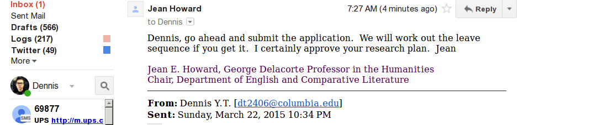

## Applicant Information

```
    Dennis Tenen  
    Assistant Professor  
    Depart of English and Comparative Literature  
    Columbia University  
    602 Philosophy Hall, MC4927  
    1150 Amsterdam Ave New York, NY 10027  
    (415)215-3315  
    dt2406@columbia.edu  
```
\clearpage

## Summary of research

I propose to use the funds to complement one semester of Junior Faculty
Development leave for the academic year 2015-2016.

The extra funded semester would further research contributing to my book-length
manuscript exploring the history and continual relevance of plain text document
formats. Document formats and character encodings are invisible but pervasive
modes of technology, underlying all forms of higher-level textual activity,
from the writing of poetry, to academic publishing and online surveillance.

Beginning with early international agreements governing the transmission of
telegraph communications, the discussion about data standards hinged on the
distinction between plain text and encrypted material, in what the
International Telegraph Union (ITU) Service Regulations, adopted in 1925 in
Paris, describe as "plain and secret language." And yet, because of its
technical nature, the impact of data encoding on the development of culture and
policy is not well understood. To be sure, media theorists like Friedrich
Kittler have suggested that encryption technologies irrevocably change the very
nature of literary production. "Under the conditions of high technology,
literature has nothing more to say," Kittler writes in the conclusion of his
influential monograph. He continues to write that "literature ends in
cryptograms that defy interpretation and only permit interception." I do not
share Kittler's dire conclusions, but my book does take up the challenge of
writing media history informed by developments in legislature and technology
surrounding encryption and character encoding.

In the last chapter of my book, "Plain Text," I intend argue for the recovery
and the preservation of plain textuality in the day-to-day practice of modern
computing. Returning to the history of the `.txt` file format, I find that
early documents from the International Telecommunication Union (and later
international bodies governing the exchange of information across state
borders) display unease with encrypted, non-human-readable formats of
information exchange. A theoretical treatment of technological skepticism from
Martin Heidegger, to Lewis Mumford, Frederich Kittler, and David Golumbia
concludes in a discussion about the subject's role in actively shaping the
material conditions of media being. As documents reflecting externalized states
of consciousness become increasingly more transparent, they are susceptible to
increased surveillance and control. Plain text allows political subjects to
decouple externalized mental states from mechanisms of governance. This
affordance is not however a deterministic property of literature, the internet,
or any other information exchange system.  Rather, the design of complex
systems must itself become critical practice, which, in complement to critical
theory, can actively engineer for textual mechanisms of individual dissidence
and resistance.

Work made possible by the SIPA Junior Faculty support grant will help take this
line of reasoning from the realm of theory to that of archival research. I plan
to use the Internet Policy and Cyber-security funds to travel to the
International Telegraph Union archives located in Geneva, Switzerland and to
the offices of the Unicode Consortium in Mountain View, California. These
archives contain drafts, plenum notes, first-person accounts, and other
documents not available elsewhere. The archival research will in turn
strengthen the concluding chapters of my monograph.

## Policy relevance

Encoding standards are ratified as a matter of international agreements,
national security policy, and corporate consortia. Yet, such standards have
broader cultural implications. What gets encoded determines (to an extent) that
which gets distributed, read, and understood. For this reason, character
standardization is subject to turbulent political debate, much of it happening
behind closed doors. Aditya Mukerjee, a prominent voice in technological
activism, recently wrote about the global inequities produced by that system:
"Until 2005, Unicode did not have one of the characters in the Bengali word for
*suddenly*. Instead, people who wanted to write this everyday word had to
combine three separate, unrelated characters." "Even today, I am forced to do
this when writing my own name," he writes.

Unfortunately, governing bodies of the ITU and the Unicode Consortium, do not
include literary scholars or historians among their ranks. This is due in part
to the lack of coverage encoding has received in academic literature. In
traveling to Geneva and Mountain View I hope to make long-lasting connections
between our university and the governing bodies of these institutions.

Finally, I am interested in making a connection between the parallel
developments in governance related to character encoding and encryption. The
two are related from a technical standpoint, but often have diametrically
opposite policy implications. One encourages transparency and interoperability,
(as was the case with the Brooks Act of 1965, which led to the adaptation of
ASCII by the US government). The other puts limits the exchange of information
(as is the case with the Economic Espionage Act of 1996). My research will help
to bring this problematic into the public conversation.

## Appendix: Department Support (A Note from Jean Howard, Chair)

