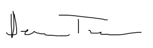

\pagenumbering{gobble}
Dear Members of the Selection Committee,
\newline

Thank you again for taking the time to consider my request for Harvard
Comparative Literature first academic book subsidy. Having a reduced teaching
load this semester has allowed me to dedicate time to writing and to advancing
my book project. Attached please find my updated Book Proposal along with two
sample chapters, which, in aggregate, should give you a reasonable
approximation of the manuscript's development.

Since last we spoke, I continued to solicit feedback from Emily-Jane Cohen,
Senior Editor at Stanford University Press. Following our initial email
exchange, I met with Emily-Jane in person, received copious and constructive
comments on the book proposal, and revised and expanded my materials.
Emily-Jane was pleased with my revisions, asking me to confirm our exclusive
arrangement in writing. In our email exchanges, she called the project
"exciting" and "refreshing," hoping that "we can go for the advance contract,
as discussed." I expect the first three chapters to go out for review shortly,
following further revisions and copy editing. I am spending the rest of the
month proofreading and presenting the chapters at the Data History workshop
here at Columbia for additional feedback.

Relevant to the first book subsidy, Emily-Jane plans to "discuss the issue of
the appendix with the press as a whole." However, besides the Appendix, she has
also flagged a more conventional concern: the number of figures and
illustrations, exacerbated by the length of the manuscript. My book relies on
diagrams to make difficult technical concepts accessible to an academic reader
in the humanities. The subsidy would go a long way to make that possible.
Furthermore, the press would like to keep the word count at around 80k words.
Seven chapters at 12k words plus introduction and conclusion puts me in the
range of 90-100k words. The subsidy could go a long way to removing these
obstacles, putting me in a stronger position for contract negotiation.

I resubmit my request in the sum of $4,000 for associated costs with gratitude
and without any expectations. I will be happy to submit again in a year, with
the understanding that by next spring the value of the funds will be
significantly diminished by the fixed terms of a contract. With warm wishes
from New York,

Dennis Tenen  
Assistant Professor  
New Media and Digital Humanities  
Department of English and Comparative Literature  
Columbia University in the City of New York  
denten.plaintext.in | 415-215-3315  
